## 서론: 알림, 이제 우리 삶의 일부입니다

스마트폰을 들었을 때 화면에 떠오르는 알림들을 떠올려 봅시다. 문자 메시지, 앱 푸시 알림, 이메일 같은 것들이 우리의 일상을 빠르게 만들어줍니다. 하지만 이런 간단해 보이는 알림을 매일 수백만 개 규모로 안정적으로 전달하는 일은 얼마나 복잡할까요? 이것이 바로 우리가 이 장에서 풀어야 할 문제입니다.

알림 시스템(Notification System)은 단순한 모바일 푸시 알림을 넘어서는 기능을 포함합니다. 속보, 상품 업데이트, 행사, 특별 제안 같은 중요한 정보를 사용자에게 전달하며, 이제는 현대 애플리케이션의 필수 기능이 되었습니다. 알림의 형태는 크게 세 가지입니다: 모바일 푸시 알림(Mobile Push Notification), SMS 메시지(SMS Message), 이메일(Email).

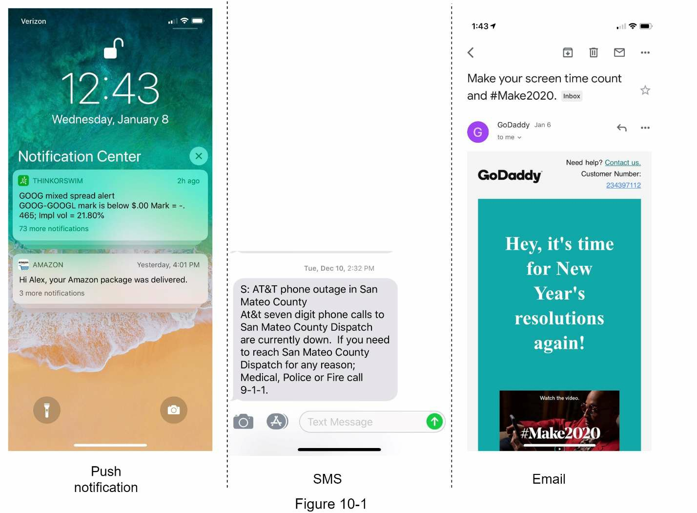

---

## 1단계: 문제 이해 및 설계 범위 정하기

결론부터 말하면, 하루에 수백만 개의 알림을 전송하는 확장 가능한 시스템을 구축하는 것은 알림 생태계에 대한 깊은 이해를 요구합니다. 인터뷰 질문은 의도적으로 개방형이고 모호하게 설계되어 있으며, 우리의 책임은 요구사항을 명확히 하는 질문을 던지는 것입니다.

### 요구사항 명확히 하기: 핵심 질문들

**후보자**: 이 시스템은 어떤 유형의 알림을 지원합니까?
**면접관**: 푸시 알림, SMS 메시지, 그리고 이메일입니다.

**후보자**: 실시간 시스템입니까?
**면접관**: 소프트 실시간(Soft Real-time) 시스템이라고 생각해 봅시다. 우리는 사용자가 최대한 빨리 알림을 받기를 원합니다. 하지만 시스템에 높은 부하가 걸렸을 때는 약간의 지연이 허용됩니다.

**후보자**: 지원하는 기기는 무엇입니까?
**면접관**: iOS 기기, 안드로이드 기기, 그리고 노트북/데스크톱입니다.

**후보자**: 무엇이 알림을 트리거합니까?
**면접관**: 알림은 클라이언트 애플리케이션으로부터 트리거될 수 있습니다. 서버 측에서 스케줄링될 수도 있습니다.

**후보자**: 사용자가 옵트아웃할 수 있습니까?
**면접관**: 그렇습니다. 옵트아웃을 선택한 사용자는 더 이상 알림을 받지 않습니다.

**후보자**: 하루에 얼마나 많은 알림이 전송됩니까?
**면접관**: 모바일 푸시 알림 1천만 개, SMS 메시지 1백만 개, 그리고 이메일 5백만 개입니다.

---

## 2단계: 고수준 설계 제시 및 합의 도출

### 다양한 알림 유형의 구현 방식

이 섹션에서는 다양한 알림 유형을 지원하는 고수준 설계를 살펴봅니다. 구조는 다음과 같습니다:
- 다양한 알림 유형
- 연락처 정보 수집 흐름
- 알림 전송/수신 흐름

### iOS 푸시 알림: 애플 서비스와의 통합

iOS 푸시 알림을 전송하기 위해서는 기본적으로 세 가지 컴포넌트가 필요합니다:

**제공자(Provider)**: 제공자는 알림 요청을 Apple Push Notification Service(APNS)에 구성하고 전송합니다. 푸시 알림을 구성하기 위해 제공자는 다음 데이터를 제공합니다:
- **기기 토큰(Device Token)**: 푸시 알림 전송에 사용되는 고유 식별자
- **페이로드(Payload)**: 알림의 페이로드를 포함하는 JSON 사전

**APNS**: 애플에서 제공하는 원격 서비스로, iOS 기기에 푸시 알림을 전파합니다.

**iOS 기기**: 알림을 수신하는 최종 클라이언트입니다.

### 안드로이드 푸시 알림: Firebase를 통한 구현

안드로이드는 유사한 알림 흐름을 채택합니다. APNS 대신 Firebase Cloud Messaging(FCM)을 사용하여 안드로이드 기기에 푸시 알림을 전송합니다.

### SMS 메시지: 제3자 서비스 활용

SMS 메시지의 경우, Twilio, Nexmo 같은 제3자 SMS 서비스들이 일반적으로 사용됩니다. 대부분의 경우 상용 서비스입니다.

### 이메일: 신뢰할 수 있는 배달 보장

회사들이 자체 이메일 서버를 구축할 수도 있지만, 많은 회사들이 상용 이메일 서비스를 선택합니다. Sendgrid와 Mailchimp 같은 서비스들은 높은 배달 률과 데이터 분석 기능을 제공하는 가장 인기 있는 이메일 서비스입니다.

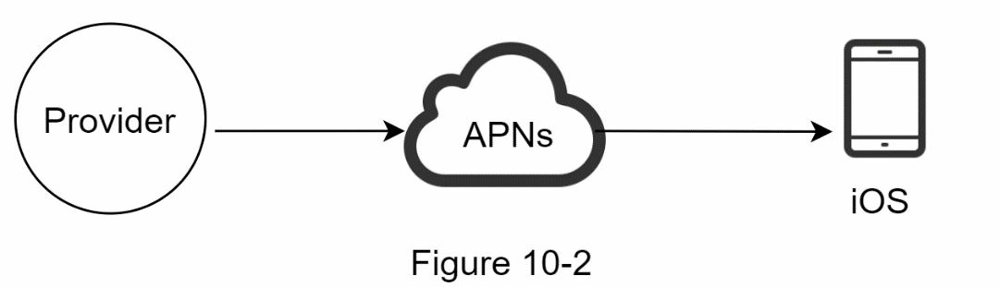

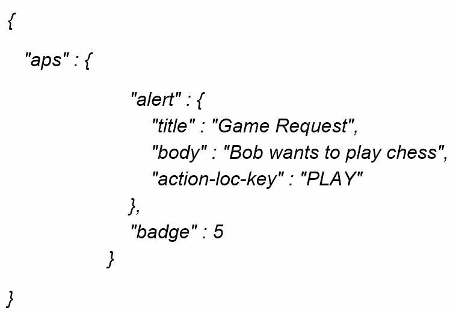

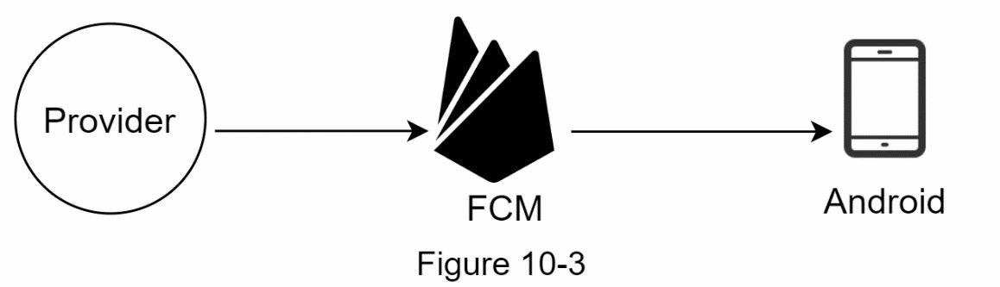

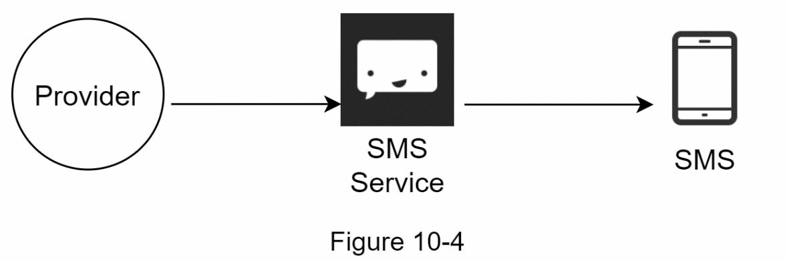

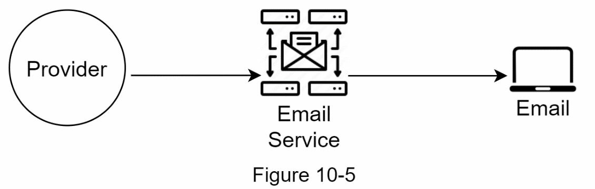

### 연락처 정보 수집: 데이터베이스 전략

알림을 전송하려면 모바일 기기 토큰, 전화번호, 또는 이메일 주소를 수집해야 합니다. 사용자가 앱을 설치하거나 처음 가입할 때, API 서버는 사용자 연락처 정보를 수집하여 데이터베이스에 저장합니다.

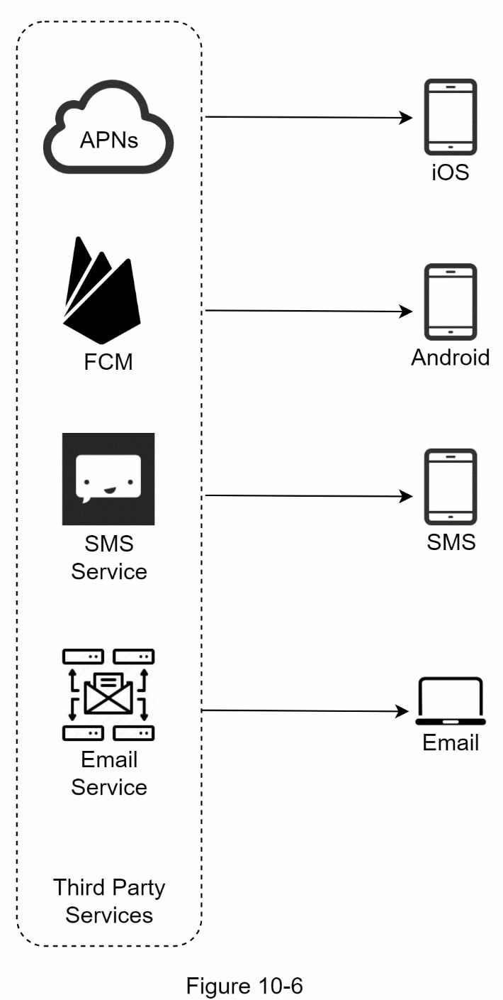

연락처 정보를 저장하는 간단한 데이터베이스 테이블 구조를 살펴봅시다. 이메일 주소와 전화번호는 사용자 테이블에 저장되는 반면, 기기 토큰은 별도의 기기 테이블에 저장됩니다. 한 명의 사용자가 여러 기기를 가질 수 있다는 점이 중요합니다. 이는 푸시 알림이 사용자의 모든 기기로 전송될 수 있음을 의미합니다.

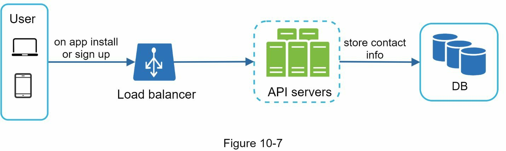

### 알림 전송/수신 흐름: 초기 설계와 최적화

처음에는 기본적인 설계부터 시작하고, 이후에 최적화를 제안합니다.

#### 고수준 초기 설계

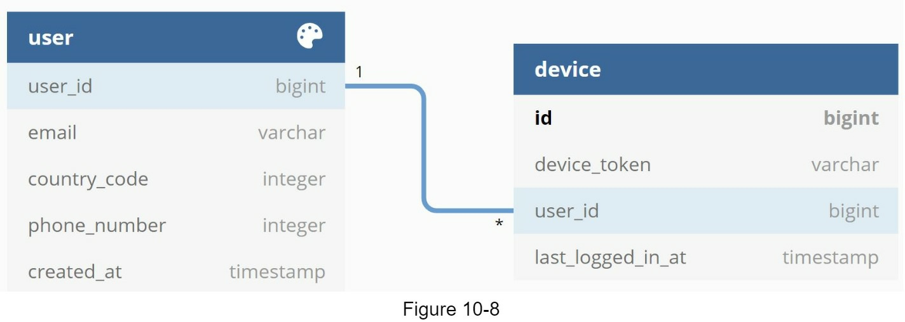

**서비스 1부터 N**: 마이크로서비스, 크론 작업, 또는 알림 전송 이벤트를 트리거하는 분산 시스템이 될 수 있습니다. 예를 들어, 청구 서비스는 고객에게 미납 결제를 상기시키는 이메일을 전송하거나, 쇼핑 웹사이트는 고객에게 내일 배송될 패키지가 있다는 SMS를 알립니다.

**알림 시스템**: 알림 시스템은 알림 전송/수신의 핵심입니다. 처음에는 하나의 알림 서버만 사용됩니다. 이 서버는 서비스 1부터 N을 위한 API를 제공하고, 제3자 서비스를 위한 알림 페이로드를 구성합니다.

**제3자 서비스**: 제3자 서비스는 사용자에게 알림을 전달하는 책임을 집니다. 제3자 서비스와 통합할 때는 확장성(Extensibility)에 특별한 주의를 기울여야 합니다. 좋은 확장성은 제3자 서비스를 쉽게 추가하거나 제거할 수 있는 유연한 시스템을 의미합니다. 또 다른 중요한 고려사항은 제3자 서비스가 새로운 시장에서 이용 불가능하거나 앞으로 이용 불가능해질 수도 있다는 점입니다. 예를 들어, FCM은 중국에서 이용 불가능합니다. 따라서 Jpush, PushY 같은 대체 제3자 서비스가 사용됩니다.

**iOS, 안드로이드, SMS, 이메일**: 사용자는 자신의 기기에서 알림을 받습니다.

#### 초기 설계의 문제점 식별

이 설계에서는 세 가지 문제가 식별됩니다:

**단일 실패 지점(Single Point of Failure, SPOF)**: 하나의 알림 서버는 전체 시스템의 실패 지점입니다.

**확장의 어려움(Hard to Scale)**: 알림 시스템이 푸시 알림과 관련된 모든 것을 하나의 서버에서 처리합니다. 데이터베이스, 캐시, 그리고 다양한 알림 처리 컴포넌트를 독립적으로 확장하기 어렵습니다.

**성능 병목(Performance Bottleneck)**: 알림을 처리하고 전송하는 일은 리소스 집약적입니다. 예를 들어, HTML 페이지를 구성하거나 제3자 서비스로부터의 응답을 기다리는 일은 시간이 걸립니다. 한 시스템에서 모든 것을 처리하면 특히 피크 시간에 시스템 과부하가 발생할 수 있습니다.

#### 개선된 고수준 설계: 아키텍처 재구성

이 문제들을 식별한 후, 우리는 다음과 같이 설계를 개선합니다:

- 데이터베이스와 캐시를 알림 서버에서 분리
- 더 많은 알림 서버를 추가하고 자동 수평 확장(Horizontal Scaling) 설정
- 시스템 컴포넌트를 분리하기 위해 메시지 큐(Message Queue) 도입

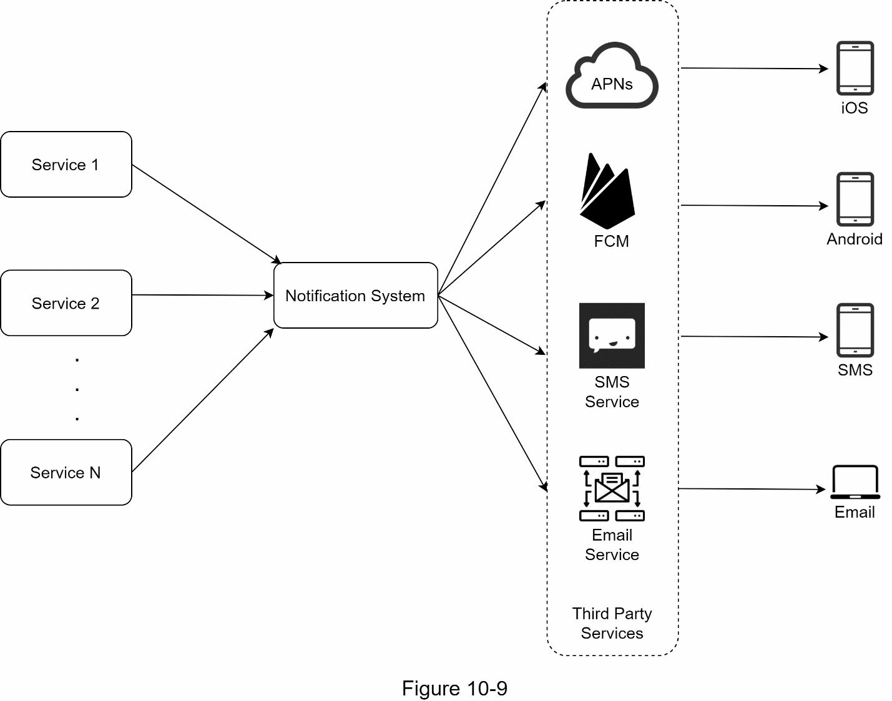

위의 다이어그램을 왼쪽에서 오른쪽으로 살펴봅시다:

**서비스 1부터 N**: 알림 서버가 제공하는 API를 통해 알림을 전송하는 다양한 서비스들을 나타냅니다.

**알림 서버**: 다음 기능들을 제공합니다:
- 서비스가 알림을 전송할 수 있도록 API를 제공합니다. 이러한 API는 내부적으로만 접근 가능하거나 검증된 클라이언트만 접근할 수 있으며, 이를 통해 스팸을 방지합니다.
- 이메일, 전화번호 등을 검증하기 위한 기본 검증을 수행합니다.
- 알림을 렌더링하는 데 필요한 데이터를 가져오기 위해 데이터베이스나 캐시를 조회합니다.
- 병렬 처리를 위해 알림 데이터를 메시지 큐에 넣습니다.

예를 들어, SMS를 전송하기 위한 API의 형태는 다음과 같습니다:
```
POST https://api.example.com/v/sms/send
Request body
{
  "to": "+1234567890",
  "from": "+0987654321",
  "content": "Hello, this is a notification"
}
```

**캐시**: 사용자 정보, 기기 정보, 알림 템플릿이 캐시됩니다.

**데이터베이스**: 사용자, 알림, 설정 등에 대한 데이터를 저장합니다.

**메시지 큐**: 컴포넌트 간의 의존성을 제거합니다. 메시지 큐는 대량의 알림이 전송되어야 할 때 버퍼 역할을 합니다. 각 알림 유형이 별도의 메시지 큐를 할당받으므로, 하나의 제3자 서비스 장애가 다른 알림 유형에 영향을 미치지 않습니다.

**워커(Worker)**: 메시지 큐에서 알림 이벤트를 가져와서 해당 제3자 서비스에 전송하는 서버들의 목록입니다.

**제3자 서비스**: 초기 설계에서 이미 설명했습니다.

**iOS, 안드로이드, SMS, 이메일**: 초기 설계에서 이미 설명했습니다.

#### 알림 전송 프로세스 흐름

이제 모든 컴포넌트가 함께 어떻게 작동하는지 살펴봅시다:

1. 서비스가 알림 서버가 제공하는 API를 호출하여 알림을 전송합니다.
2. 알림 서버는 사용자 정보, 기기 토큰, 알림 설정 같은 메타데이터를 캐시나 데이터베이스에서 가져옵니다.
3. 알림 이벤트가 처리를 위해 해당 큐로 전송됩니다. 예를 들어, iOS 푸시 알림 이벤트는 iOS PN 큐로 전송됩니다.
4. 워커가 메시지 큐에서 알림 이벤트를 가져옵니다.
5. 워커가 제3자 서비스에 알림을 전송합니다.
6. 제3자 서비스가 사용자 기기에 알림을 전송합니다.

---

## 3단계: 깊이 있는 설계 분석

고수준 설계에서 다양한 알림 유형, 연락처 정보 수집 흐름, 알림 전송/수신 흐름을 논의했습니다. 이제 다음 사항을 깊이 있게 살펴봅시다:
- 신뢰성(Reliability)
- 추가 컴포넌트와 고려사항: 알림 템플릿, 알림 설정, 속도 제한, 재시도 메커니즘, 푸시 알림의 보안, 큐에 있는 알림 모니터링, 이벤트 추적
- 업데이트된 설계

### 신뢰성: 분산 환경에서의 핵심 질문

분산 환경에서 알림 시스템을 설계할 때는 몇 가지 중요한 신뢰성 질문에 답해야 합니다.

#### 데이터 손실을 어떻게 방지합니까?

알림 시스템의 가장 중요한 요구사항 중 하나는 데이터를 잃지 않는다는 것입니다. 알림은 보통 지연되거나 순서가 바뀔 수 있지만, 절대 손실되면 안 됩니다. 이 요구사항을 충족하기 위해 알림 시스템은 알림 데이터를 데이터베이스에 저장하고 재시도 메커니즘을 구현합니다. 데이터 지속성을 위해 알림 로그 데이터베이스가 포함됩니다.

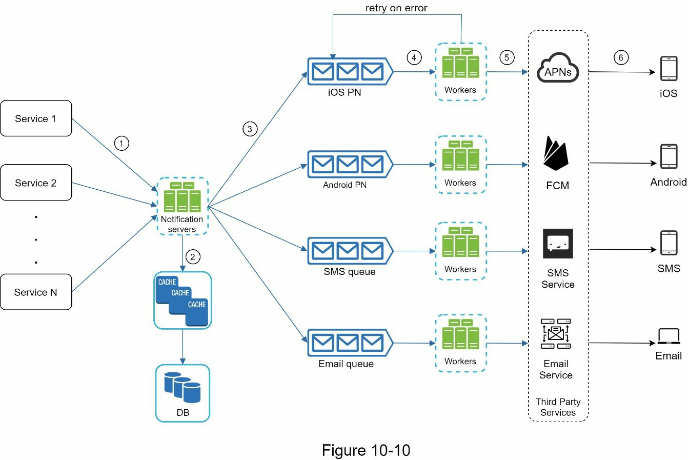

#### 수신자가 알림을 정확히 한 번만 받을까요?

짧은 답변은 아니오입니다. 대부분의 경우 알림이 정확히 한 번 배달되지만, 분산 환경의 특성상 중복된 알림이 발생할 수 있습니다. 중복 발생을 줄이기 위해 우리는 중복 제거(Dedupe) 메커니즘을 도입하고 각 실패 사례를 신중하게 처리합니다. 간단한 중복 제거 로직은 다음과 같습니다:

알림 이벤트가 처음 도착할 때, 우리는 이벤트 ID를 확인하여 이전에 본 적이 있는지 확인합니다. 이전에 본 경우, 이를 버립니다. 그렇지 않으면 알림을 전송합니다.

### 추가 컴포넌트와 고려사항: 시스템 확장하기

사용자 연락처 정보를 수집하고, 알림을 전송하고 수신하는 방법을 논의했습니다. 하지만 알림 시스템은 그것보다 훨씬 더 많은 기능을 포함합니다. 여기서는 템플릿 재사용, 알림 설정, 이벤트 추적, 시스템 모니터링, [[4장 속도 제한기 설계 (Design a Rate Limiter)|속도 제한기]] 등을 포함한 추가 컴포넌트를 논의합니다.

#### 알림 템플릿: 일관성과 효율성

큰 규모의 알림 시스템은 하루에 수백만 개의 알림을 전송하며, 이 중 많은 알림이 유사한 형식을 따릅니다. 알림 템플릿(Notification Template)은 모든 알림을 처음부터 구성하는 것을 피하기 위해 도입됩니다. 알림 템플릿은 매개변수, 스타일, 추적 링크 등을 맞춤 설정하여 고유한 알림을 만들기 위한 사전 형식화된 알림입니다. 푸시 알림의 템플릿 예시는 다음과 같습니다:

```
BODY:
You dreamed of it. We dared it. [ITEM NAME] is back — only until [DATE].

CTA:
Order Now. Or, Save My [ITEM NAME]
```

알림 템플릿 사용의 이점은 일관된 형식 유지, 오류 가능성 감소, 그리고 시간 절약입니다.

#### 알림 설정: 사용자 선택권 존중

사용자는 일반적으로 매일 너무 많은 알림을 받으며 쉽게 압도당할 수 있습니다. 따라서 많은 웹사이트와 앱은 사용자에게 알림 설정에 대한 세밀한 제어권을 제공합니다. 이 정보는 다음과 같은 필드를 가진 알림 설정 테이블에 저장됩니다:

```
user_id: bigInt
channel: varchar (push notification, email or SMS)
opt_in: boolean (opt-in to receive notification)
```

어떤 알림이 사용자에게 전송되기 전에, 우리는 먼저 사용자가 이 유형의 알림을 수신하도록 옵트인했는지 확인합니다.

#### 속도 제한: 과부하 방지

사용자를 너무 많은 알림으로 압도하는 것을 피하기 위해, 우리는 사용자가 받을 수 있는 알림의 수를 제한할 수 있습니다. 이는 중요합니다. 왜냐하면 우리가 너무 자주 알림을 보내면 수신자들이 알림 기능을 완전히 끌 수 있기 때문입니다.

#### 재시도 메커니즘: 실패 처리

제3자 서비스가 알림 전송에 실패하면, 알림은 메시지 큐에 다시 추가되어 재시도됩니다. 문제가 계속되면, 개발자에게 경고가 전송됩니다.

#### 푸시 알림의 보안: 인증과 검증

iOS나 안드로이드 앱의 경우, appKey와 appSecret이 푸시 알림 API를 보호하는 데 사용됩니다. 검증되거나 인증된 클라이언트만 우리의 API를 사용하여 푸시 알림을 전송할 수 있습니다.

#### 큐에 있는 알림 모니터링: 성능 지표 추적

모니터링해야 할 핵심 지표는 큐에 있는 알림의 총 수입니다. 이 숫자가 크면, 알림 이벤트가 워커에 의해 충분히 빠르게 처리되지 않고 있습니다. 알림 전달 시 지연을 피하려면 더 많은 워커가 필요합니다.

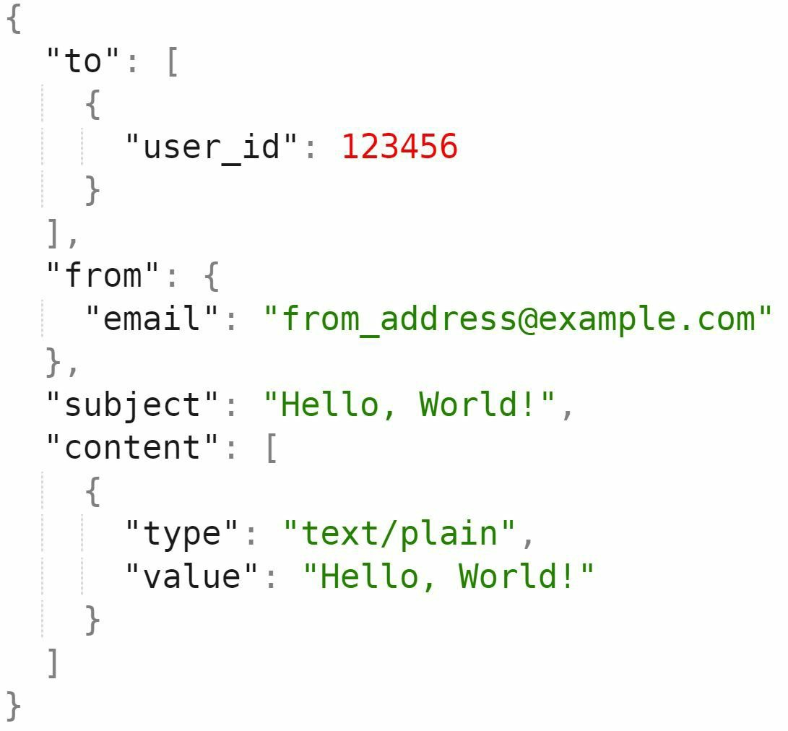

#### 이벤트 추적: 분석과 개선

알림 오픈율, 클릭율, 참여도 같은 알림 지표는 고객 행동을 이해하는 데 중요합니다. 분석 서비스가 이벤트 추적을 구현합니다. 알림 시스템과 분석 서비스 간의 통합이 보통 필요합니다.

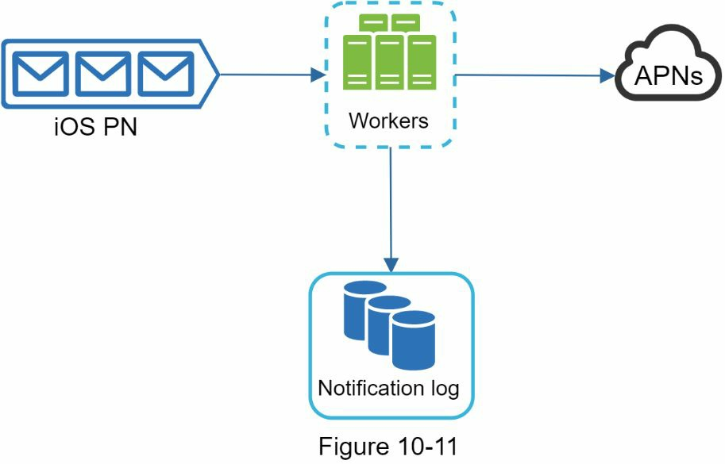

### 업데이트된 설계: 모든 것을 종합하다

모든 것을 함께 만들면, Figure 10-14는 업데이트된 알림 시스템 설계를 보여줍니다.

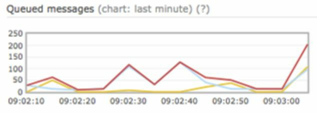

이 설계에서는 이전 설계와 비교하여 많은 새로운 컴포넌트가 추가되었습니다:

- **알림 서버의 강화**: 알림 서버는 인증과 속도 제한이라는 두 가지 중요한 기능이 추가되었습니다.

- **재시도 메커니즘 추가**: 우리는 알림 실패를 처리하기 위한 재시도 메커니즘을 추가했습니다. 시스템이 알림 전송에 실패하면, 알림은 메시지 큐에 다시 들어가고 워커가 미리 정의된 횟수만큼 재시도합니다.

- **알림 템플릿**: 알림 템플릿은 일관성 있고 효율적인 알림 생성 프로세스를 제공합니다.

- **모니터링과 추적 시스템 추가**: 모니터링과 추적 시스템이 시스템 상태 확인과 향후 개선을 위해 추가되었습니다.

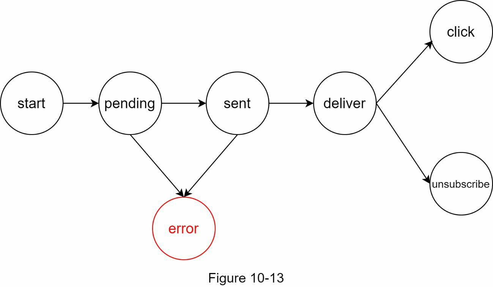

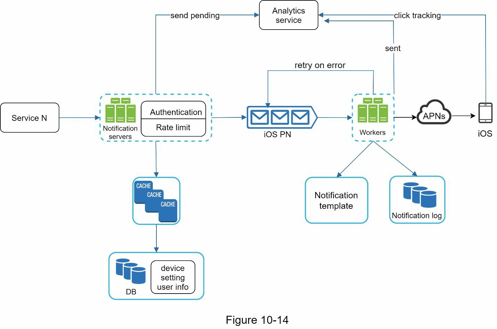

---

## 4단계: 마무리

알림은 우리에게 중요한 정보를 계속 알려주기 때문에 필수불가결합니다. Netflix에서 즐겨 보는 영화에 대한 푸시 알림, 새로운 상품 할인에 대한 이메일, 온라인 쇼핑 결제 확인에 대한 메시지 같은 것들이 그것입니다.

이 장에서 우리는 다양한 알림 형식(푸시 알림, SMS 메시지, 이메일)을 지원하는 확장 가능한 알림 시스템의 설계를 설명했습니다. 우리는 메시지 큐를 도입하여 시스템 컴포넌트를 분리했습니다.

고수준 설계 외에도, 우리는 더 많은 컴포넌트와 최적화를 깊이 있게 살펴봤습니다:

**신뢰성**: 실패율을 최소화하기 위해 강력한 재시도 메커니즘을 제안했습니다.

**보안**: AppKey/appSecret 쌍을 사용하여 검증된 클라이언트만 알림을 전송할 수 있도록 보장합니다.

**추적과 모니터링**: 이들은 알림 흐름의 모든 단계에서 구현되어 중요한 통계를 수집합니다.

**사용자 설정 존중**: 사용자가 알림 수신을 거부할 수 있습니다. 우리 시스템은 알림을 전송하기 전에 사용자 설정을 먼저 확인합니다.

**속도 제한**: 사용자는 자신이 받는 알림의 빈도 제한에 감사할 것입니다.

축하합니다! 여기까지 읽으신 분들께 진심으로 박수를 보냅니다. 정말 잘하셨습니다!

---

## 핵심 개념 정리

**APNS(Apple Push Notification Service, 애플 푸시 알림 서비스)**: 애플이 운영하는 원격 알림 전달 인프라입니다. iOS·macOS 기기에 푸시 알림을 전파하며, 제공자(Provider)가 기기 토큰과 페이로드를 담아 APNS에 요청을 보내면 APNS가 최종 기기로 전달합니다.

**FCM(Firebase Cloud Messaging, 파이어베이스 클라우드 메시징)**: 구글이 제공하는 안드로이드용 푸시 알림 전달 서비스입니다. APNS와 대응되는 역할을 하며, 중국처럼 FCM을 사용할 수 없는 지역에서는 Jpush·PushY 같은 대체 서비스를 활용합니다.

**기기 토큰(Device Token)**: 푸시 알림을 특정 기기에 전달하기 위한 고유 식별자입니다. iOS에서는 APNS, 안드로이드에서는 FCM이 발급하며, 서버는 이 토큰을 데이터베이스에 저장해 두었다가 알림 전송 시 사용합니다.

**팬아웃(Fan-out)**: 하나의 알림 이벤트를 여러 수신자 또는 여러 채널(모바일 푸시·SMS·이메일)로 동시에 분배하는 패턴입니다. 알림 서버가 메시지 큐에 이벤트를 넣으면 각 채널 전용 워커가 병렬로 처리해 팬아웃을 구현합니다.

**알림 중복 제거(Dedupe, 중복 제거)**: 분산 환경에서 동일한 알림이 두 번 이상 전달되는 것을 방지하는 메커니즘입니다. 이벤트 ID를 데이터베이스에 기록해 두고, 같은 ID가 다시 들어오면 처리 없이 버립니다.

**재시도 메커니즘(Retry Mechanism)**: 제3자 서비스(APNS·FCM·SMS 게이트웨이 등)가 알림 전달에 실패했을 때 알림을 메시지 큐에 다시 넣어 미리 정의된 횟수만큼 재전송을 시도하는 방식입니다. 반복 실패 시 개발자에게 경고를 발송합니다.

**알림 템플릿(Notification Template)**: 대량 알림의 일관성과 효율성을 위해 사전에 정의해 둔 알림 형식입니다. 매개변수·스타일·추적 링크 등을 변수로 두어 알림마다 처음부터 구성하는 비용을 줄이고 오류를 최소화합니다.

**옵트아웃(Opt-out)**: 사용자가 특정 채널 또는 전체 알림 수신을 거부하는 설정입니다. 시스템은 알림을 전송하기 전에 알림 설정 테이블을 조회하여 옵트아웃한 사용자에게는 알림을 발송하지 않습니다.

**소프트 실시간(Soft Real-time)**: 알림이 즉시 도착하는 것을 목표로 하되, 시스템 부하가 높을 때는 약간의 지연을 허용하는 설계 방침입니다. 엄격한 실시간(Hard Real-time)과 달리 메시지 큐를 통한 비동기 처리가 가능합니다.

**단일 실패 지점(Single Point of Failure, SPOF)**: 시스템 내 하나의 컴포넌트가 장애를 일으켰을 때 전체 서비스가 중단되는 구조적 취약점입니다. 알림 서버를 수평 확장하고 메시지 큐로 컴포넌트를 분리하면 SPOF를 제거할 수 있습니다.

**메시지 큐(Message Queue)**: 알림 서버와 워커 사이에서 이벤트를 버퍼링하는 비동기 통신 컴포넌트입니다. 채널별로 독립된 큐를 두어 한 제3자 서비스의 장애가 다른 채널 알림에 영향을 주지 않도록 격리합니다.

---

## 참고 자료

[1] Twilio SMS: https://www.twilio.com/sms
[2] Nexmo SMS: https://www.nexmo.com/products/sms
[3] Sendgrid: https://sendgrid.com/
[4] Mailchimp: https://mailchimp.com/
[5] You Cannot Have Exactly-Once Delivery: https://bravenewgeek.com/you-cannot-have-exactly-once-delivery/
[6] Security in Push Notifications: https://cloud.ibm.com/docs/services/mobilepush?topic=mobile-pushnotification-security-in-push-notifications
[7] RadditMQ: https://bit.ly/2sotIa6
