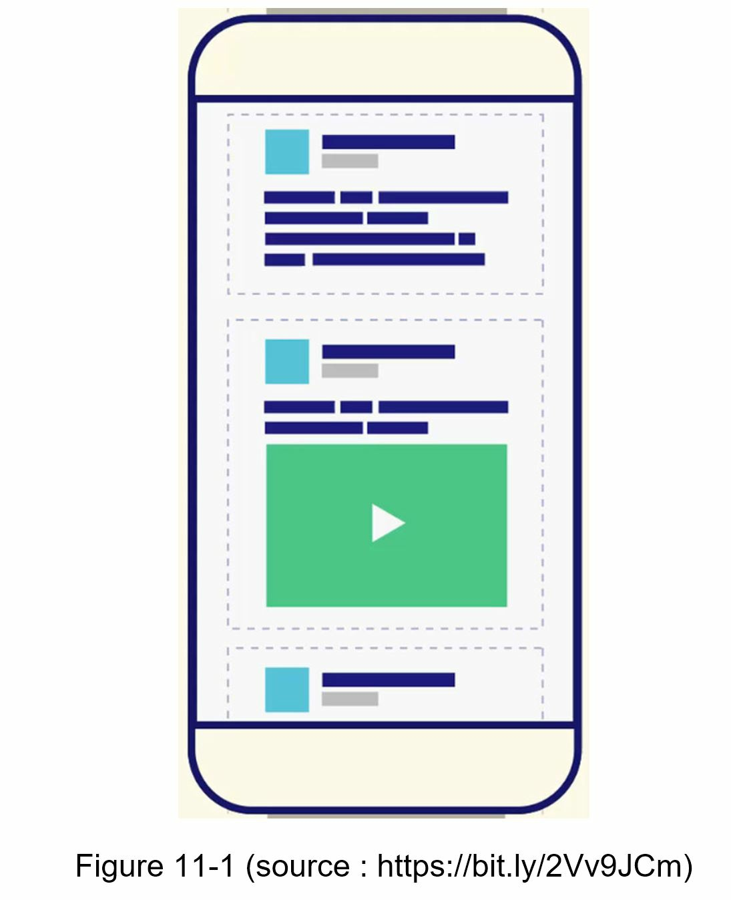
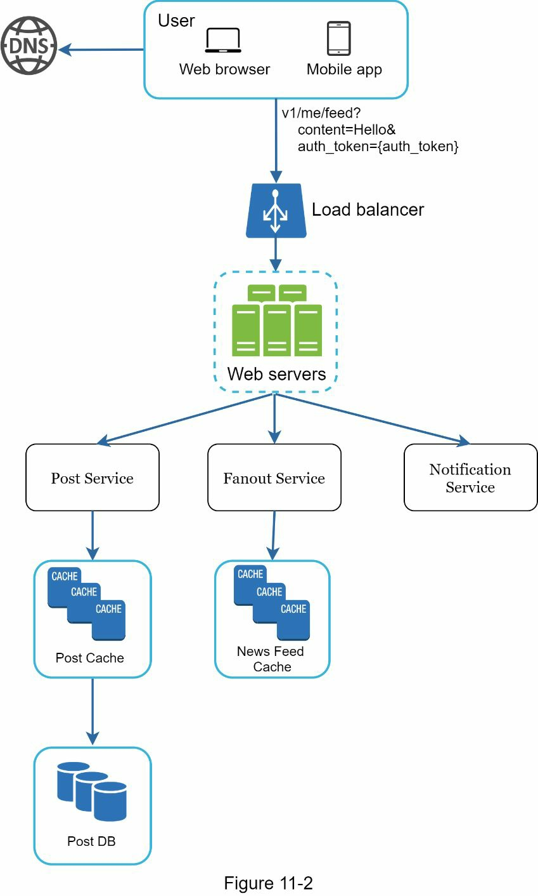
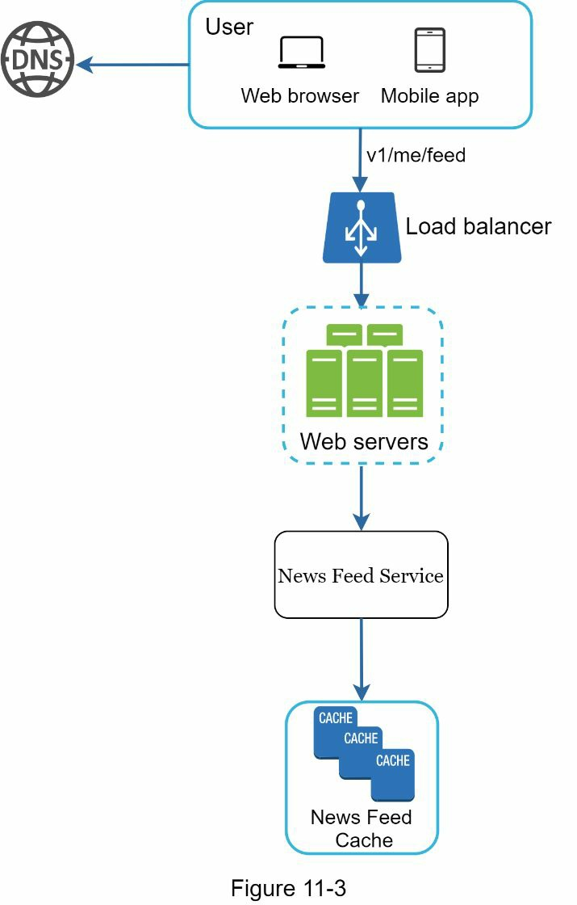
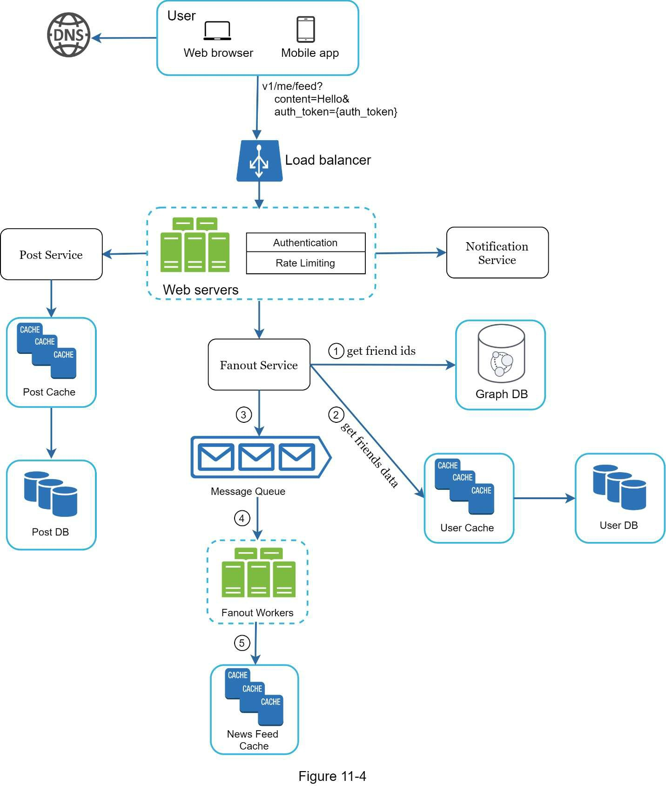
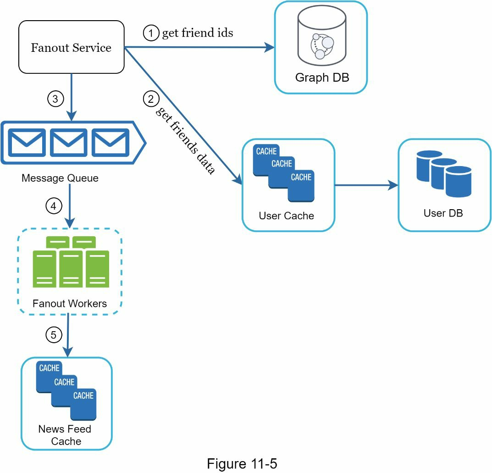
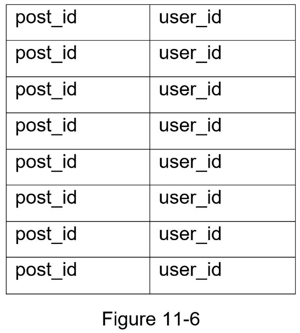
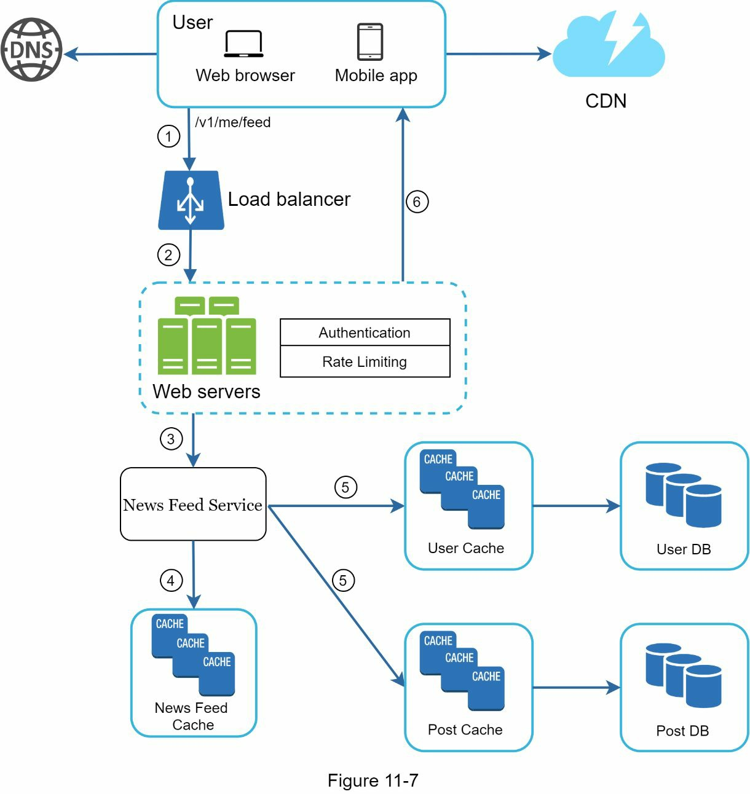
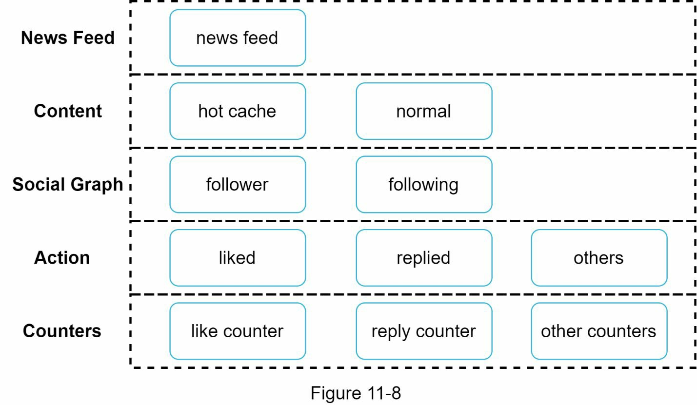

## 서론: 피드는 관계를 시각화하는 창

아침에 신문을 펼칠 때처럼, 우리는 소셜 미디어를 열면서 친구들의 새로운 소식을 기대합니다. 그 피드에 어떤 이야기들이 어떤 순서로 나타날까요? 결론부터 말하면, 뉴스 피드 시스템은 단순해 보이지만 그 안에는 수백만 사용자의 복잡한 관계와 데이터를 실시간으로 처리하는 정교한 아키텍처가 숨어 있습니다.

뉴스 피드(News Feed)란 무엇일까요? 페이스북의 정의에 따르면, "뉴스 피드는 홈페이지 중앙에 끊임없이 업데이트되는 스토리 목록으로, 팔로우하는 사람, 페이지, 그룹의 상태 업데이트, 사진, 동영상, 링크, 앱 활동, 좋아요 등을 포함합니다."[1] 이는 시스템 설계 면접에서 매우 인기 있는 질문입니다. 유사한 질문으로는 페이스북 뉴스 피드, 인스타그램 피드, 트위터 타임라인 설계 등이 있습니다.



---

## 1단계: 문제 이해 및 설계 범위 결정

### 요구사항 파악: 명확한 답변을 이끌어내기

제일 먼저 해야 할 일은 면접관이 원하는 시스템의 모양을 명확히 이해하는 것입니다. 어떤 기능을 지원해야 하는지 최소한 파악해야 합니다. 다음은 지원자와 면접관의 대화 예시입니다.

**지원자:** 이것은 모바일 앱인가요? 웹 앱인가요? 아니면 둘 다인가요?
**면접관:** 둘 다입니다.

**지원자:** 가장 중요한 기능이 무엇인가요?
**면접관:** 사용자가 게시물을 발행할 수 있고, 친구들의 게시물을 뉴스 피드 페이지에서 볼 수 있어야 합니다.

**지원자:** 뉴스 피드는 역시간순 정렬인가요, 아니면 특정 점수에 따라 정렬되나요? 예를 들어, 친한 친구의 게시물이 더 높은 점수를 받는 경우처럼요?
**면접관:** 간단하게 하기 위해 역시간순 정렬로 가정하겠습니다.

**지원자:** 사용자가 몇 명의 친구를 가질 수 있나요?
**면접관:** 5,000명입니다.

**지원자:** 트래픽 규모는 어느 정도인가요?
**면접관:** 일일 활성 사용자(DAU)는 1,000만 명입니다.

**지원자:** 피드에 이미지, 동영상이 포함될 수 있나요? 아니면 텍스트만 포함되나요?
**면접관:** 이미지와 동영상을 포함한 미디어 파일을 포함할 수 있습니다.

이제 요구사항을 정리했으므로, 본격적으로 시스템을 설계해봅시다.

---

## 2단계: 고수준 설계 제안 및 검증

### 두 가지 핵심 흐름: 피드 게시와 피드 구성

설계는 두 가지 흐름으로 나뉩니다:

1. **피드 게시(Feed Publishing):** 사용자가 게시물을 발행할 때, 해당 데이터가 캐시와 데이터베이스에 기록되고, 그 게시물이 친구들의 뉴스 피드에 전파됩니다.

2. **뉴스 피드 구성(Newsfeed Building):** 간단하게 하기 위해, 뉴스 피드는 친구들의 게시물을 역시간순으로 집계하여 구성한다고 가정합니다.

### 뉴스 피드 API

뉴스 피드 API는 클라이언트가 서버와 통신하는 주요 방식입니다. 이러한 API들은 HTTP 기반으로, 클라이언트가 상태 게시, 뉴스 피드 검색, 친구 추가 등의 작업을 수행할 수 있도록 합니다. 가장 중요한 두 API는 다음과 같습니다.

**피드 게시 API(Feed Publishing API)**

게시물을 발행하기 위해 HTTP POST 요청이 서버로 전송됩니다:

```
POST /v1/me/feed

Params:
  - content: 게시물의 텍스트 내용
  - auth_token: API 요청 인증에 사용되는 토큰
```

**뉴스 피드 검색 API(Newsfeed Retrieval API)**

뉴스 피드를 검색하기 위한 API:

```
GET /v1/me/feed

Params:
  - auth_token: API 요청 인증에 사용되는 토큰
```

### 피드 게시: 고수준 설계



피드 게시 흐름의 각 구성 요소를 살펴봅시다:

- **사용자(User):** 사용자가 브라우저나 모바일 앱에서 뉴스 피드를 봅니다. "Hello" 내용의 게시물을 다음과 같은 API를 통해 만듭니다: `/v1/me/feed?content=Hello&auth_token={auth_token}`

- **로드 밸런서(Load Balancer):** 트래픽을 웹 서버들에 분산시킵니다.

- **웹 서버(Web Servers):** 웹 서버는 트래픽을 다양한 내부 서비스로 리다이렉트합니다.

- **포스트 서비스(Post Service):** 게시물을 데이터베이스와 캐시에 저장합니다.

- **팬아웃 서비스(Fanout Service):** 새로운 콘텐츠를 친구들의 뉴스 피드에 푸시합니다. 뉴스 피드 데이터는 빠른 검색을 위해 캐시에 저장됩니다.

- **[[10장 알림 시스템 설계 (Design a Notification System)|알림 서비스]](Notification Service):** 친구들에게 새로운 콘텐츠가 있다는 것을 알리고 푸시 알림을 보냅니다.

### 뉴스 피드 구성: 고수준 설계



뉴스 피드가 내부적으로 어떻게 구성되는지 살펴봅시다:

- **사용자(User):** 사용자가 뉴스 피드를 검색하도록 요청합니다. 요청 형식은 다음과 같습니다: `/v1/me/feed`

- **로드 밸런서(Load Balancer):** 로드 밸런서가 트래픽을 웹 서버로 리다이렉트합니다.

- **웹 서버(Web Servers):** 웹 서버가 요청을 뉴스 피드 서비스로 라우팅합니다.

- **뉴스 피드 서비스(Newsfeed Service):** 뉴스 피드 서비스는 캐시에서 뉴스 피드를 가져옵니다.

- **뉴스 피드 캐시(Newsfeed Cache):** 뉴스 피드를 렌더링하기 위해 필요한 뉴스 피드 ID들을 저장합니다.

---

## 3단계: 상세 설계

고수준 설계에서는 피드 게시와 뉴스 피드 구성이라는 두 가지 흐름을 간략하게 다루었습니다. 이제 이 주제들을 더 깊이 있게 살펴봅시다.

### 피드 게시 상세 설계



고수준 설계에서 대부분의 구성 요소를 다루었으므로, 이번에는 웹 서버와 팬아웃 서비스라는 두 가지 핵심 구성 요소에 집중합니다.

#### 웹 서버: 인증과 속도 제한

클라이언트와 통신하는 것 외에도, 웹 서버는 인증과 [[4장 속도 제한기 설계 (Design a Rate Limiter)|속도 제한기]](Rate-Limiting)를 강제합니다.

유효한 `auth_token`으로 로그인한 사용자만 게시물을 발행할 수 있습니다. 시스템은 특정 기간 내에 사용자가 만들 수 있는 게시물의 수를 제한합니다. 이는 스팸과 욕설성 콘텐츠를 방지하는 데 매우 중요합니다.

#### 팬아웃 서비스: 어떤 방식으로 전파할 것인가?

팬아웃(Fanout)이란 게시물을 모든 친구에게 전달하는 프로세스입니다. 두 가지 팬아웃 모델이 있습니다:

1. **쓰기 시 팬아웃(Fanout on Write)** (푸시 모델이라고도 함)
2. **읽기 시 팬아웃(Fanout on Read)** (풀 모델이라고도 함)

두 모델 모두 장단점이 있습니다. 각각의 워크플로우를 설명하고 우리의 시스템을 지원하기 위한 최고의 접근 방식을 탐색해봅시다.

##### 쓰기 시 팬아웃(Fanout on Write)

이 접근법에서는 뉴스 피드가 쓰기 시점(Write Time)에 미리 계산됩니다. 새로운 게시물은 발행되자마자 친구들의 캐시로 즉시 전달됩니다.

**장점:**
- 뉴스 피드는 실시간으로 생성되고 친구들에게 즉시 푸시될 수 있습니다.
- 뉴스 피드는 쓰기 시점에 미리 계산되므로 검색이 빠릅니다.

**단점:**
- 사용자가 많은 친구를 가지고 있다면, 친구 목록을 가져오고 모든 친구에 대한 뉴스 피드를 생성하는 것은 느리고 시간이 많이 걸립니다. 이를 **핫키 문제(Hotkey Problem)**라고 합니다.
- 활동하지 않는 사용자나 거의 로그인하지 않는 사용자의 뉴스 피드를 미리 계산하는 것은 계산 자원을 낭비합니다.

##### 읽기 시 팬아웃(Fanout on Read)

뉴스 피드는 읽기 시점(Read Time)에 생성됩니다. 이는 온디맨드(On-Demand) 모델입니다. 사용자가 홈페이지를 로드할 때 최근 게시물이 가져와집니다.

**장점:**
- 활동하지 않는 사용자나 거의 로그인하지 않는 사용자의 경우, 읽기 시 팬아웃이 더 잘 작동합니다. 계산 자원이 낭비되지 않기 때문입니다.
- 데이터가 친구에게 푸시되지 않으므로 핫키 문제가 없습니다.

**단점:**
- 뉴스 피드가 미리 계산되지 않으므로 뉴스 피드를 가져오는 것이 느립니다.

##### 하이브리드 접근법: 최고의 것만 취하기

뉴스 피드 검색 속도가 중요하므로, 대다수의 사용자에게는 푸시 모델을 사용합니다. 그러나 유명인이나 많은 친구/팔로워를 가진 사용자의 경우, 팔로워가 온디맨드로 뉴스 콘텐츠를 끌어오도록 하여 시스템 과부하를 방지합니다. [[5장 일관 해싱 설계|일관 해싱]](Consistent Hashing)은 핫키 문제를 완화하기 위한 유용한 기법입니다. 요청/데이터를 더 균등하게 분배하는 데 도움이 됩니다.

### 팬아웃 서비스 상세 설계



팬아웃 서비스는 다음과 같이 동작합니다:

1. **친구 ID를 그래프 데이터베이스에서 가져옵니다(Fetch friend IDs from the graph database).** 그래프 데이터베이스(Graph Database)는 친구 관계와 친구 추천을 관리하는 데 적합합니다. 이 개념에 대해 더 알고 싶은 독자는 참고 자료를 참조하시기 바랍니다.[2]

2. **사용자 캐시에서 친구 정보를 가져옵니다(Get friends info from the user cache).** 그 다음 시스템은 사용자 설정에 따라 친구를 필터링합니다. 예를 들어, 누군가를 뮤트(Mute)했다면 그 사람의 게시물은 여전히 친구이더라도 뉴스 피드에 표시되지 않습니다. 또한 특정 친구들과만 선택적으로 정보를 공유하거나 다른 사람들에게 숨기는 경우도 있을 수 있습니다.

3. **친구 목록과 새 게시물 ID를 메시지 큐(Message Queue)로 보냅니다.**

4. **팬아웃 워커(Fanout Workers)가 메시지 큐에서 데이터를 가져와 뉴스 피드 캐시에 뉴스 피드 데이터를 저장합니다.** 뉴스 피드 캐시는 `<post_id, user_id>` 매핑 테이블로 생각할 수 있습니다. 새로운 게시물이 만들어질 때마다 다음 그림(Figure 11-6)처럼 뉴스 피드 테이블에 추가됩니다. 캐시에 전체 사용자 및 게시물 객체를 저장하면 메모리 소비가 매우 커질 수 있으므로, 오직 ID만 저장됩니다. 메모리 크기를 작게 유지하기 위해 구성 가능한 제한을 설정합니다. 사용자가 뉴스 피드에서 수천 개의 게시물을 스크롤할 가능성은 거의 없습니다. 대부분의 사용자는 최신 콘텐츠에만 관심이 있으므로 캐시 미스율은 낮습니다.

5. **뉴스 피드 캐시에 `<post_id, user_id>`를 저장합니다.** Figure 11-6은 캐시의 뉴스 피드가 어떤 모습인지 보여주는 예시입니다.



### 뉴스 피드 검색 상세 설계



위 그림처럼, 미디어 콘텐츠(이미지, 동영상 등)는 빠른 검색을 위해 **콘텐츠 배포 네트워크(Content Delivery Network, CDN)**에 저장됩니다. 이제 클라이언트가 어떻게 뉴스 피드를 검색하는지 살펴봅시다.

1. 사용자가 뉴스 피드를 검색하도록 요청합니다. 요청 형식은 `/v1/me/feed`입니다.

2. 로드 밸런서가 요청을 웹 서버들에 재분배합니다.

3. 웹 서버가 뉴스 피드를 가져오기 위해 뉴스 피드 서비스를 호출합니다.

4. 뉴스 피드 서비스는 뉴스 피드 캐시에서 게시물 ID 목록을 가져옵니다.

5. 사용자의 뉴스 피드는 단지 피드 ID 목록이 아닙니다. 사용자 이름, 프로필 사진, 게시물 내용, 게시물 이미지 등을 포함합니다. 따라서 뉴스 피드 서비스는 완전하게 수화된(Fully Hydrated) 뉴스 피드를 구성하기 위해 캐시(사용자 캐시 및 게시물 캐시)에서 전체 사용자 및 게시물 객체를 가져옵니다.

6. 완전하게 수화된 뉴스 피드가 JSON 형식으로 클라이언트에 반환되어 렌더링됩니다.

### 캐시 아키텍처: 5계층 캐시 전략



캐시는 뉴스 피드 시스템에서 극히 중요합니다. 다음 그림에서 보듯이 캐시 계층을 5개 계층으로 나눕니다:

- **뉴스 피드(News Feed):** 뉴스 피드의 ID를 저장합니다.

- **콘텐츠(Content):** 모든 게시물 데이터를 저장합니다. 인기 있는 콘텐츠는 핫 캐시(Hot Cache)에 저장됩니다.

- **소셜 그래프(Social Graph):** 사용자 관계 데이터를 저장합니다.

- **액션(Action):** 사용자가 게시물을 좋아했는지, 댓글을 달았는지, 또는 게시물에 대해 다른 조치를 취했는지에 대한 정보를 저장합니다.

- **카운터(Counters):** 좋아요, 댓글, 팔로워, 팔로잉 등의 카운터를 저장합니다.

---

## 4단계: 마무리 및 추가 고려사항

### 설계의 트레이드오프 이해하기

이 장에서 우리는 뉴스 피드 시스템을 설계했습니다. 우리의 설계는 피드 게시와 뉴스 피드 검색이라는 두 가지 흐름을 포함합니다.

다른 모든 시스템 설계 면접 질문과 마찬가지로, 시스템을 설계하는 완벽한 방법은 없습니다. 모든 회사는 고유한 제약이 있으며, 그 제약에 맞게 시스템을 설계해야 합니다. 설계의 트레이드오프와 기술 선택을 이해하는 것이 중요합니다.

시간이 남아 있다면, 확장성 문제(Scalability Issues)에 대해 이야기할 수 있습니다. 중복 논의를 피하기 위해 다음은 고수준의 말씀 포인트만 나열합니다.

### 데이터베이스 확장(Scaling the database):

- 수직 확장(Vertical Scaling) vs 수평 확장(Horizontal Scaling)
- SQL vs NoSQL
- 마스터-슬레이브 복제(Master-Slave Replication)
- 읽기 복제본(Read Replicas)
- 일관성 모델(Consistency Models)
- 데이터베이스 샤딩(Database Sharding)

### 추가 고려사항(Other talking points):

- 웹 계층을 상태 비저장(Stateless)으로 유지하기
- 데이터를 최대한 캐시하기
- 여러 데이터 센터 지원하기
- 메시지 큐로 느슨한 결합(Loose Coupling) 구현하기
- 주요 지표 모니터링하기. 예를 들어, 피크 시간대의 초당 쿼리 수(QPS)와 사용자가 뉴스 피드를 새로고칠 때의 지연 시간(Latency)을 모니터링하는 것이 흥미롭습니다.

---

## 축하합니다!

여기까지 읽어주셔서 감사합니다! 이제 자신에게 한 번 박수를 쳐주세요. 잘하셨습니다!

---

## 핵심 개념 정리

**뉴스 피드 게시(Feed Publishing)**: 사용자가 게시물을 작성하면 해당 데이터가 데이터베이스와 캐시에 기록되고 친구들의 피드로 전파되는 흐름

**팬아웃(Fanout)**: 하나의 게시물을 작성자의 모든 친구·팔로워에게 전달하는 프로세스. 쓰기 시 팬아웃(Fanout on Write, 푸시)과 읽기 시 팬아웃(Fanout on Read, 풀) 두 가지 모델이 존재

**쓰기 시 팬아웃(Fanout on Write)**: 게시물 작성 시점에 미리 친구들의 피드 캐시에 데이터를 밀어넣는 방식. 조회가 빠르지만 팔로워가 많은 계정(핫키 문제)에서 쓰기 부하가 큼

**읽기 시 팬아웃(Fanout on Read)**: 사용자가 피드를 열 때 온디맨드로 게시물을 집계하는 방식. 비활성 사용자에게 자원을 낭비하지 않지만 조회 지연이 발생

**소셜 그래프(Social Graph)**: 사용자 간 친구·팔로워 관계를 노드와 엣지로 표현한 데이터 구조. 그래프 데이터베이스(Graph Database)로 관리하며 친구 ID 조회와 관계 추천에 활용

**피드 캐시(Feed Cache / Newsfeed Cache)**: 각 사용자의 피드를 구성하는 `<post_id, user_id>` 쌍을 미리 저장해 두는 캐시 계층. 전체 객체 대신 ID만 보관하여 메모리를 절약

**핫키 문제(Hotkey Problem)**: 팔로워 수가 매우 많은 유명인 계정에 게시물이 올라올 때 수백만 건의 캐시 쓰기가 한꺼번에 발생하는 현상

**수화(Hydration)**: 피드 캐시에서 ID 목록을 가져온 뒤, 사용자 캐시·게시물 캐시에서 실제 객체(이름, 프로필 사진, 콘텐츠 등)를 채워 완전한 응답을 조립하는 과정

**5계층 캐시 아키텍처**: 뉴스 피드 시스템에서 사용하는 캐시 계층 — 뉴스 피드(피드 ID), 콘텐츠(게시물 데이터), 소셜 그래프(관계 데이터), 액션(좋아요·댓글), 카운터(집계 수치)로 구성

**CDN(Content Delivery Network, 콘텐츠 배포 네트워크)**: 이미지·동영상 등 미디어 파일을 지리적으로 분산된 서버에 캐시하여 낮은 지연으로 빠르게 전달하는 네트워크 인프라

**메시지 큐(Message Queue)**: 팬아웃 서비스와 팬아웃 워커 사이의 비동기 버퍼로, 피크 트래픽 시 쓰기 부하를 흡수하고 컴포넌트 간 느슨한 결합(Loose Coupling)을 실현

**그래프 데이터베이스(Graph Database)**: 사용자 간 친구·팔로워 관계처럼 노드와 엣지로 이루어진 네트워크 구조를 효율적으로 저장·탐색하는 데이터베이스

---

## 참고 자료

[1] How News Feed Works: https://www.facebook.com/help/327131014036297/

[2] Friend of Friend recommendations Neo4j and SQL Server: http://geekswithblogs.net/brendonpage/archive/2015/10/26/friend-of-friend-recommendations-with-neo4j.aspx
