## 도입: 일상 속의 메시징

카카오톡을 켜고 친구에게 메시지를 보낼 때, 우리는 그 뒤에서 일어나는 복잡한 과정을 거의 의식하지 못합니다. 메시지가 어떻게 순식간에 상대방에게 전달되고, 여러 기기에서 동기화되는지, 언제 상대가 온라인인지를 어떻게 알 수 있는지 말입니다. 이 장에서는 페이스북 메신저(Facebook Messenger)와 같은 대규모 채팅 시스템을 설계하는 방법을 살펴봅니다.

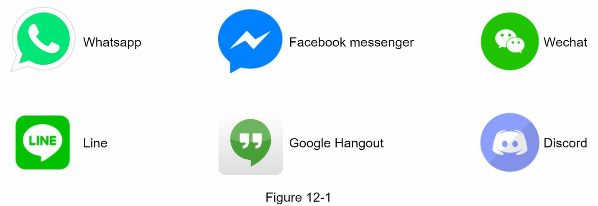

채팅 앱은 사람마다 다른 기능을 수행합니다. 정확한 요구 사항을 파악하는 것이 극히 중요합니다. 예를 들어 면접관이 1대1 채팅을 염두에 두고 있는데 그룹 채팅에 초점을 맞춘 시스템을 설계한다면 낭패입니다. 기능 요구 사항을 명확히 파악해야 합니다.

---

## 1단계: 문제 이해 및 설계 범위 정하기

### 채팅 앱의 종류: 요구사항을 명확히 하다

설계할 채팅 앱의 종류를 합의하는 것이 생명입니다. 시장에는 페이스북 메신저, 위챗, 왓츠앱과 같은 1대1 채팅 앱도 있고, 슬랙처럼 그룹 채팅에 초점을 맞춘 업무용 채팅 앱도 있으며, 디스코드처럼 대규모 그룹 상호작용과 낮은 음성 채팅 지연시간(Latency)을 중시하는 게임 채팅 앱도 있습니다.

첫 번째 단계에서 할 수 있는 질문들은 다음과 같습니다:

**면접자**: 우리가 설계할 채팅 앱은 어떤 종류입니까? 1대1 채팅입니까, 아니면 그룹 기반입니까?  
**면접관**: 1대1과 그룹 채팅을 모두 지원해야 합니다.

**면접자**: 모바일 앱입니까? 웹 앱입니까? 둘 다입니까?  
**면접관**: 둘 다입니다.

**면접자**: 이 앱의 규모는 어느 정도입니까? 스타트업 규모입니까, 아니면 대규모입니까?  
**면접관**: 5천만 명의 일일활성사용자(Daily Active Users, DAU)를 지원해야 합니다.

**면접자**: 그룹 채팅의 경우, 그룹 멤버 제한은 어느 정도입니까?  
**면접관**: 최대 100명입니다.

**면접자**: 채팅 앱에서 중요한 기능은 무엇입니까? 첨부 파일을 지원합니까?  
**면접관**: 1대1 채팅, 그룹 채팅, 온라인 표시기(Online indicator)를 지원합니다. 시스템은 텍스트 메시지만 지원합니다.

**면접자**: 메시지 크기 제한이 있습니까?  
**면접관**: 네, 텍스트 길이는 100,000자 이하여야 합니다.

**면접자**: 엔드투엔드 암호화(End-to-end encryption)가 필요합니까?  
**면접관**: 지금은 필요 없지만 시간이 남으면 논의해봅시다.

**면접자**: 채팅 기록을 얼마나 오래 저장해야 합니까?  
**면접관**: 영구히 저장합니다.

### 설계 범위 요약

이 장에서는 다음의 기능에 중점을 두고 페이스북 메신저와 같은 채팅 앱을 설계합니다:

- 낮은 전달 지연시간의 1대1 채팅
- 소규모 그룹 채팅(최대 100명)
- 온라인 상태 표시기
- 다중 기기 지원(같은 계정으로 여러 기기에 동시 로그인 가능)
- 푸시 알림(Push notification)

설계 규모는 5천만 명의 일일활성사용자를 지원하는 시스템입니다.

---

## 2단계: 고수준 설계안 제시 및 합의

### 통신 프로토콜: 클라이언트와 서버 간 대화의 방식

고품질 설계를 위해서는 클라이언트와 서버가 어떻게 통신하는지에 대한 기본적인 이해가 필요합니다. 채팅 시스템에서 클라이언트는 모바일 애플리케이션이거나 웹 애플리케이션입니다. 클라이언트들은 서로 직접 통신하지 않습니다. 대신 각 클라이언트는 위에서 언급한 모든 기능을 지원하는 채팅 서비스에 연결됩니다.

채팅 서비스가 지원해야 하는 기본적인 기능들은 다음과 같습니다:

- 다른 클라이언트로부터 메시지를 수신합니다.
- 각 메시지의 올바른 수신자를 찾아 메시지를 전달합니다.
- 수신자가 온라인 상태가 아니면, 그 수신자가 온라인이 될 때까지 서버에 메시지를 보관합니다.

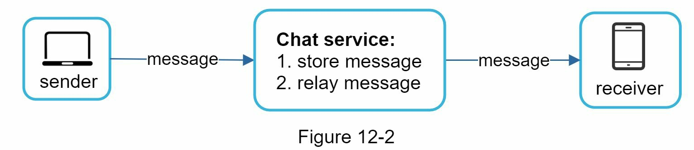

### 네트워크 프로토콜 선택: 데이터 전송의 기술

클라이언트가 채팅을 시작하려고 할 때, 하나 이상의 네트워크 프로토콜을 사용하여 채팅 서비스에 연결합니다. 채팅 서비스의 경우 네트워크 프로토콜의 선택이 중요합니다.

대부분의 클라이언트/서버 애플리케이션에서는 클라이언트가 요청을 시작합니다. 채팅 애플리케이션의 발신자 측도 마찬가지입니다. 발신자가 채팅 서비스를 통해 수신자에게 메시지를 보낼 때, 가장 일반적인 웹 프로토콜인 HTTP 프로토콜을 사용합니다. 이 시나리오에서 클라이언트는 채팅 서비스와의 HTTP 연결을 열고 메시지를 보냅니다. Keep-Alive 헤더를 통해 클라이언트가 채팅 서비스와의 지속적인 연결을 유지할 수 있으므로 효율적입니다. 또한 TCP 핸드셰이크 횟수를 줄여줍니다. 페이스북 같은 인기 있는 채팅 애플리케이션도 초기에는 메시지 전송에 HTTP를 사용했습니다.

다만, 수신자 측은 더 복잡합니다. HTTP는 클라이언트가 시작하기 때문에 서버에서 메시지를 보내기가 간단하지 않습니다. 지난 몇 년간 서버 시작 연결을 시뮬레이션하기 위해 많은 기법이 사용되었습니다: 폴링(Polling), 롱 폴링(Long polling), 웹소켓(WebSocket). 이러한 기법들은 시스템 설계 면접에서 널리 사용되므로 각각을 살펴봅시다.

### 폴링: 주기적으로 묻기

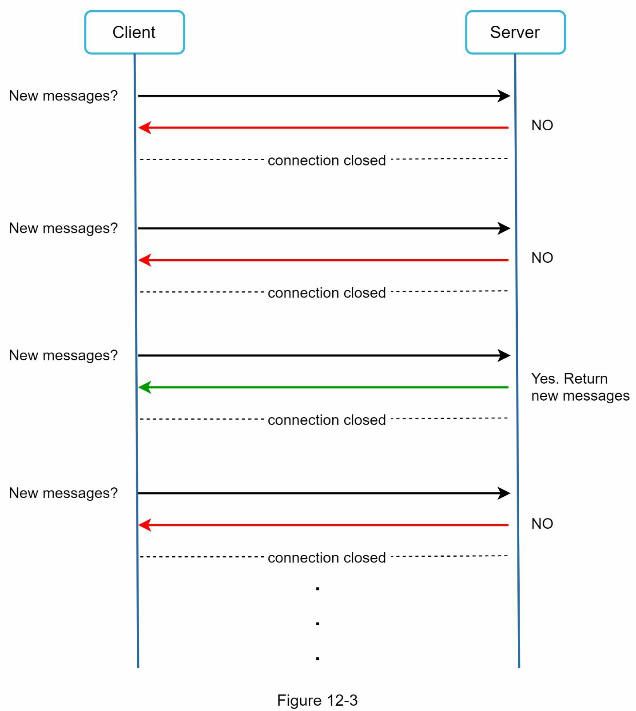

폴링은 클라이언트가 주기적으로 서버에 이용 가능한 메시지가 있는지 묻는 기법입니다. 폴링 빈도에 따라 비용이 클 수 있습니다. 대부분의 경우 "없음"이라는 답변을 주는 질문에 답하기 위해 귀중한 서버 리소스를 소비할 수 있습니다.

### 롱 폴링: 기다렸다 답하기

폴링의 비효율성 때문에 다음 단계가 롱 폴링(Long polling)입니다.

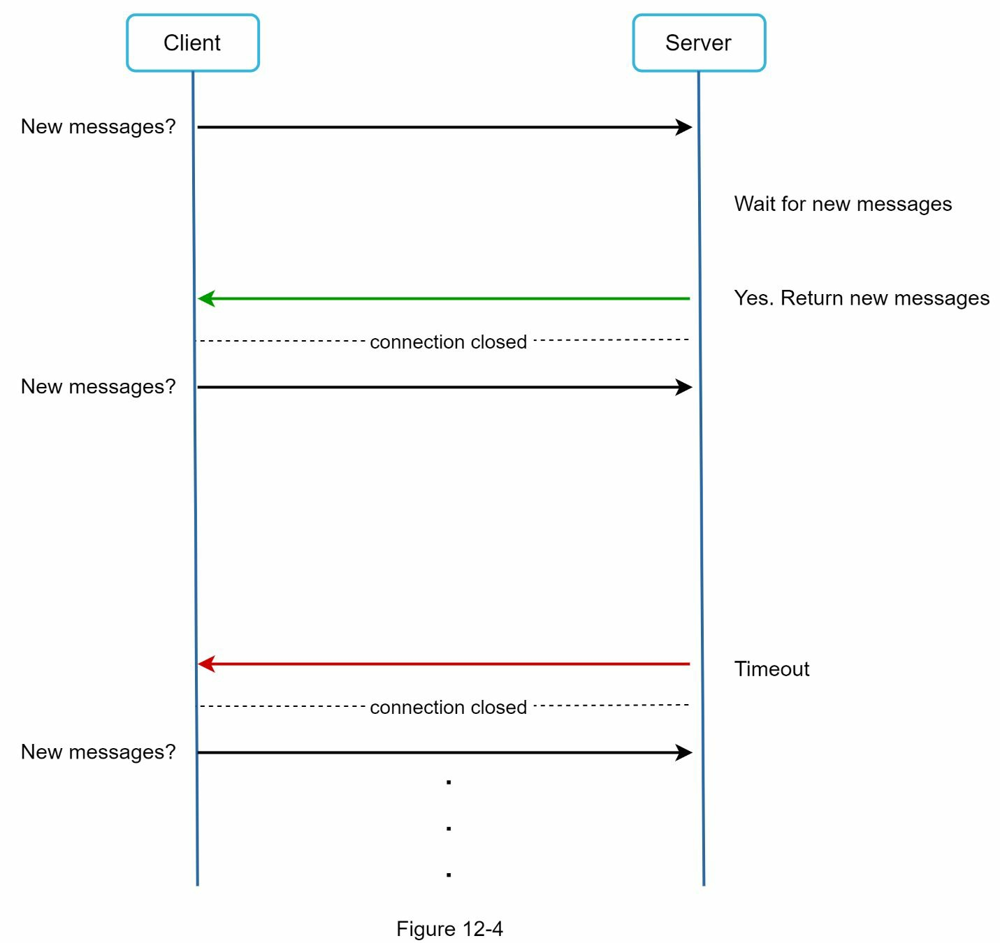

롱 폴링에서는 클라이언트가 실제로 새 메시지가 있을 때까지 또는 시간 초과 임계값에 도달할 때까지 연결을 열어 둡니다. 클라이언트가 새 메시지를 받으면 즉시 서버에 새로운 요청을 보내 프로세스를 다시 시작합니다. 롱 폴링에는 몇 가지 단점이 있습니다:

- **서버 라우팅 문제**: 발신자와 수신자가 같은 채팅 서버에 연결되지 않을 수 있습니다. HTTP 기반 서버는 일반적으로 무상태(Stateless)입니다. 라운드 로빈(Round robin) 방식으로 로드 밸런싱을 사용하면, 메시지를 받는 서버가 메시지를 수신하는 클라이언트와의 롱 폴링 연결을 갖지 않을 수 있습니다.
- **연결 상태 추적 어려움**: 서버가 클라이언트의 연결 해제를 판단할 좋은 방법이 없습니다.
- **비효율성**: 사용자가 채팅을 많이 하지 않는 경우, 롱 폴링은 여전히 시간 초과 후 주기적으로 연결을 만듭니다.

### 웹소켓: 진정한 양방향 통신

웹소켓은 서버에서 클라이언트로의 비동기 업데이트를 보내기 위한 가장 일반적인 솔루션입니다.

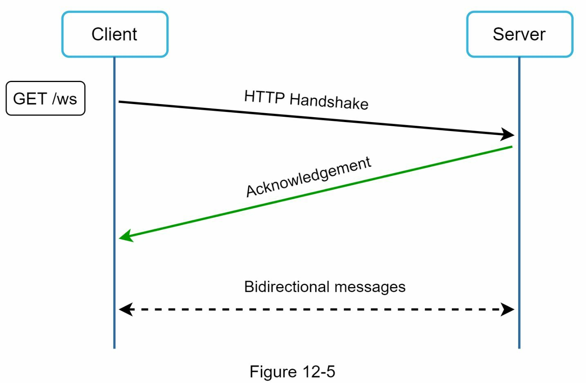

웹소켓 연결은 클라이언트에 의해 시작됩니다. 양방향(Bi-directional)이고 지속적(Persistent)입니다. HTTP 연결로 시작하여 잘 정의된 핸드셰이크를 통해 웹소켓 연결로 "업그레이드"될 수 있습니다. 이 지속적인 연결을 통해 서버는 클라이언트에 업데이트를 보낼 수 있습니다. 웹소켓 연결은 방화벽이 있어도 일반적으로 작동합니다. 왜냐하면 HTTP/HTTPS 연결도 사용하는 포트 80 또는 443을 사용하기 때문입니다.

앞서 발신자 측에서 HTTP가 좋은 프로토콜이라고 했지만, 웹소켓이 양방향이므로 발신자 측에도 웹소켓을 사용하지 않을 기술적 이유가 없습니다.

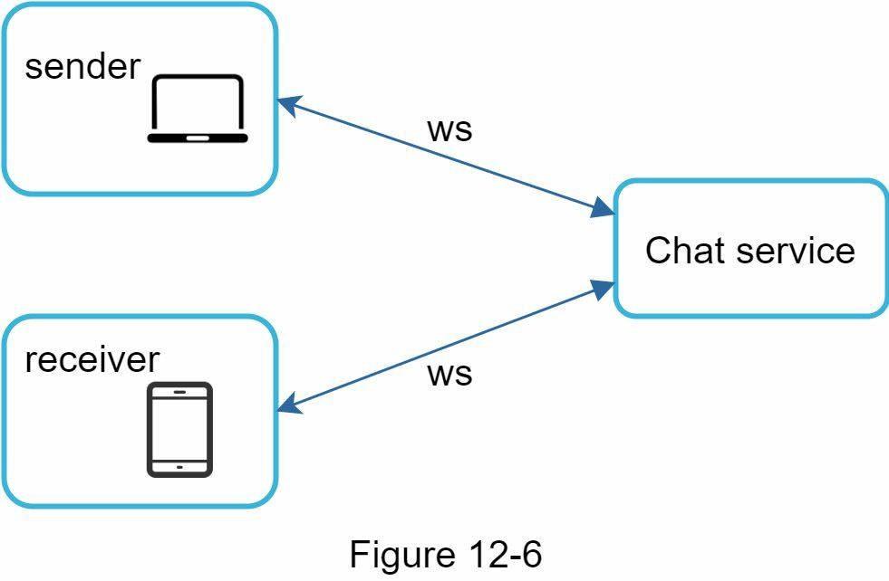

발신자와 수신자 양쪽 모두에 웹소켓을 사용하면 설계가 단순화되고 클라이언트와 서버 양쪽의 구현이 더욱 직관적이 됩니다. 웹소켓 연결은 지속적이므로 서버 측의 효율적인 연결 관리가 중요합니다.

---

### 고수준 아키텍처 설계

#### 컴포넌트 분해: 채팅 시스템의 주요 구성 요소

웹소켓이 클라이언트와 서버 간의 양방향 통신을 위한 주요 통신 프로토콜로 선택되었지만, 다른 모든 것이 웹소켓일 필요는 없습니다. 실제로 채팅 애플리케이션의 대부분의 기능(회원가입, 로그인, 사용자 프로필 등)은 HTTP를 통한 전통적인 요청/응답 방식을 사용할 수 있습니다.

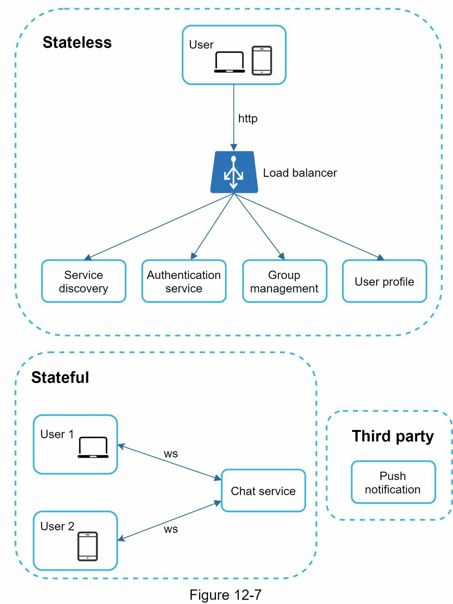

채팅 시스템은 세 가지 주요 카테고리로 나뉩니다: 무상태 서비스(Stateless services), 상태 저장 서비스(Stateful services), 그리고 제3자 통합(Third-party integration).

#### 무상태 서비스: 전통적인 요청/응답 방식

무상태 서비스는 로그인, 회원가입, 사용자 프로필 등을 관리하는 전통적인 공개 인터페이스 요청/응답 서비스입니다. 이는 많은 웹사이트와 앱에서 공통적인 기능입니다. 무상태 서비스는 요청 경로에 따라 올바른 서비스로 요청을 라우팅하는 로드 밸런서(Load balancer) 뒤에 앉아 있습니다. 이 서비스들은 모놀리식(Monolithic)이거나 개별 마이크로서비스(Microservices)일 수 있습니다.

우리가 직접 많은 무상태 서비스를 구축할 필요는 없습니다. 시장에 쉽게 통합할 수 있는 서비스들이 있기 때문입니다. 더 자세히 논의할 서비스는 서비스 디스커버리(Service discovery)입니다. 주요 역할은 클라이언트가 연결할 수 있는 채팅 서버의 DNS 호스트명 목록을 클라이언트에게 제공하는 것입니다.

#### 상태 저장 서비스: 채팅 서버

유일한 상태 저장 서비스는 채팅 서비스입니다. 이 서비스가 상태를 저장하는 이유는 각 클라이언트가 채팅 서버와의 지속적인 네트워크 연결을 유지하기 때문입니다. 이 서비스에서 클라이언트는 서버가 여전히 사용 가능한 한 다른 채팅 서버로 전환하지 않습니다. 서비스 디스커버리는 서버 과부하를 피하기 위해 채팅 서비스와 긴밀히 협력합니다.

#### 제3자 통합: 푸시 알림

채팅 앱의 경우 푸시 알림이 가장 중요한 제3자 통합입니다. 앱이 실행되지 않아도 새 메시지가 도착했을 때 사용자에게 알리는 방법입니다. 푸시 알림의 적절한 통합이 중요합니다. 자세한 내용은 10장 [[10장 알림 시스템 설계 (Design a Notification System)|알림 시스템]] 설계를 참조하십시오.

#### 확장성 고려: 단일 서버에서 다중 서버로

작은 규모에서는 위에서 나열한 모든 서비스가 하나의 서버에 맞을 수 있습니다. 우리가 설계하는 규모에서도 이론상 모든 사용자 연결이 하나의 최신 클라우드 서버에 맞을 수 있습니다. 100만 명의 동시 사용자라고 가정하면, 각 사용자 연결이 서버에서 10KB의 메모리가 필요하다면(이는 매우 대략적인 수치이며 언어 선택에 크게 의존합니다), 모든 연결을 하나의 서버에 보관하는 데 약 10GB의 메모리만 필요합니다.

모든 것이 하나의 서버에 맞는 설계를 제안하면, 면접관이 큰 우려의 신호를 보낼 것입니다. 어떤 기술자도 이러한 규모를 단일 서버로 설계하지 않을 것입니다. 단일 서버 설계는 많은 이유 때문에 결정적인 결함입니다. 그 중 가장 큰 것은 단일 지점 장애(Single point of failure)입니다.

그러나 단일 서버 설계로 시작하는 것은 완벽하게 괜찮습니다. 면접관이 이것이 시작점임을 알도록 하십시오. 우리가 언급한 모든 것을 종합하면, 다음 그림은 조정된 고수준 설계를 보여줍니다.

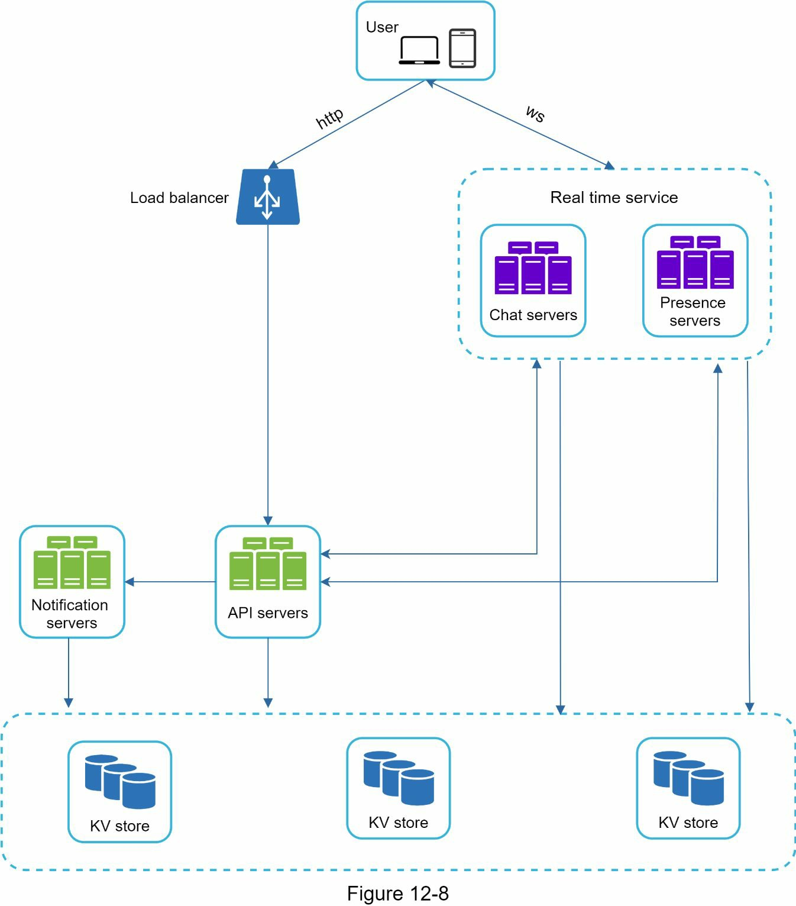

이 설계에서:
- 클라이언트는 실시간 메시징을 위해 채팅 서버에 지속적인 웹소켓 연결을 유지합니다.
- 채팅 서버는 메시지 송수신을 촉진합니다.
- 상태 서버(Presence server)는 온라인/오프라인 상태를 관리합니다.
- API 서버는 사용자 로그인, 회원가입, 프로필 변경 등 모든 것을 처리합니다.
- 알림 서버는 푸시 알림을 보냅니다.
- 마지막으로 [[6장 키-값 저장소 설계|키-값 저장소]]는 채팅 기록을 저장합니다. 오프라인 사용자가 온라인이 되면, 이전의 모든 채팅 기록을 볼 수 있습니다.

---

### 저장소 계층: 어떤 데이터베이스를 선택할 것인가?

#### 저장소 선택: 관계형 DB vs NoSQL

서버들이 준비되고, 서비스가 실행 중이며, 제3자 통합이 완료되었다면, 기술 스택의 맨 아래는 데이터 계층입니다. 데이터 계층은 보통 올바르게 설계하기 위해 노력이 필요합니다. 우리가 해야 할 중요한 결정은 어떤 유형의 데이터베이스를 사용할지 결정하는 것입니다: 관계형 데이터베이스(Relational database)인지 NoSQL 데이터베이스인지요? 정보에 입각한 결정을 내리기 위해 데이터 유형과 읽기/쓰기 패턴을 검토합니다.

#### 두 가지 데이터 유형

일반적인 채팅 시스템에는 두 가지 유형의 데이터가 존재합니다.

**첫 번째는 일반 데이터**: 사용자 프로필, 설정, 사용자 친구 목록 같은 것들입니다. 이 데이터는 견고하고 신뢰할 수 있는 관계형 데이터베이스에 저장됩니다. 레플리케이션(Replication)과 샤딩(Sharding)은 가용성과 확장성 요구 사항을 만족시키는 일반적인 기법입니다.

**두 번째는 채팅 시스템에만 고유한 데이터**: 채팅 기록 데이터입니다. 읽기/쓰기 패턴을 이해하는 것이 중요합니다:

- **데이터 규모가 엄청남**: 이전 연구에 따르면 페이스북 메신저와 왓츠앱은 하루에 600억 개의 메시지를 처리합니다.
- **최근 채팅만 자주 액세스함**: 사용자는 보통 오래된 채팅을 조회하지 않습니다.
- **무작위 액세스 필요**: 최근 채팅 기록이 가장 많이 조회되지만, 사용자는 검색, 멘션 보기, 특정 메시지로 이동 등의 기능이 필요할 수 있습니다. 이러한 경우들도 데이터 액세스 계층에서 지원되어야 합니다.
- **읽기/쓰기 비율이 1:1**: 1대1 채팅 앱의 경우 읽기와 쓰기의 비율이 대략 같습니다.

#### 키-값 저장소의 선택

모든 사용 사례를 지원하는 올바른 저장소 시스템을 선택하는 것이 중요합니다. 다음의 이유로 키-값 저장소(Key-value store)를 권장합니다:

- 키-값 저장소는 쉬운 수평 확장성을 제공합니다.
- 키-값 저장소는 데이터 액세스에 매우 낮은 지연시간을 제공합니다.
- 관계형 데이터베이스는 롱테일(Long tail) 데이터를 잘 처리하지 못합니다. 인덱스가 커지면 무작위 액세스가 비싸집니다.
- 키-값 저장소는 다른 입증된 신뢰할 수 있는 채팅 애플리케이션에서도 채택되었습니다. 예를 들어, 페이스북 메신저와 디스코드 모두 키-값 저장소를 사용합니다. 페이스북 메신저는 HBase를 사용하고, 디스코드는 카산드라(Cassandra)를 사용합니다.

---

### 데이터 모델

방금 저장소 계층으로 키-값 저장소를 사용하겠다고 논의했습니다. 가장 중요한 데이터는 메시지 데이터입니다. 자세히 살펴봅시다.

#### 1대1 채팅을 위한 메시지 테이블

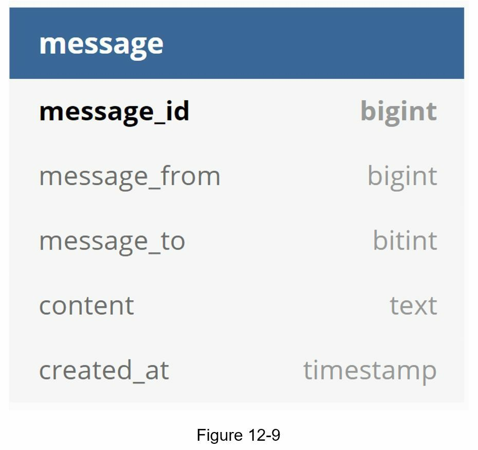

1대1 채팅을 위한 메시지 테이블을 보여줍니다. 기본 키(Primary key)는 message_id이며, 이는 메시지 순서를 결정하는 데 도움이 됩니다. 두 메시지가 동시에 생성될 수 있으므로 created_at에만 의존하여 메시지 순서를 결정할 수 없습니다.

#### 그룹 채팅을 위한 메시지 테이블

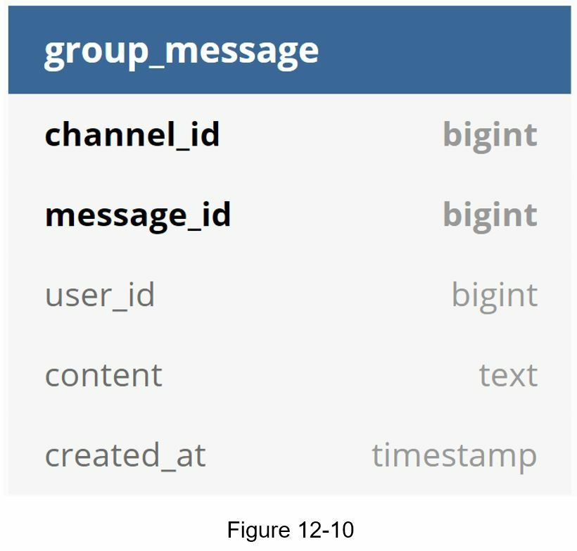

그룹 채팅을 위한 메시지 테이블입니다. 복합 기본 키(Composite primary key)는 (channel_id, message_id)입니다. 채널과 그룹은 여기서 같은 의미입니다. channel_id는 그룹 채팅의 모든 쿼리가 채널에서 작동하므로 파티션 키(Partition key)입니다.

#### 메시지 ID 생성: 순서를 보장하는 고유성

message_id를 어떻게 생성할 것인지는 탐구할 가치가 있는 흥미로운 주제입니다. Message_id는 메시지의 순서를 보장하는 책임을 집니다. 메시지의 순서를 확인하려면 message_id는 다음 두 가지 요구 사항을 만족해야 합니다:

- **ID는 고유해야 합니다.**
- **ID는 시간 정렬이 가능해야 합니다.** 즉, 새로운 행은 이전 행보다 높은 ID를 가져야 합니다.

이 두 가지 보장을 어떻게 달성할 수 있을까요?

**첫 번째 아이디어**: MySQL의 "auto_increment" 키워드를 사용하는 것입니다. 그러나 NoSQL 데이터베이스는 보통 이러한 기능을 제공하지 않습니다.

**두 번째 접근 방식**: Snowflake와 같은 글로벌 64비트 시퀀스 번호 생성기(Sequence number generator)를 사용합니다. 이는 분산 시스템에서 [[7장 분산 시스템에서 고유 ID 생성기 설계|고유 ID 생성기]] 설계(7장)에서 논의됩니다.

**세 번째 접근 방식**: 로컬 시퀀스 번호 생성기를 사용합니다. 로컬이란 ID가 그룹 내에서만 고유함을 의미합니다. 로컬 ID가 작동하는 이유는 1대1 채널 또는 그룹 채널 내에서 메시지 순서를 유지하는 것으로 충분하기 때문입니다. 이 접근 방식은 글로벌 ID 구현에 비해 구현하기가 더 쉽습니다.

---

## 3단계: 심화 설계

### 심화 설계의 초점

시스템 설계 면접에서는 보통 고수준 설계의 일부 컴포넌트에 깊이 있게 들어갈 것으로 예상됩니다. 채팅 시스템의 경우, 서비스 디스커버리, 메시지 흐름(Message flow), 온라인/오프라인 표시기가 더 깊은 탐구를 할 가치가 있습니다.

### 서비스 디스커버리: 최적의 채팅 서버 찾기

서비스 디스커버리의 주요 역할은 지리적 위치, 서버 용량 등의 기준에 따라 클라이언트에게 최적의 채팅 서버를 추천하는 것입니다. 아파치 주키퍼(Apache ZooKeeper)는 서비스 디스커버리를 위한 인기 있는 오픈소스 솔루션입니다. 사용 가능한 모든 채팅 서버를 등록하고 사전 정의된 기준에 따라 클라이언트에 최적의 채팅 서버를 선택합니다.

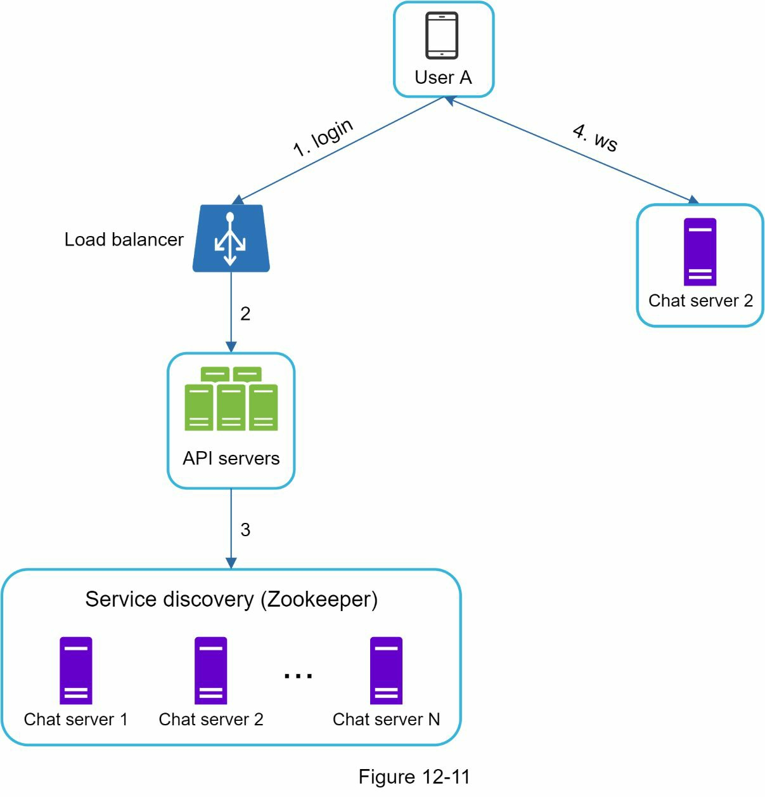

서비스 디스커버리의 작동 흐름:

1. 사용자 A가 앱에 로그인하려고 합니다.
2. 로드 밸런서가 로그인 요청을 API 서버로 보냅니다.
3. 백엔드가 사용자를 인증한 후, 서비스 디스커버리가 사용자 A를 위한 최적의 채팅 서버를 찾습니다. 이 예에서는 서버 2가 선택되고 서버 정보가 사용자 A에게 반환됩니다.
4. 사용자 A는 웹소켓을 통해 채팅 서버 2에 연결합니다.

### 메시지 흐름: 종단간 메시지 전달

채팅 시스템의 종단간 흐름을 이해하는 것은 흥미롭습니다. 이 섹션에서는 1대1 채팅 흐름, 다중 기기에서의 메시지 동기화, 그룹 채팅 흐름을 살펴봅시다.

#### 1대1 채팅 흐름: 개인 대 개인

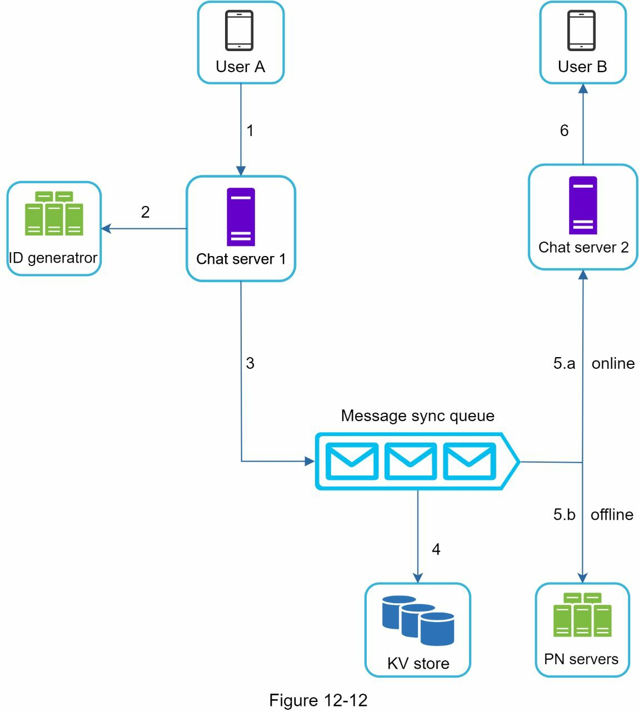

사용자 A가 사용자 B에게 메시지를 보낼 때 일어나는 일을 설명합니다:

1. 사용자 A가 채팅 메시지를 채팅 서버 1로 보냅니다.
2. 채팅 서버 1이 ID 생성기로부터 메시지 ID를 얻습니다.
3. 채팅 서버 1이 메시지를 메시지 동기화 큐(Message sync queue)로 보냅니다.
4. 메시지가 키-값 저장소에 저장됩니다.
5a. 사용자 B가 온라인이면, 메시지는 사용자 B가 연결된 채팅 서버 2로 전달됩니다.
5b. 사용자 B가 오프라인이면, 푸시 알림 서버로부터 푸시 알림이 발송됩니다.
6. 채팅 서버 2가 메시지를 사용자 B에게 전달합니다. 사용자 B와 채팅 서버 2 사이에는 지속적인 웹소켓 연결이 있습니다.

#### 다중 기기 간 메시지 동기화: 같은 계정, 여러 기기

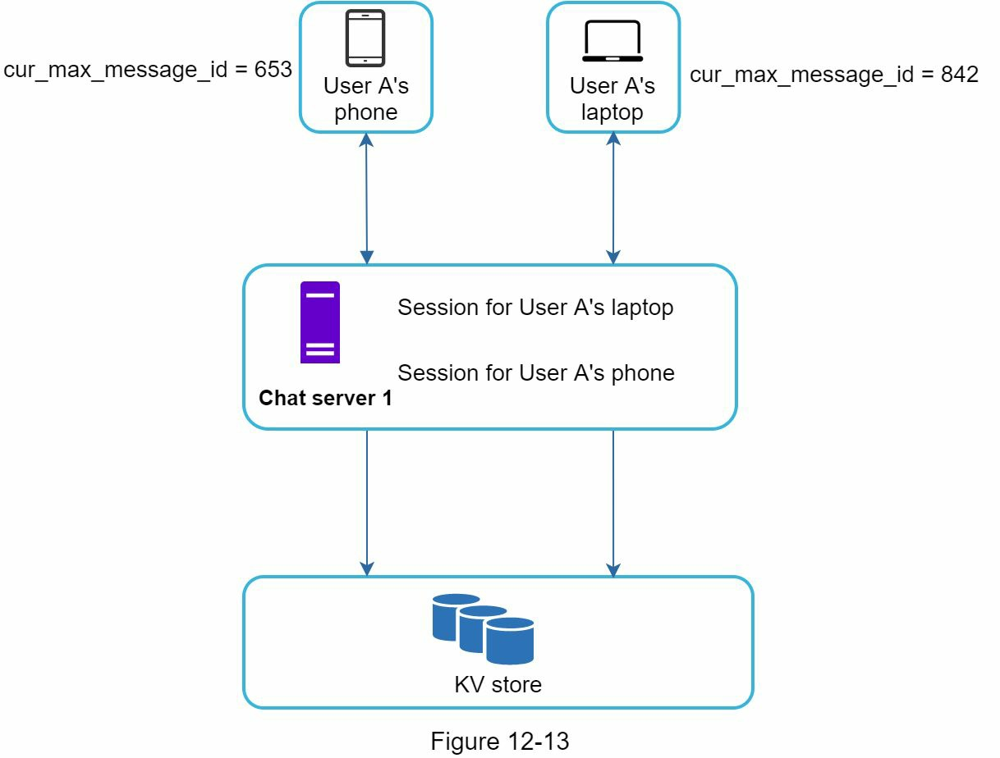

많은 사용자가 여러 기기를 가지고 있습니다. 다중 기기에서 메시지를 동기화하는 방법을 설명하겠습니다.

이 그림에서 사용자 A는 휴대폰과 노트북, 두 개의 기기를 가지고 있습니다. 사용자 A가 휴대폰으로 채팅 앱에 로그인하면, 채팅 서버 1과 웹소켓 연결을 설정합니다. 마찬가지로 노트북과 채팅 서버 1 사이에도 연결이 있습니다.

각 기기는 cur_max_message_id라는 변수를 유지합니다. 이는 기기의 최신 메시지 ID를 추적합니다. 다음 두 조건을 만족하는 메시지는 새 메시지로 간주됩니다:

- 수신자 ID가 현재 로그인한 사용자 ID와 같습니다.
- 키-값 저장소의 메시지 ID가 cur_max_message_id보다 큽니다.

각 기기마다 고유한 cur_max_message_id를 유지하면, 메시지 동기화가 쉬워집니다. 각 기기는 키-값 저장소에서 새 메시지를 가져올 수 있습니다.

#### 소규모 그룹 채팅 흐름: 최대 100명

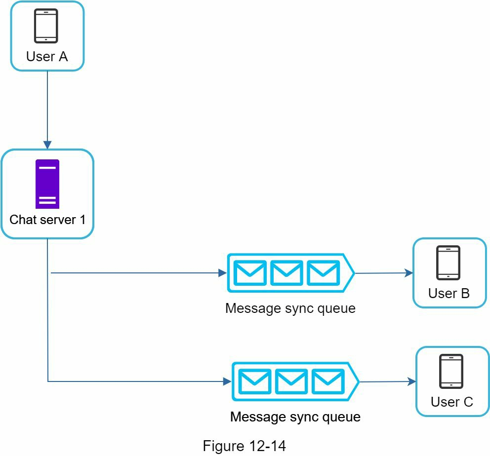

1대1 채팅과 비교하면, 그룹 채팅의 로직은 더 복잡합니다. 사용자 A가 그룹 채팅에 메시지를 보낼 때 일어나는 일을 설명합니다. 그룹에 3명의 멤버가 있다고 가정합니다(사용자 A, 사용자 B, 사용자 C). 먼저 사용자 A의 메시지는 각 그룹 멤버의 메시지 동기화 큐에 복사됩니다: 사용자 B를 위한 하나, 사용자 C를 위한 하나입니다. 메시지 동기화 큐를 수신자를 위한 받은편지함으로 생각할 수 있습니다.

이 설계 선택이 소규모 그룹 채팅에 좋은 이유:

- 메시지 동기화 흐름이 단순화됩니다. 각 클라이언트는 자신의 받은편지함만 확인하면 새 메시지를 얻을 수 있습니다.
- 그룹 수가 작을 때, 각 수신자의 받은편지함에 메시지 사본을 저장하는 것이 그리 비싸지 않습니다.

위챗은 유사한 접근 방식을 사용하며, 그룹을 500명으로 제한합니다. 그러나 사용자가 많은 그룹의 경우, 각 멤버마다 메시지 사본을 저장하는 것은 수용할 수 없습니다.

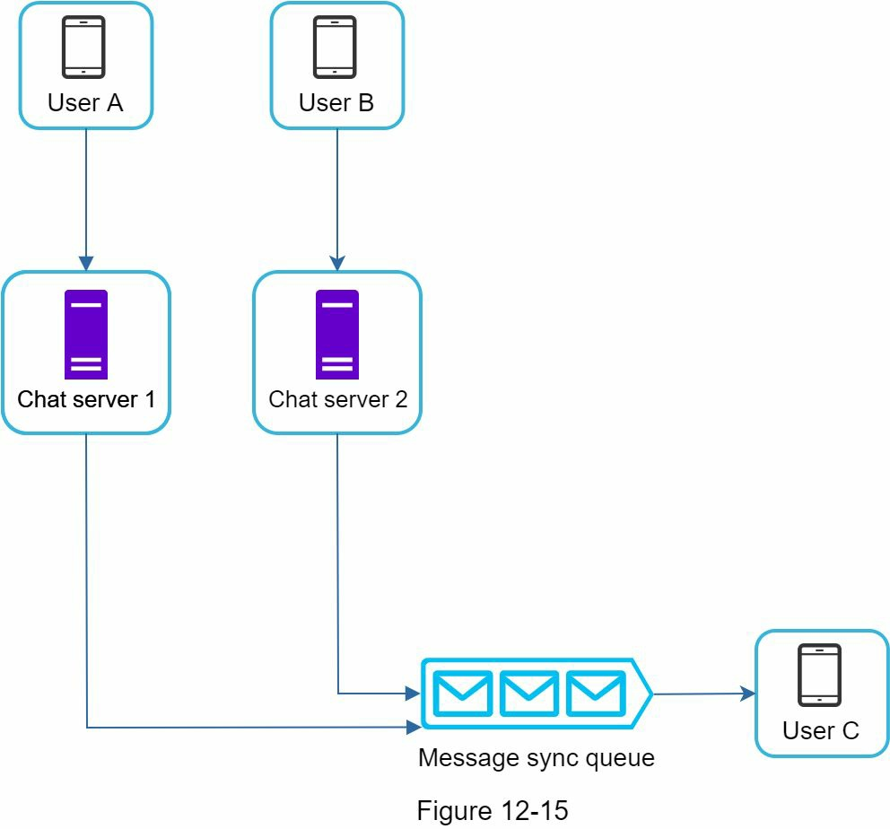

수신자 측에서 수신자는 여러 사용자로부터 메시지를 받을 수 있습니다. 각 수신자는 서로 다른 발신자의 메시지를 포함하는 받은편지함(메시지 동기화 큐)을 가지고 있습니다. 이 그림은 설계를 보여줍니다.

---

### 온라인 상태 표시: "사용자가 현재 온라인입니까?"

#### 온라인 상태 표시란?

온라인 상태 표시(Online presence)는 많은 채팅 애플리케이션의 필수 기능입니다. 보통 사용자의 프로필 사진이나 사용자명 옆에 녹색 점을 볼 수 있습니다. 이 섹션에서는 이 뒤에서 일어나는 일을 설명합니다.

고수준 설계에서 상태 서버는 온라인 상태를 관리하고 웹소켓을 통해 클라이언트와 통신합니다. 온라인 상태 변경을 트리거하는 몇 가지 흐름이 있습니다. 각각을 살펴봅시다.

#### 사용자 로그인: 온라인이 됨

사용자 로그인 흐름은 "서비스 디스커버리" 섹션에서 설명되었습니다. 클라이언트와 실시간 서비스 사이에 웹소켓 연결이 구축된 후, 사용자 A의 온라인 상태와 last_active_at 타임스탬프가 키-값 저장소에 저장됩니다. 온라인 표시기는 사용자가 로그인한 후 사용자가 온라인임을 보여줍니다.

#### 사용자 로그아웃: 오프라인이 됨

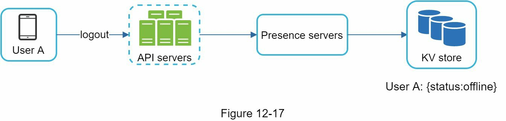

사용자가 로그아웃할 때, 그림에 표시된 사용자 로그아웃 흐름을 거칩니다. 온라인 상태가 키-값 저장소에서 오프라인으로 변경됩니다. 온라인 표시기는 사용자가 오프라인임을 보여줍니다.

#### 사용자 연결 해제: 일시적 끊김 처리

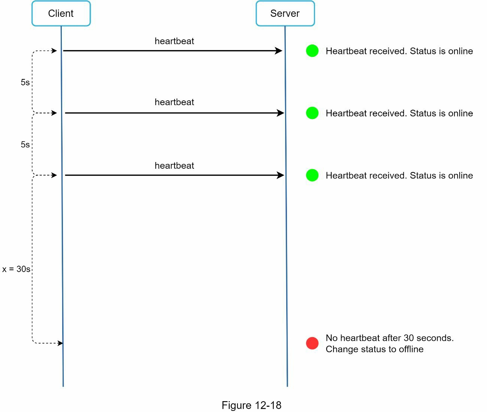

우리 모두는 인터넷 연결이 일관되고 신뢰할 수 있기를 바랍니다. 하지만 항상 그런 것은 아닙니다. 따라서 우리는 설계에서 이 문제를 다루어야 합니다. 사용자가 인터넷에서 연결을 해제하면, 클라이언트와 서버 사이의 지속적인 연결이 끊깁니다. 사용자 연결 해제를 처리하는 순진한 방법은 사용자를 오프라인으로 표시하고 연결이 재확립될 때 온라인으로 변경하는 것입니다.

그러나 이 접근 방식에는 큰 결함이 있습니다. 사용자가 짧은 시간에 인터넷 연결을 자주 끊었다가 다시 연결하는 것은 흔한 일입니다. 예를 들어, 사용자가 터널을 통과할 때 네트워크 연결이 켜졌다가 꺼질 수 있습니다. 매번 연결 해제/재연결할 때마다 온라인 상태를 업데이트하면 온라인 표시기가 너무 자주 변경되어 사용자 경험이 좋지 않습니다.

이 문제를 해결하기 위해 **하트비트 메커니즘(Heartbeat mechanism)**을 도입합니다. 주기적으로 온라인 클라이언트는 상태 서버로 하트비트 이벤트(Heartbeat event)를 보냅니다. 상태 서버가 클라이언트로부터 x초 이내에 하트비트 이벤트를 받으면, 사용자는 온라인으로 간주됩니다. 그렇지 않으면 오프라인입니다.

이 그림에서 클라이언트는 매 5초마다 서버로 하트비트 이벤트를 보냅니다. 3개의 하트비트 이벤트를 보낸 후 클라이언트가 연결을 해제하고 x = 30초 이내에 재연결하지 않습니다(이 숫자는 로직을 설명하기 위해 임의로 선택되었습니다). 온라인 상태가 오프라인으로 변경됩니다.

#### 온라인 상태 팬아웃: 친구들에게 알리기

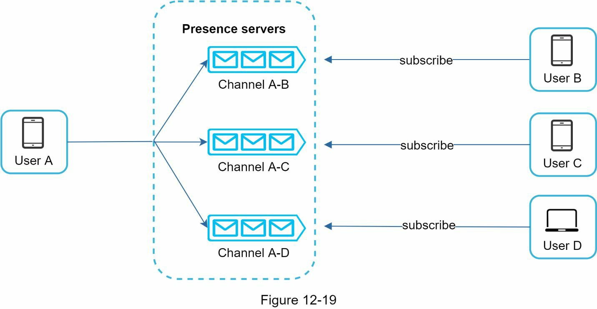

사용자 A의 친구들은 상태 변경에 대해 어떻게 알 수 있을까요? 상태 서버는 퍼블리시-구독 모델(Publish-subscribe model)을 사용합니다. 각 친구 쌍은 채널을 유지합니다. 사용자 A의 온라인 상태가 변경되면, 3개의 채널(A-B, A-C, A-D)로 이벤트를 발행합니다. 이 3개의 채널은 각각 사용자 B, C, D에 의해 구독됩니다. 따라서 친구들이 온라인 상태 업데이트를 받기가 쉽습니다. 클라이언트와 서버 사이의 통신은 실시간 웹소켓을 통합니다.

#### 대규모 그룹에서의 온라인 상태 최적화

위의 설계는 작은 사용자 그룹에 효과적입니다. 예를 들어, 위챗은 유사한 접근 방식을 사용하므로 사용자 그룹이 500명으로 제한됩니다. 더 큰 그룹의 경우, 모든 멤버에게 온라인 상태를 알리는 것은 비싸고 시간이 오래 걸립니다. 예를 들어, 그룹에 100,000명의 멤버가 있다고 가정합시다. 각 상태 변경은 100,000개의 이벤트를 생성합니다.

이 성능 병목 현상을 해결하기 위한 가능한 솔루션은 사용자가 그룹에 진입하거나 친구 목록을 수동으로 새로고침할 때만 온라인 상태를 가져오는 것입니다.

---

## 4단계: 정리 및 마무리

### 설계 요약

이 장에서는 1대1 채팅과 소규모 그룹 채팅을 모두 지원하는 채팅 시스템 아키텍처를 제시했습니다. 웹소켓은 클라이언트와 서버 사이의 실시간 통신에 사용됩니다. 채팅 시스템은 다음 컴포넌트를 포함합니다:

- **채팅 서버**: 실시간 메시지 송수신을 촉진합니다.
- **상태 서버**: 온라인 상태를 관리합니다.
- **푸시 알림 서버**: 푸시 알림을 발송합니다.
- **키-값 저장소**: 채팅 기록을 지속시킵니다.
- **API 서버**: 로그인, 회원가입 등 기타 기능을 처리합니다.

### 추가 논의 주제

면접이 끝나갈 때 시간이 남으면, 다음은 추가 논의 주제입니다:

#### 미디어 파일 지원 확장
- 채팅 앱을 사진과 비디오 같은 미디어 파일을 지원하도록 확장합니다. 미디어 파일은 텍스트보다 크기가 훨씬 큽니다. 압축, 클라우드 저장소, 썸네일은 논의할 가치 있는 흥미로운 주제입니다.

#### 엔드투엔드 암호화
- 왓츠앱은 메시지에 대해 엔드투엔드 암호화를 지원합니다. 발신자와 수신자만 메시지를 읽을 수 있습니다. 관심 있는 독자는 참고 자료의 글을 참고해야 합니다.

#### 클라이언트 측 캐싱
- 클라이언트 측에서 메시지를 캐싱하는 것은 클라이언트와 서버 사이의 데이터 전송을 줄이는 데 효과적입니다.

#### 로드 시간 개선
- 슬랙은 지리적으로 분산된 네트워크를 구축하여 사용자의 데이터, 채널 등을 캐시하여 더 나은 로드 시간을 제공합니다.

#### 오류 처리
**채팅 서버 오류**: 채팅 서버에는 수백, 수백만 개의 지속적인 연결이 있을 수 있습니다. 채팅 서버가 오프라인이 되면, 서비스 디스커버리(주키퍼)가 클라이언트를 위한 새로운 채팅 서버를 제공하여 새로운 연결을 설정할 수 있습니다.

**메시지 재전송 메커니즘**: 재시도와 큐잉은 메시지를 다시 보내는 일반적인 기법입니다.

---

## 축하합니다!

여기까지 읽어주셔서 감사합니다! 이제 자신에게 박수를 보내세요. 멋진 일을 해냈습니다!

---

## 핵심 개념 정리

**웹소켓(WebSocket)**: HTTP 핸드셰이크를 거쳐 업그레이드되는 양방향·지속적 통신 프로토콜. 서버가 클라이언트에 먼저 메시지를 보낼 수 있어 실시간 채팅에 최적

**롱 폴링(Long Polling)**: 클라이언트가 서버에 요청을 보내고 새 메시지가 도착하거나 시간 초과가 될 때까지 연결을 열어 두는 기법. 진정한 서버 푸시가 아니어서 연결 상태 추적이 어렵다는 단점이 있음

**서비스 디스커버리(Service Discovery)**: 클라이언트에게 최적의 채팅 서버 DNS 호스트명을 동적으로 제공하는 컴포넌트. 아파치 주키퍼(Apache ZooKeeper)가 대표적인 구현체

**온라인 상태 표시(Online Presence)**: 사용자의 실시간 접속 여부를 친구 목록에 녹색 점으로 나타내는 기능. 하트비트 메커니즘과 상태 서버(Presence Server)가 핵심

**하트비트 메커니즘(Heartbeat Mechanism)**: 클라이언트가 주기적으로(예: 5초마다) 상태 서버에 신호를 보내 연결 유지를 알리는 방식. 일시적 네트워크 단절과 실제 로그아웃을 구분하는 데 사용

**메시지 동기화(Message Sync)**: 같은 계정의 여러 기기가 `cur_max_message_id`를 추적해 키-값 저장소에서 새 메시지를 가져오는 방식. 기기마다 독립적인 기준값을 유지

**메시지 동기화 큐(Message Sync Queue)**: 그룹 채팅에서 각 수신자의 받은편지함 역할을 하는 큐. 발신 메시지를 멤버 수만큼 복사해 넣어 동기화 흐름을 단순화

**퍼블리시-구독 모델(Publish-Subscribe Model)**: 상태 서버가 친구 쌍마다 채널을 유지하고, 온라인 상태 변경 시 해당 채널로 이벤트를 발행하면 구독 중인 친구들이 수신하는 패턴

**무상태 서비스 vs 상태 저장 서비스(Stateless vs Stateful Service)**: 로그인·회원가입 등은 무상태 서비스로 수평 확장이 자유롭고, 지속적 웹소켓 연결을 맺는 채팅 서버는 상태 저장 서비스로 세심한 부하 관리가 필요

**메시지 ID 생성(Message ID Generation)**: 메시지 순서를 보장하기 위해 고유하고 시간 정렬 가능한 ID가 필요. 전역 순서는 Snowflake 방식, 채널 내 순서는 로컬 시퀀스 번호로 처리 가능

---

## 참고 자료

[1] Erlang at Facebook: https://www.erlang-factory.com/upload/presentations/31/EugeneLetuchy-ErlangatFacebook.pdf

[2] Messenger and WhatsApp process 60 billion messages a day: https://www.theverge.com/2016/4/12/11415198/facebook-messenger-whatsapp-number-messages-vs-sms-f8-2016

[3] Long tail: https://en.wikipedia.org/wiki/Long_tail

[4] The Underlying Technology of Messages: https://www.facebook.com/notes/facebook-engineering/the-underlying-technology-of-messages/454991608919/

[5] How Discord Stores Billions of Messages: https://blog.discordapp.com/how-discord-stores-billions-of-messages-7fa6ec7ee4c7

[6] Announcing Snowflake: https://blog.twitter.com/engineering/en_us/a/2010/announcing-snowflake.html

[7] Apache ZooKeeper: https://zookeeper.apache.org/

[8] From nothing: the evolution of WeChat background system (Article in Chinese): https://www.infoq.cn/article/the-road-of-the-growth-of-weixin-background

[9] End-to-end encryption: https://faq.whatsapp.com/en/android/28030015/

[10] Flannel: An Application-Level Edge Cache to Make Slack Scale: https://slack.engineering/flannel-an-application-level-edge-cache-to-make-slack-scale-b8a6400e2f6b
