## 서론: 왜 자동완성이 필요할까

검색창에 글자를 입력해본 경험을 떨어올려 봅시다. Google에서 검색하거나 Amazon에서 물건을 찾을 때, 몇 글자만 입력해도 관련된 검색어들이 자동으로 나타납니다. 이 기능을 자동완성(autocomplete), 타입어헤드(typeahead), 검색-입력-중(search-as-you-type), 또는 증분 검색(incremental search)이라고 부릅니다. 


검색 자동완성은 많은 제품의 중요한 기능입니다. 이것이 우리 앞에 놓인 인터뷰 질문입니다: 검색 자동완성 시스템을 설계하시오. 이 질문은 "상위 k개 설계" 또는 "상위 k개 가장 검색된 쿼리 설계"로도 불립니다.

---

## 1단계: 문제 이해 및 설계 범위 결정

어떤 시스템 설계 인터뷰 질문이든 요구사항을 명확히 하기 위해 충분한 질문을 던져야 합니다. 다음은 후보자와 면접관의 상호작용 예시입니다:

**후보자:** 매칭이 검색 쿼리의 처음에서만 지원되나요, 중간에서도 지원되나요?  
**면접관:** 검색 쿼리의 처음에서만입니다.

**후보자:** 시스템이 반환해야 하는 자동완성 제안은 몇 개인가요?  
**면접관:** 5개입니다.

**후보자:** 시스템이 어떤 5개의 제안을 반환할지는 어떻게 알까요?  
**면접관:** 이것은 인기도로 결정되며, 과거 쿼리 빈도로 정해집니다.

**후보자:** 시스템이 맞춤법 검사를 지원하나요?  
**면접관:** 아니요, 맞춤법 검사나 자동 정정은 지원하지 않습니다.

**후보자:** 검색 쿼리가 영어인가요?  
**면접관:** 네, 시간이 허락하면 다국어 지원을 논의할 수 있습니다.

**후보자:** 대소문자와 특수문자를 허용하나요?  
**면접관:** 아니요, 모든 검색 쿼리는 소문자 알파벳만 포함한다고 가정합니다.

**후보자:** 제품을 사용하는 사용자는 몇 명인가요?  
**면접관:** 일일 활성 사용자(DAU) 1천만 명입니다.

### 요구사항 정리

요구사항을 요약하면 다음과 같습니다:

- **빠른 응답 시간:** 사용자가 검색 쿼리를 입력할 때, 자동완성 제안이 충분히 빠르게 나타나야 합니다. Facebook의 자동완성 시스템에 관한 기사에 따르면 시스템이 100밀리초 내에 결과를 반환해야 합니다. 그렇지 않으면 버벅거림(stuttering)이 발생합니다.
  
- **관련성:** 자동완성 제안이 검색어와 관련이 있어야 합니다.
  
- **정렬:** 시스템이 반환하는 결과는 인기도 또는 다른 순위 모델로 정렬되어야 합니다.
  
- **확장성:** 시스템이 높은 트래픽 볼륨을 처리할 수 있어야 합니다.
  
- **고가용성:** 시스템의 일부가 오프라인이거나 느려지거나 예상치 못한 네트워크 오류가 발생해도 시스템이 접근 가능해야 합니다.

### 개략적 규모 추정 (Back of the Envelope Estimation)

다음과 같이 계산해봅시다:

- **일일 활성 사용자(DAU):** 1천만 명
- **사용자당 일일 검색:** 평균 10회
- **쿼리 문자열당 데이터:** 20바이트
  - ASCII 문자 인코딩 사용 (1문자 = 1바이트)
  - 쿼리당 평균 4개 단어, 각 단어당 5글자
  - 4 × 5 = 20바이트/쿼리
  
- **요청 빈도:** 검색상자에 입력되는 각 문자마다 클라이언트가 백엔드에 요청을 보냅니다. 각 검색 쿼리당 평균 20개 요청이 전송됩니다. 예를 들어 "dinner"를 입력할 때까지 다음 6개 요청이 백엔드로 전송됩니다:
  ```
  search?q=d
  search?q=di
  search?q=din
  search?q=dinn
  search?q=dinne
  search?q=dinner
  ```

- **처리량:** ~24,000 QPS = 10,000,000 × 10 × 20 / (24 × 3600)
- **최고 QPS:** QPS × 2 = ~48,000
- **일일 새로운 데이터:** 일일 쿼리의 20%가 새로움
  - 10,000,000 × 10 × 20바이트 × 20% = 0.4GB
  - 즉, 매일 0.4GB의 새로운 데이터가 저장소에 추가됩니다.

---

## 2단계: 고수준 설계 제안 및 동의 확보

고수준에서 시스템은 두 가지로 나뉩니다:

- **데이터 수집 서비스:** 사용자 입력 쿼리를 수집하고 실시간으로 집계합니다. 실시간 처리는 대규모 데이터셋에는 실용적이지 않지만, 좋은 시작점입니다. 심화 섹션에서 더 현실적인 솔루션을 살펴보겠습니다.
  
- **쿼리 서비스:** 검색 쿼리나 접두어가 주어졌을 때, 가장 자주 검색된 5개 항목을 반환합니다.

### 데이터 수집 서비스

데이터 수집 서비스가 어떻게 작동하는지 간단한 예로 살펴봅시다. 쿼리 문자열과 그 빈도를 저장하는 빈도 테이블이 있다고 가정합시다. 처음에는 빈도 테이블이 비어 있습니다. 나중에 사용자가 "twitch", "twitter", "twitter", "twillo"를 순차적으로 입력합니다.

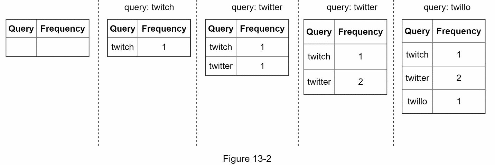

### 쿼리 서비스

빈도 테이블이 있다고 가정합시다. 이 테이블에는 두 가지 필드가 있습니다:

- **Query:** 쿼리 문자열을 저장합니다.
- **Frequency:** 쿼리가 검색된 횟수를 나타냅니다.

사용자가 검색상자에 "tw"를 입력하면, 다음 상위 5개 검색 쿼리가 표시됩니다:

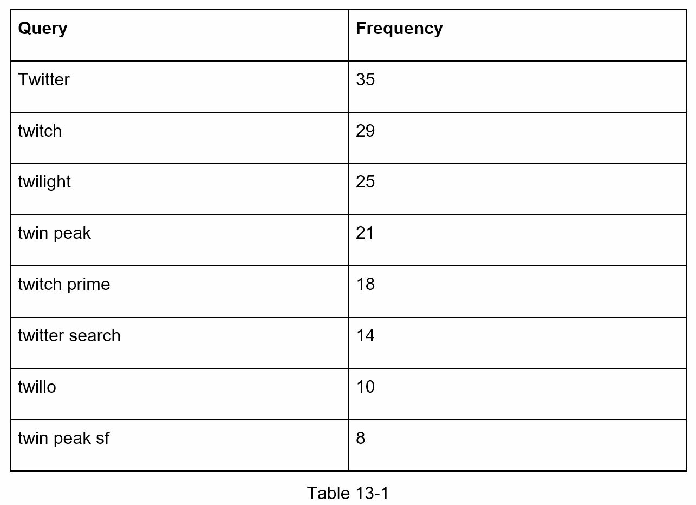

상위 5개 자주 검색된 쿼리를 얻으려면 다음 SQL 쿼리를 실행합니다:

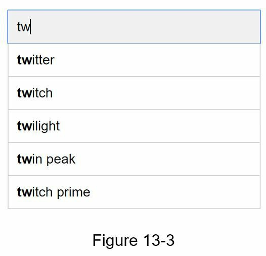

이것은 데이터셋이 작을 때 허용 가능한 솔루션입니다. 데이터셋이 크면 데이터베이스 접근이 병목 지점이 됩니다. 심화 섹션에서 최적화를 살펴보겠습니다.

---

## 3단계: 설계 심화

고수준 설계에서 데이터 수집 서비스와 쿼리 서비스를 논의했습니다. 고수준 설계가 최적은 아니지만, 좋은 시작점입니다. 이 섹션에서는 몇 가지 컴포넌트를 깊이 있게 살펴보고 다음과 같은 최적화를 살펴보겠습니다:

- 트라이(Trie) 자료구조
- 데이터 수집 서비스
- 쿼리 서비스
- 저장소 확장
- 트라이 운영

### 트라이 자료구조: 검색을 위한 최적화된 트리

고수준 설계에서 저장소로 관계형 데이터베이스를 사용했습니다. 하지만 관계형 데이터베이스에서 상위 5개 검색 쿼리를 가져오는 것은 비효율적입니다. **트라이(Trie)** 또는 **접두사 트리(prefix tree)**라는 자료구조를 사용하여 이 문제를 극복합니다. 트라이 자료구조가 시스템의 핵심이므로, 맞춤형 트라이를 설계하는 데 상당한 시간을 할애하겠습니다.

트라이의 기본 개념을 이해하는 것은 이 인터뷰 질문에 필수적입니다. 하지만 이것은 시스템 설계 질문보다 자료구조 질문에 더 가깝습니다. 또한 많은 온라인 자료가 이 개념을 설명합니다. 이 장에서는 트라이 자료구조의 개요만 논의하고 응답 시간을 개선하기 위해 기본 트라이를 최적화하는 방법에 초점을 맞추겠습니다.

#### 기본 트라이의 핵심 원리

**트라이(발음: "try")**는 문자열을 컴팩트하게 저장할 수 있는 트리 같은 자료구조입니다. 이름은 "retrieval(검색)"이라는 단어에서 나왔으며, 문자열 검색 작업을 위해 설계되었음을 나타냅니다. 트라이의 주요 아이디어는 다음과 같습니다:

- 트라이는 트리 같은 자료구조입니다.
- 루트는 빈 문자열을 나타냅니다.
- 각 노드는 문자를 저장하고 26개의 자식을 가집니다 (가능한 각 문자마다 하나). 공간을 절약하기 위해 빈 링크는 그리지 않습니다.
- 각 트리 노드는 단일 단어 또는 접두사 문자열을 나타냅니다.

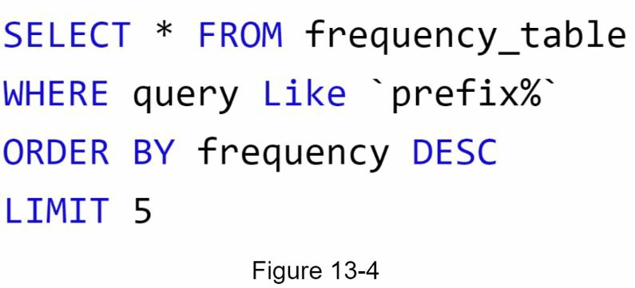

#### 빈도 정보가 추가된 트라이

기본 트라이 자료구조는 노드에 문자를 저장합니다. 빈도로 정렬을 지원하려면, 노드에 빈도 정보를 포함해야 합니다.

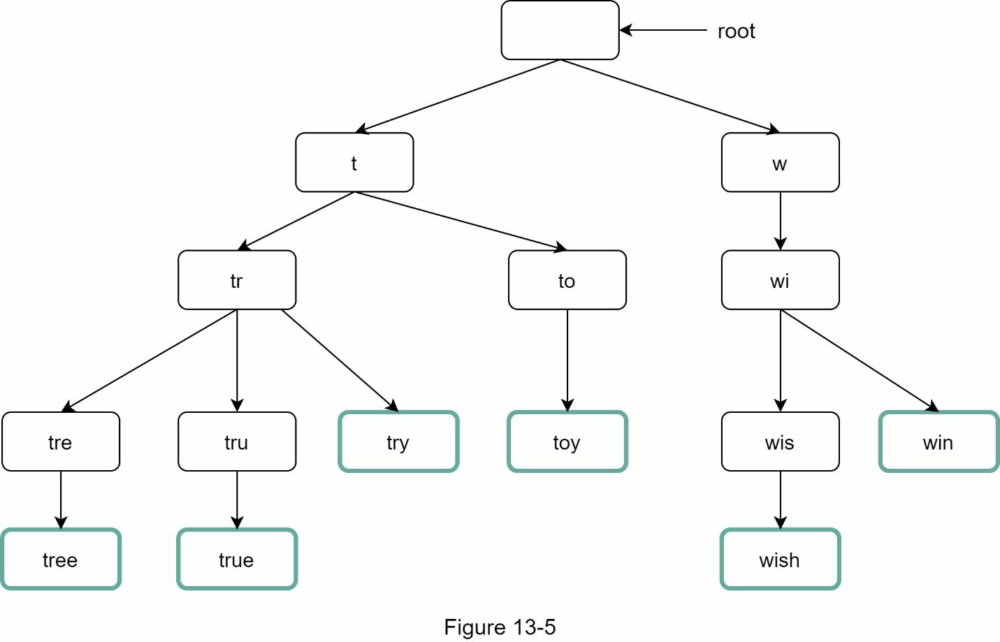

#### 자동완성의 동작 원리

트라이를 사용한 자동완성 동작을 살펴보기 전에 몇 가지 용어를 정의합시다:

- **p:** 접두어의 길이
- **n:** 트라이의 총 노드 개수
- **c:** 주어진 노드의 자식 개수

상위 k개의 가장 검색된 쿼리를 얻기 위한 단계는 다음과 같습니다:

1. **접두어 찾기.** 시간 복잡도: O(p)
2. **접두어 노드에서 서브트리를 순회하여 모든 유효한 자식 얻기.** 자식이 유효하다는 것은 그것이 유효한 쿼리 문자열을 형성할 수 있다는 뜻입니다. 시간 복잡도: O(c)
3. **자식을 정렬하고 상위 k개 얻기.** 시간 복잡도: O(c log c)

다음과 같은 예를 사용하여 알고리즘을 설명합시다. k가 2이고 사용자가 검색상자에 "tr"을 입력한다고 가정합시다:

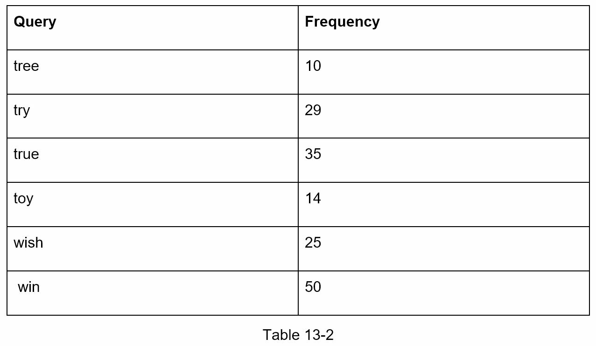

알고리즘의 작동 방식:
- **1단계:** 접두어 노드 "tr"을 찾습니다.
- **2단계:** 서브트리를 순회하여 모든 유효한 자식을 얻습니다. 이 경우 노드 [tree: 10], [true: 35], [try: 29]가 유효합니다.
- **3단계:** 자식을 정렬하고 상위 2개를 얻습니다. [true: 35]와 [try: 29]가 접두어 "tr"을 가진 상위 2개 쿼리입니다.

이 알고리즘의 시간 복잡도는 각 단계에 소요된 시간의 합입니다:  
**O(p) + O(c) + O(c log c)**

#### 문제점: 왜 이 알고리즘은 느릴까?

위의 알고리즘은 직설적입니다. 하지만 너무 느립니다. 최악의 경우 전체 트라이를 순회해야 상위 k개 결과를 얻을 수 있기 때문입니다. 다음 두 가지 최적화가 있습니다:

1. 접두어의 최대 길이 제한
2. 각 노드에 상위 검색 쿼리 캐싱

이 최적화들을 하나씩 살펴봅시다.

#### 최적화 1: 접두어의 최대 길이 제한

사용자는 검색상자에 긴 검색 쿼리를 입력하는 일이 드뭅니다. 따라서 p는 작은 정수, 예를 들어 50이라고 말하는 것이 안전합니다. 접두어의 길이를 제한하면, "접두어 찾기" 단계의 시간 복잡도를 O(p)에서 O(작은 상수), 즉 O(1)로 줄일 수 있습니다.

#### 최적화 2: 각 노드에서 상위 검색 쿼리 캐싱

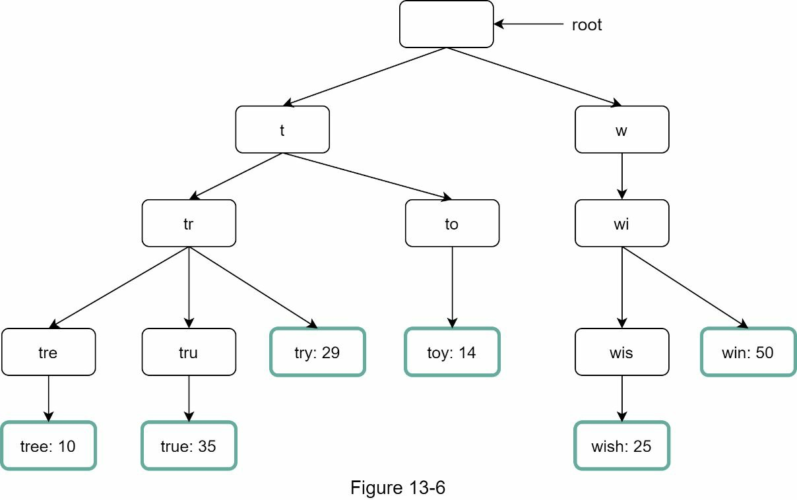

전체 트라이를 순회하는 것을 피하기 위해, 각 노드에 상위 k개의 가장 자주 사용된 쿼리를 저장합니다. 자동완성 제안은 사용자에게 5~10개면 충분하므로, k는 상대적으로 작은 숫자입니다. 우리의 경우, 상위 5개 검색 쿼리만 캐싱됩니다.

매 노드에 상위 검색 쿼리를 캐싱함으로써, 상위 5개 쿼리를 검색하는 시간 복잡도를 현저히 줄입니다. 하지만 이 설계는 모든 노드에 상위 쿼리를 저장하기 위해 많은 공간이 필요합니다. 빠른 응답 시간이 매우 중요하므로, 공간과 시간을 맞바꾸는 것이 충분히 가치 있습니다.

예를 들어, 접두어 "be"를 가진 노드는 다음을 저장합니다: [best: 35, bet: 29, bee: 20, be: 15, beer: 10].

#### 최적화 적용 후 시간 복잡도 재검토

이 두 최적화를 적용한 후 알고리즘의 시간 복잡도를 다시 살펴봅시다:

1. **접두어 노드 찾기.** 시간 복잡도: O(1)
2. **상위 k개 반환.** 상위 k개 쿼리가 캐싱되어 있으므로, 이 단계의 시간 복잡도는 O(1)입니다.

각 단계의 시간 복잡도가 O(1)로 줄어들었으므로, 우리의 알고리즘은 상위 k개 쿼리를 가져오는 데 단 **O(1)**만 걸립니다.

### 데이터 수집 서비스: 실시간에서 배치로

이전 설계에서는 사용자가 검색 쿼리를 입력할 때마다 데이터를 실시간으로 업데이트했습니다. 이 접근 방식은 다음 두 가지 이유로 실용적이지 않습니다:

- 사용자가 일일 수십억 개의 쿼리를 입력할 수 있습니다. 모든 쿼리마다 트라이를 업데이트하면 쿼리 서비스가 크게 느려집니다.
- 트라이가 구축되면 상위 제안이 크게 변하지 않을 수 있습니다. 따라서 트라이를 자주 업데이트할 필요가 없습니다.

확장 가능한 데이터 수집 서비스를 설계하기 위해, 데이터가 어디서 나오는지와 데이터가 어떻게 사용되는지를 살펴봅시다. Twitter 같은 실시간 애플리케이션은 최신의 자동완성 제안을 요구합니다. 하지만 Google의 많은 검색어에 대한 자동완성 제안은 매일 크게 변하지 않을 수 있습니다.

사용 사례는 다르지만, 데이터 수집 서비스의 기본 토대는 동일합니다. 왜냐하면 트라이를 구축하는 데 사용되는 데이터는 보통 분석(analytics) 또는 로깅(logging) 서비스에서 나오기 때문입니다.

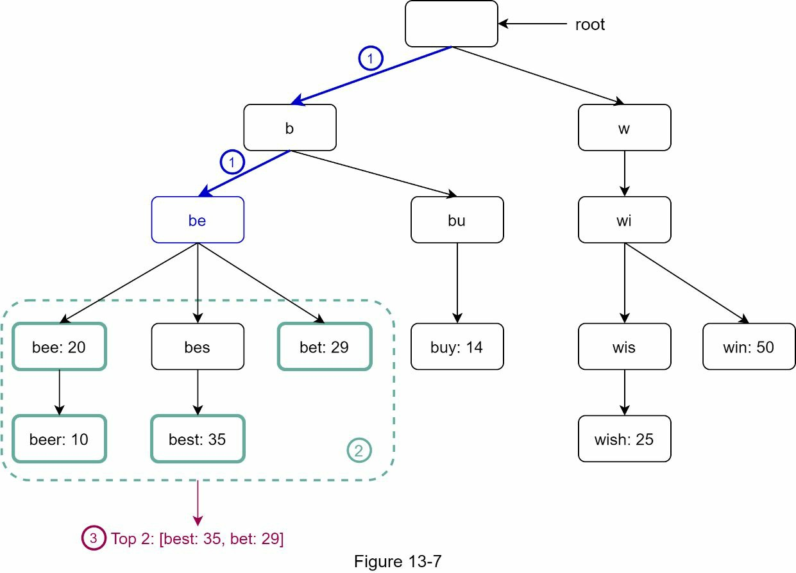

#### 데이터 수집 서비스의 각 컴포넌트

**분석 로그(Analytics Logs):** 검색 쿼리에 대한 원본 데이터를 저장합니다. 로그는 append-only이며 인덱싱되지 않습니다. 로그 파일의 예시는 다음과 같습니다:

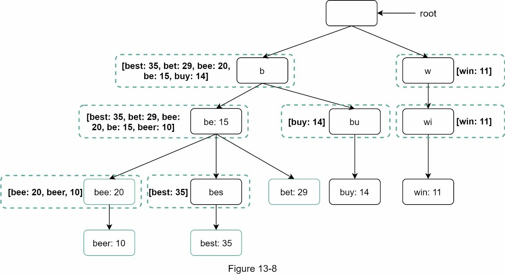

**집계자(Aggregators):** 분석 로그의 크기는 보통 매우 크고, 데이터가 올바른 형식으로 되어 있지 않습니다. 우리의 시스템에서 쉽게 처리할 수 있도록 데이터를 집계해야 합니다. 사용 사례에 따라 데이터를 다르게 집계할 수 있습니다. Twitter 같은 실시간 애플리케이션의 경우, 실시간 결과가 중요하므로 짧은 시간 간격으로 데이터를 집계합니다. 반면 주 1회처럼 덜 자주 집계하는 것이 많은 사용 사례에 충분할 수 있습니다. 인터뷰 세션 중에 실시간 결과가 중요한지 확인하십시오. 우리는 트라이가 주 1회 재구축된다고 가정합니다.

**집계된 데이터(Aggregated Data):** 집계된 주간 데이터의 예시입니다. "time" 필드는 주의 시작 시간을 나타냅니다. "frequency" 필드는 그 주의 해당 쿼리의 발생 횟수의 합입니다.

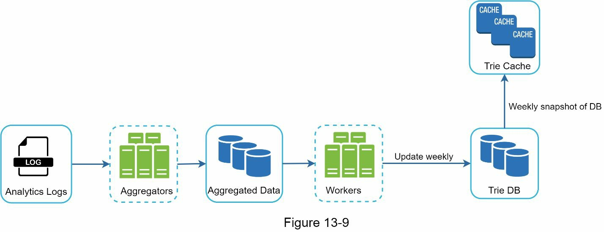

**워커(Workers):** 워커는 정기적으로 비동기 작업을 수행하는 서버 세트입니다. 트라이 자료구조를 구축하고 Trie DB에 저장합니다.

**트라이 캐시(Trie Cache):** Trie Cache는 분산 캐시 시스템으로, 메모리에 트라이를 유지하여 빠른 읽기를 보장합니다. 이 시스템은 DB의 주간 스냅샷을 가져옵니다.

**트라이 DB(Trie DB):** 트라이 DB는 영구 저장소입니다. 데이터를 저장할 수 있는 두 가지 옵션이 있습니다:

1. **문서 저장소(Document Store):** 새로운 트라이가 주 1회 구축되므로, 주기적으로 스냅샷을 촬영하고, 직렬화한 후, 직렬화된 데이터를 데이터베이스에 저장할 수 있습니다. MongoDB 같은 문서 저장소가 직렬화된 데이터에 적합합니다.

2. **[[6장 키-값 저장소 설계|키-값 저장소]](Key-Value Store):** 다음 로직을 적용하여 트라이를 해시 테이블 형태로 나타낼 수 있습니다:
   - 트라이의 모든 접두어는 해시 테이블의 키로 매핑됩니다.
   - 각 트라이 노드의 데이터는 해시 테이블의 값으로 매핑됩니다.

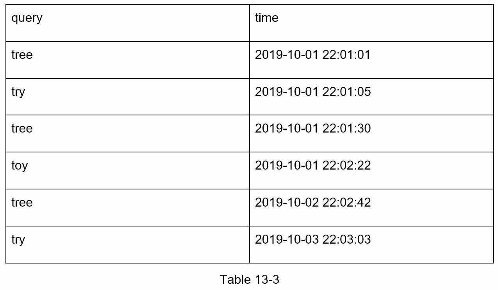

위의 그림에서, 왼쪽의 각 트라이 노드는 오른쪽의 <key, value> 쌍으로 매핑됩니다. 키-값 저장소가 어떻게 작동하는지 불명확하다면, 6장 "키-값 저장소 설계"를 참고하십시오.

### 쿼리 서비스: 최적화된 검색

고수준 설계에서 쿼리 서비스는 데이터베이스를 직접 호출하여 상위 5개 결과를 가져옵니다. 다음 그림은 이전 설계가 비효율적이므로 개선된 설계를 보여줍니다:

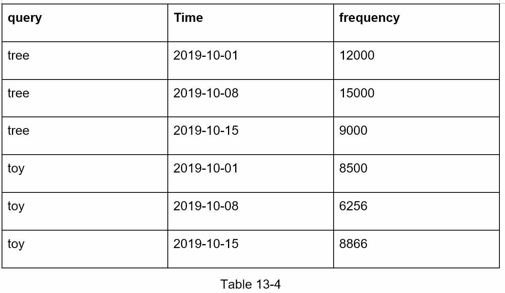

#### 쿼리 흐름

1. 검색 쿼리가 로드 밸런서로 전송됩니다.
2. 로드 밸런서가 요청을 API 서버로 라우팅합니다.
3. API 서버가 Trie Cache에서 트라이 데이터를 가져오고 클라이언트를 위한 자동완성 제안을 구성합니다.
4. Trie Cache에 데이터가 없는 경우, 캐시에 데이터를 다시 채웁니다. 이렇게 하면 동일한 접두어에 대한 모든 후속 요청이 캐시에서 반환됩니다. 캐시 미스는 캐시 서버의 메모리가 부족하거나 오프라인일 때 발생할 수 있습니다.

#### 쿼리 서비스 최적화

쿼리 서비스는 번개 같은 속도를 요구합니다. 다음과 같은 최적화를 제안합니다:

**AJAX 요청:** 웹 애플리케이션의 경우, 브라우저는 보통 AJAX 요청을 전송하여 자동완성 결과를 가져옵니다. AJAX의 주요 장점은 요청/응답 송수신이 전체 웹 페이지를 새로고침하지 않는다는 것입니다.

**브라우저 캐싱:** 많은 애플리케이션의 경우, 자동완성 검색 제안이 짧은 시간 내에 크게 변하지 않을 수 있습니다. 따라서 자동완성 제안을 브라우저 캐시에 저장하여 후속 요청이 캐시에서 직접 결과를 얻도록 할 수 있습니다. Google 검색 엔진도 동일한 캐시 메커니즘을 사용합니다.

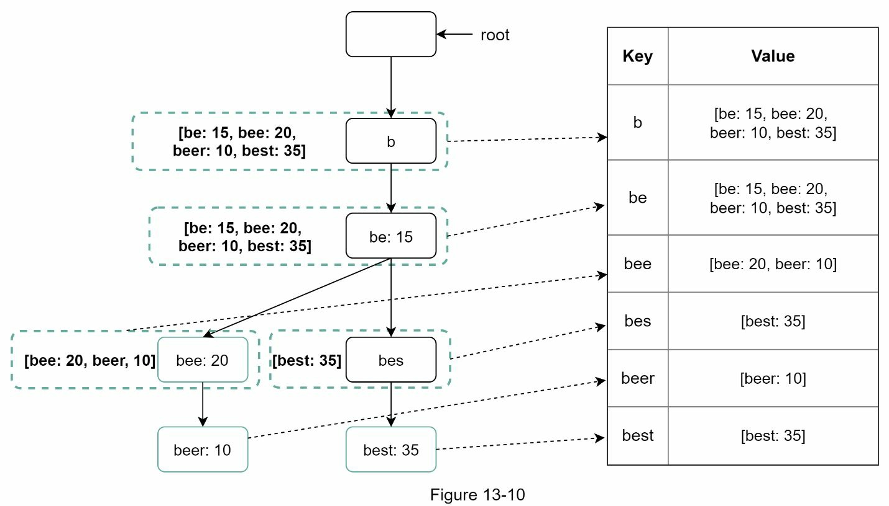

그림에서 보이듯이, Google은 브라우저에서 결과를 1시간 동안 캐싱합니다. 주목할 점으로 "private"은 결과가 단일 사용자를 위한 것이며 공유 캐시에 의해 캐싱되면 안 된다는 의미입니다. "max-age=3600"은 캐시가 3600초(1시간) 동안 유효하다는 의미입니다.

**데이터 샘플링:** 대규모 시스템의 경우, 모든 검색 쿼리를 로깅하려면 많은 처리 능력과 저장소가 필요합니다. 데이터 샘플링이 중요합니다. 예를 들어, N개의 요청 중 1개만 시스템에 의해 로깅됩니다.

### 트라이 운영: 생성, 업데이트, 삭제

트라이는 자동완성 시스템의 핵심 컴포넌트입니다. 트라이 운영(생성, 업데이트, 삭제)이 어떻게 작동하는지 살펴봅시다.

#### 생성 (Create)

트라이는 워커가 집계된 데이터를 사용하여 생성합니다. 데이터의 출처는 분석 로그/데이터베이스입니다.

#### 업데이트 (Update)

트라이를 업데이트하는 두 가지 방법이 있습니다:

**옵션 1: 트라이를 주 1회 업데이트합니다.** 새로운 트라이가 생성되면, 새로운 트라이가 이전 트라이를 대체합니다.

**옵션 2: 개별 트라이 노드를 직접 업데이트합니다.** 우리는 이 작업을 피하려고 노력합니다. 왜냐하면 이것이 느리기 때문입니다. 하지만 트라이의 크기가 작으면, 이것은 허용 가능한 솔루션입니다. 트라이 노드를 업데이트할 때, 루트까지 그 조상 노드를 모두 업데이트해야 합니다. 왜냐하면 조상은 자식의 상위 쿼리를 저장하기 때문입니다.

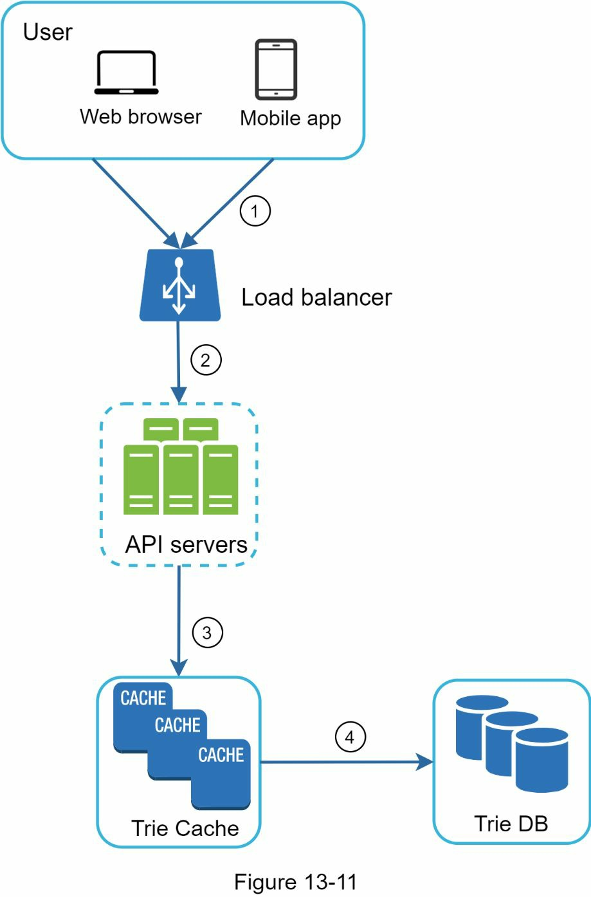

위의 그림은 업데이트 작업이 어떻게 작동하는지를 보여줍니다. 왼쪽에서, 검색 쿼리 "beer"는 원래 값 10을 가지고 있습니다. 오른쪽에서는 30으로 업데이트됩니다. 보시듯이, 노드와 그 조상이 "beer" 값이 30으로 업데이트됩니다.

#### 삭제 (Delete)

증오, 폭력, 성적으로 노골적이거나 위험한 자동완성 제안을 제거해야 합니다. Trie Cache 앞에 필터 레이어(그림 13-16)를 추가합니다. 필터 레이어를 두면 다른 필터 규칙에 따라 결과를 제거할 수 있습니다. 원치 않는 제안은 다음 업데이트 사이클에서 트라이를 구축할 때 올바른 데이터셋이 사용되도록 비동기로 데이터베이스에서 물리적으로 제거됩니다.

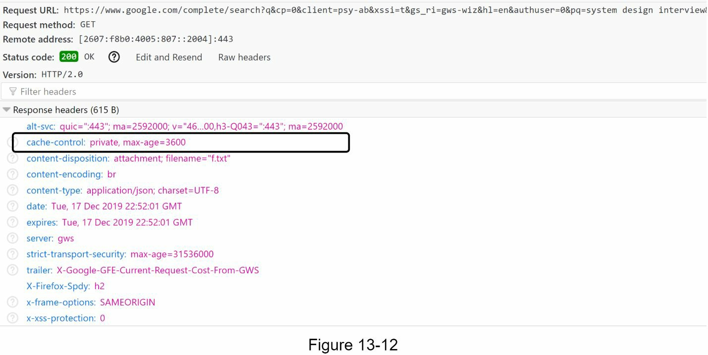

### 저장소 확장: 샤딩을 통한 수평 확장

자동완성 쿼리를 사용자에게 제공하는 시스템을 개발했으니, 트라이가 한 서버에 맞지 않을 정도로 커질 때의 확장성 문제를 해결할 시간입니다.

영어만 지원하므로, 첫 번째 문자를 기준으로 샤딩하는 나이브한 방법이 있습니다. 다음은 몇 가지 예입니다:

- 두 개의 서버가 필요한 경우, 'a'에서 'm'으로 시작하는 쿼리를 첫 번째 서버에 저장하고, 'n'에서 'z'로 시작하는 쿼리를 두 번째 서버에 저장할 수 있습니다.
- 세 개의 서버가 필요한 경우, 쿼리를 'a'부터 'i', 'j'부터 'r', 's'부터 'z'로 분할할 수 있습니다.

이 논리에 따르면, 영어에는 26개의 알파벳 문자가 있으므로 최대 26개의 서버로 쿼리를 분할할 수 있습니다. 첫 번째 문자를 기준으로 한 샤딩을 **첫 번째 레벨 샤딩(first level sharding)**이라고 정의합시다. 26개를 넘어 데이터를 저장하려면 두 번째 또는 심지어 세 번째 레벨에서 샤딩할 수 있습니다. 예를 들어, 'a'로 시작하는 쿼리를 4개의 서버로 분할할 수 있습니다: 'aa-ag', 'ah-an', 'ao-au', 'av-az'.

언뜻 보기에는 이 접근 방식이 합리적으로 보입니다. 그러나 'c'로 시작하는 단어가 'x'로 시작하는 단어보다 훨씬 많다는 것을 깨닫게 됩니다. 이것은 불균등한 분배를 만듭니다.

#### 데이터 불균형 해결: 스마트 샤딩

데이터 불균형 문제를 완화하기 위해, 우리는 과거 데이터 분포 패턴을 분석하고 다음 그림과 같이 더 스마트한 샤딩 로직을 적용합니다:

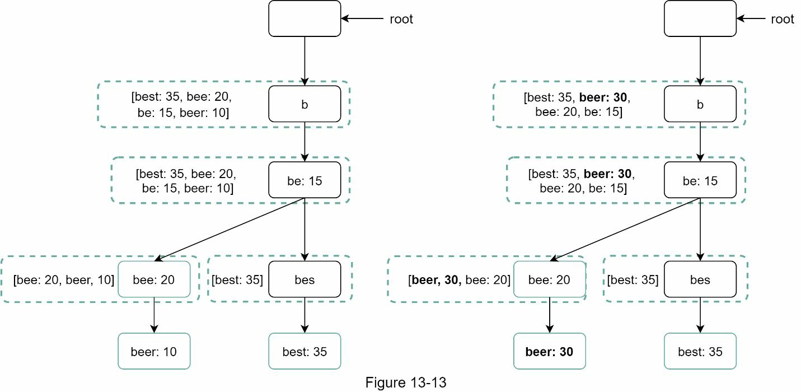

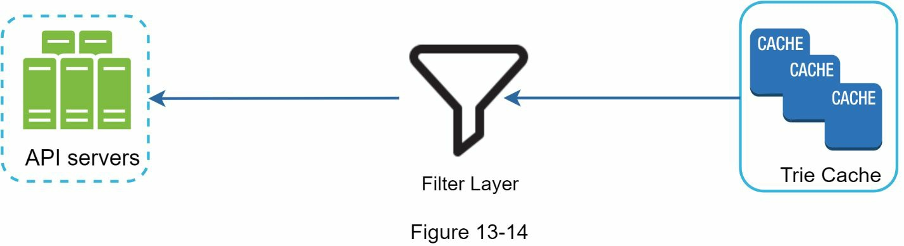

샤드 맵 매니저는 행이 어디에 저장되어야 하는지를 식별하기 위한 조회 데이터베이스를 유지합니다. 예를 들어, 's'의 과거 쿼리 수와 'u', 'v', 'w', 'x', 'y', 'z' 결합한 수가 비슷하다면, 우리는 's'를 위한 하나의 샤드와 'u'에서 'z'까지를 위한 또 다른 샤드로 두 개의 샤드를 유지할 수 있습니다.

---

## 4단계: 마무리

설계의 심화 단계가 끝나면, 면접관이 몇 가지 후속 질문을 할 수 있습니다.

### 다국어 지원

**면접관:** 설계를 여러 언어를 지원하도록 확장하려면 어떻게 할까요?

다른 비영어 쿼리를 지원하려면, 트라이 노드에 **Unicode(유니코드)** 문자를 저장합니다. 유니코드에 익숙하지 않다면, 다음이 정의입니다: "세계의 모든 기록 체계(현대 및 고대)의 모든 문자를 다루는 인코딩 표준"

### 국가별 검색어 차이

**면접관:** 특정 국가의 상위 검색 쿼리가 다른 국가와 다르다면 어떨까요?

이 경우, 우리는 다른 국가를 위해 다른 트라이를 구축할 수 있습니다. 응답 시간을 개선하기 위해, 우리는 CDN에 트라이를 저장할 수 있습니다.

### 실시간 검색 쿼리 지원: 트렌딩 검색어

**면접관:** 실시간(트렌딩) 검색 쿼리를 어떻게 지원할 수 있을까요?

뉴스 사건이 터지면 검색 쿼리가 갑자기 인기 있어집니다. 우리의 원래 설계는 다음 이유로 작동하지 않을 것입니다:

- 오프라인 워커가 주 1회로 스케줄되어 있으므로 아직 트라이를 업데이트하도록 예약되지 않았습니다.
- 예약되어 있더라도 트라이를 구축하는 데 너무 오래 걸립니다.

실시간 검색 자동완성을 구축하는 것은 복잡하며 이 책의 범위를 벗어납니다. 우리는 몇 가지 아이디어만 제시하겠습니다:

- 샤딩을 통해 작업 데이터셋을 줄입니다.
- 순위 모델을 변경하고 최근 검색 쿼리에 더 많은 가중치를 할당합니다.
- 데이터는 스트림(stream)으로 올 수 있으므로, 우리는 한 번에 모든 데이터에 접근할 수 없습니다. 스트리밍 데이터는 데이터가 지속적으로 생성된다는 의미입니다. 스트림 처리는 다른 시스템 세트를 요구합니다: Apache Hadoop MapReduce, Apache Spark Streaming, Apache Storm, Apache Kafka 등. 이 모든 주제는 특정 도메인 지식을 요구하므로, 우리는 여기서 자세히 다루지 않을 것입니다.

---

## 축하합니다!

이 정도까지 온 것을 축하합니다! 자신에게 박수를 쳐주세요. 잘했습니다!

---

## 핵심 개념 정리

| 용어 | 설명 |
|---|---|
| **트라이(Trie)** | 문자열을 컴팩트하게 저장하는 트리 자료구조. 각 노드가 문자 하나를 나타내며, 루트에서 노드까지의 경로가 접두어(prefix)를 형성한다. "retrieval(검색)"에서 이름이 유래했다. |
| **접두어 검색(Prefix Search)** | 입력된 문자열을 접두어로 삼아 해당 접두어로 시작하는 모든 문자열을 트라이에서 탐색하는 연산. 자동완성의 핵심 동작 원리다. |
| **Top K 쿼리(Top K Query)** | 특정 접두어를 가진 검색어 중 빈도수 기준 상위 k개를 반환하는 연산. 이 장에서는 k=5를 기본값으로 사용한다. |
| **트라이 캐시(Trie Cache)** | 트라이 자료구조를 메모리에 올려두는 분산 캐시 시스템. DB 주간 스냅샷을 적재해 빠른 읽기를 보장하며, 쿼리 서비스의 응답 속도를 크게 높인다. |
| **노드별 상위 쿼리 캐싱(Per-node Top-K Caching)** | 각 트라이 노드에 해당 노드를 접두어로 하는 상위 k개 쿼리를 미리 저장해두는 최적화 기법. 상위 쿼리 조회를 O(c log c)에서 O(1)로 줄인다. |
| **샤딩(Sharding)** | 트라이를 여러 서버에 분산 저장하는 수평 확장 기법. 첫 글자 기반의 단순 샤딩에서 나아가, 과거 데이터 분포를 분석한 스마트 샤딩으로 데이터 불균형을 완화한다. |
| **데이터 집계(Aggregation)** | 분석 로그에 쌓인 원시 검색 쿼리 데이터를 주기적으로 집계해 빈도 테이블을 생성하는 과정. 실시간 트라이 업데이트 대신 주 1회 배치 방식으로 처리해 시스템 부하를 줄인다. |
| **필터 레이어(Filter Layer)** | 트라이 캐시 앞에 위치하는 계층으로, 증오 표현·위험 콘텐츠 등 부적절한 자동완성 제안을 실시간으로 차단한다. 다음 업데이트 사이클에서 DB에서도 물리적으로 제거된다. |
| **QPS(Queries Per Second)** | 초당 처리되는 쿼리 수. 이 장에서는 DAU 1천만 명·사용자당 10회 검색·쿼리당 20자 입력을 기준으로 약 24,000 QPS(최고 48,000 QPS)로 추산된다. |
| **브라우저 캐싱(Browser Caching)** | 자동완성 응답에 Cache-Control 헤더(예: max-age=3600)를 설정하여, 동일 접두어에 대한 재요청을 서버까지 보내지 않고 브라우저에서 바로 처리하는 최적화 기법. |
| **데이터 샘플링(Data Sampling)** | 대규모 시스템에서 모든 검색 쿼리를 로깅하는 대신 N개 중 1개만 기록하는 방식. 저장소와 처리 비용을 줄이면서도 통계적으로 유의미한 빈도 데이터를 유지한다. |
| **샤드 맵 매니저(Shard Map Manager)** | 각 접두어가 어느 샤드 서버에 저장되는지를 관리하는 조회 데이터베이스. 데이터 불균형을 해소하기 위해 과거 분포 패턴을 반영한 스마트 샤딩 규칙을 보관한다. |

---

## 참고 자료

[1] The Life of a Typeahead Query: https://www.facebook.com/notes/facebook-engineering/the-life-of-a-typeahead-query/389105248919/

[2] How We Built Prefixy: A Scalable Prefix Search Service for Powering Autocomplete: https://medium.com/@prefixyteam/how-we-built-prefixy-a-scalable-prefix-search-service-for-powering-autocomplete-c20f98e2eff1

[3] Prefix Hash Tree An Indexing Data Structure over Distributed Hash Tables: https://people.eecs.berkeley.edu/~sylvia/papers/pht.pdf

[4] MongoDB wikipedia: https://en.wikipedia.org/wiki/MongoDB

[5] Unicode frequently asked questions: https://www.unicode.org/faq/basic_q.html

[6] Apache hadoop: https://hadoop.apache.org/

[7] Spark streaming: https://spark.apache.org/streaming/

[8] Apache storm: https://storm.apache.org/

[9] Apache kafka: https://kafka.apache.org/documentation/
