## 서론

오늘 아침에도 우리는 무심코 YouTube를 열어 영상 하나를 재생했을지 모릅니다. 재생 버튼을 누르는 순간 영상은 거의 기다림 없이 흘러나오고, 네트워크가 느려지면 화질이 슬그머니 낮아졌다가, 다시 빨라지면 또렷해집니다. 사용자 입장에서 YouTube는 더없이 단순해 보입니다. 크리에이터가 영상을 올리고, 시청자가 재생 버튼을 누르면 그만입니다. 그런데 정말 그렇게 단순할까요?

결론부터 말하면, 그 매끄러운 단순함 뒤에는 수많은 복잡한 기술이 숨어 있습니다. 이 장에서는 YouTube를 설계해 봅니다. 여기서 다루는 해법은 Netflix나 Hulu 같은 다른 동영상 공유 플랫폼을 설계하는 면접 질문에도 그대로 응용할 수 있습니다.

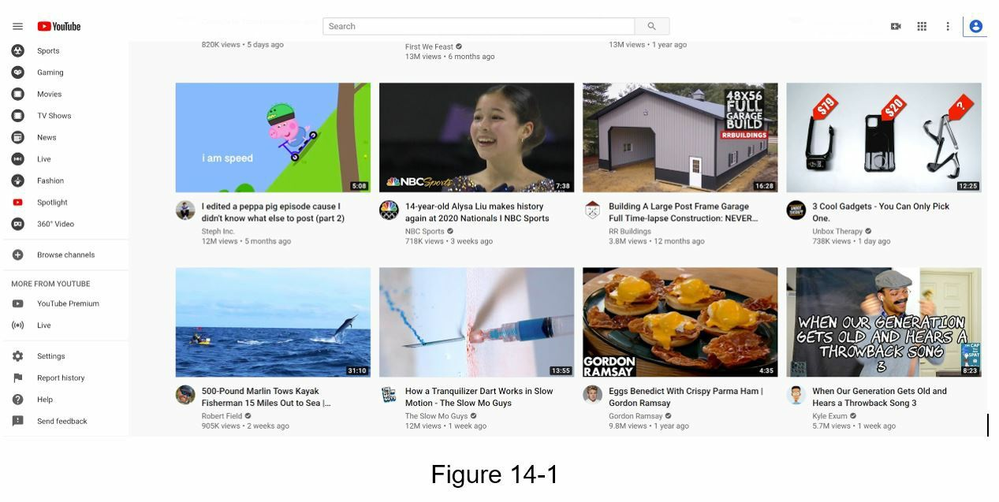

Figure 14-1은 YouTube 홈페이지를 보여줍니다. YouTube가 얼마나 거대한 서비스인지 가늠해 보기 위해, 2020년 기준 인상적인 통계와 사용자 구성, 흥미로운 사실 몇 가지를 살펴봅시다 [1] [2].

- 월간 활성 사용자(monthly active users) 총수: 20억 명
- 하루에 시청되는 영상 수: 50억 건
- 미국 성인의 73%가 YouTube를 사용
- YouTube 크리에이터 5,000만 명
- 2019년 한 해 YouTube의 광고 매출은 151억 달러로, 2018년 대비 36% 증가
- 전체 모바일 인터넷 트래픽의 37%를 YouTube가 차지
- YouTube는 80개 언어로 제공

이 통계만 보아도 YouTube가 거대하고, 전 세계적이며, 막대한 수익을 내는 서비스임을 알 수 있습니다.

## 1단계 - 문제를 이해하고 설계 범위를 정한다

Figure 14-1에서 보았듯이, YouTube에서는 영상을 시청하는 것 외에도 할 수 있는 일이 무척 많습니다. 영상에 댓글을 달고, 공유하고, 좋아요를 누르고, 재생목록에 영상을 저장하고, 채널을 구독하는 등 기능이 다채롭습니다. 45분이나 60분짜리 면접 안에서 이 모든 것을 설계하기란 불가능합니다. 그러므로 질문을 던져 범위를 좁히는 일이 중요합니다.

**지원자:** 어떤 기능이 중요한가요?
**면접관:** 영상을 업로드하는 기능과 시청하는 기능입니다.

**지원자:** 어떤 클라이언트를 지원해야 하나요?
**면접관:** 모바일 앱, 웹 브라우저, 그리고 스마트 TV입니다.

**지원자:** 일간 활성 사용자(daily active users)는 몇 명인가요?
**면접관:** 500만 명입니다.

**지원자:** 사용자가 제품에 하루 평균 얼마나 시간을 쓰나요?
**면접관:** 30분입니다.

**지원자:** 해외 사용자도 지원해야 하나요?
**면접관:** 네, 사용자의 상당수가 해외 사용자입니다.

**지원자:** 지원해야 하는 영상 해상도는 어떻게 되나요?
**면접관:** 시스템은 대부분의 영상 해상도와 포맷을 받아들입니다.

**지원자:** 암호화가 필요한가요?
**면접관:** 네.

**지원자:** 영상의 파일 크기에 제한이 있나요?
**면접관:** 우리 플랫폼은 소형 및 중형 영상에 집중합니다. 허용되는 최대 영상 크기는 1GB입니다.

**지원자:** Amazon, Google, Microsoft가 제공하는 기존 클라우드 인프라를 활용해도 될까요?
**면접관:** 훌륭한 질문입니다. 대부분의 기업에게 모든 것을 처음부터 만드는 일은 비현실적이므로, 기존 클라우드 서비스를 일부 활용하는 편이 권장됩니다.

이 장에서는 다음과 같은 기능을 갖춘 동영상 스트리밍 서비스를 설계하는 데 집중합니다.

- 영상을 빠르게 업로드하는 기능
- 매끄러운 영상 스트리밍
- 영상 화질을 바꾸는 기능
- 낮은 인프라 비용
- 고가용성(high availability), 확장성(scalability), 안정성(reliability) 요구사항
- 지원 클라이언트: 모바일 앱, 웹 브라우저, 스마트 TV

### 봉투 뒷면 추정: 대략적인 규모를 가늠해 보자

다음 추정값은 여러 가정에 바탕을 두므로, 면접관과 소통하며 같은 전제를 공유하고 있는지 확인하는 일이 중요합니다.

- 제품의 일간 활성 사용자(DAU, Daily Active Users)가 500만 명이라고 가정합니다.
- 사용자는 하루에 영상 5개를 시청합니다.
- 사용자의 10%가 하루에 영상 1개를 업로드합니다.
- 영상의 평균 크기를 300MB라고 가정합니다.
- 하루에 필요한 총 저장 공간: 500만 × 10% × 300MB = 150TB

이어서 **CDN 비용**을 가늠해 봅시다.

- 클라우드 CDN(Content Delivery Network, 콘텐츠 전송 네트워크)이 영상을 서비스할 때, CDN 밖으로 전송되는 데이터에 대해 요금이 부과됩니다.
- 비용 추정에는 Amazon의 CDN인 CloudFront를 사용하겠습니다(Figure 14-2) [3]. 트래픽의 100%가 미국에서 제공된다고 가정하면, GB당 평균 비용은 $0.02입니다. 단순화를 위해 영상 스트리밍 비용만 계산합니다.
- 500만 × 영상 5개 × 0.3GB × $0.02 = 하루 $150,000

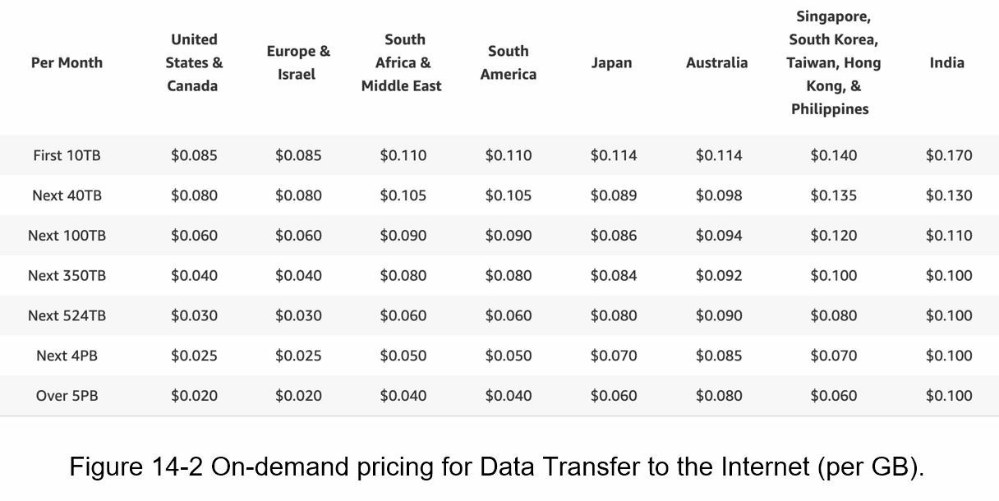

이 대략적인 비용 추정만으로도, CDN에서 영상을 서비스하는 데 막대한 비용이 든다는 사실을 알 수 있습니다. 클라우드 제공업체가 대형 고객에게는 CDN 비용을 상당히 낮춰 주긴 하지만, 그래도 비용은 여전히 큽니다. CDN 비용을 줄이는 방법은 심층 설계에서 다루겠습니다.

## 2단계 - 고수준 설계를 제안하고 동의를 얻는다

앞서 논의했듯이, 면접관은 모든 것을 처음부터 만드는 대신 기존 클라우드 서비스를 활용하기를 권했습니다. 우리가 활용할 클라우드 서비스는 CDN과 블롭 스토리지(blob storage)입니다. 어떤 독자는 "왜 전부 직접 만들지 않느냐"고 물을 수 있습니다. 그 이유는 다음과 같습니다.

- 시스템 설계 면접은 모든 것을 처음부터 만드는 일에 관한 것이 아닙니다. 제한된 시간 안에서는, 기술이 어떻게 동작하는지 세세하게 설명하기보다 작업에 알맞은 기술을 골라 제대로 쓰는 일이 더 중요합니다. 예컨대 원본 영상을 저장할 때 블롭 스토리지를 쓰겠다고 언급하는 정도면 면접에서는 충분합니다. 블롭 스토리지의 상세 설계까지 이야기하는 것은 과합니다.
- 확장 가능한 블롭 스토리지나 CDN을 만드는 일은 대단히 복잡하고 비용이 큽니다. Netflix나 Facebook 같은 대기업조차 모든 것을 직접 만들지는 않습니다. Netflix는 Amazon의 클라우드 서비스를 활용하고 [4], Facebook은 Akamai의 CDN을 사용합니다 [5].

고수준에서 보면, 시스템은 세 가지 구성 요소로 이루어집니다(Figure 14-3).

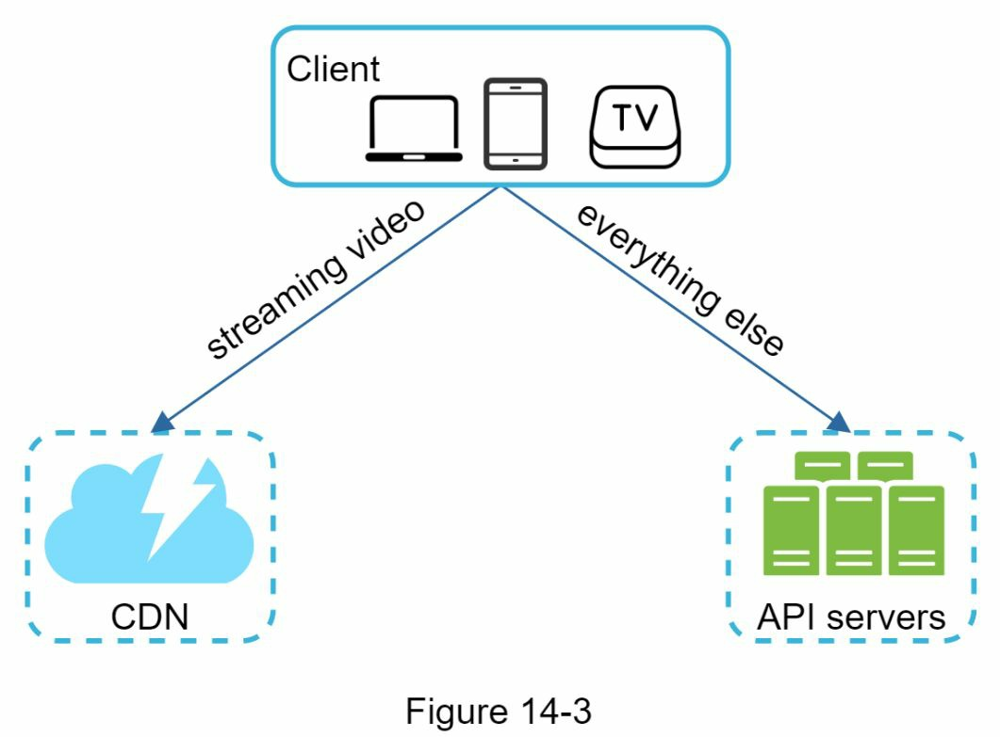

**클라이언트(Client):** YouTube는 컴퓨터, 휴대폰, 스마트 TV에서 볼 수 있습니다.

**CDN:** 영상은 CDN에 저장됩니다. 재생 버튼을 누르면 영상은 CDN에서 스트리밍됩니다.

**API 서버(API servers):** 영상 스트리밍을 제외한 나머지 모든 것은 API 서버를 거칩니다. 여기에는 피드 추천, 영상 업로드 URL 생성, 메타데이터 데이터베이스와 캐시 갱신, 사용자 회원가입 등이 포함됩니다.

질의응답 세션에서 면접관은 두 가지 흐름에 관심을 보였습니다.

- 영상 업로드 흐름
- 영상 스트리밍 흐름

각각의 고수준 설계를 살펴봅시다.

### 영상 업로드 흐름: 사용자가 영상을 플랫폼에 올리는 과정

Figure 14-4는 영상 업로드의 고수준 설계를 보여줍니다.

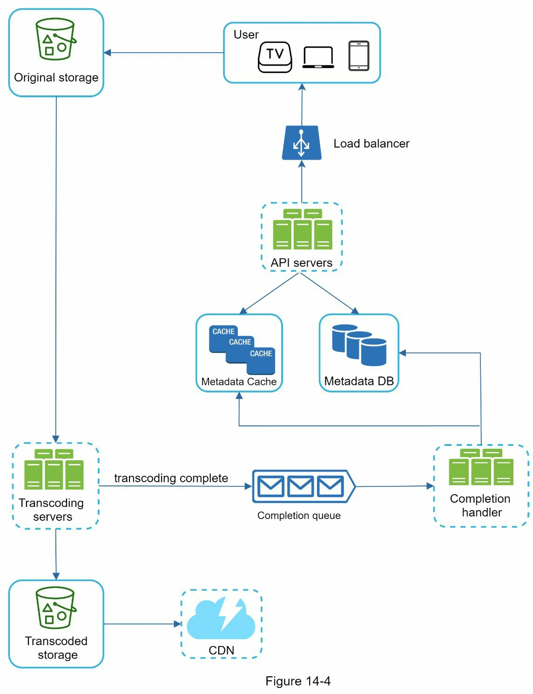

다음과 같은 구성 요소로 이루어집니다.

- **사용자(User):** 사용자는 컴퓨터, 휴대폰, 스마트 TV 같은 기기로 YouTube를 시청합니다.
- **로드 밸런서(Load balancer):** 로드 밸런서는 API 서버들 사이로 요청을 고르게 분배합니다.
- **API 서버(API servers):** 영상 스트리밍을 제외한 모든 사용자 요청은 API 서버를 거칩니다.
- **메타데이터 DB(Metadata DB):** 영상 메타데이터는 메타데이터 DB에 저장됩니다. 성능과 고가용성 요구를 충족하기 위해 샤딩(sharding)되고 복제(replication)됩니다.
- **메타데이터 캐시(Metadata cache):** 더 나은 성능을 위해 영상 메타데이터와 사용자 객체를 캐시합니다.
- **원본 스토리지(Original storage):** 원본 영상을 저장하는 데 블롭 스토리지 시스템을 사용합니다. 블롭 스토리지에 관한 Wikipedia의 정의를 인용하면, "이진 대형 객체(BLOB, Binary Large Object)란 데이터베이스 관리 시스템 안에 하나의 개체로 저장되는 이진 데이터의 모음"입니다 [6].
- **트랜스코딩 서버(Transcoding servers):** 영상 트랜스코딩(video transcoding)은 영상 인코딩(video encoding)이라고도 합니다. 이는 하나의 영상 포맷을 다른 포맷(MPEG, HLS 등)으로 변환하는 과정으로, 다양한 기기와 대역폭 환경에 가장 알맞은 영상 스트림을 제공합니다.
- **트랜스코딩 스토리지(Transcoded storage):** 트랜스코딩된 영상 파일을 저장하는 블롭 스토리지입니다.
- **CDN:** 영상은 CDN에 캐시됩니다. 재생 버튼을 누르면 영상은 CDN에서 스트리밍됩니다.
- **완료 큐(Completion queue):** 영상 트랜스코딩 완료 이벤트에 관한 정보를 저장하는 메시지 큐(message queue)입니다.
- **완료 핸들러(Completion handler):** 완료 큐에서 이벤트 데이터를 꺼내 메타데이터 캐시와 데이터베이스를 갱신하는 워커(worker)들의 모음입니다.

각 구성 요소를 개별적으로 이해했으니, 이제 영상 업로드 흐름이 어떻게 동작하는지 살펴봅시다. 이 흐름은 병렬로 실행되는 두 개의 프로세스로 나뉩니다.

a. 실제 영상을 업로드한다.
b. 영상 메타데이터를 갱신한다. 메타데이터에는 영상 URL, 크기, 해상도, 포맷, 사용자 정보 등이 담깁니다.

#### 흐름 a: 실제 영상을 업로드한다

Figure 14-5는 실제 영상을 어떻게 업로드하는지 보여줍니다. 설명은 아래와 같습니다.

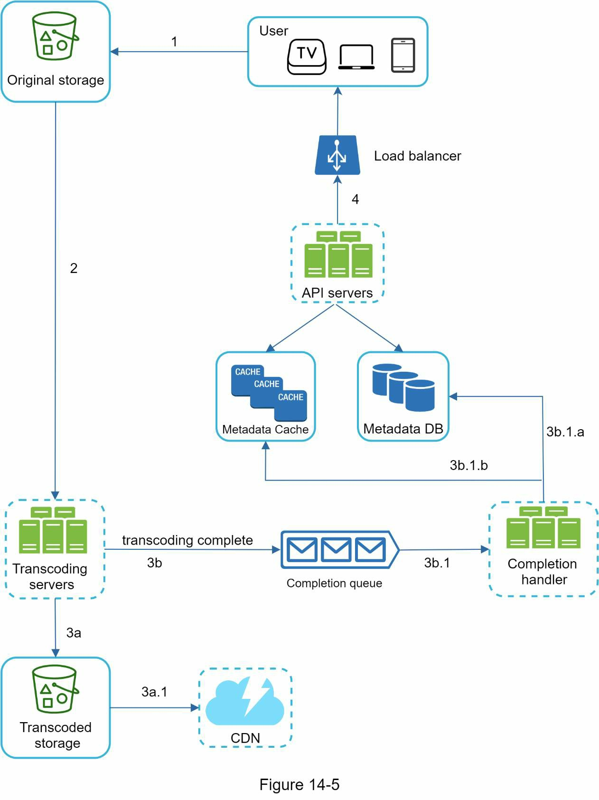

1. 영상이 원본 스토리지에 업로드됩니다.
2. 트랜스코딩 서버가 원본 스토리지에서 영상을 가져와 트랜스코딩을 시작합니다.
3. 트랜스코딩이 끝나면, 다음 두 단계가 병렬로 실행됩니다.
   - 3a. 트랜스코딩된 영상이 트랜스코딩 스토리지로 보내집니다.
   - 3b. 트랜스코딩 완료 이벤트가 완료 큐에 적재됩니다.
   - 3a.1. 트랜스코딩된 영상이 CDN으로 배포됩니다.
   - 3b.1. 완료 핸들러는 큐에서 이벤트 데이터를 끊임없이 꺼내는 여러 워커로 이루어집니다.
   - 3b.1.a / 3b.1.b. 영상 트랜스코딩이 완료되면, 완료 핸들러가 메타데이터 데이터베이스와 캐시를 갱신합니다.
4. API 서버가 영상이 성공적으로 업로드되어 스트리밍 준비가 되었음을 클라이언트에 알립니다.

#### 흐름 b: 메타데이터를 갱신한다

파일이 원본 스토리지에 업로드되는 동안, 클라이언트는 병렬로 영상 메타데이터를 갱신하는 요청을 보냅니다(Figure 14-6). 이 요청에는 파일명, 크기, 포맷 등 영상 메타데이터가 담겨 있습니다. API 서버는 메타데이터 캐시와 데이터베이스를 갱신합니다.

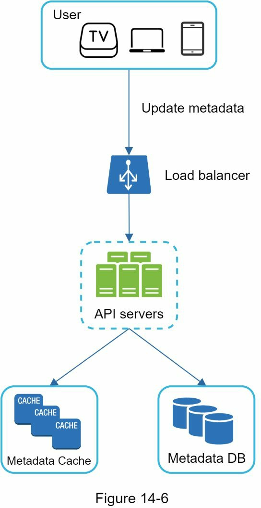

### 영상 스트리밍 흐름: 다운로드를 기다리지 않고 바로 재생되는 비결

YouTube에서 영상을 볼 때면, 영상은 대개 즉시 재생되기 시작하고 우리는 영상 전체가 내려받아질 때까지 기다리지 않습니다. 다운로드(downloading)는 영상 전체가 기기로 복사되는 것을 뜻하고, 스트리밍(streaming)은 기기가 원격의 원본 영상으로부터 영상 스트림을 계속해서 받아 오는 것을 뜻합니다. 스트리밍 영상을 볼 때, 클라이언트는 한 번에 조금씩 데이터를 불러오므로 영상을 곧바로, 그리고 끊김 없이 볼 수 있습니다.

영상 스트리밍 흐름을 논하기 전에, 중요한 개념 하나를 먼저 살펴봅시다. 바로 **스트리밍 프로토콜(streaming protocol)**입니다. 이는 영상 스트리밍의 데이터 전송을 제어하는 표준화된 방식입니다. 널리 쓰이는 스트리밍 프로토콜은 다음과 같습니다.

- **MPEG–DASH.** MPEG는 "Moving Picture Experts Group(동영상 전문가 그룹)"의 약자이고, DASH는 "Dynamic Adaptive Streaming over HTTP(HTTP 기반 동적 적응 스트리밍)"의 약자입니다.
- **Apple HLS.** HLS는 "HTTP Live Streaming(HTTP 라이브 스트리밍)"의 약자입니다.
- **Microsoft Smooth Streaming.**
- **Adobe HTTP Dynamic Streaming (HDS).**

이런 스트리밍 프로토콜의 이름들을 완전히 이해하거나 외울 필요는 없습니다. 이는 특정 도메인 지식이 필요한 저수준 세부 사항이기 때문입니다. 여기서 중요한 점은, 서로 다른 스트리밍 프로토콜이 서로 다른 영상 인코딩과 재생 플레이어를 지원한다는 사실을 이해하는 것입니다. 동영상 스트리밍 서비스를 설계할 때는, 우리의 사용 사례를 뒷받침할 알맞은 스트리밍 프로토콜을 골라야 합니다. 스트리밍 프로토콜을 더 알고 싶다면 훌륭한 글이 하나 있습니다 [7].

영상은 CDN에서 곧바로 스트리밍됩니다. 사용자와 가장 가까운 엣지 서버(edge server)가 영상을 전달하므로 지연(latency)이 매우 적습니다. Figure 14-7은 영상 스트리밍의 고수준 설계를 보여줍니다.

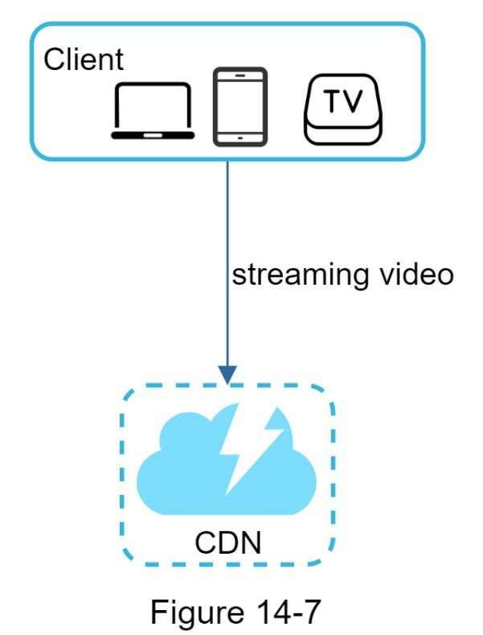

## 3단계 - 설계 심층 분석

고수준 설계에서 전체 시스템을 영상 업로드 흐름과 영상 스트리밍 흐름의 두 부분으로 나누어 보았습니다. 이 절에서는 두 흐름을 중요한 최적화와 함께 다듬고, 오류 처리 메커니즘도 소개하겠습니다.

### 영상 트랜스코딩: 왜 영상을 여러 포맷으로 변환해야 할까?

영상을 녹화하면, 기기(보통 휴대폰이나 카메라)는 영상 파일에 특정 포맷을 부여합니다. 그 영상이 다른 기기에서도 매끄럽게 재생되게 하려면, 영상을 호환되는 비트레이트(bitrate)와 포맷으로 인코딩해야 합니다. 비트레이트란 시간당 처리되는 비트의 속도를 말합니다. 비트레이트가 높을수록 일반적으로 영상 화질이 좋습니다. 다만 고비트레이트 스트림은 더 많은 처리 능력과 빠른 인터넷 속도를 요구합니다.

영상 트랜스코딩이 중요한 이유는 다음과 같습니다.

- 원본 영상은 막대한 저장 공간을 잡아먹습니다. 60프레임(60 frames per second)으로 녹화한 한 시간짜리 고화질(high definition) 영상은 수백 GB의 공간을 차지할 수 있습니다.
- 많은 기기와 브라우저가 특정 영상 포맷만 지원합니다. 따라서 호환성을 위해 영상을 여러 포맷으로 인코딩하는 일이 중요합니다.
- 사용자가 고화질 영상을 보면서도 매끄러운 재생을 유지하게 하려면, 네트워크 대역폭이 높은 사용자에게는 더 높은 해상도의 영상을, 대역폭이 낮은 사용자에게는 더 낮은 해상도의 영상을 전달하는 편이 좋습니다.
- 특히 모바일 기기에서는 네트워크 상태가 수시로 바뀔 수 있습니다. 영상이 끊김 없이 재생되도록, 네트워크 상태에 따라 자동으로 혹은 수동으로 화질을 전환하는 일은 매끄러운 사용자 경험에 필수적입니다.

여러 종류의 인코딩 포맷이 있지만, 대부분은 두 부분으로 이루어집니다.

- **컨테이너(Container):** 영상 파일, 오디오, 메타데이터를 담는 바구니와 같습니다. 마치 도시락 통이 밥과 반찬을 함께 담듯, 컨테이너는 여러 요소를 한데 담습니다. 컨테이너 포맷은 `.avi`, `.mov`, `.mp4` 같은 파일 확장자로 알 수 있습니다.
- **코덱(Codecs):** 화질은 유지하면서 영상 크기를 줄이는 것을 목표로 하는 압축·복원 알고리즘입니다. 가장 많이 쓰이는 영상 코덱은 H.264, VP9, HEVC입니다.

#### 방향성 비순환 그래프(DAG) 모델: 작업을 단계로 쪼개 유연하게 처리하기

영상을 트랜스코딩하는 일은 계산 비용이 크고 시간이 오래 걸립니다. 게다가 콘텐츠 크리에이터마다 영상 처리 요구가 다를 수 있습니다. 어떤 크리에이터는 영상 위에 워터마크(watermark)를 넣어 달라 하고, 어떤 크리에이터는 썸네일 이미지를 직접 제공하며, 어떤 이는 고화질 영상을 올리지만 다른 이는 그렇지 않습니다.

다양한 영상 처리 파이프라인을 지원하면서 높은 병렬성을 유지하려면, 어느 정도 추상화 계층을 두어 클라이언트 프로그래머가 어떤 작업을 실행할지 정의할 수 있게 하는 것이 중요합니다. 예를 들어 Facebook의 스트리밍 비디오 엔진은 **방향성 비순환 그래프(DAG, Directed Acyclic Graph)** 프로그래밍 모델을 사용합니다. 이 모델은 작업을 여러 단계로 정의하여 순차적으로든 병렬로든 실행할 수 있게 합니다 [8]. 우리 설계에서도 유연성과 병렬성을 얻기 위해 비슷한 DAG 모델을 채택합니다. Figure 14-8은 영상 트랜스코딩을 위한 DAG를 나타냅니다.

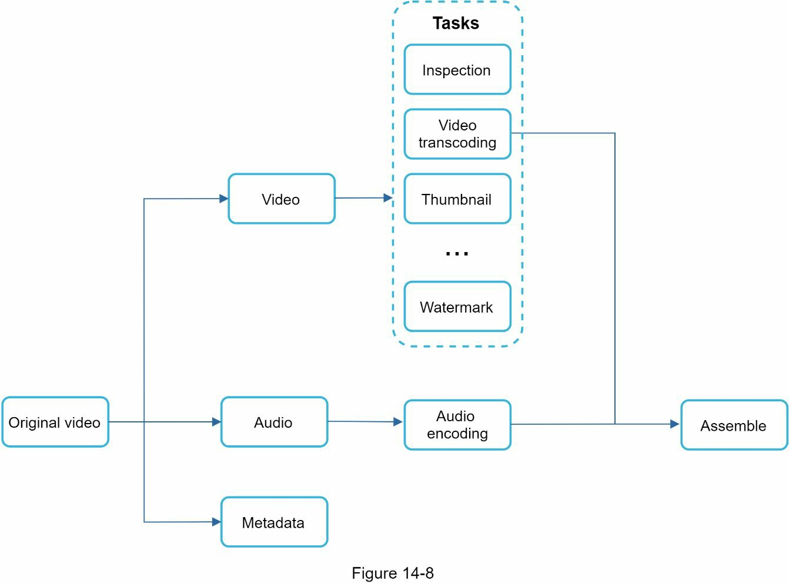

Figure 14-8에서 원본 영상은 영상, 오디오, 메타데이터로 나뉩니다. 영상 파일에 적용할 수 있는 작업으로는 다음과 같은 것들이 있습니다.

- **검사(Inspection):** 영상의 화질이 양호하고 손상되지 않았는지 확인합니다.
- **영상 인코딩(Video encodings):** 서로 다른 해상도, 코덱, 비트레이트 등을 지원하도록 영상을 변환합니다. Figure 14-9는 인코딩된 영상 파일의 예를 보여줍니다.
- **썸네일(Thumbnail):** 썸네일은 사용자가 업로드하거나 시스템이 자동으로 생성할 수 있습니다.
- **워터마크(Watermark):** 영상 위에 덧씌우는 이미지로, 영상을 식별하는 정보를 담습니다.

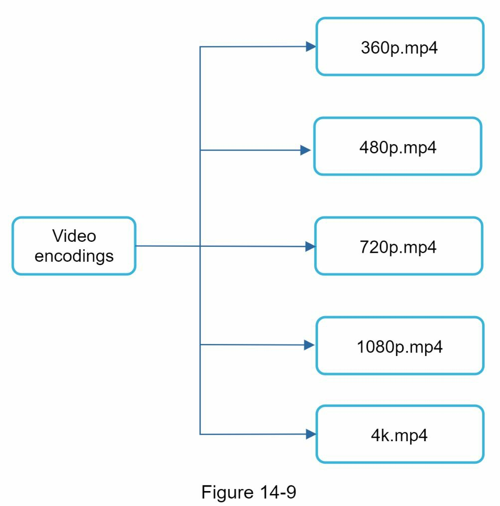

#### 영상 트랜스코딩 아키텍처: 클라우드 서비스를 활용한 처리 구조

클라우드 서비스를 활용하는, 우리가 제안하는 영상 트랜스코딩 아키텍처는 Figure 14-10과 같습니다.

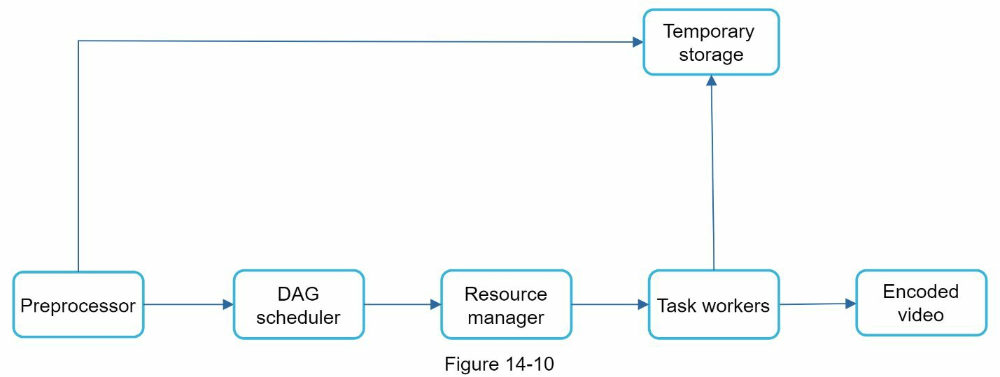

이 아키텍처는 여섯 개의 주요 구성 요소를 가집니다. 전처리기(preprocessor), DAG 스케줄러(DAG scheduler), 자원 관리자(resource manager), 작업 워커(task workers), 임시 스토리지(temporary storage), 그리고 출력물인 인코딩된 영상(encoded video)입니다. 각 구성 요소를 가까이 들여다봅시다.

##### 전처리기(Preprocessor)

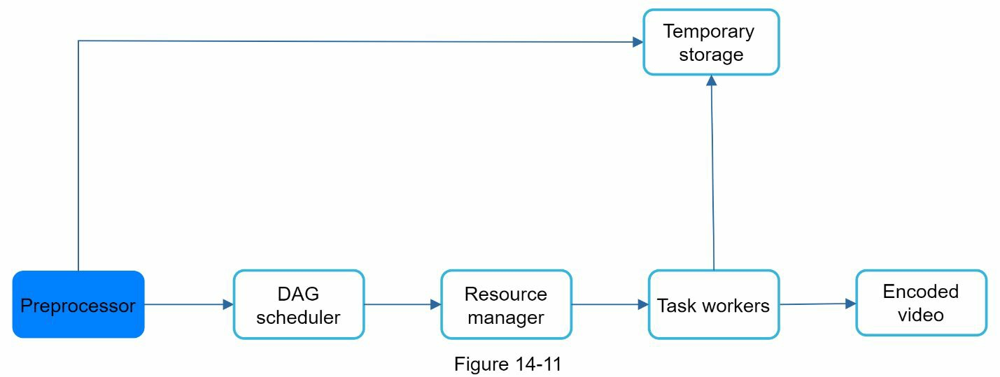

전처리기에는 네 가지 책임이 있습니다.

1. **영상 분할.** 영상 스트림을 더 작은 GOP(Group of Pictures, 화면 그룹) 정렬 단위로 쪼개거나 더 잘게 나눕니다. GOP는 특정 순서로 배열된 프레임의 묶음(청크, chunk)입니다. 각 청크는 독립적으로 재생 가능한 단위이며, 보통 몇 초 길이입니다.
2. 일부 구형 모바일 기기나 브라우저는 영상 분할을 지원하지 않을 수 있습니다. 전처리기는 구형 클라이언트를 위해 영상을 GOP 정렬 단위로 분할합니다.
3. **DAG 생성.** 전처리기는 클라이언트 프로그래머가 작성한 구성 파일(configuration files)을 바탕으로 DAG를 생성합니다. Figure 14-12는 노드 2개와 엣지 1개로 이루어진, 단순화한 DAG 표현입니다.

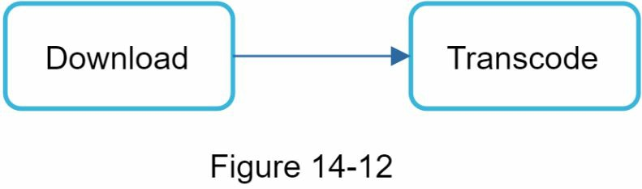

이 DAG 표현은 아래의 두 구성 파일로부터 생성됩니다(Figure 14-13).

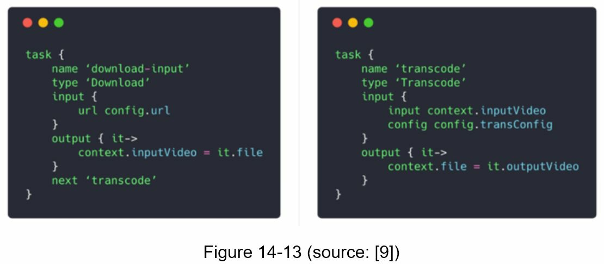

4. **데이터 캐시.** 전처리기는 분할된 영상의 캐시 역할을 합니다. 더 나은 안정성을 위해, 전처리기는 GOP와 메타데이터를 임시 스토리지에 저장합니다. 영상 인코딩이 실패할 경우, 시스템은 영속화된 데이터를 활용해 재시도할 수 있습니다.

##### DAG 스케줄러(DAG scheduler)

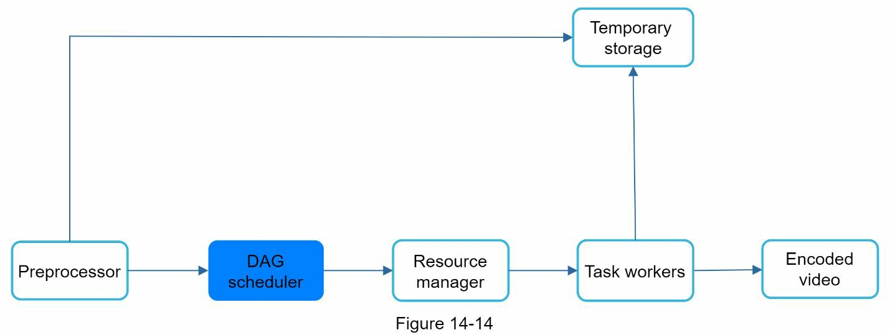

DAG 스케줄러는 DAG 그래프를 작업 단계(stage)들로 나누어 자원 관리자 안의 작업 큐(task queue)에 넣습니다. Figure 14-15는 DAG 스케줄러가 어떻게 동작하는지 보여주는 예입니다.

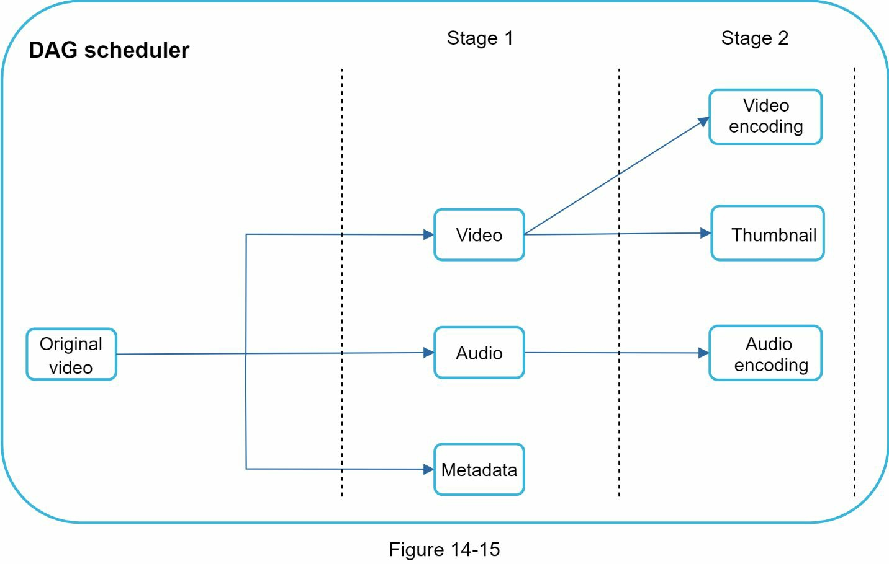

Figure 14-15에서 보듯, 원본 영상은 세 단계로 나뉩니다. 1단계에서는 영상, 오디오, 메타데이터로 분리됩니다. 영상 파일은 2단계에서 다시 두 작업, 즉 영상 인코딩과 썸네일로 나뉩니다. 오디오 파일은 2단계 작업의 일부로 오디오 인코딩을 거칩니다.

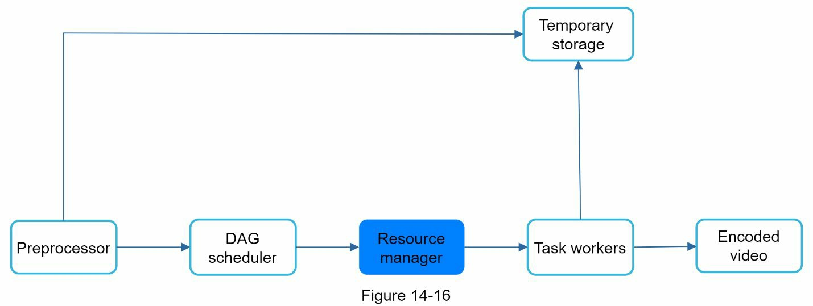

##### 자원 관리자(Resource manager)

자원 관리자는 자원 할당의 효율성을 관리하는 책임을 집니다. Figure 14-17과 같이 세 개의 큐와 하나의 작업 스케줄러로 이루어집니다.

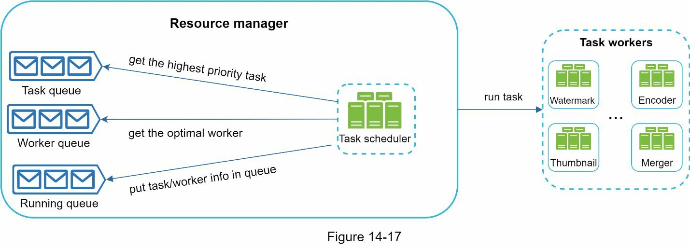

- **작업 큐(Task queue):** 실행할 작업을 담는 우선순위 큐(priority queue)입니다.
- **워커 큐(Worker queue):** 워커의 사용 현황 정보를 담는 우선순위 큐입니다.
- **실행 큐(Running queue):** 현재 실행 중인 작업과 그 작업을 수행하는 워커에 관한 정보를 담습니다.
- **작업 스케줄러(Task scheduler):** 최적의 작업/워커를 골라, 선택된 작업 워커에게 작업을 실행하도록 지시합니다.

자원 관리자는 다음과 같이 동작합니다.

- 작업 스케줄러가 작업 큐에서 가장 우선순위가 높은 작업을 가져옵니다.
- 작업 스케줄러가 워커 큐에서 그 작업을 실행할 최적의 작업 워커를 가져옵니다.
- 작업 스케줄러가 선택된 작업 워커에게 작업을 실행하도록 지시합니다.
- 작업 스케줄러가 작업/워커 정보를 묶어 실행 큐에 넣습니다.
- 작업이 끝나면 작업 스케줄러가 그 작업을 실행 큐에서 제거합니다.

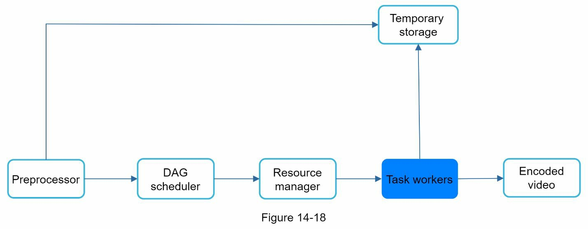

##### 작업 워커(Task workers)

작업 워커는 DAG에 정의된 작업을 실행합니다. Figure 14-19와 같이, 작업 워커마다 서로 다른 작업을 실행할 수 있습니다.

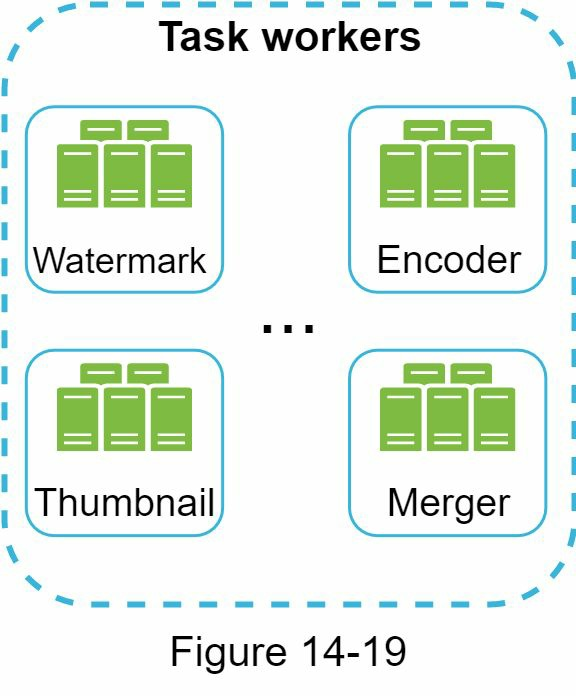

##### 임시 스토리지(Temporary storage)

여기서는 여러 스토리지 시스템이 함께 쓰입니다. 어떤 스토리지 시스템을 고를지는 데이터 유형, 데이터 크기, 접근 빈도, 데이터 수명 등의 요인에 따라 달라집니다. 예를 들어 메타데이터는 워커가 자주 접근하고 데이터 크기는 대체로 작습니다. 따라서 메타데이터를 메모리에 캐시하는 것이 좋습니다. 영상이나 오디오 데이터는 블롭 스토리지에 넣습니다. 임시 스토리지의 데이터는 해당 영상 처리가 완료되면 비워집니다.

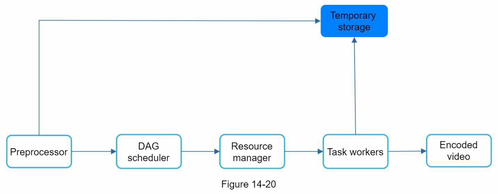

##### 인코딩된 영상(Encoded video)

인코딩된 영상은 인코딩 파이프라인의 최종 출력물입니다. 출력의 예를 들면 `funny_720p.mp4` 같은 형태입니다.

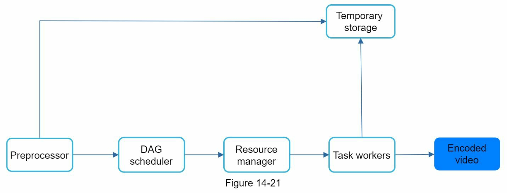

### 시스템 최적화: 속도, 안전, 비용 절감을 다듬다

이 시점에서 우리는 영상 업로드 흐름, 영상 스트리밍 흐름, 영상 트랜스코딩을 충분히 이해했을 것입니다. 다음으로는 속도, 안전, 비용 절감을 비롯한 최적화로 시스템을 더 다듬어 봅시다.

#### 속도 최적화: 영상 업로드를 병렬화한다

영상을 하나의 통째 단위로 업로드하는 것은 비효율적입니다. Figure 14-22와 같이 영상을 GOP 정렬을 기준으로 더 작은 청크로 나눌 수 있습니다.

이렇게 하면 이전 업로드가 실패했을 때 빠르게 이어서 재개할 수 있습니다(resumable upload). 영상 파일을 GOP 기준으로 나누는 작업은, Figure 14-23과 같이 클라이언트가 직접 수행하여 업로드 속도를 높일 수 있습니다.

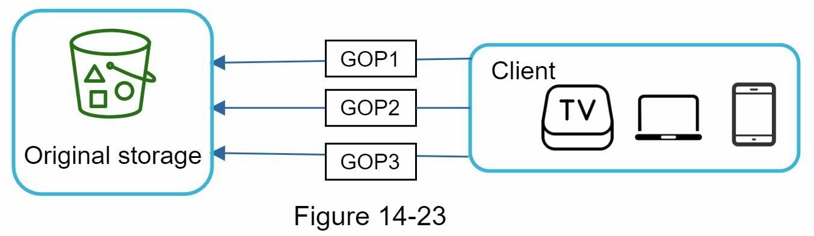

#### 속도 최적화: 업로드 센터를 사용자 가까이에 둔다

업로드 속도를 높이는 또 다른 방법은, 전 세계 곳곳에 여러 업로드 센터를 두는 것입니다(Figure 14-24). 미국 사람들은 북미 업로드 센터로, 중국 사람들은 아시아 업로드 센터로 영상을 올릴 수 있습니다. 이를 구현하기 위해 우리는 CDN을 업로드 센터로 사용합니다.

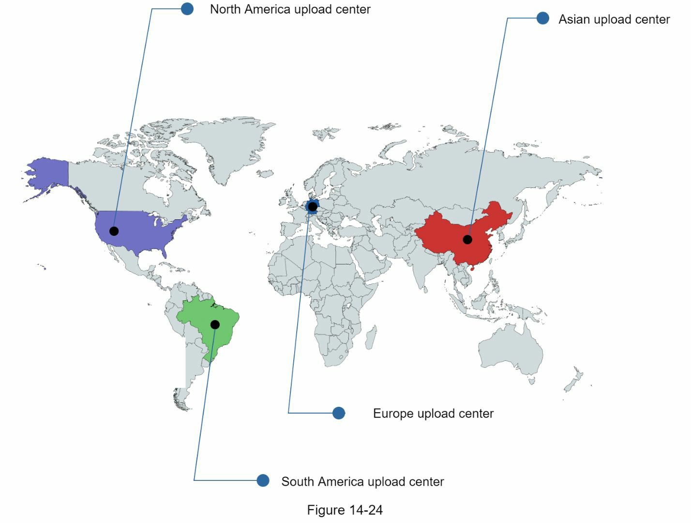

#### 속도 최적화: 곳곳에 병렬성을 심는다

낮은 지연을 달성하려면 상당한 노력이 필요합니다. 또 다른 최적화는 느슨하게 결합된(loosely coupled) 시스템을 만들어 높은 병렬성을 가능하게 하는 것입니다.

높은 병렬성을 얻으려면 우리 설계에 약간의 수정이 필요합니다. 영상이 원본 스토리지에서 CDN으로 전송되는 흐름을 확대해 봅시다. 이 흐름은 Figure 14-25에 나타나 있는데, 각 단계의 출력이 이전 단계의 입력에 의존하고 있음을 드러냅니다. 이 의존성 때문에 병렬화가 어렵습니다.

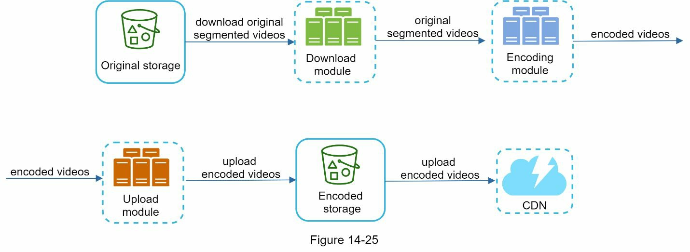

시스템을 더 느슨하게 결합하기 위해, Figure 14-26과 같이 메시지 큐를 도입했습니다. 메시지 큐가 어떻게 시스템을 더 느슨하게 결합하는지 예를 들어 설명하겠습니다.

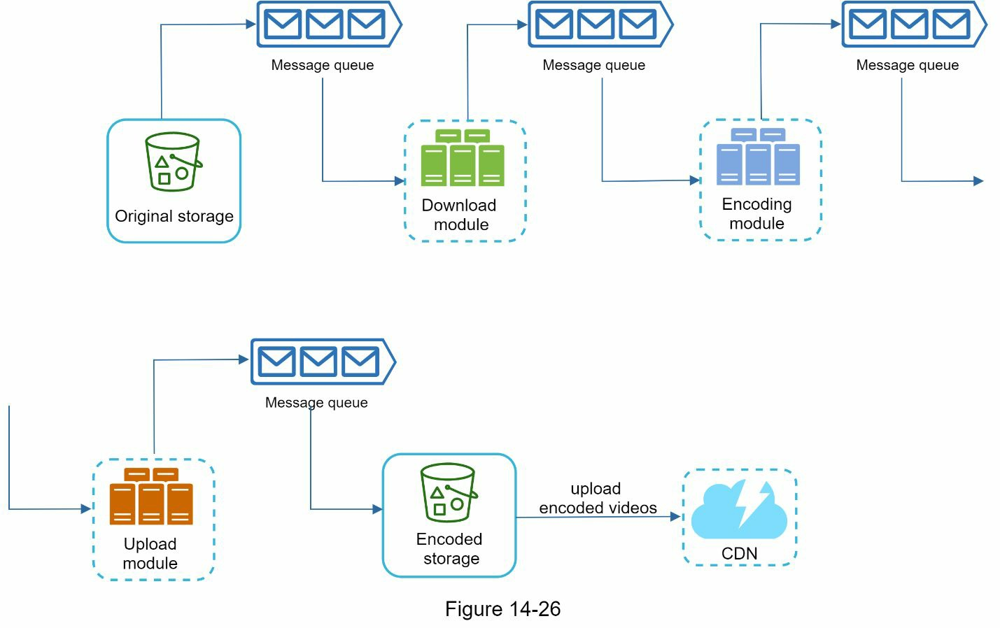

- 메시지 큐를 도입하기 전에는, 인코딩 모듈이 다운로드 모듈의 출력을 기다려야 했습니다.
- 메시지 큐를 도입한 뒤에는, 인코딩 모듈이 더 이상 다운로드 모듈의 출력을 기다릴 필요가 없습니다. 메시지 큐에 이벤트가 있으면 인코딩 모듈은 그 작업들을 병렬로 실행할 수 있습니다.

#### 안전 최적화: 사전 서명된 업로드 URL

안전(safety)은 어떤 제품에서든 가장 중요한 측면 중 하나입니다. 인가된 사용자만이 올바른 위치에 영상을 업로드하도록 보장하기 위해, Figure 14-27과 같이 사전 서명된 URL(pre-signed URL)을 도입합니다.

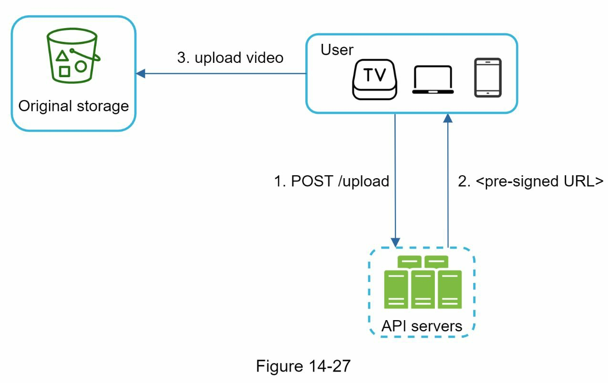

업로드 흐름은 다음과 같이 갱신됩니다.

1. 클라이언트가 API 서버에 HTTP 요청을 보내 사전 서명된 URL을 받아 옵니다. 이 URL은 그 URL이 가리키는 객체에 대한 접근 권한을 부여합니다. "사전 서명된 URL"이라는 용어는 Amazon S3에 파일을 업로드할 때 쓰입니다. 다른 클라우드 서비스 제공업체는 다른 이름을 쓸 수 있습니다. 예를 들어 Microsoft Azure 블롭 스토리지는 같은 기능을 "공유 접근 서명(Shared Access Signature)"이라고 부릅니다 [10].
2. API 서버가 사전 서명된 URL로 응답합니다.
3. 클라이언트는 응답을 받으면, 그 사전 서명된 URL을 사용해 영상을 업로드합니다.

#### 안전 최적화: 영상을 보호한다

많은 콘텐츠 제작자가 자신의 원본 영상이 도용될까 봐 영상을 온라인에 올리기를 꺼립니다. 저작권이 있는 영상을 보호하기 위해, 다음 세 가지 안전 방안 중 하나를 채택할 수 있습니다.

- **디지털 저작권 관리(DRM, Digital Rights Management) 시스템:** 대표적인 세 가지 DRM 시스템은 Apple FairPlay, Google Widevine, Microsoft PlayReady입니다.
- **AES 암호화:** 영상을 암호화하고 인가 정책을 설정할 수 있습니다. 암호화된 영상은 재생 시점에 복호화됩니다. 이로써 인가된 사용자만이 암호화된 영상을 볼 수 있게 됩니다.
- **시각적 워터마킹(Visual watermarking):** 영상 위에 덧씌우는 이미지로, 영상을 식별하는 정보를 담습니다. 회사 로고나 회사명이 될 수 있습니다.

#### 비용 절감 최적화: CDN 비용을 어떻게 줄일까?

CDN은 우리 시스템의 핵심 구성 요소입니다. 전 세계적인 규모로 빠른 영상 전송을 보장하기 때문입니다. 그러나 [[2장 대략적 추정 (Back-of-the-Envelope Estimation)|대략적 추정]]에서 보았듯, CDN은 비쌉니다. 특히 데이터 크기가 클 때 그렇습니다. 그렇다면 어떻게 비용을 줄일 수 있을까요?

기존 연구에 따르면 YouTube 영상 스트림은 롱테일 분포(long-tail distribution)를 따릅니다 [11] [12]. 이는 소수의 인기 영상은 자주 접근되지만, 다른 많은 영상은 시청자가 거의 없거나 아예 없다는 뜻입니다. 마치 도서관에서 몇몇 베스트셀러만 끊임없이 대출되고 나머지 수많은 책은 서가에 가만히 꽂혀 있는 것과 같습니다. 이 관찰에 바탕을 두어 몇 가지 최적화를 적용합니다.

1. 가장 인기 있는 영상만 CDN에서 서비스하고, 나머지 영상은 우리의 고용량 스토리지 영상 서버에서 서비스합니다(Figure 14-28).

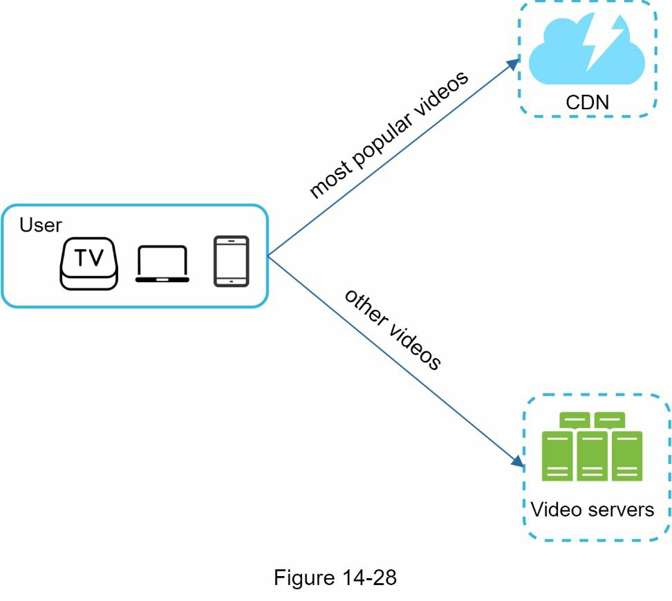

2. 덜 인기 있는 콘텐츠라면, 인코딩된 영상 버전을 여러 개 저장할 필요가 없을 수 있습니다. 짧은 영상은 필요할 때 즉석에서(on-demand) 인코딩할 수 있습니다.
3. 어떤 영상은 특정 지역에서만 인기가 있습니다. 그런 영상을 다른 지역으로까지 배포할 필요는 없습니다.
4. Netflix처럼 자체 CDN을 구축하고 인터넷 서비스 제공업체(ISP, Internet Service Provider)와 제휴합니다. 자체 CDN을 구축하는 일은 거대한 프로젝트이지만, 대형 스트리밍 기업이라면 해 볼 만합니다. ISP로는 Comcast, AT&T, Verizon 같은 인터넷 제공업체가 있습니다. ISP는 전 세계에 자리하며 사용자와 가깝습니다. ISP와 제휴하면 시청 경험을 개선하고 대역폭 요금을 줄일 수 있습니다.

이 모든 최적화는 콘텐츠 인기도, 사용자 접근 패턴, 영상 크기 등에 바탕을 둡니다. 어떤 최적화든 시도하기 전에 과거의 시청 패턴을 분석하는 일이 중요합니다. 이 주제에 관한 흥미로운 글 몇 편을 소개합니다: [12] [13].

### 오류 처리: 대규모 시스템에서 오류를 우아하게 다루는 법

대규모 시스템에서 시스템 오류는 피할 수 없습니다. 고장 내성(fault-tolerant)이 높은 시스템을 만들려면, 오류를 우아하게 처리하고 거기서 빠르게 복구해야 합니다. 오류에는 두 가지 유형이 있습니다.

- **복구 가능한 오류(Recoverable error).** 영상 세그먼트의 트랜스코딩 실패 같은 복구 가능한 오류라면, 일반적으로 작업을 몇 차례 재시도하는 방향으로 접근합니다. 작업이 계속 실패하고 시스템이 복구 불가능하다고 판단하면, 적절한 오류 코드를 클라이언트에 반환합니다.
- **복구 불가능한 오류(Non-recoverable error).** 손상된 영상 포맷 같은 복구 불가능한 오류라면, 시스템은 그 영상과 관련해 실행 중인 작업을 멈추고 적절한 오류 코드를 클라이언트에 반환합니다.

각 시스템 구성 요소에서 흔히 발생하는 오류는 다음과 같은 대응 지침(playbook)으로 다룹니다.

- **업로드 오류:** 몇 차례 재시도합니다.
- **영상 분할 오류:** 구버전 클라이언트가 영상을 GOP 정렬 기준으로 나누지 못하면, 영상 전체를 서버로 넘깁니다. 영상을 나누는 작업은 서버 측에서 수행합니다.
- **트랜스코딩 오류:** 재시도합니다.
- **전처리기 오류:** DAG 다이어그램을 다시 생성합니다.
- **DAG 스케줄러 오류:** 작업을 다시 스케줄링합니다.
- **자원 관리자 큐 다운:** 복제본을 사용합니다.
- **작업 워커 다운:** 새 워커에서 작업을 재시도합니다.
- **API 서버 다운:** API 서버는 무상태(stateless)이므로 요청은 다른 API 서버로 보내집니다.
- **메타데이터 캐시 서버 다운:** 데이터는 여러 번 복제되어 있습니다. 한 노드가 죽어도 다른 노드에서 데이터를 가져올 수 있습니다. 죽은 서버를 대체할 새 캐시 서버를 띄우면 됩니다.
- **메타데이터 DB 서버 다운:**
  - 마스터가 다운된 경우. 마스터가 다운되면, 슬레이브 중 하나를 새 마스터로 승격시킵니다.
  - 슬레이브가 다운된 경우. 슬레이브가 다운되면, 읽기에는 다른 슬레이브를 사용하고, 죽은 서버를 대체할 또 다른 데이터베이스 서버를 띄웁니다.

## 4단계 - 마무리

이 장에서는 YouTube 같은 동영상 스트리밍 서비스의 아키텍처 설계를 살펴보았습니다. 면접이 끝날 무렵 시간이 남는다면, 다음 몇 가지를 더 이야기해 볼 수 있습니다.

- **API 계층 확장:** API 서버는 무상태이므로 API 계층을 수평으로(horizontally) 확장하기 쉽습니다.
- **데이터베이스 확장:** 데이터베이스 복제와 샤딩에 관해 이야기할 수 있습니다.
- **라이브 스트리밍(Live streaming):** 영상을 실시간으로 녹화하고 송출하는 과정을 가리킵니다. 우리 시스템이 라이브 스트리밍을 위해 특별히 설계된 것은 아니지만, 라이브 스트리밍과 비(非)라이브 스트리밍에는 몇 가지 공통점이 있습니다. 둘 다 업로드, 인코딩, 스트리밍이 필요합니다. 주목할 만한 차이는 다음과 같습니다.
  - 라이브 스트리밍은 지연 요구사항이 더 높으므로, 다른 스트리밍 프로토콜이 필요할 수 있습니다.
  - 라이브 스트리밍은 작은 데이터 청크가 이미 실시간으로 처리되므로, 병렬성에 대한 요구가 더 낮습니다.
  - 라이브 스트리밍은 다른 오류 처리 방식이 필요합니다. 시간이 너무 오래 걸리는 오류 처리는 용납되지 않습니다.
- **영상 게시 중단(Video takedowns):** 저작권을 침해하거나, 음란물이거나, 그 밖에 불법적인 행위에 해당하는 영상은 삭제되어야 합니다. 일부는 업로드 과정에서 시스템이 발견할 수 있고, 다른 일부는 사용자 신고를 통해 발견될 수 있습니다.

여기까지 온 것을 축하합니다! 이제 스스로 어깨를 토닥여 주세요. 정말 잘하셨습니다!

## 핵심 개념 정리

| 용어 | 설명 |
|---|---|
| **비디오 트랜스코딩(Video Transcoding)** | 원본 영상 파일을 다른 포맷·해상도·비트레이트로 변환하는 과정. 다양한 기기와 네트워크 환경에서 재생을 보장하기 위해 필수적이다. 영상 인코딩(video encoding)이라고도 한다. |
| **DAG(Directed Acyclic Graph, 방향성 비순환 그래프)** | 순환이 없는 방향 그래프. 영상 처리 파이프라인에서 작업 간 의존 관계를 표현하는 데 쓰이며, 단계별·병렬 실행을 유연하게 지원한다. |
| **CDN(Content Delivery Network, 콘텐츠 전송 네트워크)** | 전 세계에 분산된 엣지 서버 네트워크. 사용자와 가장 가까운 서버에서 영상을 제공해 지연을 최소화하고 대역폭 부담을 줄인다. |
| **블롭 스토리지(Blob Storage, Binary Large Object Storage)** | 이진 대형 객체를 저장하는 오브젝트 스토리지. 원본 영상·트랜스코딩 영상처럼 구조화되지 않은 대용량 파일을 저장하는 데 사용된다. Amazon S3가 대표적인 예다. |
| **HLS(HTTP Live Streaming)** | Apple이 개발한 적응형 비트레이트 스트리밍 프로토콜. 영상을 짧은 세그먼트로 나눠 HTTP로 전달하며, 네트워크 상태에 따라 화질을 자동 전환한다. |
| **MPEG-DASH(Dynamic Adaptive Streaming over HTTP)** | MPEG 표준 기반의 적응형 스트리밍 프로토콜. HLS와 유사하게 HTTP로 영상 세그먼트를 전달하며, 오픈 표준으로 다양한 플랫폼에서 지원된다. |
| **GOP(Group of Pictures, 화면 그룹)** | 독립적으로 디코딩 가능한 프레임 묶음. 영상 업로드 병렬화 및 이어받기(resumable upload)를 위해 GOP 단위로 영상을 분할한다. |
| **사전 서명된 URL(Pre-signed URL)** | 특정 객체에 대한 제한된 접근 권한을 부여하는 일시적 URL. 인가된 사용자만 지정된 스토리지 위치에 업로드할 수 있도록 보안을 강화한다. |
| **비트레이트(Bitrate)** | 단위 시간당 처리되는 데이터 비트 수. 비트레이트가 높을수록 영상 화질이 좋지만, 더 많은 대역폭과 처리 능력이 필요하다. |
| **코덱(Codec)** | 영상·오디오를 압축(인코딩)하고 복원(디코딩)하는 알고리즘. H.264, VP9, HEVC가 대표적이며, 화질을 최대한 유지하면서 파일 크기를 줄이는 것을 목표로 한다. |
| **DRM(Digital Rights Management, 디지털 저작권 관리)** | 디지털 콘텐츠의 무단 복제·배포를 방지하는 기술 체계. Apple FairPlay, Google Widevine, Microsoft PlayReady가 대표적인 구현이다. |
| **롱테일 분포(Long-tail Distribution)** | 소수의 인기 항목이 대부분의 트래픽을 차지하고, 나머지 다수는 거의 접근되지 않는 분포 패턴. 인기 영상은 CDN에서, 비인기 영상은 자체 스토리지 서버에서 서비스하는 비용 최적화 전략의 근거가 된다. |

## 참고 자료

[1] YouTube by the numbers: https://www.omnicoreagency.com/youtube-statistics/

[2] 2019 YouTube Demographics: https://blog.hubspot.com/marketing/youtube-demographics

[3] Cloudfront Pricing: https://aws.amazon.com/cloudfront/pricing/

[4] Netflix on AWS: https://aws.amazon.com/solutions/case-studies/netflix/

[5] Akamai homepage: https://www.akamai.com/

[6] Binary large object: https://en.wikipedia.org/wiki/Binary_large_object

[7] Here's What You Need to Know About Streaming Protocols: https://www.dacast.com/blog/streaming-protocols/

[8] SVE: Distributed Video Processing at Facebook Scale: https://www.cs.princeton.edu/~wlloyd/papers/sve-sosp17.pdf

[9] Weibo video processing architecture (in Chinese): https://www.upyun.com/opentalk/399.html

[10] Delegate access with a shared access signature: https://docs.microsoft.com/en-us/rest/api/storageservices/delegate-access-with-shared-access-signature

[11] YouTube scalability talk by early YouTube employee: https://www.youtube.com/watch?v=w5WVu624fY8

[12] Understanding the characteristics of internet short video sharing: A youtube-based measurement study. https://arxiv.org/pdf/0707.3670.pdf

[13] Content Popularity for Open Connect: https://netflixtechblog.com/content-popularity-for-open-connect-b86d56f613b
