## 서론: 클라우드에 파일을 맡기다

스마트폰으로 찍은 사진, 컴퓨터에서 작업 중인 문서, 태블릿으로 읽는 전자책. 이런 파일들을 여러 기기에서 언제 어디서나 꺼낼 수 있다면 얼마나 편할까요? Google Drive, Dropbox, Microsoft OneDrive, Apple iCloud 같은 클라우드 스토리지 서비스들이 최근 몇 년 사이 매우 인기를 얻은 이유가 바로 이것입니다.

Google Drive는 단순한 저장소가 아닙니다. 문서, 사진, 동영상, 그 외 다양한 파일을 클라우드에 저장하고, 어떤 컴퓨터, 스마트폰, 태블릿에서든 접근할 수 있게 해주며, 친구, 가족, 동료들과 쉽게 공유할 수 있는 **파일 저장 및 동기화 서비스**입니다. 이 장에서는 이러한 Google Drive를 어떻게 설계할지 함께 살펴보겠습니다.

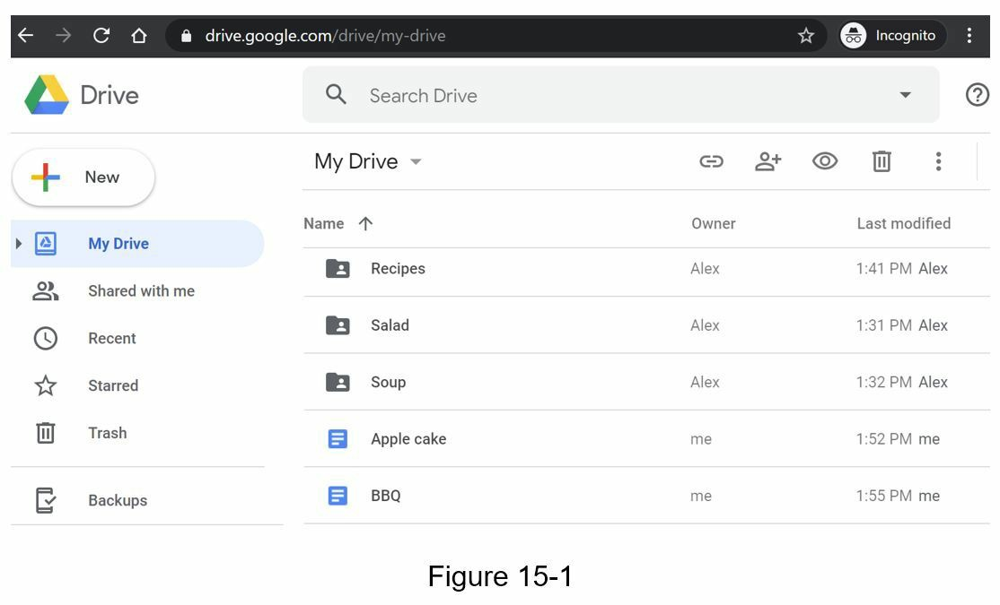

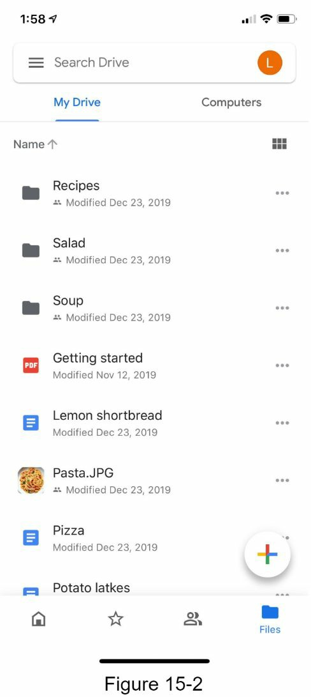

---

## 1단계: 문제 이해 및 설계 범위 결정

Google Drive 같은 거대한 프로젝트를 설계하려면 먼저 범위를 명확히 해야 합니다. 인터뷰에서 질문을 통해 요구사항을 구체화하는 과정을 살펴봅시다.

**후보자**: 가장 중요한 기능들은 무엇입니까?  
**면접관**: 파일 업로드와 다운로드, 파일 동기화, 알림 기능입니다.

**후보자**: 모바일 앱인가요, 웹 앱인가요, 아니면 둘 다인가요?  
**면접관**: 둘 다입니다.

**후보자**: 지원하는 파일 형식은 무엇입니까?  
**면접관**: 모든 파일 형식입니다.

**후보자**: 파일을 암호화해야 합니까?  
**면접관**: 네, 저장소의 모든 파일은 암호화되어야 합니다.

**후보자**: 파일 크기 제한이 있습니까?  
**면접관**: 네, 파일은 10GB 이하여야 합니다.

**후보자**: 사용자 수는 몇 명입니까?  
**면접관**: 일일 활성 사용자(Daily Active User, DAU)는 1,000만 명입니다.

### 포함할 기능

이 장에서 우리가 집중할 기능들은 다음과 같습니다:

- **파일 추가**: Google Drive에 파일을 끌어다 놓으면 가장 간단하게 파일을 추가할 수 있습니다.
- **파일 다운로드**: 저장된 파일을 다운로드합니다.
- **여러 기기에서 동기화**: 한 기기에 파일을 추가하면 다른 모든 기기에 자동으로 동기화됩니다.
- **파일 버전 확인**: 파일의 이전 버전들을 볼 수 있습니다.
- **파일 공유**: 친구, 가족, 동료와 파일을 공유합니다.
- **알림 전송**: 파일이 수정되거나 삭제되거나 공유될 때 알림을 받습니다.

### 포함하지 않을 기능

이 장에서 다루지 않는 기능들:

- **Google 문서 편집 및 협업**: Google 문서는 여러 사람이 동시에 같은 문서를 편집할 수 있게 하지만, 이는 설계 범위를 벗어납니다.

### 비기능 요구사항 (Non-Functional Requirements)

시스템 설계에서 중요한 요구사항들도 이해해야 합니다:

- **신뢰성**: 저장소 시스템에서 신뢰성은 매우 중요합니다. 데이터 손실은 절대 용납될 수 없습니다.
- **빠른 동기화 속도**: 파일 동기화가 너무 오래 걸리면 사용자는 답답해하여 서비스를 떠날 것입니다.
- **대역폭 효율성**: 불필요한 네트워크 대역폭을 많이 사용하면 사용자, 특히 모바일 데이터 요금제를 사용하는 사용자는 불만족합니다.
- **확장성**: 시스템은 높은 트래픽을 처리할 수 있어야 합니다.
- **고가용성**: 일부 서버가 오프라인 상태이거나 느려지거나 예기치 않은 네트워크 오류가 발생해도 사용자는 시스템을 계속 사용할 수 있어야 합니다.

### 백지 추정 (Back of the Envelope Estimation)

- 가입한 사용자: 5,000만 명, 일일 활성 사용자: 1,000만 명
- 사용자당 무료 저장 공간: 10GB
- 사용자당 일일 업로드: 2개 파일, 평균 파일 크기: 500KB
- 읽기/쓰기 비율: 1:1

**총 저장 공간**: 5,000만 × 10GB = 500 페타바이트(Petabyte, PB)

**업로드 API QPS**: 1,000만 × 2개 / 24시간 / 3600초 = 약 240

**최고 QPS**: 240 × 2 = 480

---

## 2단계: 고수준 설계 제안 및 합의

### 단일 서버로 시작하기

결론부터 말하면, 거대한 시스템도 작은 것에서 시작됩니다. 이 과정을 거치며 중요한 설계 개념들을 상기해 봅시다.

단일 서버 구성에서는 다음 세 가지가 필요합니다:

- **웹 서버**: 파일 업로드/다운로드
- **데이터베이스**: 사용자 정보, 로그인, 파일 정보 등의 메타데이터 저장
- **저장소 시스템**: 업로드된 파일 저장 (1TB 공간 할당)

Apache 웹 서버, MySQL 데이터베이스, 그리고 `drive/`라는 루트 디렉토리를 설정합니다. `drive/` 디렉토리 아래에는 **네임스페이스**(namespace)라고 불리는 디렉토리들이 있으며, 각 네임스페이스는 해당 사용자가 업로드한 모든 파일을 포함합니다. 파일명은 원본 파일명과 동일하게 유지되며, 각 파일이나 폴더는 네임스페이스와 상대 경로를 결합하여 고유하게 식별됩니다.

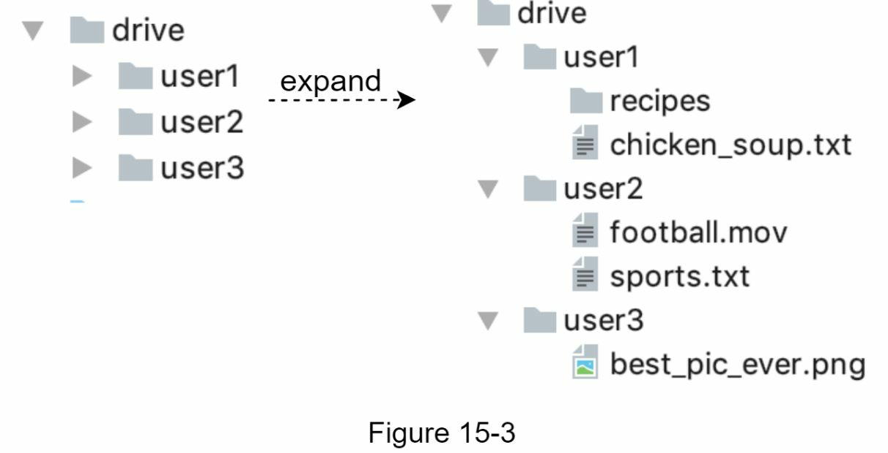

### API 설계

#### 1. 파일 업로드

두 가지 업로드 방식을 지원합니다:

- **단순 업로드**: 파일 크기가 작을 때 사용
- **재개 가능한 업로드**: 파일 크기가 크고 네트워크 중단 위험이 있을 때 사용

재개 가능한 업로드 API 예시:
```
https://api.example.com/files/upload?uploadType=resumable
```

재개 가능한 업로드는 다음 3단계로 진행됩니다:

1. 초기 요청을 보내 재개 가능한 URL을 받습니다.
2. 데이터를 업로드하고 업로드 상태를 모니터링합니다.
3. 업로드가 중단되면 이전에 진행한 부분부터 재개합니다.

#### 2. 파일 다운로드

파일 다운로드 API 예시:
```
https://api.example.com/files/download
```

파라미터:
```json
{
  "path": "/recipes/soup/best_soup.txt"
}
```

#### 3. 파일 버전 조회

파일 버전 조회 API 예시:
```
https://api.example.com/files/list_revisions
```

파라미터:
```json
{
  "path": "/recipes/soup/best_soup.txt",
  "limit": 20
}
```

모든 API는 사용자 인증이 필요하며 HTTPS를 사용합니다. SSL(Secure Sockets Layer)은 클라이언트와 백엔드 서버 간의 데이터 전송을 보호합니다.

### 단일 서버에서 탈출하기

시간이 지나면서 파일이 계속 업로드되면 결국 저장 공간이 가득 찹니다.

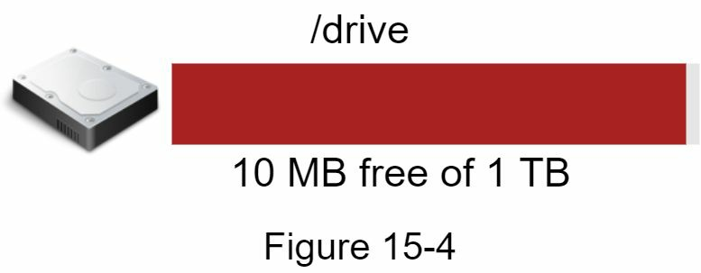

남은 저장 공간이 단 10MB만 남았습니다! 사용자는 더 이상 파일을 업로드할 수 없게 됩니다. 이 문제의 해결책은 **데이터 샤딩**(sharding)입니다. 데이터를 여러 저장소 서버에 분산시키는 것입니다.

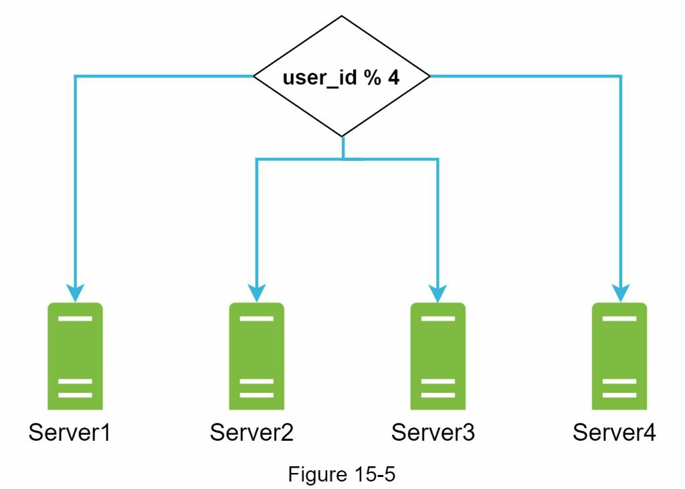

밤을 새워가며 데이터베이스 샤딩을 설정하고 정밀하게 모니터링합니다. 모든 것이 다시 잘 작동합니다. 화재를 진압했지만, 저장소 서버의 장애로 인한 데이터 손실 위험이 여전히 걱정됩니다. 주변 사람들에게 물어보니 Netflix, Airbnb 같은 선도적인 회사들이 Amazon S3를 사용한다고 합니다.

Amazon S3(Amazon Simple Storage Service)는 "업계 최고의 확장성, 데이터 가용성, 보안 및 성능을 제공하는 객체 저장소 서비스"입니다. S3를 선택하기로 결정합니다.

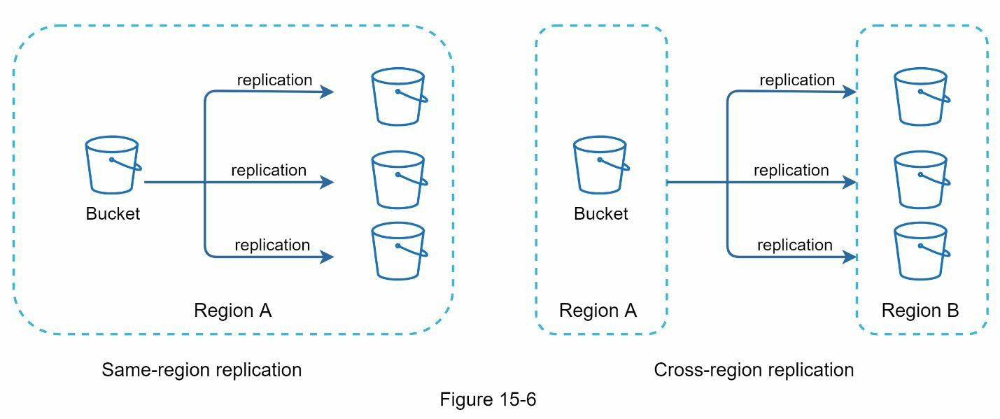

연구를 진행한 결과, Amazon S3는 같은 지역(같은 리전) 복제와 지역 간(리전 간) 복제를 지원합니다. 리전은 AWS가 데이터 센터를 운영하는 지리적 영역입니다. 그림에 보이는 대로, 데이터는 같은 리전(왼쪽)과 다른 리전(오른쪽)에 복제될 수 있습니다. 중복 파일들이 여러 지역에 저장되어 데이터 손실을 방지하고 가용성을 보장합니다. 버킷(bucket)은 파일 시스템의 폴더 같은 개념입니다.

S3에 파일을 저장한 후, 비로소 데이터 손실 걱정 없이 숙면을 취할 수 있습니다. 앞으로 비슷한 문제를 방지하기 위해 개선할 수 있는 부분들을 찾아봅니다:

- **로드 밸런서**: 네트워크 트래픽을 분산시키는 로드 밸런서를 추가합니다. 웹 서버가 다운되면 트래픽을 다른 서버로 재분배합니다.
- **웹 서버**: 로드 밸런서를 추가한 후, 트래픽에 따라 웹 서버를 쉽게 추가하거나 제거할 수 있습니다.
- **메타데이터 데이터베이스**: 단일 실패점(single point of failure)을 피하기 위해 데이터베이스를 별도의 서버로 옮깁니다. 동시에 데이터 복제와 샤딩을 설정하여 가용성과 확장성 요구사항을 충족시킵니다.
- **파일 저장소**: Amazon S3를 파일 저장소로 사용합니다. 가용성과 내구성을 보장하기 위해 파일을 두 개의 다른 지역에 복제합니다.

이런 개선사항들을 적용한 후, 웹 서버, 메타데이터 데이터베이스, 파일 저장소를 단일 서버에서 성공적으로 분리합니다.

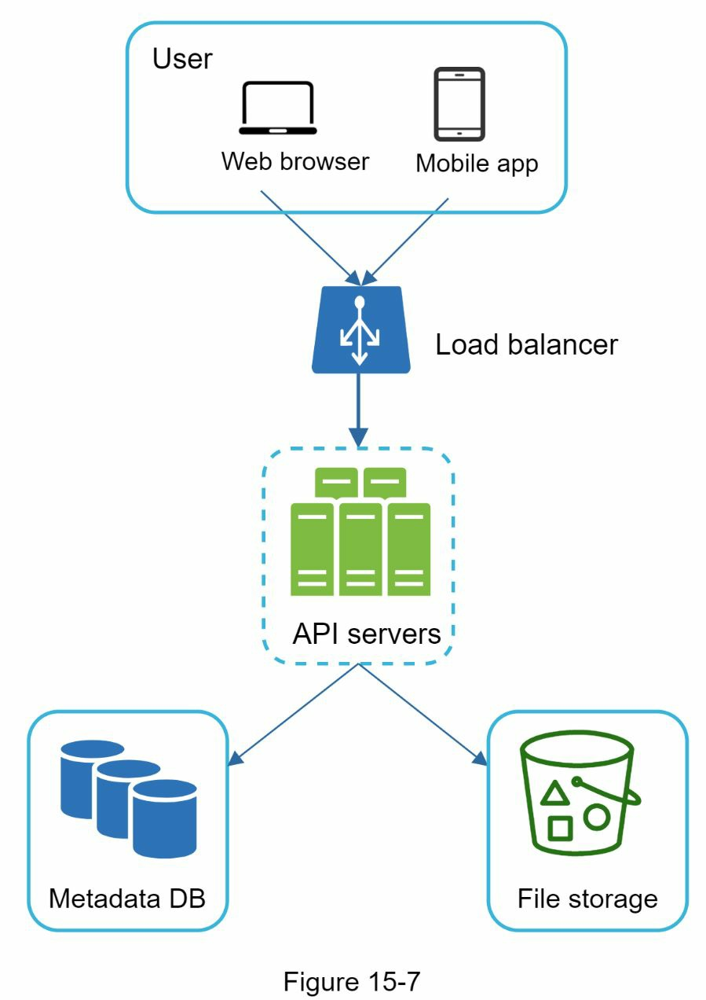

### 동기화 충돌 (Sync Conflicts)

Google Drive 같은 대규모 저장소 시스템에서는 동기화 충돌이 간헐적으로 발생합니다. 두 사용자가 동시에 같은 파일이나 폴더를 수정하면 충돌이 발생합니다. 어떻게 해결할까요?

**우리의 전략**: 먼저 처리되는 버전이 승리하고, 나중에 처리되는 버전이 충돌을 받게 됩니다.

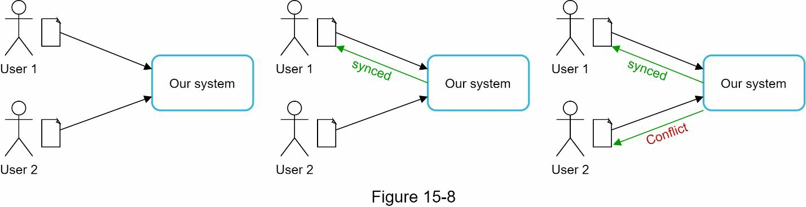

그림에서 사용자 1과 사용자 2가 동시에 같은 파일을 업데이트하려고 하지만, 우리 시스템이 사용자 1의 파일을 먼저 처리합니다. 사용자 1의 업데이트는 성공하지만, 사용자 2는 동기화 충돌을 받게 됩니다.

사용자 2의 충돌을 해결하는 방법은 어떻게 될까요? 우리 시스템은 같은 파일의 두 복사본을 표시합니다: 사용자 2의 로컬 복사본과 서버의 최신 버전입니다.

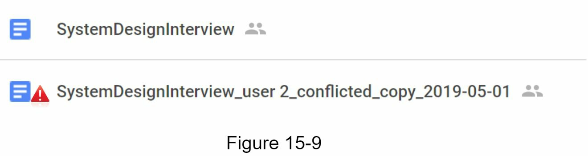

사용자 2는 두 파일을 병합하거나 한 버전을 다른 버전으로 덮어쓸 수 있는 옵션을 가집니다.

---

### 고수준 설계

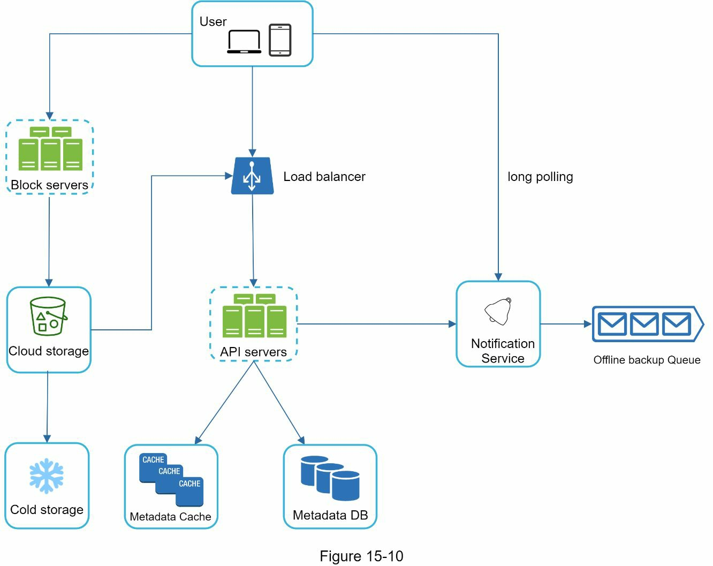

제안된 고수준 설계를 자세히 살펴봅시다. 각 컴포넌트를 살펴보겠습니다:

#### 주요 컴포넌트

**사용자**: 브라우저나 모바일 앱을 통해 애플리케이션을 사용하는 사용자입니다.

**블록 서버(Block Servers)**: 블록들을 클라우드 저장소에 업로드합니다. 블록 저장소(block-level storage)는 클라우드 환경에서 데이터 파일을 저장하는 기술입니다. 파일은 여러 블록으로 분할되며, 각 블록은 고유한 해시값을 가지고 메타데이터 데이터베이스에 저장됩니다. 각 블록은 독립적인 객체로 취급되어 저장 시스템(S3)에 저장됩니다. 파일을 재구성하려면 블록들을 특정 순서로 결합합니다. 블록 크기는 Dropbox를 참고하여 최대 4MB로 설정합니다.

**클라우드 저장소**: 파일이 더 작은 블록으로 분할되어 클라우드 저장소에 저장됩니다.

**냉동 저장소(Cold Storage)**: 오랫동안 접근하지 않은 비활성 데이터를 저장하기 위해 설계된 컴퓨터 시스템입니다.

**로드 밸런서**: API 서버들 간에 요청을 균등하게 분산시킵니다.

**API 서버**: 업로드 흐름을 제외한 거의 모든 것을 담당합니다. 사용자 인증, 사용자 프로필 관리, 파일 메타데이터 업데이트 등을 수행합니다.

**메타데이터 데이터베이스**: 사용자, 파일, 블록, 버전 등의 메타데이터를 저장합니다. 주의할 점은 파일은 클라우드에 저장되고 메타데이터 데이터베이스는 메타데이터만 포함한다는 것입니다.

**메타데이터 캐시**: 빠른 조회를 위해 일부 메타데이터가 캐시됩니다.

**알림 서비스**: 발행자/구독자(publisher/subscriber) 시스템으로, 특정 이벤트가 발생하면 데이터를 클라이언트로 전달할 수 있습니다. 파일이 다른 곳에서 추가/수정/제거되었을 때 관련 클라이언트에게 알려주어, 최신 변경사항을 가져올 수 있도록 합니다.

**오프라인 백업 큐(Offline Backup Queue)**: 클라이언트가 오프라인 상태여서 최신 파일 변경사항을 가져올 수 없을 때, 이 정보를 저장했다가 클라이언트가 다시 온라인이 되면 동기화합니다.

---

## 3단계: 깊이 있는 설계

이 섹션에서는 다음을 자세히 살펴볼 것입니다: 블록 서버, 메타데이터 데이터베이스, 업로드 흐름, 다운로드 흐름, 알림 서비스, 저장 공간 절약, 그리고 장애 처리.

### 블록 서버

정기적으로 업데이트되는 대용량 파일의 경우, 매번 전체 파일을 전송하는 것은 많은 대역폭을 소비합니다. 네트워크 트래픽을 최소화하기 위해 두 가지 최적화 방법을 제안합니다:

- **델타 동기화(Delta Sync)**: 파일이 수정될 때 전체 파일이 아닌 수정된 블록만 동기화합니다.
- **압축(Compression)**: 블록에 압축을 적용하면 데이터 크기를 크게 줄일 수 있습니다. 파일 유형에 따라 다른 압축 알고리즘을 사용합니다. 예를 들어, gzip과 bzip2는 텍스트 파일 압축에 사용되고, 이미지와 동영상 압축에는 다른 알고리즘이 필요합니다.

블록 서버는 파일 업로드 시 무거운 작업을 수행합니다. 클라이언트로부터 받은 파일을 블록으로 분할하고, 각 블록을 압축하고, 암호화한 후 저장소 시스템에만 수정된 블록을 전송합니다.

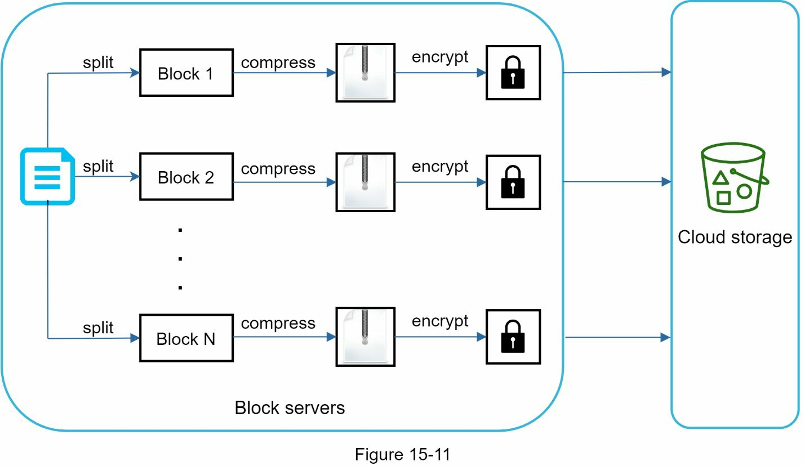

파일을 더 작은 블록으로 분할합니다.
- 각 블록을 압축 알고리즘으로 압축합니다.
- 보안을 위해 각 블록을 암호화한 후 클라우드 저장소로 전송합니다.
- 블록들을 클라우드 저장소에 업로드합니다.

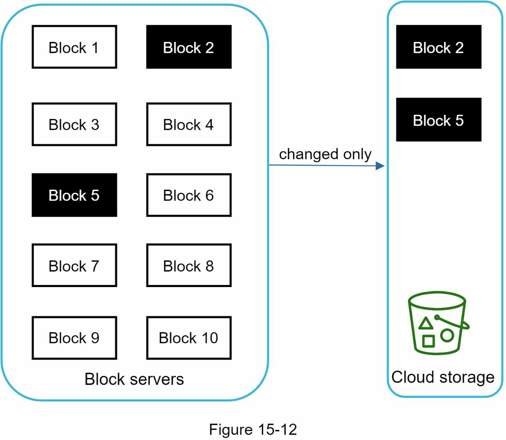

그림은 델타 동기화를 보여줍니다. 즉, 수정된 블록만 클라우드 저장소로 전송됩니다. 강조된 "블록 2"와 "블록 5"는 변경된 블록들입니다. 델타 동기화를 사용하면 이 두 블록만 클라우드 저장소에 업로드됩니다.

블록 서버는 델타 동기화와 압축을 제공함으로써 네트워크 트래픽을 절약할 수 있게 합니다.

### 강한 일관성 요구사항 (High Consistency Requirement)

우리 시스템은 기본적으로 **강한 일관성**(strong consistency)을 요구합니다. 같은 파일이 다른 클라이언트에서 다르게 표시되는 것은 용납될 수 없습니다. 시스템은 메타데이터 캐시와 데이터베이스 계층에서 강한 일관성을 제공해야 합니다.

메모리 캐시는 기본적으로 **최종 일관성**(eventual consistency) 모델을 채택합니다. 이는 다른 복제본들이 다른 데이터를 가질 수 있음을 의미합니다. 강한 일관성을 달성하려면 다음을 보장해야 합니다:

- 캐시 복제본과 마스터의 데이터가 일치합니다.
- 데이터베이스 쓰기 시 캐시를 무효화하여 캐시와 데이터베이스가 같은 값을 유지하도록 합니다.

관계형 데이터베이스에서 강한 일관성을 달성하는 것은 쉽습니다. ACID(원자성, 일관성, 격리성, 내구성) 속성을 기본적으로 유지하기 때문입니다. 하지만 NoSQL 데이터베이스는 기본적으로 ACID 속성을 지원하지 않습니다. ACID 속성을 프로그래밍으로 동기화 로직에 포함시켜야 합니다. 우리 설계에서는 ACID가 기본적으로 지원되는 관계형 데이터베이스를 선택합니다.

### 메타데이터 데이터베이스

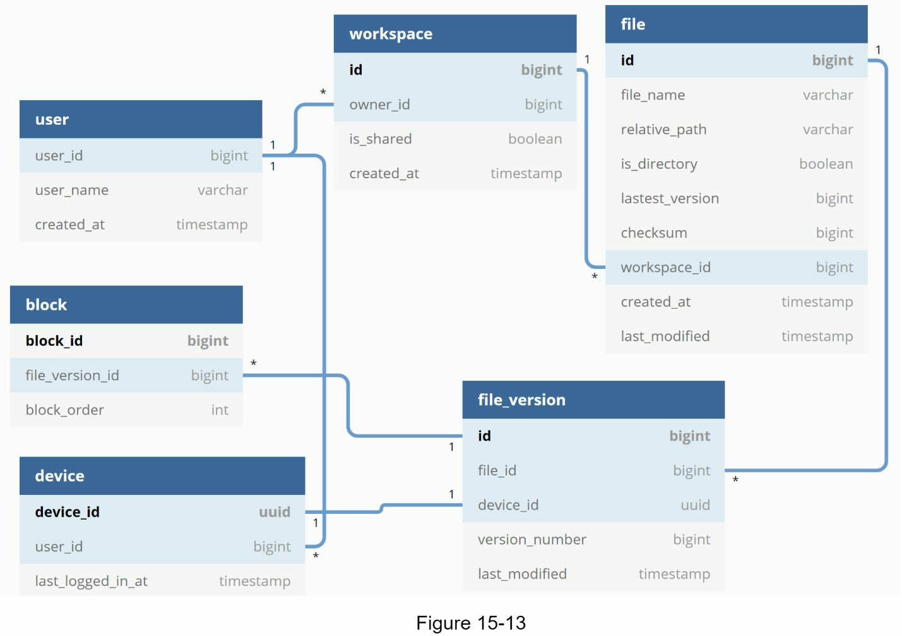

데이터베이스 스키마 설계는 다음과 같습니다. 이는 가장 중요한 테이블과 필드만 포함하는 단순화된 버전입니다.

**User (사용자)**: 사용자명, 이메일, 프로필 사진 등 사용자에 대한 기본 정보를 포함합니다.

**Device (기기)**: 기기 정보를 저장합니다. push_id는 모바일 푸시 알림을 보내고 받는 데 사용됩니다. 한 사용자가 여러 기기를 가질 수 있습니다.

**Namespace (네임스페이스)**: 사용자의 루트 디렉토리입니다.

**File (파일)**: 최신 파일과 관련된 모든 정보를 저장합니다.

**File_version (파일 버전)**: 파일의 버전 이력을 저장합니다. 기존 행들은 파일 수정 이력의 무결성을 유지하기 위해 읽기 전용입니다.

**Block (블록)**: 파일 블록과 관련된 모든 것을 저장합니다. 특정 버전의 파일은 올바른 순서로 모든 블록을 결합하여 재구성할 수 있습니다.

### 업로드 흐름

클라이언트가 파일을 업로드할 때 무엇이 일어나는지 살펴봅시다. 흐름을 더 잘 이해하기 위해 시퀀스 다이어그램을 그렸습니다.

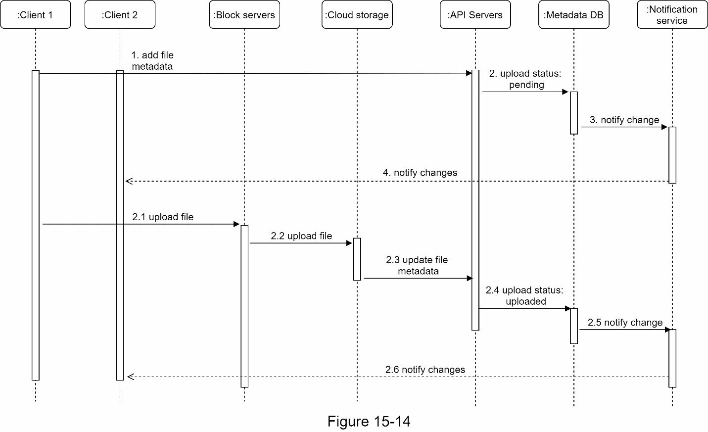

그림 15-14에서는 두 개의 요청이 병렬로 전송됩니다: 파일 메타데이터 추가와 파일을 클라우드 저장소에 업로드. 두 요청 모두 클라이언트 1에서 시작됩니다.

**파일 메타데이터 추가:**
1. 클라이언트 1이 새 파일의 메타데이터를 추가하는 요청을 보냅니다.
2. 메타데이터 DB에 새 파일 메타데이터를 저장하고, 파일 업로드 상태를 "pending"으로 변경합니다.
3. 알림 서비스에 새 파일이 추가되고 있음을 알립니다.
4. 알림 서비스가 관련 클라이언트(클라이언트 2)에게 파일이 업로드되고 있음을 알립니다.

**파일을 클라우드 저장소에 업로드:**
2.1 클라이언트 1이 파일의 콘텐츠를 블록 서버에 업로드합니다.
2.2 블록 서버가 파일을 블록으로 분할하고, 압축하고, 암호화한 후 클라우드 저장소에 업로드합니다.
2.3 파일이 업로드되면, 클라우드 저장소가 업로드 완료 콜백을 트리거합니다. 요청은 API 서버로 전송됩니다.
2.4 메타데이터 DB에서 파일 상태를 "uploaded"로 변경합니다.
2.5 알림 서비스에 파일 상태가 "uploaded"로 변경되었음을 알립니다.
2.6 알림 서비스가 관련 클라이언트(클라이언트 2)에게 파일이 완전히 업로드되었음을 알립니다.

파일이 편집될 때는 흐름이 유사하므로 반복하지 않겠습니다.

### 다운로드 흐름

다운로드 흐름은 파일이 다른 곳에서 추가되거나 편집될 때 트리거됩니다. 클라이언트가 파일이 추가되거나 편집되었음을 어떻게 알 수 있을까요? 두 가지 방법이 있습니다:

- **온라인 상태**: 클라이언트 A가 온라인 상태일 때 다른 클라이언트가 파일을 변경하면, 알림 서비스가 클라이언트 A에게 변경사항이 발생했으므로 최신 데이터를 가져와야 함을 알립니다.
- **오프라인 상태**: 클라이언트 A가 오프라인 상태일 때 다른 클라이언트가 파일을 변경하면, 데이터가 캐시에 저장됩니다. 오프라인 클라이언트가 다시 온라인이 되면 최신 변경사항을 가져옵니다.

클라이언트가 파일이 변경되었음을 알면, 먼저 API 서버를 통해 메타데이터를 요청한 후, 블록들을 다운로드하여 파일을 재구성합니다.

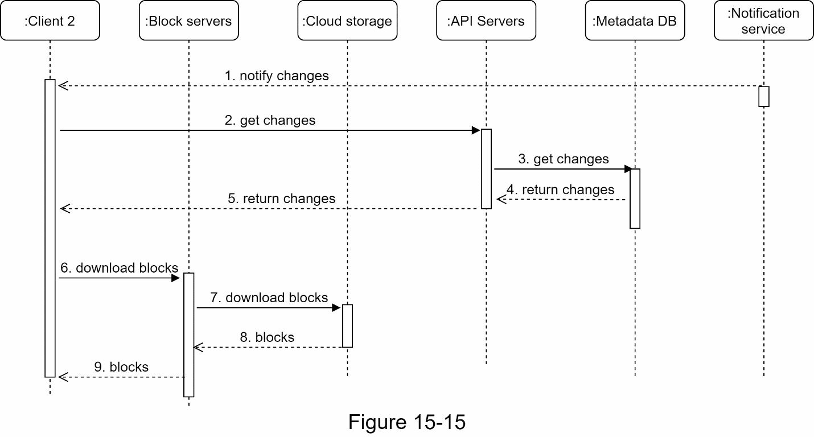

그림은 상세한 흐름을 보여줍니다. 공간 제약으로 가장 중요한 컴포넌트들만 표시되어 있습니다.

1. 알림 서비스가 클라이언트 2에게 파일이 다른 곳에서 변경되었음을 알립니다.
2. 클라이언트 2가 새로운 업데이트가 있음을 알게 되면, 메타데이터를 가져오는 요청을 보냅니다.
3. API 서버가 메타데이터 DB를 호출하여 변경사항의 메타데이터를 가져옵니다.
4. API 서버에 메타데이터가 반환됩니다.
5. 클라이언트 2가 메타데이터를 받습니다.
6. 클라이언트가 메타데이터를 받으면, 블록 서버에 블록을 다운로드하도록 요청합니다.
7. 블록 서버가 먼저 클라우드 저장소에서 블록을 다운로드합니다.
8. 클라우드 저장소가 블록 서버에 블록을 반환합니다.
9. 클라이언트 2가 모든 새 블록을 다운로드하여 파일을 재구성합니다.

### 알림 서비스

파일의 일관성을 유지하려면, 로컬에서 수행된 파일의 모든 변경사항을 다른 클라이언트에게 알려야 충돌을 줄일 수 있습니다. 알림 서비스가 이 목적으로 만들어졌습니다. 고수준에서는, 알림 서비스가 이벤트가 발생할 때 클라이언트로 데이터를 전달할 수 있게 합니다. 다음과 같은 몇 가지 옵션이 있습니다:

- **롱 폴링(Long Polling)**: Dropbox는 롱 폴링을 사용합니다.
- **WebSocket**: WebSocket은 클라이언트와 서버 사이의 지속적인 연결을 제공합니다. 통신은 양방향입니다.

두 옵션 모두 잘 작동하지만, 우리는 다음 두 가지 이유로 롱 폴링을 선택합니다:

- **단방향 통신**: 알림 서비스의 통신은 양방향이 아닙니다. 서버가 파일 변경사항에 대한 정보를 클라이언트로 보내지만, 그 반대는 아닙니다.
- **실시간 양방향 통신의 필요성 부재**: WebSocket은 채팅 앱 같은 실시간 양방향 통신에 적합합니다. Google Drive의 경우 알림이 불규칙적으로 전송되며 데이터 폭증이 없습니다.

롱 폴링을 사용하면, 각 클라이언트는 알림 서비스에 롱 폴 연결을 설정합니다. 파일의 변경사항이 감지되면, 클라이언트는 롱 폴 연결을 종료합니다. 연결을 종료한다는 것은 클라이언트가 메타데이터 서버에 연결하여 최신 변경사항을 다운로드해야 함을 의미합니다. 응답이 수신되거나 연결 타임아웃에 도달한 후, 클라이언트는 즉시 새로운 요청을 보내 연결을 계속 유지합니다.

### 저장 공간 절약

파일 버전 이력을 지원하고 신뢰성을 보장하려면, 같은 파일의 여러 버전을 여러 데이터 센터에 저장합니다. 자주 백업되는 모든 파일 수정본으로 저장 공간이 빠르게 차 버립니다. 저장 비용을 줄이기 위해 세 가지 기술을 제안합니다:

**데이터 중복 제거 (Deduplication)**

계정 수준에서 중복 블록을 제거하는 것은 공간을 절약하는 쉬운 방법입니다. 두 블록이 같은 해시값을 가지면 동일합니다.

**지능형 데이터 백업 전략**

두 가지 최적화 전략을 적용할 수 있습니다:

- **제한 설정**: 저장할 버전의 개수에 제한을 설정할 수 있습니다. 제한에 도달하면 가장 오래된 버전이 새 버전으로 대체됩니다.
- **가치 있는 버전만 유지**: 일부 파일은 자주 편집될 수 있습니다. 예를 들어, 자주 수정되는 문서의 모든 편집 버전을 저장하는 것은 짧은 기간 내에 파일이 1000번 이상 저장될 수 있음을 의미합니다. 불필요한 복사본을 방지하기 위해 저장된 버전의 개수를 제한하고 최근 버전에 더 많은 가중치를 둘 수 있습니다. 최적의 버전 저장 개수를 파악하려면 실험이 도움이 됩니다.

**비활성 데이터를 냉동 저장소로 이동**

냉동 데이터는 몇 개월 또는 몇 년 동안 활성화되지 않은 데이터입니다. Amazon S3 Glacier 같은 냉동 저장소는 S3보다 훨씬 저렴합니다.

### 장애 처리 (Failure Handling)

대규모 시스템에서는 장애가 발생할 수 있으며, 이러한 장애에 대처하기 위한 설계 전략을 채택해야 합니다. 면접관은 다음 시스템 장애들에 대해 어떻게 처리하는지 듣고 싶어 할 것입니다:

**로드 밸런서 장애**

로드 밸런서가 장애나면, 보조(secondary) 로드 밸런서가 활성화되어 트래픽을 처리합니다. 로드 밸런서들은 보통 하트비트(heartbeat)라는 주기적인 신호를 사용하여 서로를 모니터링합니다. 로드 밸런서는 일정 시간 동안 하트비트를 보내지 않으면 장애 상태로 간주됩니다.

**블록 서버 장애**

블록 서버가 장애나면, 다른 서버들이 완료되지 않은 작업이나 보류 중인 작업을 처리합니다.

**클라우드 저장소 장애**

S3 버킷은 다양한 리전에서 여러 번 복제됩니다. 한 리전에서 파일을 사용할 수 없으면, 다른 리전에서 가져올 수 있습니다.

**API 서버 장애**

API 서버는 상태를 가지지 않는 서비스입니다. API 서버가 장애나면, 로드 밸런서가 트래픽을 다른 API 서버로 재지정합니다.

**메타데이터 캐시 장애**

메타데이터 캐시 서버는 여러 번 복제됩니다. 한 노드가 다운되면, 다른 노드에서 데이터를 가져올 수 있습니다. 장애가 발생한 캐시 서버를 대체할 새 캐시 서버를 시작합니다.

**메타데이터 DB 장애**

마스터 다운: 마스터가 다운되면, 슬레이브(복제 서버) 중 하나를 승격시켜 새로운 마스터로 사용하고, 새 슬레이브 노드를 시작합니다.

슬레이브 다운: 슬레이브가 다운되면, 다른 슬레이브를 읽기 작업에 사용하고, 장애가 발생한 슬레이브를 대체할 새 데이터베이스 서버를 시작합니다.

**알림 서비스 장애**

모든 온라인 사용자는 알림 서버와 롱 폴 연결을 유지합니다. 따라서 각 알림 서버는 많은 사용자와 연결됩니다. 2012년의 Dropbox 발표에 따르면, 한 대의 머신당 100만 개 이상의 연결이 열려 있습니다. 서버가 다운되면, 모든 롱 폴 연결이 끊어져 클라이언트는 다른 서버에 재연결해야 합니다. 한 서버가 많은 개방된 연결을 유지할 수 있음에도 불구하고, 끊어진 모든 연결을 한 번에 재연결할 수는 없습니다. 끊어진 모든 클라이언트와의 재연결은 상대적으로 느린 과정입니다.

**오프라인 백업 큐 장애**

큐는 여러 번 복제됩니다. 한 큐가 장애나면, 큐의 소비자들이 백업 큐에 다시 구독해야 할 수 있습니다.

---

## 4단계: 마무리

이 장에서 우리는 Google Drive를 지원하는 시스템 설계를 제안했습니다. 강한 일관성, 낮은 네트워크 대역폭, 빠른 동기화가 우리 설계를 흥미롭게 만듭니다. 우리 설계는 두 가지 흐름으로 구성됩니다: 파일 메타데이터 관리와 파일 동기화입니다. 알림 서비스는 시스템의 또 다른 중요한 컴포넌트입니다. 롱 폴링을 사용하여 클라이언트들을 파일 변경사항으로 최신 상태로 유지합니다.

시스템 설계 인터뷰 문제처럼, 완벽한 해결책은 없습니다. 모든 회사는 고유한 제약이 있으며, 그 제약에 맞는 시스템을 설계해야 합니다. 설계의 트레이드오프와 기술 선택사항을 이해하는 것이 중요합니다. 시간이 조금 남으면 다양한 설계 선택사항에 대해 이야기할 수 있습니다.

예를 들어, 블록 서버를 거치지 않고 클라이언트에서 직접 클라우드 저장소에 파일을 업로드할 수도 있습니다. 이 방법의 장점은 파일이 한 번만 클라우드 저장소로 전송되면 되므로 파일 업로드가 더 빠르다는 것입니다. 우리 설계에서는 파일이 먼저 블록 서버로 전송된 후 클라우드 저장소로 전송됩니다. 하지만 이 새로운 방법에는 몇 가지 단점이 있습니다:

- **첫째**, 같은 청킹, 압축, 암호화 로직을 다양한 플랫폼(iOS, Android, 웹)에 구현해야 합니다. 이는 오류가 발생하기 쉽고 많은 엔지니어링 노력이 필요합니다. 우리 설계에서는 이 모든 로직이 한 곳인 블록 서버에 집중되어 있습니다.
- **둘째**, 클라이언트는 쉽게 해킹되거나 조작될 수 있으므로, 클라이언트 측에 암호화 로직을 구현하는 것은 이상적이지 않습니다.

시스템의 또 다른 흥미로운 진화는 온라인/오프라인 로직을 별도의 서비스로 옮기는 것입니다. 이를 **프레젠스 서비스**(presence service)라고 부르겠습니다. 프레젠스 서비스를 알림 서버에서 분리함으로써, 온라인/오프라인 기능을 다른 서비스들이 쉽게 통합할 수 있게 됩니다.

축하합니다! 여기까지 읽어 주셨습니다. 자신을 칭찬해주세요. 잘하셨습니다!

---

## 핵심 개념 정리

| 용어 | 설명 |
|------|------|
| **블록 서버(Block Server)** | 업로드된 파일을 고정 크기의 블록으로 분할하고 압축·암호화한 뒤 클라우드 저장소에 전송하는 서버. 파일 처리 로직을 클라이언트에서 분리하여 일관성과 보안을 높인다. |
| **청크(Chunk) / 블록(Block)** | 파일을 분할한 고정 크기 조각(예: 최대 4MB). 각 블록은 독립적인 객체로 저장되며, 고유 해시값으로 식별된다. 파일 재구성 시 올바른 순서로 결합된다. |
| **델타 동기화(Delta Sync)** | 파일 수정 시 전체 파일 대신 변경된 블록만 서버로 전송하는 방식. 네트워크 대역폭과 업로드 시간을 대폭 줄여준다. |
| **중복 제거(Deduplication)** | 동일한 해시값을 가진 블록을 하나만 저장하여 중복 데이터를 제거하는 기법. 계정 수준에서 적용하여 저장 공간을 절약한다. |
| **메타데이터 DB(Metadata Database)** | 사용자, 파일, 블록, 버전, 기기 등 실제 파일 내용을 제외한 모든 메타정보를 저장하는 관계형 데이터베이스. 강한 일관성(ACID)을 위해 관계형 DB를 선택한다. |
| **동기화 충돌(Sync Conflict)** | 두 클라이언트가 동시에 같은 파일을 수정할 때 발생하는 충돌. 먼저 처리된 버전이 우선되며, 이후 버전은 충돌 상태로 사용자에게 제시된다. |
| **냉동 저장소(Cold Storage)** | 수개월 이상 접근하지 않는 비활성 데이터를 저렴하게 보관하는 저장 계층. Amazon S3 Glacier가 대표적이며, 핫 스토리지(S3)보다 훨씬 낮은 비용을 제공한다. |
| **롱 폴링(Long Polling)** | 클라이언트가 서버에 연결을 열고 유지하다가 이벤트가 발생하면 응답을 받는 방식. 단방향의 비정기적 알림 전달에 적합하며 Google Drive 알림 서비스에 채택된다. |
| **오프라인 백업 큐(Offline Backup Queue)** | 클라이언트가 오프라인 상태일 때 전달하지 못한 파일 변경 이벤트를 임시 저장하는 큐. 클라이언트가 온라인으로 복귀하면 큐에 쌓인 변경사항을 순서대로 동기화한다. |
| **네임스페이스(Namespace)** | 각 사용자의 루트 디렉토리를 구분하는 논리적 격리 단위. 파일 경로는 네임스페이스와 상대 경로의 조합으로 전역적으로 고유하게 식별된다. |
| **재개 가능한 업로드(Resumable Upload)** | 대용량 파일 업로드 중 네트워크가 끊겨도 중단된 지점부터 재개할 수 있는 업로드 방식. 초기 요청으로 재개 가능한 URL을 발급받고, 이후 청크 단위로 전송한다. |
| **강한 일관성(Strong Consistency)** | 모든 클라이언트가 항상 동일한 최신 데이터를 읽도록 보장하는 일관성 모델. 캐시 무효화와 ACID 트랜잭션을 통해 메타데이터 계층 전반에 적용된다. |

---

## 참고 자료

[1] Google Drive: https://www.google.com/drive/

[2] Upload file data: https://developers.google.com/drive/api/v2/manage-uploads

[3] Amazon S3: https://aws.amazon.com/s3

[4] Differential Synchronization: https://neil.fraser.name/writing/sync/

[5] Differential Synchronization youtube talk: https://www.youtube.com/watch?v=S2Hp_1jqpY8

[6] How We've Scaled Dropbox: https://youtu.be/PE4gwstWhmc

[7] Tridgell, A., & Mackerras, P. (1996). The rsync algorithm.

[8] Librsync. (n.d.). Retrieved April 18, 2015, from https://github.com/librsync/librsync

[9] ACID: https://en.wikipedia.org/wiki/ACID

[10] Dropbox security white paper: https://www.dropbox.com/static/business/resources/Security_Whitepaper.pdf

[11] Amazon S3 Glacier: https://aws.amazon.com/glacier/faqs/
