## 서론

자전거를 타는 법을 배울 때를 떠올려 봅시다. 처음에는 균형을 잡기 위해 발을 땅에 계속 디디고 있다가, 조금씩 속도를 내면서 두 바퀴 위에서 균형을 유지하게 됩니다. 시스템 설계도 이와 비슷합니다. 결론부터 말하면, **수백만 사용자를 지원하는 시스템을 설계하는 것은 작은 시작에서 출발해 지속적으로 개선하고 확장해나가는 여정**입니다.

이 장에서는 단일 사용자를 지원하는 시스템부터 시작해 단계적으로 수백만 사용자를 처리하도록 확장하는 과정을 살펴봅니다. 이를 통해 시스템 설계 면접을 통과하는 데 필수적인 여러 기법들을 습득하게 될 것입니다.

---

## 단일 서버 설정

> 천리 길도 한 걸음부터 시작된다고 했던가요?

복잡한 시스템을 구축하는 첫 번째 단계는 단순함입니다. 하나의 서버에 웹 애플리케이션, 데이터베이스, 캐시 등 모든 것이 함께 실행되는 구조를 생각해 봅시다. 마치 한 사람이 상점의 모든 일을 담당하는 것처럼 말입니다.

이러한 설정을 이해하려면 **요청 흐름(Request Flow)**과 **트래픽 출처(Traffic Source)**를 살펴봐야 합니다.

### 요청 흐름 이해하기

사용자가 웹사이트에 접속할 때 어떤 일들이 벌어질까요?

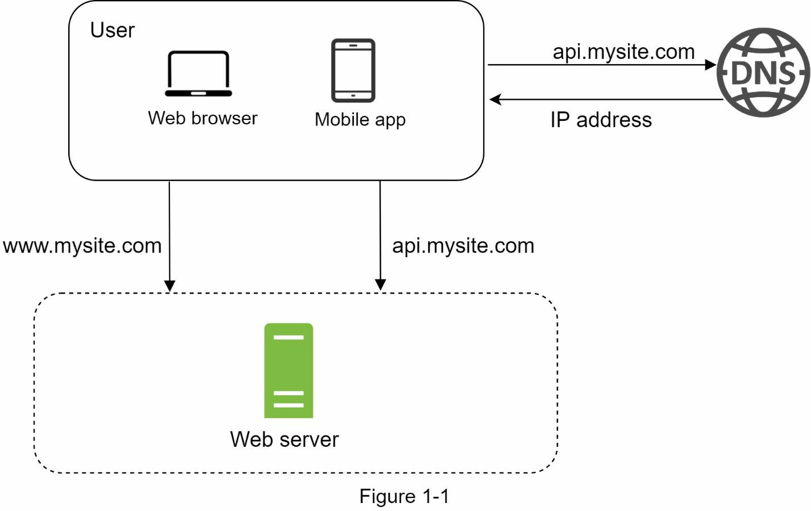

1. **도메인 이름을 통한 접속**: 사용자는 `api.mysite.com`과 같은 도메인 이름으로 웹사이트에 접근합니다. 보통 **도메인 이름 시스템(Domain Name System, DNS)**은 제3자 제공업체에서 유지 관리하며, 우리 서버에서 호스팅하지 않습니다.

2. **IP 주소 반환**: DNS 조회를 통해 브라우저나 모바일 앱에 **인터넷 프로토콜(Internet Protocol, IP) 주소**가 반환됩니다. 예를 들어 `15.125.23.214`와 같은 주소입니다.

3. **HTTP 요청 전송**: IP 주소를 얻으면 **초문본 전송 프로토콜(Hypertext Transfer Protocol, HTTP)** 요청이 웹 서버로 직접 전송됩니다.

4. **응답 반환**: 웹 서버는 렌더링을 위해 HTML 페이지나 JSON 응답을 반환합니다.

### 요청 흐름

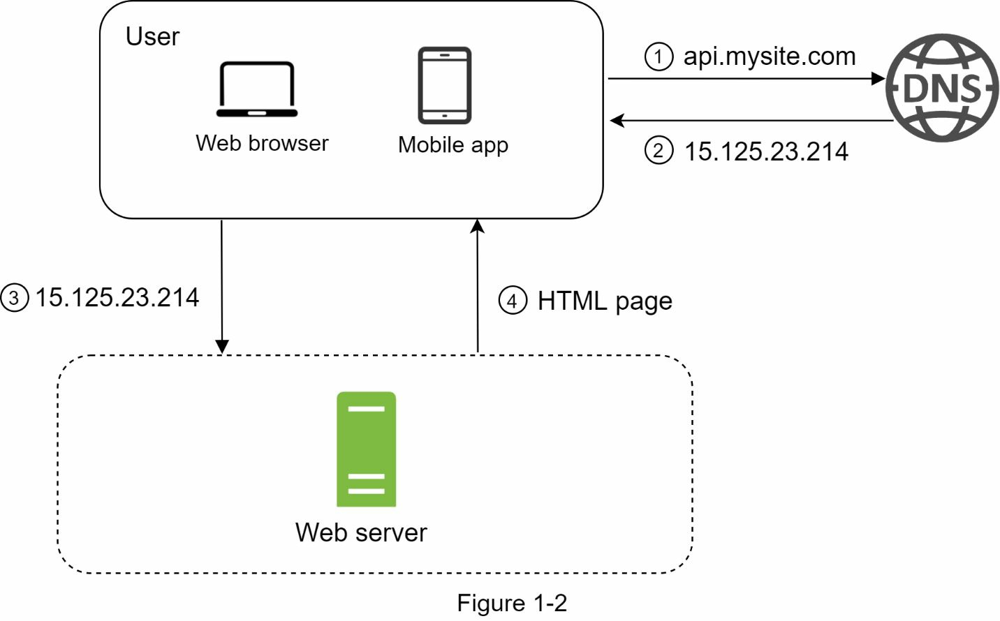

### 트래픽 출처

웹 서버로 유입되는 트래픽은 두 가지 출처에서 나옵니다:

- **웹 트래픽**: 브라우저에서 오는 요청
- **모바일 트래픽**: 모바일 앱에서 오는 요청

이 단계에서 모든 것이 하나의 서버에서 실행되므로, 사용자 수가 증가하면 병목 현상이 생기게 됩니다.

---

## 데이터베이스 분리

사용자 기반이 증가하면서 단일 서버만으로는 충분하지 않습니다. 이제 두 개의 서버로 나누어야 합니다: 하나는 웹과 모바일 트래픽용(웹 계층), 다른 하나는 데이터베이스용(데이터 계층)입니다.

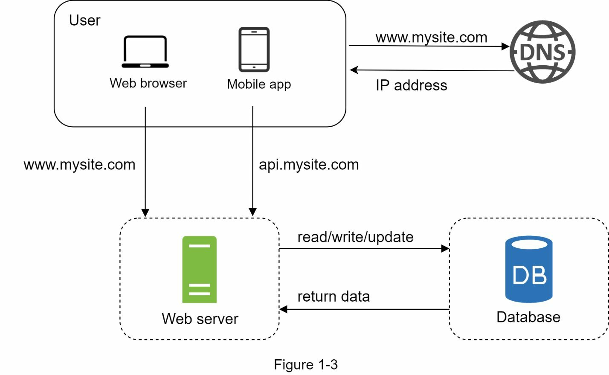

이렇게 **웹 계층(Web Tier)**과 **데이터 계층(Data Tier)**을 분리하면, 각 계층을 독립적으로 확장할 수 있다는 큰 장점이 생깁니다.

### 어떤 데이터베이스를 선택할까?

**전통적 관계형 데이터베이스(Relational Database Management System, RDBMS 또는 SQL 데이터베이스)**와 **비관계형 데이터베이스(Non-relational Database 또는 NoSQL)**는 서로 다른 특성을 가지고 있습니다.

#### 관계형 데이터베이스(RDBMS)
MySQL, Oracle, PostgreSQL 등이 대표적입니다. 관계형 데이터베이스는 다음과 같은 특징이 있습니다:

- **구조화된 데이터**: 테이블의 행과 열로 데이터를 정렬
- **ACID 특성**: 원자성(Atomicity), 일관성(Consistency), 고립성(Isolation), 지속성(Durability)을 보장하여 데이터 무결성을 유지
- **JOIN 연산**: 여러 테이블의 데이터를 효율적으로 결합

#### 비관계형 데이터베이스(NoSQL)
MongoDB, DynamoDB, Cassandra 등이 있으며, 다음과 같은 특징을 가집니다:

- **유연한 스키마**: 미리 정의된 스키마 없이 다양한 형태의 데이터 저장 가능
- **수평 확장성**: 대규모 데이터 처리에 용이
- **빠른 읽기/쓰기**: 특정 사용 사례에서 높은 성능 제공

일반적으로 대부분의 애플리케이션은 관계형 데이터베이스로 시작합니다.

---

## 수직 확장 vs 수평 확장

> 작은 모델은 정말 기능이 부족할까요?

시스템 성능을 높이는 방법은 크게 두 가지로 나뉩니다.

### 수직 확장(Vertical Scaling, Scale Up)

**수직 확장**은 서버에 **더 많은 처리 능력(CPU, RAM 등)을 추가**하는 방식입니다. 

**장점:**
- 단순성이 뛰어남
- 구현이 직관적

**단점:**
- **하드 한계**: 단일 서버에 무제한으로 CPU와 메모리를 추가할 수 없음
- **장애 조치 없음**: 서버가 다운되면 전체 시스템이 중단됨
- **비용 효율성 저하**: 고사양 서버는 기하급수적으로 비싸짐

트래픽이 낮을 때는 수직 확장이 좋은 선택이지만, 시스템이 성장하면 이 방식의 한계에 빠르게 도달합니다.

### 수평 확장(Horizontal Scaling, Scale Out)

**수평 확장**은 **더 많은 서버를 리소스 풀에 추가**하는 방식입니다.

**장점:**
- **무제한 확장성**: 필요에 따라 계속 서버를 추가 가능
- **장애 조치 가능**: 한 서버가 다운되어도 다른 서버들이 요청 처리
- **비용 효율성**: 일반적인 사양의 서버 여러 개가 고사양 서버보다 저렴

**단점:**
- 복잡성 증가
- 네트워크 통신 오버헤드
- 분산 시스템의 문제들(불일치성, 동기화 등)

웹 서비스 확장에는 수평 확장이 더 적합합니다.

---

## 로드 밸런서

> 여러 웹 서버가 있으면, 사용자의 요청을 어떻게 분배할까요?

**로드 밸런서(Load Balancer)**는 수평 확장의 핵심입니다. 마치 음식점의 매니저가 손님들을 각 직원에게 균등하게 배분하는 것처럼, 로드 밸런서는 **들어오는 트래픽을 웹 서버들에 고르게 분배**합니다.

### 작동 원리

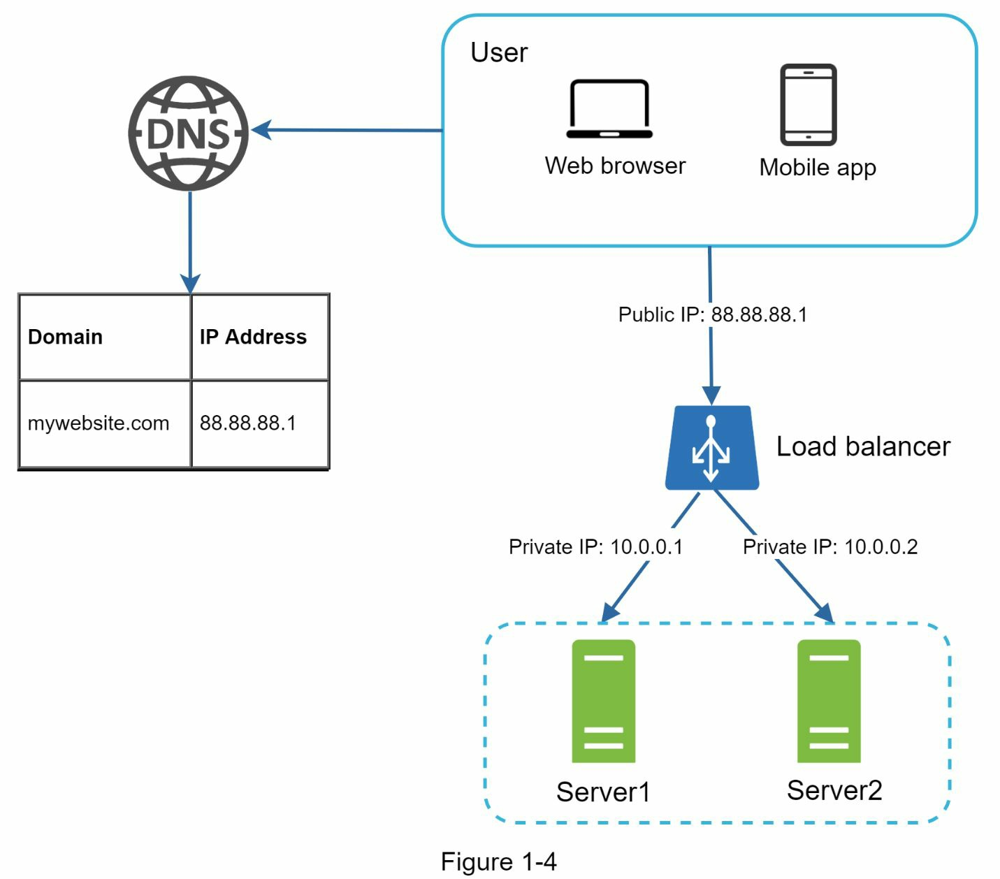

1. 사용자들이 로드 밸런서의 **공개 IP(Public IP)**에 직접 연결됩니다
2. 이제 웹 서버들은 클라이언트로부터 직접 접근할 수 없어져 **보안성이 향상**됩니다
3. 로드 밸런서는 웹 서버들과 **사설 IP(Private IP)**를 통해 통신합니다
   - 사설 IP는 같은 네트워크 내에서만 접근 가능하며 인터넷을 통해서는 접근 불가능

### 로드 밸런싱 전략

- **라운드 로빈(Round Robin)**: 각 서버를 순서대로 선택
- **가중 라운드 로빈(Weighted Round Robin)**: 서버 용량에 따라 다른 비율로 할당
- **최소 연결(Least Connections)**: 현재 연결 수가 가장 적은 서버 선택
- **IP 해시(IP Hash)**: 클라이언트 IP를 기반으로 서버 결정 (세션 유지에 유용)

로드 밸런서 자체도 **단일 실패 지점(Single Point of Failure, SPOF)**이 될 수 있으므로, 보통 여러 개의 로드 밸런서를 이용합니다.

---

## 데이터베이스 복제

> 만약 데이터베이스가 다운되면?

단일 데이터베이스는 장애 조치나 중복성을 지원하지 않습니다. 이 문제를 해결하기 위해 **데이터베이스 복제(Database Replication)**를 사용합니다.

### 마스터-슬레이브 구조

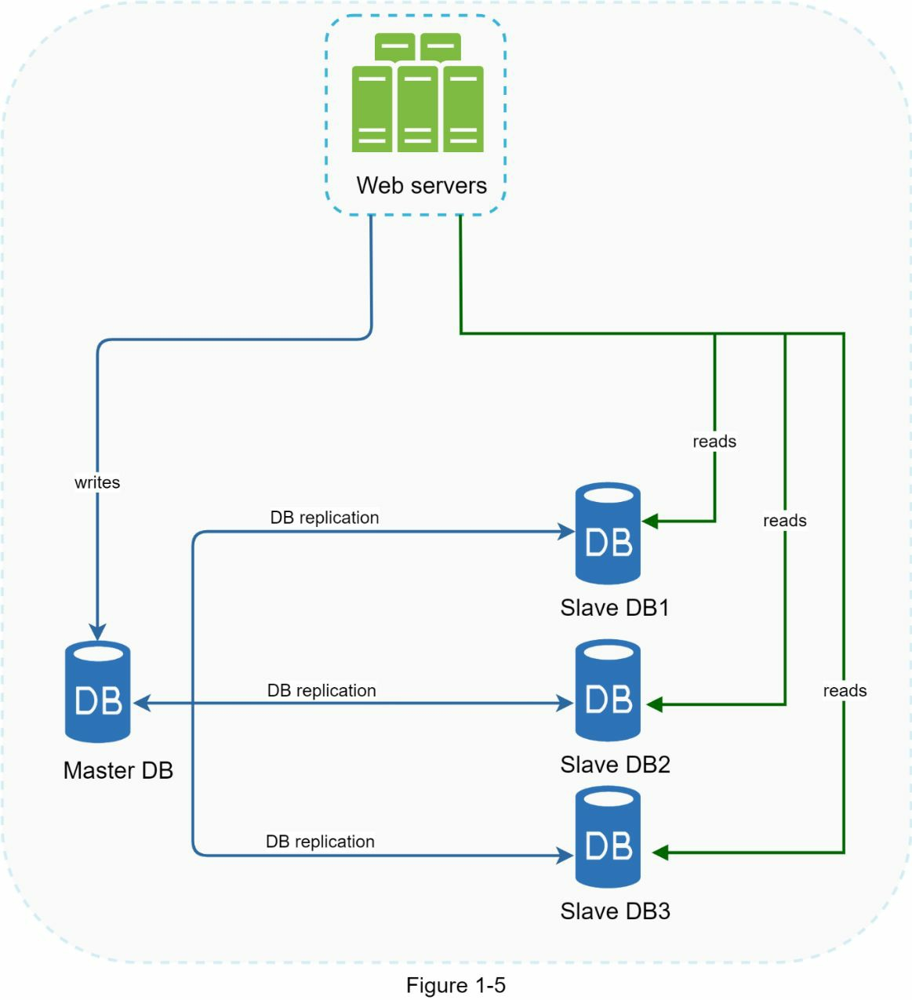

**데이터베이스 복제**는 보통 **마스터(Master)/슬레이브(Slave)** 관계로 구성됩니다:

- **마스터 데이터베이스**: 일반적으로 **쓰기 작업(Write Operation)**만 지원
- **슬레이브 데이터베이스**: 마스터에서 데이터 복사본을 받아서 **읽기 작업(Read Operation)**만 지원

### 왜 이렇게 구성할까?

대부분의 애플리케이션에서 읽기 작업의 비율이 쓰기 작업보다 훨씬 높습니다. 따라서 **슬레이브 데이터베이스의 수는 보통 마스터보다 많습니다**. 이렇게 하면:

- 마스터는 쓰기 작업에 집중
- 슬레이브들이 읽기 부하를 분산
- 전체 시스템의 처리량 증가

### 복제의 장점

1. **향상된 성능**: 마스터는 쓰기, 슬레이브는 읽기를 처리하므로 효율성 증대
2. **신뢰성**: 데이터가 여러 데이터베이스에 복사되므로 데이터 손실 위험 감소
3. **고가용성**: 한 데이터베이스가 오프라인이 되어도 다른 데이터베이스의 데이터에 접근 가능

### 장애 시나리오

만약 하나의 슬레이브가 다운되면:

- 읽기 작업이 다른 슬레이브나 마스터로 일시적으로 라우팅됨
- 문제가 발견되면 새로운 슬레이브가 오래된 것을 대체
- 여러 슬레이브가 있으면 상황이 더 나아짐

만약 마스터가 다운되면:

- 가장 최신 슬레이브가 새로운 마스터로 승격
- 다른 슬레이브들은 새 마스터를 바라보도록 재설정

### 웹 계층과 데이터 계층 통합 설계

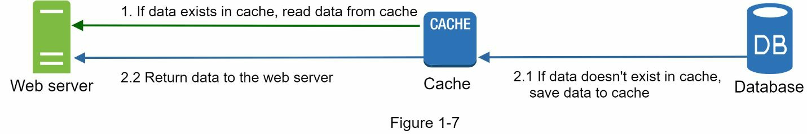

---

## 캐시 계층

> 같은 데이터베이스 질의를 계속 반복한다면?

새로운 웹 페이지가 로드될 때마다 하나 이상의 데이터베이스 호출이 실행됩니다. 이렇게 데이터베이스를 반복적으로 호출하면 애플리케이션 성능이 크게 저하됩니다. **캐시(Cache)**는 이 문제를 완벽하게 해결합니다.

### 캐시란?

**캐시**는 **자주 접근하는 데이터나 비용이 많이 드는 계산 결과를 메모리에 임시 저장**하여, 다음 요청이 더 빠르게 처리되도록 하는 저장 공간입니다. 마치 주방용품을 손이 닿기 쉬운 곳에 배치해두는 요리사처럼, 데이터베이스 쿼리 결과를 캐시에 저장해두면 응답 속도가 비약적으로 향상됩니다.

### 캐시 계층의 이점

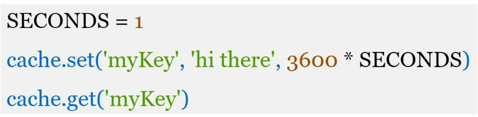

- **시스템 성능 향상**: 데이터베이스 접근보다 캐시 접근이 훨씬 빠름
- **리소스 효율성**: 데이터베이스 부하 감소
- **데이터베이스 확장성 개선**: 캐시가 많은 읽기 요청을 흡수

### 캐시 사용 패턴

#### 1. 캐시-어사이드(Cache-Aside)
- 애플리케이션이 먼저 캐시를 확인
- 캐시 미스 시 데이터베이스에서 데이터를 가져온 후 캐시에 저장
- 가장 일반적인 패턴

#### 2. 라이트-스루(Write-Through)
- 데이터를 쓸 때 캐시와 데이터베이스 모두에 저장
- 데이터 일관성 보장하지만 쓰기 지연 증가

#### 3. 라이트-비하인드(Write-Behind)
- 데이터를 캐시에만 쓰고, 나중에 데이터베이스에 쓰기
- 성능은 좋지만 데이터 손실 위험 존재

### 캐시 구현 시 고려사항

**메모리 관리**: 캐시는 제한된 자원이므로, 만료된 데이터를 주기적으로 제거해야 합니다.

- **TTL(Time To Live)**: 데이터가 캐시에 유지되는 시간 설정
- **제거 정책(Eviction Policy)**: 메모리가 부족할 때 어떤 데이터를 제거할지 결정
  - **LRU(Least Recently Used)**: 가장 최근에 사용되지 않은 데이터 제거
  - **LFU(Least Frequently Used)**: 가장 적게 사용된 데이터 제거
  - **FIFO(First In First Out)**: 가장 먼저 들어온 데이터 제거

**캐시와 데이터베이스의 동기화**: 데이터베이스가 직접 업데이트되면 캐시와 불일치가 생길 수 있습니다. 이 문제는 대규모 시스템에서는 특히 복잡하며, Facebook의 "Scaling Memcache at Facebook" 논문에서 자세히 다루어졌습니다.

**장애 대응**: 단일 캐시 서버는 **단일 실패 지점(Single Point of Failure, SPOF)**이 될 수 있습니다. 이를 해결하려면:

- 여러 데이터센터에 캐시 서버 배치
- 필요한 메모리보다 일정 비율 많은 메모리를 미리 확보(오버프로비저닝)
- 여러 캐시 서버를 클러스터로 구성하여 중복성 확보

### 캐시 저장소

Memcached와 Redis가 가장 인기 있는 캐시 솔루션입니다:

- **Memcached**: 간단하고 빠른 메모리 캐시
- **Redis**: Memcached의 기능에 더해 데이터 구조와 지속성 지원

---

## 콘텐츠 전송 네트워크 (CDN)

> 사진이나 동영상 파일을 전 세계 사용자에게 빠르게 전달하려면?

**콘텐츠 전송 네트워크(Content Delivery Network, CDN)**는 **지리적으로 분산된 서버 네트워크로 정적 콘텐츠를 배송**합니다. 이미지, 동영상, CSS, JavaScript 파일 등의 **정적 콘텐츠(Static Content)**를 CDN 서버에 캐시합니다.

### CDN의 작동 원리

사용자가 이미지에 접근할 때:

1. 사용자 A가 이미지를 요청
2. CDN이 해당 지역의 가장 가까운 서버에서 이미지 제공
3. 이미지가 CDN에 캐시되고 사용자 A에게 반환
4. 이미지는 TTL이 만료될 때까지 CDN에 유지
5. 사용자 B가 같은 이미지를 요청하면, TTL이 아직 유효하면 캐시에서 즉시 반환

### CDN 흐름

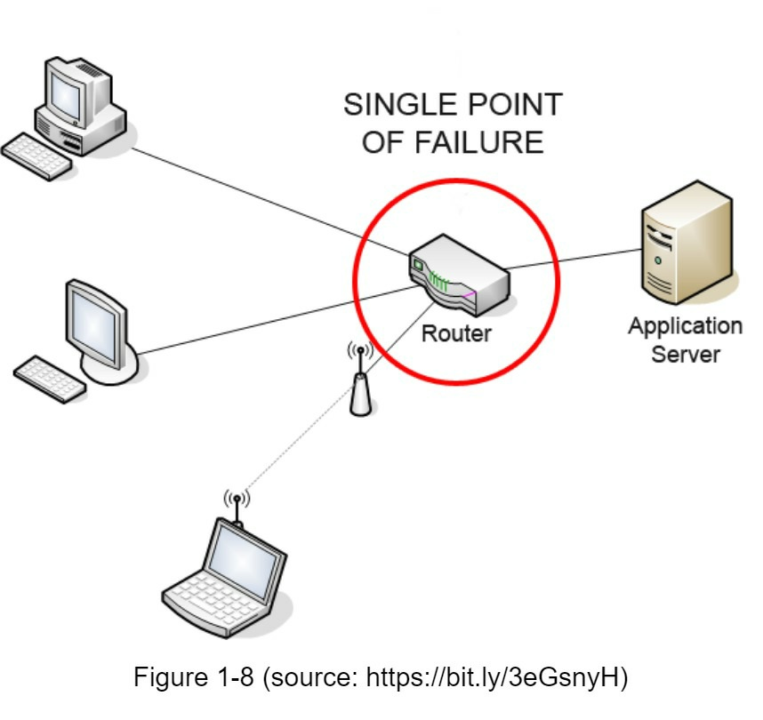

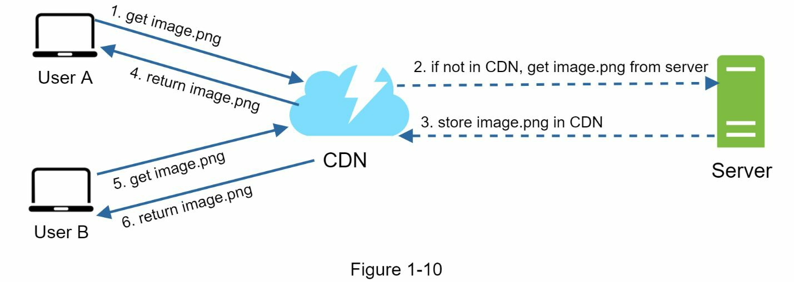

### CDN 사용 시 고려사항

**비용**: CDN은 제3자 서비스이므로, 데이터 입출금에 따라 요금이 부과됩니다.
- 자주 사용하지 않는 콘텐츠를 CDN에서 제거하여 비용 최적화
- 접근 빈도를 기반으로 CDN 사용 여부 결정

**캐시 만료 시간 설정**: 시간에 민감한 콘텐츠는 적절한 TTL 설정이 중요합니다.
- 자주 업데이트되는 파일: 짧은 TTL
- 거의 변경되지 않는 파일: 긴 TTL

**장애 처리**: CDN이 다운되면 원본 서버(Origin Server)로 폴백

### 캐시 및 CDN 추가 후 설계

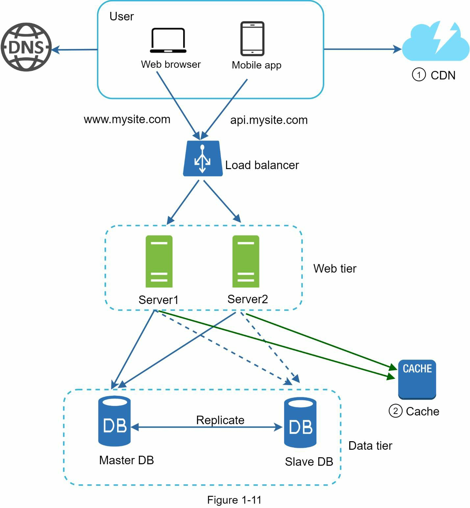

---

## 상태 비저장 웹 계층

> 웹 서버 여러 개가 있을 때, 사용자의 세션 정보는 어디에 저장할까요?

이제 웹 계층을 수평으로 확장할 때가 되었습니다. 이를 위해서는 **상태(State, 예를 들어 사용자 세션 데이터)를 웹 계층 밖으로 꺼내야** 합니다. 

### 상태 저장 서버 vs 상태 비저장 서버

**상태 저장 서버(Stateful Server)**

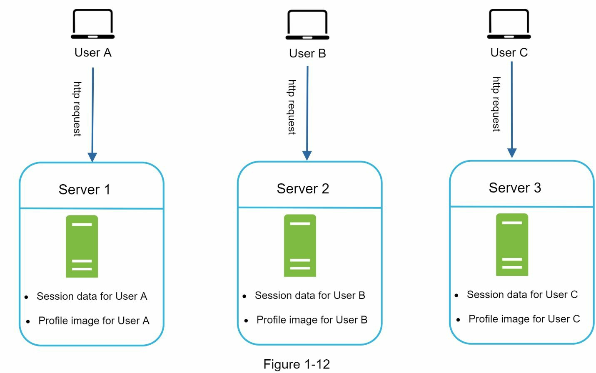

- 한 요청에서 다음 요청으로 **클라이언트 데이터(상태)를 기억**
- 클라이언트가 항상 같은 서버에 연결되어야 함 (세션 친화성 필요)
- 서버 추가/제거가 어려움
- 예: 같은 사용자의 요청이 항상 서버 A로 가야 하는 경우

**상태 비저장 서버(Stateless Server)**

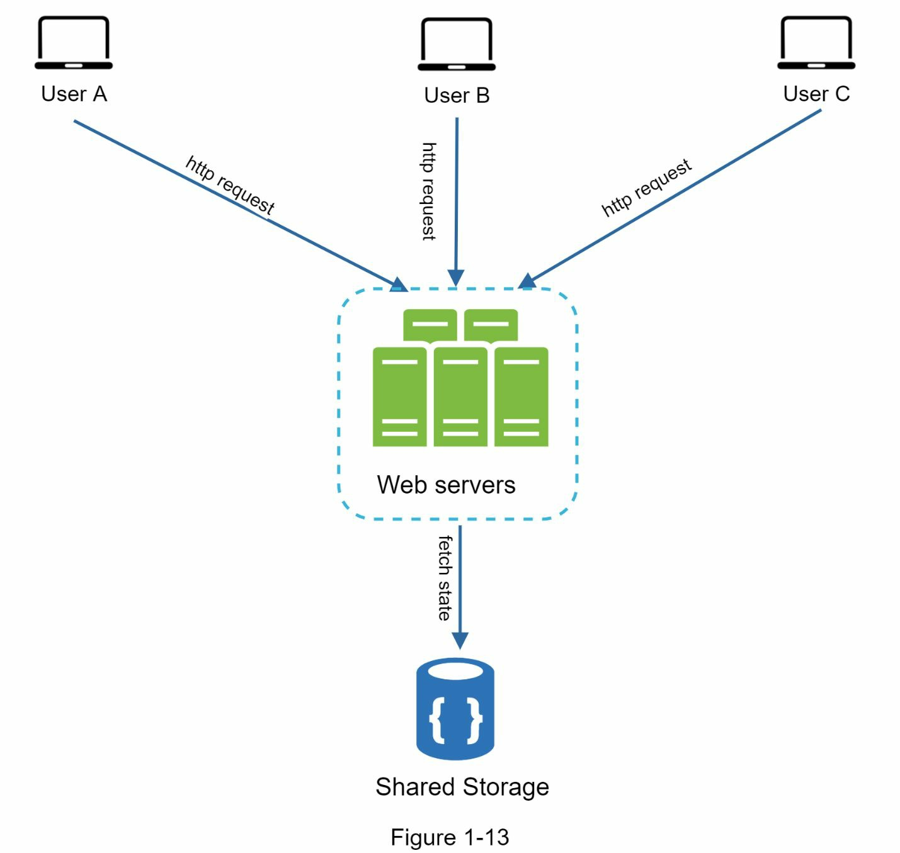

- 클라이언트 상태 정보를 **보관하지 않음**
- 어떤 서버로든 요청을 라우팅 가능
- 확장성과 유연성이 뛰어남
- 예: 웹 서버가 데이터베이스에서 필요한 정보를 매번 조회

### 상태 비저장 아키텍처의 이점

마치 은행의 여러 직원이 고객 정보를 중앙 데이터베이스에서 조회하여 서비스하는 것처럼, **상태 비저장 아키텍처**에서는:

1. 사용자 세션 데이터를 **관계형 데이터베이스나 NoSQL 데이터베이스 같은 영구 저장소**에 저장
2. 클러스터의 각 웹 서버가 데이터베이스에서 상태 데이터에 접근
3. 어떤 웹 서버로든 요청을 라우팅 가능

### 상태 비저장 웹 계층이 적용된 설계

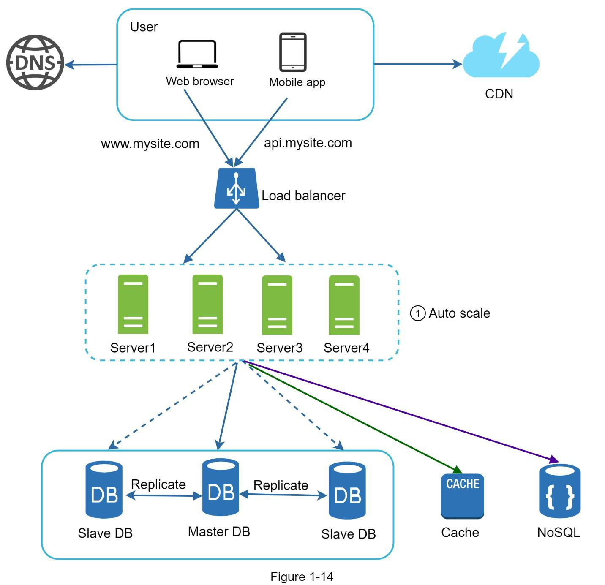

이러한 구조는 **자동 장애 조치(Automatic Failover)**를 가능하게 합니다. 한 웹 서버가 다운되어도 다른 서버가 같은 사용자 정보에 접근할 수 있기 때문입니다.

---

## 데이터 센터 확장

> 한 지역의 데이터센터가 다운되면 어떻게 할까요?

지금까지 우리는 단일 데이터센터 내에서의 확장을 살펴봤습니다. 이제 **다중 데이터센터(Multi-datacenter)** 설정으로 나아갑니다.

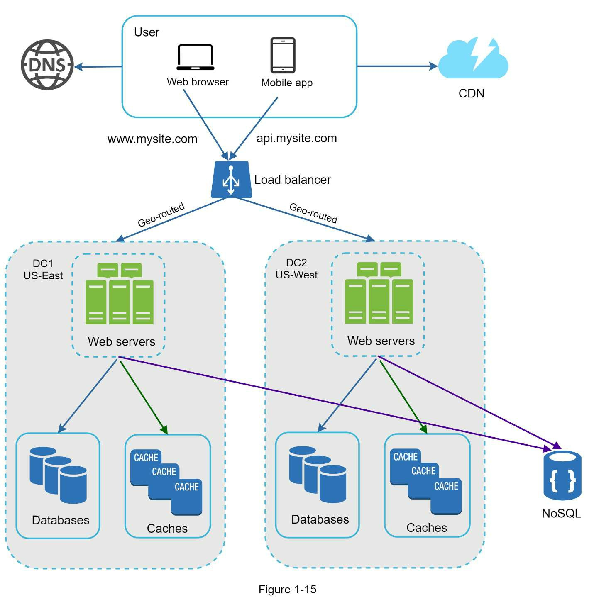

### 지리적 분산의 이점

1. **재해 복구(Disaster Recovery)**: 한 데이터센터가 다운되어도 다른 데이터센터에서 서비스 지속
2. **낮은 지연 시간(Low Latency)**: 사용자와 가까운 데이터센터에서 서비스 제공
3. **높은 가용성**: 여러 데이터센터가 서로 백업 역할

### 다중 데이터센터 아키텍처 고려사항

**트래픽 라우팅**: GeoDNS를 사용하여 사용자의 지리적 위치에 따라 가장 가까운 데이터센터로 라우팅

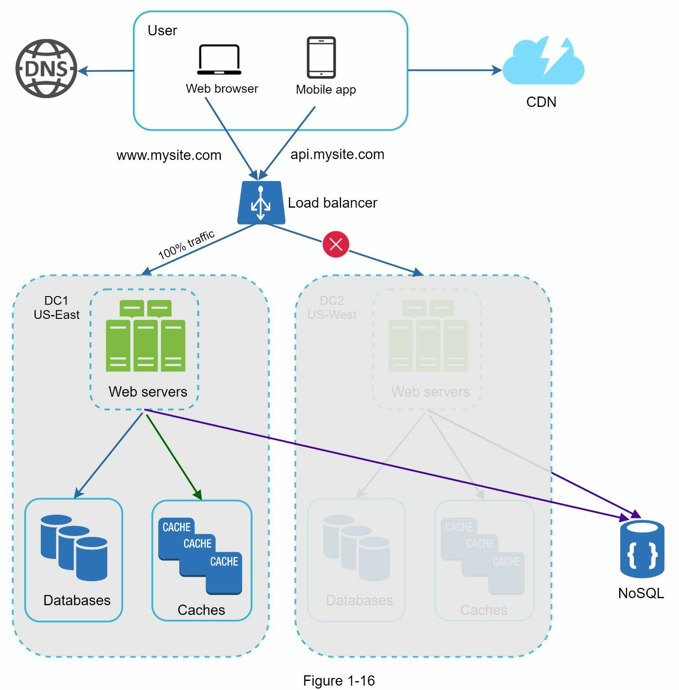

**데이터 동기화**: 여러 데이터센터 간 데이터를 동기화하는 것은 복잡합니다.
- 마스터-마스터 복제: 여러 데이터센터가 동시에 쓰기 가능 (충돌 해결이 복잡)
- 마스터-슬레이브 복제: 한 데이터센터는 마스터, 나머지는 슬레이브

**세션 관리**: 사용자가 한 데이터센터에서 다른 데이터센터로 이동할 때 세션 유지

---

## 메시지 큐를 통한 비동기 처리

> 이메일 발송이나 이미지 처리처럼 시간이 오래 걸리는 작업을 어떻게 처리할까요?

**메시지 큐(Message Queue)**는 시스템의 비동기 처리를 가능하게 합니다.

### 메시지 큐의 개념

메시지 큐는 **생산자(Producer)가 메시지를 큐에 보내고, 소비자(Consumer)가 큐에서 메시지를 가져가서 처리**하는 구조입니다. 마치 음식점의 주방에서 주문을 큐에 모아뒀다가, 요리사들이 순서대로 처리하는 것과 같습니다.

### 메시지 큐 아키텍처

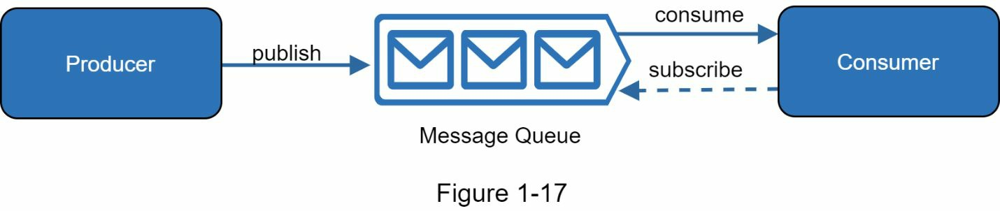

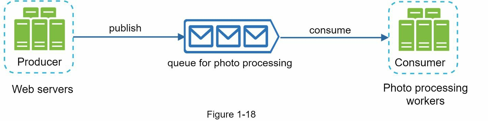

### 장점

1. **응답성 향상**: 웹 서버가 긴 작업을 기다리지 않고 즉시 응답 가능
2. **확장성**: 소비자를 추가하여 처리 능력 확장
3. **복원력**: 생산자와 소비자가 느슨하게 결합되어 있어 한쪽이 다운되어도 영향 최소화

### 인기 있는 메시지 큐

- **RabbitMQ**: 신뢰성 높음
- **Apache Kafka**: 대규모 데이터 스트리밍 처리
- **Amazon SQS**: 클라우드 기반 관리형 서비스

### 메시지 큐가 추가된 설계

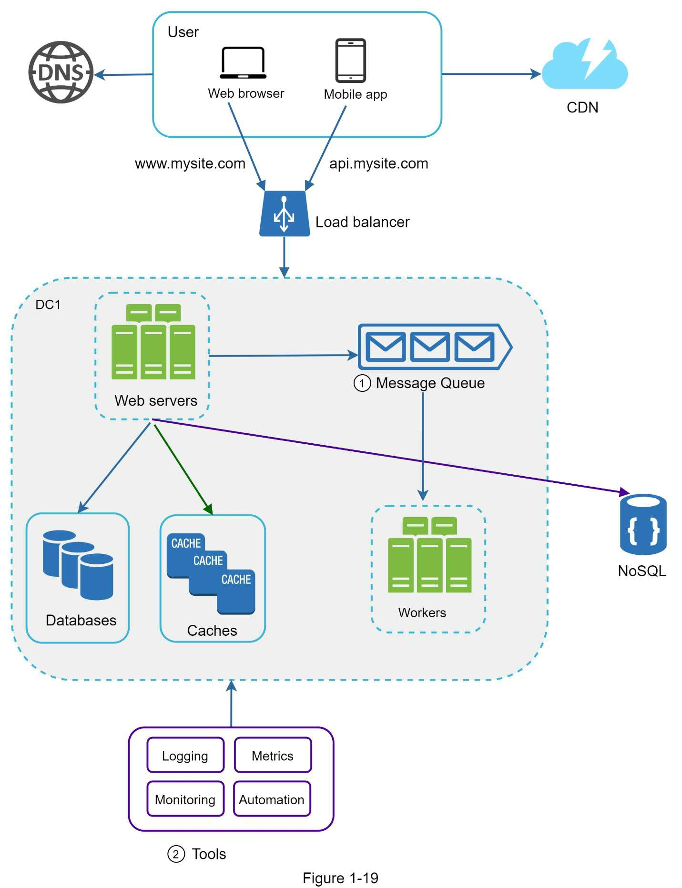

---

## 데이터베이스 확장

### 샤딩(Sharding)

> 데이터베이스가 너무 커져서 한 서버에 맞지 않으면?

**샤딩(Sharding)**은 **대규모 데이터를 여러 데이터베이스에 분산**하는 기술입니다. 마치 대형 백과사전을 여러 개의 작은 책으로 나누는 것처럼, 데이터를 여러 데이터베이스 서버에 나누어 저장합니다.

### 샤딩 키 선택

어떤 기준으로 데이터를 나눌지 결정해야 합니다:

- **사용자 ID 기반 샤딩**: 사용자 ID를 해시하여 어느 데이터베이스에 저장할지 결정
- **지역 기반 샤딩**: 사용자가 있는 지역에 따라 분산
- **시간 기반 샤딩**: 데이터가 생성된 시간에 따라 분산

### 샤딩된 데이터베이스 예제

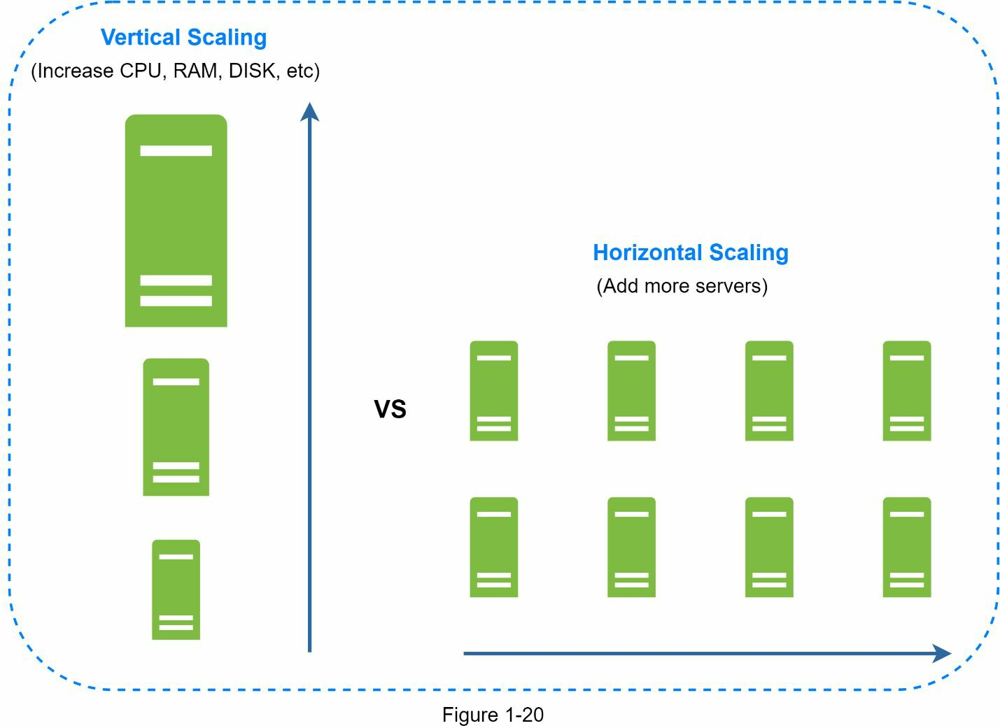

### 샤딩 키 예시

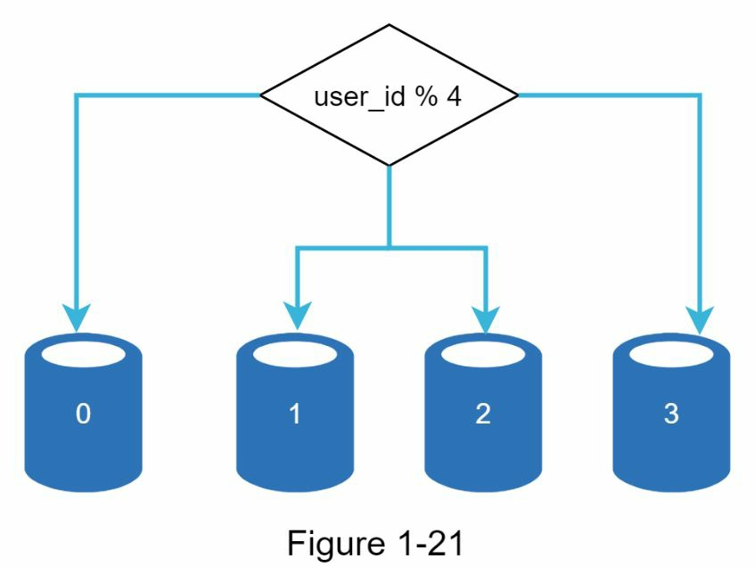

### 샤딩의 과제

**데이터 분산의 불균형**: 샤딩 키가 잘못 선택되면 어떤 샤드에 데이터가 몰릴 수 있습니다 (핫스팟 문제).

**크로스 샤드 쿼리**: 여러 샤드에 걸친 데이터를 조회할 때 복잡도 증가

**샤드 재조정**: 새 샤드를 추가할 때 기존 데이터를 마이그레이션해야 함

---

## 로깅, 메트릭, 모니터링

> 시스템이 잘 작동하고 있는지 어떻게 알 수 있을까요?

대규모 시스템을 운영하려면 **시스템의 상태를 지속적으로 모니터링**해야 합니다.

### 로깅(Logging)

중요한 이벤트를 기록하여 문제 추적에 사용합니다:

- 에러 로그
- 접근 로그
- 시스템 로그

로그는 중앙 로그 저장소(예: ELK Stack - Elasticsearch, Logstash, Kibana)에 모아집니다.

### 메트릭(Metrics)

시스템의 성능 지표를 수집합니다:

- **CPU 사용률**: 서버의 부하 정도
- **메모리 사용률**: 메모리 부족 여부
- **디스크 I/O**: 디스크 읽기/쓰기 성능
- **데이터베이스 연결 수**: 데이터베이스 병목 여부
- **응답 시간(Latency)**: 사용자 경험
- **처리량(Throughput)**: 시스템이 처리하는 요청 수

### 모니터링(Monitoring)

메트릭을 실시간으로 추적하고 알람을 설정합니다:

- **임계값 기반 알람**: CPU가 80%를 넘으면 알림
- **비정상 패턴 감지**: 평소와 다른 행동 감지
- **자동 복구**: 문제 발생 시 자동으로 서버 재시작 등의 조치

---

## 데이터베이스 스케일링 심화

### Master-Slave 복제의 한계

읽기 요청이 많아지면 슬레이브를 계속 추가할 수 있지만, 모든 쓰기는 여전히 마스터를 거쳐야 합니다. 마스터가 쓰기 작업에 포화되면 이를 더 이상 확장할 수 없습니다.

### 해결책

1. **마스터 복제(Master Replication)**: 여러 마스터를 운영
2. **샤딩**: 데이터를 여러 마스터에 분산

---

## 최종 시스템 설계

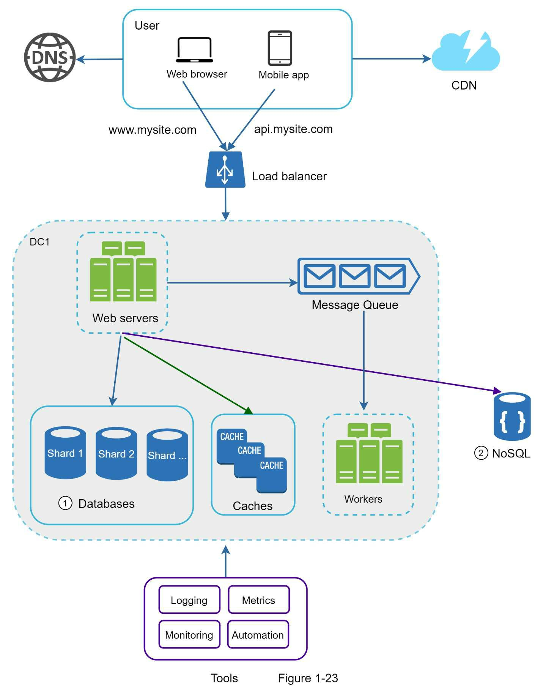

---

## 정리: 단계별 확장 여정

지금까지 살펴본 여러 기법들을 정리하면:

1. **단일 서버**: 가장 간단한 시작
2. **웹/데이터 계층 분리**: 각 계층을 독립적으로 확장
3. **로드 밸런싱**: 여러 웹 서버로의 요청 분배
4. **데이터베이스 복제**: 읽기 부하 분산
5. **캐시 계층**: 응답 시간 단축
6. **CDN**: 정적 콘텐츠 지리적 분산
7. **상태 비저장 웹 계층**: 웹 서버 확장성 향상
8. **데이터 센터 분산**: 지역별 고가용성
9. **메시지 큐**: 비동기 처리로 응답성 향상
10. **로그, 메트릭, 모니터링**: 시스템 상태 추적
11. **샤딩**: 데이터 수평 확장

이 여정은 자전거를 타는 법을 배우는 과정과 같습니다. 처음에는 한 발씩 조심스럽게 나아가지만, 시간이 지날수록 더 빠르고 복잡한 기술들을 습득하게 되는 것입니다.

---

## 핵심 개념 정리

**마스터-슬레이브 복제(Master-Slave Replication)**: 모든 쓰기는 마스터에서, 읽기는 슬레이브에서 처리하는 구조

**로드 밸런싱(Load Balancing)**: 들어오는 요청을 여러 서버에 균등하게 분배

**수평 확장(Horizontal Scaling)**: 더 많은 서버를 추가하여 확장

**수직 확장(Vertical Scaling)**: 기존 서버의 성능을 높여 확장

**캐시(Cache)**: 자주 접근하는 데이터를 메모리에 임시 저장

**CDN(Content Delivery Network)**: 정적 콘텐츠를 지리적으로 분산된 서버에서 배송

**메시지 큐(Message Queue)**: 비동기 작업 처리를 위한 대기열

**샤딩(Sharding)**: 데이터베이스를 여러 부분으로 분할하여 저장

**DNS(Domain Name System)**: 도메인 이름을 IP 주소로 변환하는 시스템

**TTL(Time To Live)**: 캐시나 DNS 레코드가 유효한 시간

이 장에서 배운 기법들은 시스템이 성장함에 따라 필요한 순서대로 적용해야 합니다. 한 기법이 모든 상황에 맞는 것은 아니며, 각 단계에서 시스템의 병목을 파악하고 가장 효과적인 해결책을 선택하는 것이 중요합니다.
