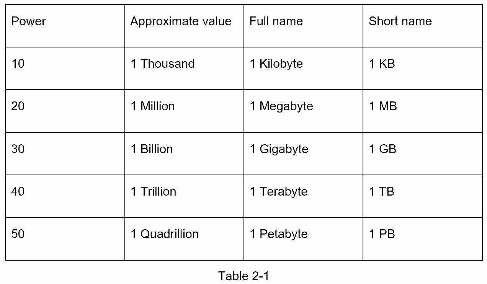
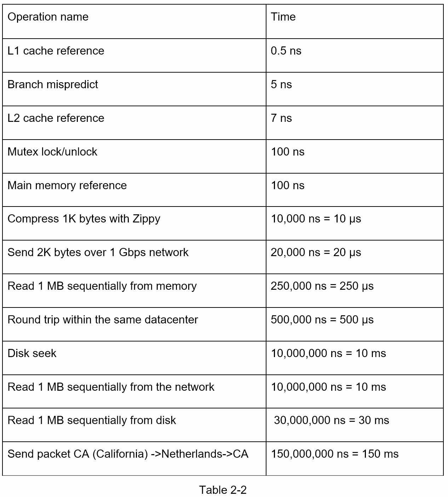
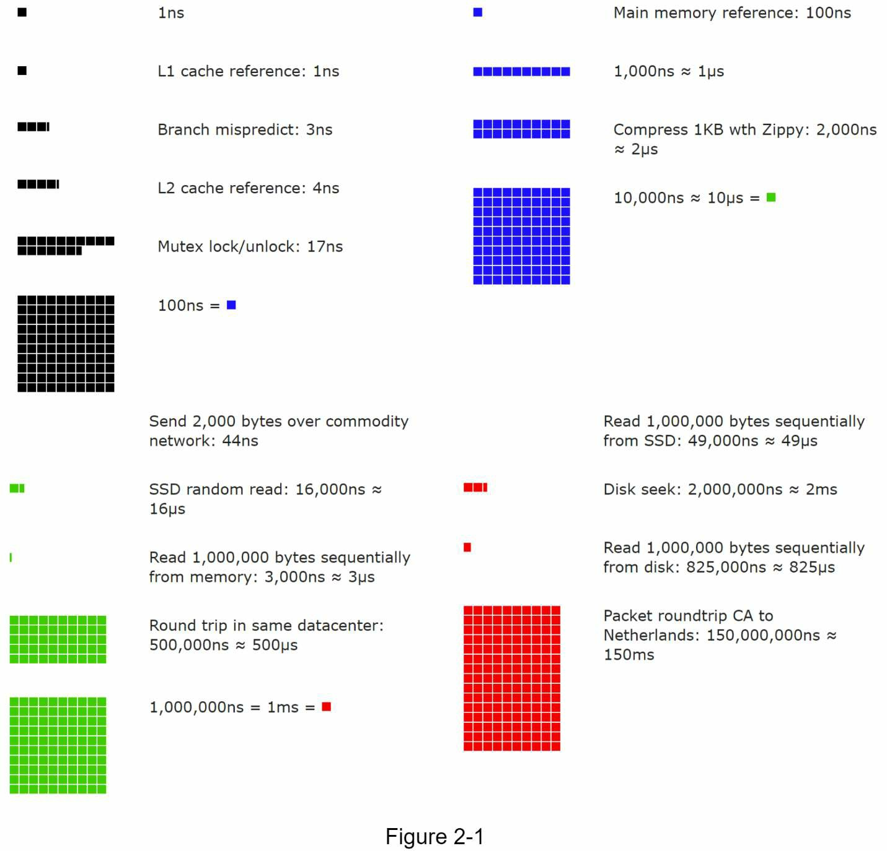
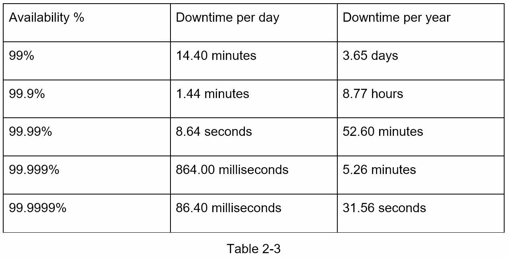

## 서론

면접관이 갑자기 물어봅니다: "만약 [[14장 YouTube 설계|YouTube]] 같은 서비스를 만든다면, 한 달에 필요한 저장 공간이 얼마나 될까요?" 이런 질문에 대답하려면 어떻게 해야 할까요? 결론부터 말하면, **대략적 추정이란 생각 실험과 일반적인 성능 수치를 결합하여 시스템 설계가 요구사항을 충족하는지 빠르게 판단하는 기법**입니다.

Google의 선임 연구원 Jeff Dean에 따르면, "대략적 계산은 생각 실험과 공통 성능 수치를 조합하여 어떤 설계가 요구사항을 충족할 수 있을지에 대한 좋은 감각을 얻을 수 있게 해주는 추정입니다."

시스템 설계 면접에서 대략적 추정을 효과적으로 수행하려면 다음과 같은 기초 개념들을 이해해야 합니다:

- **2의 거듭제곱(Power of Two)**
- **프로그래머가 알아야 할 지연 시간 수치**
- **가용성 수치**

---

## 2의 거듭제곱

분산 시스템을 다룰 때 데이터 량은 엄청날 수 있습니다. 하지만 모든 계산은 기초로 귀결됩니다. 정확한 계산을 위해서는 **2의 거듭제곱을 사용한 데이터 단위**를 알아야 합니다.

- **1바이트(Byte)**: 8비트의 시퀀스
- **1문자**: ASCII 문자 1개는 1바이트(8비트)의 메모리 사용

### 데이터 단위 표



### 실제 계산 예제

예를 들어 100만 사용자가 있는 시스템에서 각 사용자당 1MB의 데이터를 저장한다면:

```
필요 저장 공간 = 100만 × 1MB 
             = 10^6 × 10^6 B
             = 10^12 B
             = 1 TB (1 Terabyte)
```

이렇게 2의 거듭제곱을 이해하면 빠르게 대규모 수치를 계산할 수 있습니다.

---

## 프로그래머가 알아야 할 지연 시간 수치

Google의 Jeff Dean은 2010년에 전형적인 컴퓨터 작업의 처리 시간을 공개했습니다. 컴퓨터가 더 빨라지면서 일부 수치는 구식이 되었지만, 여전히 다양한 컴퓨터 작업의 상대적 빠르기와 느림을 이해하는 데 도움이 됩니다.

### 용어 정의

- **ns (나노초)**: 10^-9초
- **µs (마이크로초)**: 10^-6초  
- **ms (밀리초)**: 10^-3초

### 지연 시간 수치 표



### 시각화: 지연 시간 비교

Google의 소프트웨어 엔지니어가 Dr. Dean의 수치들을 시각화하는 도구를 만들었습니다. 이 도구는 시간 경과에 따른 변화도 고려합니다. 아래 Figure 2-1은 2020년 기준의 지연 시간을 시각화한 것입니다.



### 지연 시간 수치 분석

Figure 2-1의 수치들을 분석하면 다음과 같은 결론을 얻을 수 있습니다:

- **메모리는 빠르지만 디스크는 느립니다**: 메모리 접근은 나노초 단위이고, 디스크 접근은 밀리초 단위입니다. 약 백만 배의 차이입니다.

- **디스크 탐색을 피해야 합니다**: 가능하면 디스크를 순차적으로 접근하는 것이 임의 접근보다 훨씬 빠릅니다.

- **네트워크는 항상 느립니다**: 같은 데이터센터 내에서도 500마이크로초가 소요되며, 대륙 간 통신은 150밀리초 이상 걸립니다.

### 지연 시간의 상대적 이해

다음 수치들은 엔지니어들이 자주 참고하는 추정치입니다:

- **메모리 접근**: 약 100 나노초 (ns)
- **네트워크 패킷 왕복** (같은 데이터센터): 약 500 마이크로초 (µs) = 0.5 밀리초 (ms)
- **네트워크 패킷 왕복** (지역 간): 약 150 밀리초 (ms)

이 수치들을 기억하면, 어떤 작업이 병목이 될 수 있는지 빠르게 판단할 수 있습니다. 예를 들어:
- **메모리 접근**: 1개 작업 = 100 ns
- **디스크 읽기**: 1개 작업 = 20 ms = 20,000,000 ns
- **따라서 디스크 읽기는 메모리 접근보다 약 200,000배 느림**

### 지연 시간을 시각적으로 이해하기

마치 시간을 비유하면:
- **1초** = 메모리 접근 약 10,000,000회
- **1초** = 디스크 읽기 약 50회
- **1초** = 네트워크 왕복 약 10회 (지역 간)

이런 상대적 이해가 시스템 설계에서 매우 중요합니다.

---

## 가용성 수치

**가용성(Availability)**은 시스템이 정상적으로 작동하는 시간의 비율입니다. 높은 가용성을 제공하는 것이 중요한 이유는 다운타임이 심각한 비즈니스 손실을 초래하기 때문입니다.

### SLA와 가용성

**SLA(Service Level Agreement, 서비스 수준 약정)**는 서비스가 제공할 가동 시간의 수준을 공식적으로 정의합니다. Amazon, Google, Microsoft 같은 클라우드 제공업체들은 SLA를 99.9% 이상으로 설정합니다.

**다운타임**: 전통적으로 가동 시간은 "9의 개수"로 측정됩니다. 9의 개수가 많을수록 더 좋습니다.

### 다운타임 계산표



### 가용성 예제

예를 들어:
- **99% (2개 9)**: 연간 약 3.65일 다운타임
  - 월간: 약 7.2시간
  - 매일: 약 14.4분
  
- **99.9% (3개 9)**: 연간 약 8.76시간 다운타임
  - 월간: 약 43.2분
  - 매일: 약 86.4초
  
- **99.99% (4개 9)**: 연간 약 52.56분 다운타임
  - 월간: 약 4.32분
  - 매일: 약 8.64초

### 가용성과 중복성의 관계

가용성을 높이는 방법:

1. **중복성(Redundancy)**: 여러 서버를 배치하여 한 개가 다운되어도 다른 것이 작동
2. **장애 조치(Failover)**: 한 시스템이 다운되면 자동으로 다른 시스템으로 전환
3. **모니터링**: 문제를 빠르게 감지하고 대응

**예**: 만약 단일 서버의 가용성이 99.9%라면, 두 개의 독립적인 서버를 배치할 경우 가용성은 약 99.9999% (5개 9)에 가까워집니다.

---

## 대략적 추정 예제

### 예제 1: 사진 공유 서비스 저장 공간 계산

**요구사항**:
- 월간 활성 사용자: 1천만 명
- 일일 활성 사용자: 500만 명
- 사용자당 일일 사진 업로드: 2장
- 사진당 평균 크기: 200KB

**계산**:
```
월간 새로운 사진 수 = 500만 DAU × 30일 × 2장 = 3억 장
월간 필요 저장 공간 = 3억 장 × 200KB = 60TB
연간 필요 저장 공간 = 60TB × 12개월 = 720TB
```

이렇게 간단한 계산으로 대략적인 인프라 규모를 파악할 수 있습니다.

### 예제 2: 시스템 처리량 (Throughput) 계산

**요구사항**:
- 일일 활성 사용자: 1000만 명
- 사용자당 평균 요청: 10개/분
- 이 요청들이 24시간 동안 골고루 분산됨

**계산**:
```
일일 총 요청 수 = 1000만 × 10개/분 × 60분 × 24시간
                = 1000만 × 14,400
                = 1.44억 개

초당 요청 수 (QPS, Queries Per Second) = 1.44억 / (24 × 3600)
                                       = 1.44억 / 86,400
                                       ≈ 1,667 QPS
```

---

## 대략적 추정의 모범 사례

### 1. 가정을 명확히 하기

추정을 시작하기 전에 가정을 명확히 하고 면접관과 공유합니다:
- "사용자 수는 1천만 명이라고 가정하겠습니다"
- "각 동영상은 평균 5MB라고 가정합니다"

### 2. 자명한 것부터 시작

작은 단위부터 시작해 큰 수치를 구성합니다:
- 1개 데이터의 크기 → 사용자당 데이터 → 일일 데이터 → 연간 데이터

### 3. 반올림하기

정확한 수치보다 몇 배 범위를 아는 것이 더 중요합니다:
- 1,667 QPS ≈ 1,600 QPS (또는 약 1.7K QPS)

### 4. 산업 표준 숙지

일반적인 수치들을 미리 알아두면 계산이 빨라집니다:
- **캐시 처리량**: 1백만 요청/초
- **데이터베이스**: 1000-10,000 요청/초
- **디스크**: 100-1000 IOPS (Input/Output Operations Per Second)

---

## 핵심 개념 정리

### 2의 거듭제곱 (Power of 2)
시스템 용량을 빠르게 계산하기 위해 알아야 할 데이터 단위의 기하급수적 증가

### 지연 시간 (Latency)
메모리 접근부터 네트워크 통신까지 다양한 작업에 걸리는 시간. 이를 알면 병목이 되는 부분을 빠르게 파악 가능

### 가용성 (Availability)
"9의 개수"로 표현되는 시스템의 정상 작동 비율. 가용성이 높을수록 시스템이 더 자주 작동함

### SLA (Service Level Agreement, 서비스 수준 약정)
제공자가 서비스 가용성을 보장하는 공식 약정

### 대략적 추정 (Back-of-the-Envelope Estimation)
정확한 정보 없이도 생각 실험과 기본 수치를 사용해 대략적인 규모를 파악하는 기법

### DAU (Daily Active Users)
일일 활성 사용자. 시스템 부하를 계산할 때 기본이 되는 중요한 수치

### QPS (Queries Per Second)
초당 쿼리 수. 시스템의 처리 능력을 나타내는 중요한 지표

### IOPS (Input/Output Operations Per Second)
디스크의 초당 입출력 작업 수. 스토리지 성능을 평가하는 지표

---

## 면접 팁

**Q: 정확한 수치를 모르면 어떻게 하나요?**  
A: 합리적인 가정을 세우고 그것을 명시합니다. 면접관은 계산 과정을 보고 싶어 하지, 정답을 원하지 않습니다.

**Q: 계산을 틀리면?**  
A: 면접관이 지적해주면 감사히 받고 수정하면 됩니다. 중요한 것은 논리적인 사고 과정입니다.

**Q: 어떤 수치는 외워야 하나요?**  
A: 지연 시간 표와 2의 거듭제곱은 반복 학습하면 자연스럽게 외워집니다. 가용성 다운타임 계산도 연습하면 쉬워집니다.

---

## 결론

대략적 추정은 시스템 설계의 기초가 되는 중요한 기술입니다. 정확한 계산보다는 **수십 배 범위 내에서의 추정이 정확하면 충분합니다**. 이를 통해:

- 데이터베이스가 필요한지, 캐시가 필요한지 판단
- 서버의 개수 결정
- 네트워크 대역폭 계획
- 저장 공간 계획

을 할 수 있습니다. 기본 수치들을 숙지하고 논리적으로 계산하는 연습을 하면, 면접에서 자신감 있게 답변할 수 있을 것입니다.
