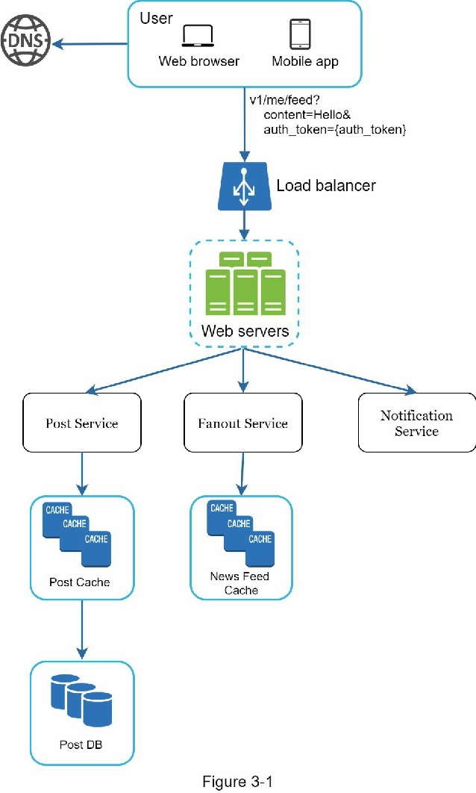
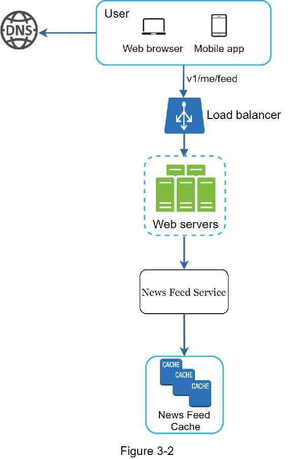
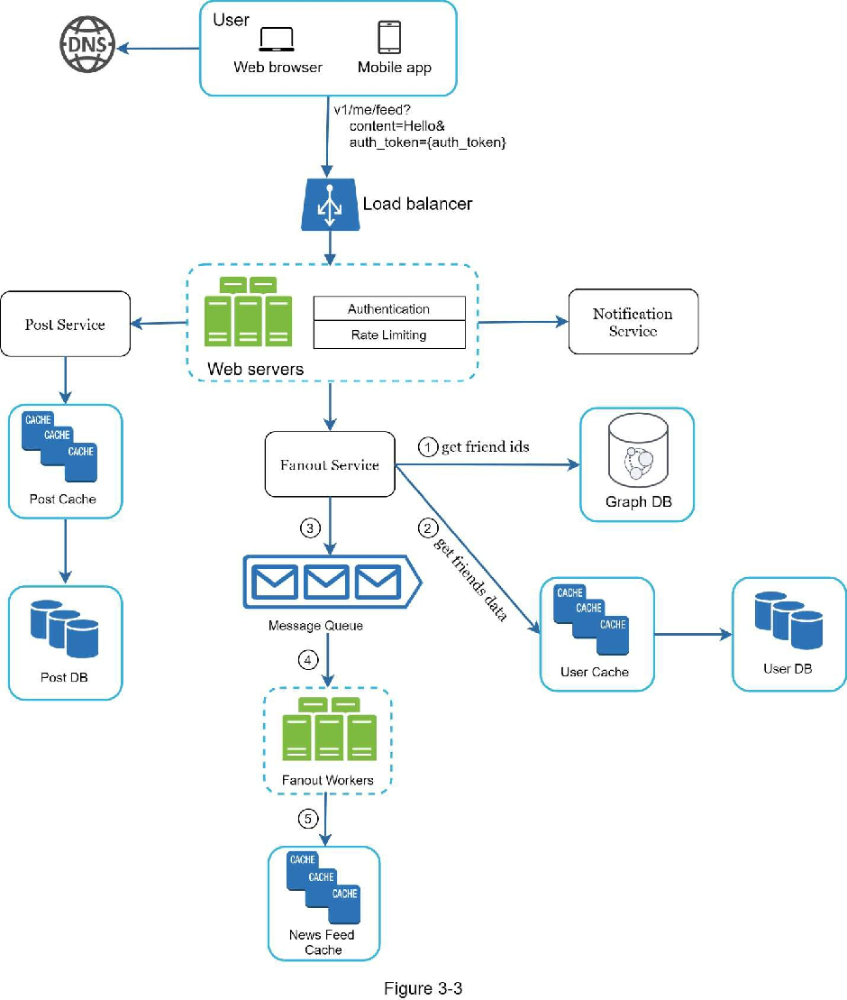
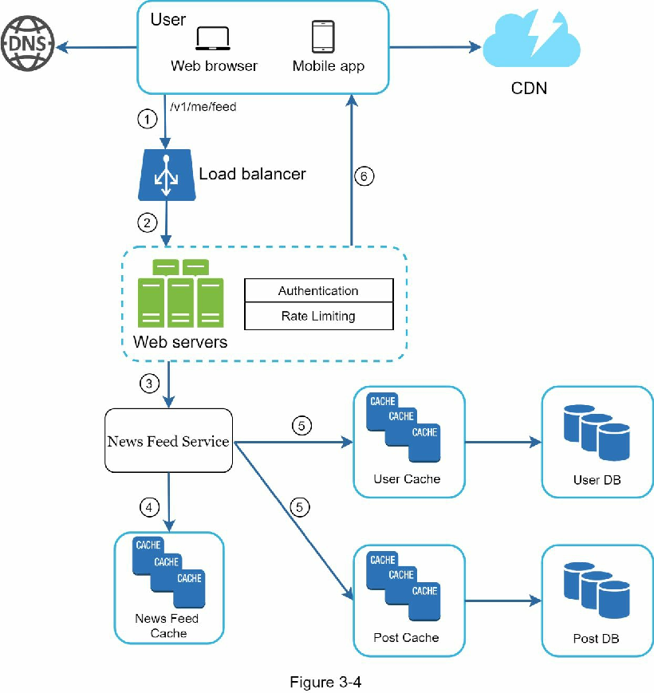

## 서론: 왜 시스템 설계 면접은 두려운가

음식점에서 주문을 할 때를 생각해봅시다. 만약 웨이터가 "뭐 먹으세요?"라고 물을 때 '아, 이건 너무 복잡한 질문이야'라며 바로 먹고 싶은 음식을 말한다면 어떻게 될까요? 아마 당신이 원했던 것과는 다른 음식이 나올 가능성이 높습니다. 마찬가지로 시스템 설계 면접에서도 문제를 제대로 이해하지 못하고 바로 답을 내놓으면 전혀 다른 방향으로 나아갈 수 있습니다.

당신은 꿈에 그리던 회사에서 현장 면접을 따냈습니다. 채용 담당자가 그날의 일정표를 보냅니다. 목록을 훑어보며 제법 좋은 기분이 들다가... 갑자기 눈에 들어오는 한 세션이 있습니다 - 시스템 설계 면접(System Design Interview)이었습니다.

시스템 설계 면접은 종종 면접자들을 위협합니다. 문제가 "유명한 상품 X를 설계하세요"처럼 모호할 수 있고, 질문은 애매하며 상당히 광범위해 보입니다. 당신의 불안감은 타당합니다. 결국, 어떻게 한 시간 안에 수백, 수천 명의 엔지니어가 시간을 들여 만든 유명한 상품을 설계할 수 있을까요?

다행히도, 아무도 그렇게 기대하지 않습니다. 실제 세계의 시스템 설계는 극도로 복잡합니다. 예를 들어, 구글 검색은 겉보기에는 단순하지만, 그 단순함을 받치는 기술의 양은 정말 놀랍습니다. 만약 아무도 한 시간 안에 실제 시스템을 설계하길 기대하지 않는다면, 시스템 설계 면접의 이점은 무엇일까요?

**시스템 설계 면접의 진정한 의미**

시스템 설계 면접은 실제 업무 환경에서의 문제 해결을 시뮬레이션합니다. 여기서 두 명의 동료가 모호한 문제에 대해 협력하여 자신들의 목표를 만족하는 해결책을 제시합니다. 이 문제는 개방적(Open-ended)이며, 완벽한 정답은 없습니다. 최종 설계 자체보다는 설계 과정에서 당신이 기울인 노력이 훨씬 중요합니다. 이를 통해 당신은 설계 능력, 설계 선택에 대한 방어력, 그리고 피드백에 건설적으로 대응하는 능력을 보여줄 수 있습니다.

이제 관점을 바꿔서 면접관의 입장이 되어봅시다. 면접관이 회의실에 들어오면서 생각하는 것은 무엇일까요? 면접관의 주된 목표는 당신의 능력을 정확하게 평가하는 것입니다. 면접관이 가장 피하고 싶은 것은 세션이 잘못되어 충분한 신호가 없어서 결론을 내릴 수 없는 평가를 하는 것입니다. 그렇다면 면접관은 시스템 설계 면접에서 무엇을 찾을까요?

많은 사람들이 시스템 설계 면접이 순전히 기술적 설계 능력에 관한 것이라고 생각합니다. 하지만 그것보다 훨씬 더 많은 것을 평가합니다. 효과적인 시스템 설계 면접은 다음과 같은 능력에 대해 강력한 신호를 전달합니다:

- **협력 능력**: 다른 사람과 함께 일하는 능력
- **압박감 하에서의 업무 처리 능력**: 시간 제약 속에서 문제를 해결하는 능력
- **모호함의 해소 능력**: 불명확한 상황을 건설적으로 풀어가는 능력
- **좋은 질문을 하는 능력**: 이것은 매우 중요한 능력이며, 많은 면접관들이 특별히 이 능력을 찾습니다

**면접관이 주의하는 위험 신호**

좋은 면접관은 또한 위험한 신호(Red flags)를 찾습니다. 과도한 엔지니어링(Over-engineering)은 많은 엔지니어들의 질병이라고 할 수 있습니다. 이들은 설계의 순수성을 즐기면서 트레이드오프를 무시합니다. 그들은 종종 과도하게 엔지니어링된 시스템의 복합적인 비용을 인식하지 못하고, 많은 회사들이 그러한 무지 때문에 큰 대가를 치릅니다. 당신은 확실히 시스템 설계 면접에서 이러한 경향을 보이고 싶지 않을 것입니다. 다른 위험 신호로는 좁은 사고방식(narrow mindedness)이나 완고함(stubbornness) 등이 있습니다.

이 장에서 우리는 시스템 설계 면접 문제를 푸는 데 유용한 팁을 소개하고 간단하면서도 효과적인 프레임워크를 제시할 것입니다.

---

## 효과적인 시스템 설계 면접을 위한 4단계 프로세스

모든 시스템 설계 면접은 다릅니다. 좋은 시스템 설계 면접은 개방적이며, 모든 상황에 맞는 단 하나의 해결책은 없습니다. 하지만 모든 시스템 설계 면접에서 다루어야 할 단계와 공통된 기초가 있습니다.

---

## 단계 1: 문제를 이해하고 설계 범위를 정하기

### 왜 급하게 답을 내놓으면 안 될까?

수업 중에 선생님이 학생들에게 물었습니다. "호랑이는 왜 울음을 냈을까요?"

뒤쪽에 손을 든 학생이 있었습니다.

"네, 지미?"

"왜냐하면 배가 고파서입니다."

"매우 잘했다, 지미."

지미는 어릴 때부터 항상 수업 시간에 제일 먼저 손을 들고 답하는 학생이었습니다. 선생님이 어떤 질문을 던지든, 지미는 항상 자신이 그 답을 알든 모르든 상관없이 대답하고 싶었습니다. 지미는 똑똑한 학생이었습니다. 그는 빠르게 모든 답을 아는 것에 자부심을 가졌습니다. 시험에서 그는 보통 가장 먼저 모든 문제를 풀고 나갔습니다. 그는 선생님이 모든 학문 경쟁에서 가장 먼저 선택하는 학생이었습니다.

**지미처럼 행동하지 마세요.**

시스템 설계 면접에서 깊이 있게 생각하지 않고 빨리 답을 내놓는 것은 당신에게 어떤 가산점도 주지 않습니다. 요구사항을 철저히 이해하지 않고 답변하는 것은 면접이 상식 경쟁이 아니라는 점에서 매우 큰 위험 신호입니다. 정답은 없습니다.

따라서 바로 해결책을 제시하지 마세요. 속도를 늦추세요. 깊이 있게 생각하고 요구사항과 가정을 명확히 하기 위해 질문을 던지세요. 이것은 극도로 중요합니다.

엔지니어로서 우리는 어려운 문제를 해결하고 최종 설계로 바로 뛰어들고 싶어합니다. 하지만 이러한 접근 방식은 잘못된 시스템을 설계하게 될 가능성이 높습니다. 엔지니어로서 가장 중요한 능력 중 하나는 올바른 질문을 하고, 적절한 가정을 하며, 시스템을 구축하는 데 필요한 모든 정보를 수집하는 것입니다. 따라서 질문하기를 두려워하지 마세요.

질문을 할 때, 면접관은 당신의 질문에 직접 답하거나 당신이 가정을 하도록 요청합니다. 후자의 경우, 당신의 가정을 화이트보드나 종이에 적어두세요. 나중에 필요할 수 있습니다.

### 어떤 질문을 해야 할까?

정확한 요구사항을 이해하기 위한 질문을 해야 합니다. 다음은 시작하는 데 도움이 될 만한 질문 목록입니다:

- 구체적으로 어떤 기능을 구축할 것인가?
- 이 제품은 몇 명의 사용자를 가지고 있는가?
- 회사는 얼마나 빠르게 확장될 것으로 예상하는가? 3개월, 6개월, 1년 후의 예상 규모는 어떻게 되는가?
- 회사의 기술 스택은 무엇인가? 설계를 단순화하기 위해 활용할 수 있는 기존 서비스는 무엇인가?

### 실제 예시: 뉴스피드 시스템 설계

만약 당신이 [[11장 뉴스 피드 시스템 설계 (Design a News Feed System)|뉴스 피드]] 시스템(News Feed System)을 설계하도록 요청받았다면, 요구사항을 명확히 하는 데 도움이 될 질문을 하고 싶을 것입니다. 당신과 면접관 사이의 대화는 다음과 같을 수 있습니다:

**지원자**: 이것은 모바일 앱인가요? 아니면 웹 앱인가요? 아니면 둘 다인가요?

**면접관**: 둘 다입니다.

**지원자**: 이 제품의 가장 중요한 기능은 무엇인가요?

**면접관**: 포스트를 작성할 수 있고, 친구들의 뉴스피드를 볼 수 있는 것입니다.

**지원자**: 뉴스피드는 역시간순(reverse chronological order)으로 정렬되나요, 아니면 특정 순서로 정렬되나요? 특정 순서는 각 포스트에 다른 가중치를 부여한다는 의미입니다. 예를 들어, 친한 친구의 포스트가 그룹의 포스트보다 더 중요할 수 있습니다.

**면접관**: 간단하게 하기 위해 피드가 역시간순으로 정렬된다고 가정합시다.

**지원자**: 사용자가 몇 명의 친구를 가질 수 있나요?

**면접관**: 5000명입니다.

**지원자**: 트래픽 볼륨은 어느 정도인가요?

**면접관**: 일일 활성 사용자(Daily Active Users, DAU)는 1000만 명입니다.

**지원자**: 피드에는 이미지, 비디오, 또는 텍스트만 포함될 수 있나요?

**면접관**: 이미지와 비디오를 포함한 미디어 파일이 모두 포함될 수 있습니다.

위는 당신이 면접관에게 할 수 있는 샘플 질문들입니다. 요구사항을 이해하고 모호함을 명확히 하는 것이 중요합니다.

---

## 단계 2: 고수준 설계를 제안하고 동의 얻기

이 단계에서 우리의 목표는 고수준(High-level) 설계를 개발하고 설계에 대해 면접관과 합의에 도달하는 것입니다. 이 과정에서 면접관과 협력하는 것이 좋은 생각입니다.

- **초기 설계 청사진을 만들고 피드백을 요청하세요.** 면접관을 팀원으로 생각하고 함께 일하세요. 좋은 면접관들은 이야기하고 참여하기를 좋아합니다.

- **화이트보드나 종이에 주요 컴포넌트를 가진 박스 다이어그램을 그리세요.** 여기에는 클라이언트(모바일/웹), API, 웹 서버, 데이터 저장소, 캐시, CDN, 메시지 큐 등이 포함될 수 있습니다.

- **[[2장 대략적 추정 (Back-of-the-Envelope Estimation)|대략적 추정]](Back-of-the-envelope) 계산을 수행하여 당신의 청사진이 규모 제약을 만족하는지 평가하세요.** 큰 소리로 생각하세요. 상세한 계산에 들어가기 전에 면접관과 커뮤니케이션하세요.

가능한 경우, 몇 가지 구체적인 사용 사례(Use cases)를 살펴보세요. 이것은 고수준 설계를 프레임하는 데 도움이 됩니다. 또한 당신이 아직 고려하지 않은 엣지 케이스(Edge cases)를 발견하는 데 도움이 될 가능성이 높습니다.

**API 엔드포인트와 데이터베이스 스키마를 포함해야 할까?** 이것은 문제에 따라 다릅니다. "구글 검색 엔진을 설계하세요"와 같은 큰 설계 문제의 경우, 이것은 너무 세부적인(Too low level) 수준입니다. "멀티플레이어 포커 게임의 백엔드를 설계하는" 것과 같은 문제의 경우, 이것은 공정한 게임입니다. 면접관과 소통하세요.

### 실제 예시: 뉴스피드 시스템 설계

"뉴스피드 시스템을 설계하세요"를 예시로 고수준 설계에 접근하는 방법을 보여드리겠습니다. 여기서 당신은 시스템이 실제로 어떻게 작동하는지 이해할 필요가 없습니다. 모든 세부사항은 11장에서 설명될 것입니다.

고수준 설계에서 설계는 두 가지 흐름(Flows)으로 나뉩니다:

- **피드 발행(Feed publishing)**: 사용자가 포스트를 발행할 때, 해당 데이터가 캐시/데이터베이스에 쓰여지고, 그 포스트가 친구들의 뉴스피드에 전파됩니다.

- **뉴스피드 구축(Newsfeed building)**: 뉴스피드는 친구들의 포스트를 역시간순으로 집계하여 구축됩니다.

Figure 3-1과 Figure 3-2는 각각 피드 발행과 뉴스피드 구축 흐름의 고수준 설계를 보여줍니다.

---

## 단계 3: 깊이 있는 설계 분석

이 단계에서 당신과 면접관은 다음의 목표를 이미 달성했어야 합니다:

- 전체 목표와 기능 범위에 동의함
- 전체 설계에 대한 고수준 청사진을 스케치함
- 고수준 설계에 대한 면접관의 피드백을 얻음
- 깊이 있는 분석에서 초점을 맞출 영역에 대한 초기 아이디어를 가짐

당신은 면접관과 함께 아키텍처(Architecture)의 컴포넌트를 식별하고 우선순위를 정해야 합니다. 모든 면접이 다르다는 점을 강조할 가치가 있습니다. 때때로 면접관은 고수준 설계에 초점을 맞추고 싶다는 신호를 보낼 수 있습니다. 때때로 시니어 직급 지원자 면접에서는 시스템 성능 특성(Performance characteristics), 특히 병목(Bottlenecks)과 자원 추정(Resource estimations)에 대한 논의가 이루어질 수 있습니다. 대부분의 경우, 면접관은 일부 시스템 컴포넌트의 세부사항으로 파고드는 것을 원할 수 있습니다. [[8장 URL 단축기 설계|URL 단축기]](URL shortener)의 경우, 긴 URL을 짧은 것으로 변환하는 해시 함수(Hash function) 설계를 깊이 있게 탐구하는 것이 흥미롭습니다. [[12장 채팅 시스템 설계 (Design a Chat System)|채팅 시스템]]의 경우, 지연시간을 줄이는 방법과 온라인/오프라인 상태를 지원하는 방법이 두 가지 흥미로운 주제입니다.

시간 관리는 필수적입니다. 당신의 능력을 보여주지 않는 분 단위의 세부사항에 빠져드는 것은 쉽습니다. 당신은 면접관에게 신호를 보여줄 준비가 되어 있어야 합니다. 불필요한 세부사항에 들어가지 않으려고 노력하세요. 예를 들어, Facebook 피드 순위의 EdgeRank 알고리즘에 대해 자세히 이야기하는 것은 시스템 설계 면접 중에 이상적이지 않습니다. 왜냐하면 이것은 귀중한 시간을 많이 소비하고 확장 가능한 시스템을 설계하는 능력을 증명하지 못하기 때문입니다.

### 실제 예시: 뉴스피드 시스템 깊이 분석

이 시점에서, 우리는 뉴스피드 시스템의 고수준 설계를 논의했고, 면접관이 당신의 제안에 만족합니다. 다음으로, 우리는 가장 중요한 두 가지 사용 사례를 조사할 것입니다:

1. 피드 발행(Feed publishing)
2. 뉴스피드 검색(News feed retrieval)

Figure 3-3과 Figure 3-4는 이 두 사용 사례에 대한 자세한 설계를 보여줍니다. 자세한 설명은 11장에서 제공될 것입니다.

---

## 단계 4: 마무리하기

이 최종 단계에서, 면접관은 당신에게 몇 가지 후속 질문을 할 수도 있고, 다른 추가 포인트를 논의할 자유를 줄 수도 있습니다. 다음은 따라할 수 있는 몇 가지 방향입니다:

- **시스템 병목을 식별하고 잠재적 개선 사항을 논의하세요.** 당신의 설계가 완벽하고 개선할 것이 없다고 말하지 마세요. 항상 개선할 것이 있습니다. 이것은 비판적 사고(Critical thinking)를 보여주고 좋은 마지막 인상을 남길 수 있는 좋은 기회입니다.

- **면접관에게 설계의 재요약을 제공하는 것이 유용할 수 있습니다.** 이것은 특히 당신이 여러 솔루션을 제안한 경우 중요합니다. 긴 세션 후에 면접관의 기억을 상기시키는 것이 도움이 될 수 있습니다.

- **에러 케이스들을 논의하세요.** 서버 고장, 네트워크 손실 등이 흥미로운 주제입니다.

- **운영 문제(Operation issues)는 언급할 가치가 있습니다.** 메트릭과 에러 로그를 어떻게 모니터링합니까? 시스템을 어떻게 배포(Roll out)합니까?

- **다음 성장 곡선(Scale curve)을 처리하는 방법도 흥미로운 주제입니다.** 예를 들어, 현재 설계가 100만 명의 사용자를 지원한다면, 1000만 명의 사용자를 지원하기 위해 어떤 변화가 필요할까요?

- **더 많은 시간이 있었다면 필요했을 다른 개선사항들을 제안하세요.**

---

## 체크리스트: 해야 할 것과 하지 말아야 할 것

### 해야 할 것 (Dos)

- **항상 명확화를 요청하세요.** 당신의 가정이 맞다고 가정하지 마세요.

- **문제의 요구사항을 이해하세요.** 정답도 없고 최고의 답도 없습니다. 젊은 스타트업의 문제를 해결하도록 설계된 솔루션은 수백만 명의 사용자를 가진 확립된 회사의 솔루션과 다릅니다. 요구사항을 확실히 이해하세요.

- **당신이 생각하는 것을 면접관에게 알리세요.** 면접관과 커뮤니케이션하세요.

- **가능하면 여러 접근 방식을 제안하세요.**

- **면접관과 청사진에 동의했으면, 각 컴포넌트에 대한 세부사항을 파고드세요.** 가장 중요한 컴포넌트를 먼저 설계하세요.

- **면접관과 아이디어를 나누세요.** 좋은 면접관은 팀원으로서 당신과 함께 일합니다.

- **절대 포기하지 마세요.**

### 하지 말아야 할 것 (Don'ts)

- **전형적인 면접 질문에 대해 준비되지 않은 상태로 가지 마세요.**

- **요구사항과 가정을 명확히 하지 않고 솔루션으로 바로 뛰어들지 마세요.**

- **처음부터 단 하나의 컴포넌트에 대해 너무 많은 세부사항을 파고들지 마세요.** 먼저 고수준 설계를 제시하고 그 다음에 세부사항을 파고드세요.

- **막히면, 힌트를 요청하기를 주저하지 마세요.**

- **다시 말하지만, 커뮤니케이션하세요.** 침묵 속에서만 생각하지 마세요.

- **설계를 제시했다고 해서 면접이 끝났다고 생각하지 마세요.** 면접관이 "다 됐어요"라고 말할 때까지는 끝나지 않습니다. 피드백을 초반에, 그리고 자주 요청하세요.

---

## 단계별 시간 배분

시스템 설계 면접 질문은 보통 매우 광범위하며, 45분 또는 1시간은 전체 설계를 다루기에 충분하지 않습니다. 시간 관리는 필수적입니다. 각 단계에 얼마나 많은 시간을 투자해야 할까요? 다음은 45분 면접 세션에서 시간을 배분하는 것에 대한 매우 대략적인 지침입니다. 이것은 대략적인 추정치이며, 실제 시간 배분은 문제의 범위와 면접관의 요구사항에 따라 다릅니다:

- **단계 1 - 문제를 이해하고 설계 범위 정하기:** 3-10분
- **단계 2 - 고수준 설계 제안하고 동의 얻기:** 10-15분
- **단계 3 - 깊이 있는 설계 분석:** 10-25분
- **단계 4 - 마무리:** 3-5분

---

## 핵심 개념 정리

**시스템 설계 면접(System Design Interview)**: 모호한 개방형 문제를 면접관과 협력하여 해결하는 과정으로, 기술 능력뿐 아니라 협력·소통·비판적 사고를 종합 평가하는 면접 방식

**4단계 프로세스(Four-Step Process)**: 문제 이해 → 고수준 설계 → 깊이 있는 설계 → 마무리로 이어지는 시스템 설계 면접의 체계적 접근 틀

**설계 범위(Design Scope)**: 면접 초반에 기능 요구사항·트래픽 규모·기술 스택 등을 질문으로 명확히 확정하여 설계 방향을 좁히는 작업

**고수준 설계(High-Level Design)**: 클라이언트·API·서버·데이터 저장소·캐시·CDN·메시지 큐 등 주요 컴포넌트와 흐름을 박스 다이어그램 수준으로 스케치한 초안

**과도한 엔지니어링(Over-Engineering)**: 트레이드오프를 무시하고 설계 순수성만을 추구하여 시스템을 불필요하게 복잡하게 만드는 위험 신호

**엣지 케이스(Edge Case)**: 일반적인 사용 흐름에서는 드러나지 않지만 특수한 조건에서 문제를 일으킬 수 있는 경계 상황

**트레이드오프(Trade-off)**: 성능·비용·복잡도·확장성 등 서로 상충하는 요소 사이에서 최적 균형점을 선택하는 설계 판단

**병목(Bottleneck)**: 시스템 성능을 제한하는 단일 지점으로, 깊이 있는 설계 단계에서 집중적으로 분석하고 개선해야 할 구성요소

**피드 발행(Feed Publishing)**: 사용자의 포스트 작성 시 데이터를 저장소에 기록하고 친구들의 피드에 전파하는 쓰기 흐름

**에러 케이스(Error Case)**: 서버 고장·네트워크 손실 등 장애 상황에서 시스템이 어떻게 동작해야 하는지를 마무리 단계에서 논의하는 주제

**비판적 사고(Critical Thinking)**: 설계의 약점과 잠재적 개선 사항을 스스로 찾아 제시하는 능력으로, 마무리 단계에서 좋은 인상을 남기는 핵심 요소

시스템 설계 면접은 완벽한 정답을 요구하는 시험이 아니라, 모호한 문제를 구조적으로 분해하고 면접관과 협력하며 합리적인 설계 결정을 내려가는 과정 자체를 평가합니다. 요구사항을 먼저 명확히 하고, 고수준 합의를 얻은 뒤 세부사항으로 파고드는 4단계 프레임워크를 체화하는 것이 핵심입니다.
