## 서론: 왜 속도 제한이 필요할까?

카페에서 커피를 주문할 때를 생각해봅시다. 한 명의 바리스타가 초당 최대 5잔의 커피만 만들 수 있다면, 그보다 많은 손님이 동시에 주문했을 때 어떻게 할까요? 결국 나머지 손님들은 대기해야 하거나 거절당하겠지요. 네트워크 시스템도 비슷합니다.

**속도 제한기(Rate Limiter)**는 클라이언트나 서비스가 보내는 트래픽의 속도를 제어하는 장치입니다. HTTP 세계에서 속도 제한기는 정해진 기간 동안 클라이언트가 보낼 수 있는 요청의 개수를 제한합니다. 만약 API 요청 수가 속도 제한기에서 정의한 임계값을 초과하면, 초과분의 모든 요청은 차단됩니다.

실제 예시를 살펴보겠습니다:
- 사용자는 초당 최대 2개의 게시물만 작성할 수 있습니다.
- 같은 IP 주소에서 하루에 최대 10개의 계정만 생성할 수 있습니다.
- 같은 기기에서 주당 5회까지만 보상을 받을 수 있습니다.

### API 속도 제한기의 핵심 혜택

속도 제한기를 사용하는 것이 왜 중요한지 알아봅시다:

#### 1. DoS 공격으로 인한 자원 고갈 방지
대규모 기술 회사들이 출시하는 거의 모든 API는 어떤 형태의 속도 제한을 시행합니다. 예를 들어:
- **Twitter**: 3시간당 최대 300개의 트윗
- **Google Docs API**: 사용자당 60초에 읽기 요청 300개
- 의도적이든 실수든, 속도 제한기는 과도한 요청을 차단하여 **서비스 거부(DoS, Denial of Service) 공격**으로부터 보호합니다.

#### 2. 운영 비용 절감
초과 요청을 제한하면 필요한 서버 수를 줄이고 높은 우선순위의 API에 리소스를 할당할 수 있습니다. 특히 외부 API를 호출 기반으로 비용을 지불하는 경우 속도 제한은 필수입니다:
- 신용 카드 확인
- 결제 처리
- 건강 기록 조회

#### 3. 서버 과부하 방지
봇이나 사용자의 부정행위로 인한 과도한 요청을 필터링하여 서버 부하를 줄입니다.

---

## 1단계: 문제 이해 및 설계 범위 확립

속도 제한기는 다양한 알고리즘으로 구현할 수 있으며, 각각의 장단점이 있습니다. 인터뷰에서 면접관과의 상호작용을 통해 어떤 유형의 속도 제한기를 구축할지 명확히 해봅시다.

### 핵심 질문과 답변

**후보:** 어떤 종류의 속도 제한기를 설계할 것인가요? 클라이언트 측인가, 아니면 서버 측 API 속도 제한기인가요?
**면접관:** 서버 측 API 속도 제한기에 초점을 맞추겠습니다.

**후보:** 속도 제한기가 IP, 사용자 ID, 또는 다른 속성을 기반으로 API 요청을 제한하나요?
**면접관:** 속도 제한기는 다양한 제한 규칙을 지원할 수 있도록 유연해야 합니다.

**후보:** 시스템의 규모는 어느 정도인가요? 스타트업용인가, 아니면 대규모 사용자 기반을 가진 큰 회사용인가요?
**면접관:** 시스템은 많은 수의 요청을 처리할 수 있어야 합니다.

**후보:** 분산 환경에서 작동하나요?
**면접관:** 예, 그렇습니다.

**후보:** 속도 제한기가 별도의 서비스인가, 아니면 애플리케이션 코드에 구현되나요?
**면접관:** 설계상 당신의 선택입니다.

**후보:** 제한된 사용자에게 알려야 하나요?
**면접관:** 예, 그렇습니다.

### 요구사항 정리

시스템의 요구사항을 정리하면 다음과 같습니다:
- 과도한 요청을 정확하게 제한합니다.
- **낮은 지연시간**: 속도 제한기가 HTTP 응답 시간을 느리게 하지 않습니다.
- 최소한의 메모리만 사용합니다.
- **분산 속도 제한**: 여러 서버나 프로세스에서 공유할 수 있습니다.
- **예외 처리**: 요청이 제한될 때 사용자에게 명확한 예외를 표시합니다.
- **높은 장애 내성**: 속도 제한기에 문제가 발생해도(예: 캐시 서버 오프라인) 전체 시스템에 영향을 주지 않습니다.

---

## 2단계: 고수준 설계 및 합의

기본 클라이언트-서버 모델로 통신을 구성해봅시다.

### 속도 제한기를 어디에 두어야 할까?

직관적으로 속도 제한기는 클라이언트 측이나 서버 측에 구현할 수 있습니다.

**클라이언트 측 구현:** 일반적으로 클라이언트는 속도 제한을 강제하기에 신뢰할 수 없는 곳입니다. 왜냐하면 악의적인 행위자가 클라이언트 요청을 쉽게 위조할 수 있고, 클라이언트 구현을 제어하지 못할 수도 있기 때문입니다.

**서버 측 구현:** 속도 제한기가 서버 측에 배치되는 구조입니다.

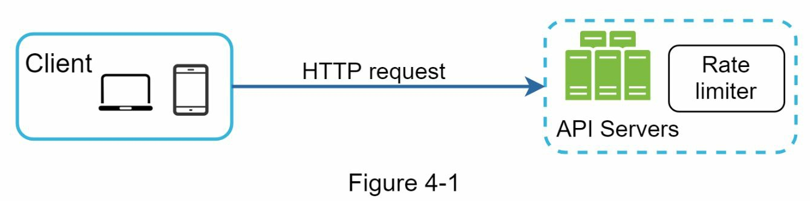

또 다른 방법도 있습니다. API 서버에 속도 제한기를 두는 대신, 요청을 제한하는 속도 제한기 미들웨어를 생성할 수 있습니다.

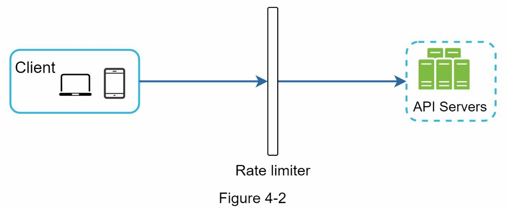

### 미들웨어를 통한 속도 제한 동작 방식

Figure 4-3을 통해 이 설계에서 속도 제한이 어떻게 작동하는지 살펴봅시다. API가 초당 2개의 요청을 허용한다고 가정하고, 클라이언트가 1초 내에 3개의 요청을 보냅니다. 처음 두 요청은 API 서버로 라우팅되지만, 속도 제한기 미들웨어는 세 번째 요청을 제한하고 HTTP 상태 코드 **429를 반환**합니다. HTTP 429 응답 상태 코드는 사용자가 너무 많은 요청을 보냈음을 나타냅니다.

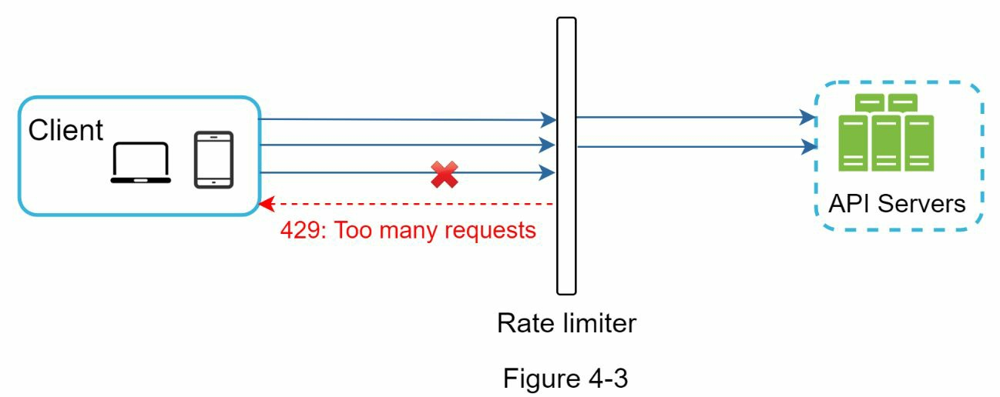

### API 게이트웨이를 통한 구현

클라우드 마이크로서비스(Cloud Microservices)가 널리 인기를 얻으면서, 속도 제한기는 보통 **API 게이트웨이(API Gateway)**라는 컴포넌트 내에서 구현됩니다. API 게이트웨이는 속도 제한, SSL 종료(SSL termination), 인증, IP 화이트리스팅, 정적 콘텐츠 서빙 등을 지원하는 완전 관리형 서비스입니다. 지금은 API 게이트웨이가 속도 제한을 지원하는 미들웨어라는 것만 알면 됩니다.

### 속도 제한기 구현 위치 결정: 서버 vs 게이트웨이

속도 제한기를 설계할 때 중요한 질문은 다음과 같습니다: 속도 제한기를 서버 측에 구현할 것인가, 아니면 게이트웨이에 구현할 것인가?

절대적인 답은 없습니다. 회사의 현재 기술 스택, 엔지니어링 리소스, 우선순위, 목표 등에 따라 달라집니다. 몇 가지 일반적인 지침:

- **현재 기술 스택 평가**: 프로그래밍 언어, 캐시 서비스 등을 고려합니다. 속도 제한을 서버 측에서 구현하기에 현재 프로그래밍 언어가 충분히 효율적인지 확인합니다.
- **적절한 알고리즘 선택**: 비즈니스 요구에 맞는 속도 제한 알고리즘을 찾습니다. 서버 측에 모든 것을 구현하면 알고리즘을 완벽히 제어할 수 있지만, 제3자 게이트웨이를 사용하면 선택지가 제한될 수 있습니다.
- **마이크로서비스 아키텍처 활용**: 이미 마이크로서비스 아키텍처를 사용하고 있고, 인증이나 IP 화이트리스팅 등을 수행하는 API 게이트웨이를 포함하고 있다면, 속도 제한기를 API 게이트웨이에 추가할 수 있습니다.
- **리소스 고려**: 자체 속도 제한 서비스를 구축하는 데는 시간이 걸립니다. 엔지니어링 리소스가 부족하다면 상용 API 게이트웨이가 더 나은 선택입니다.

---

### 속도 제한 알고리즘: 다양한 기법 비교

속도 제한기는 여러 알고리즘으로 구현할 수 있으며, 각각 뚜렷한 장단점이 있습니다. 알고리즘을 깊이 있게 이해하는 것이 당신의 사용 사례에 맞는 올바른 알고리즘이나 알고리즘 조합을 선택하는 데 도움이 됩니다.

주요 알고리즘 목록:
- **토큰 버킷(Token Bucket)**
- **누수 버킷(Leaking Bucket)**
- **고정 윈도우 카운터(Fixed Window Counter)**
- **슬라이딩 윈도우 로그(Sliding Window Log)**
- **슬라이딩 윈도우 카운터(Sliding Window Counter)**

---

### 토큰 버킷 알고리즘: 간단하고 효율적인 표준

토큰 버킷 알고리즘은 속도 제한에 널리 사용됩니다. 단순하고 잘 이해되며, 인터넷 회사들이 흔히 사용합니다. Amazon과 Stripe은 모두 이 알고리즘을 사용하여 API 요청을 제한합니다.

#### 작동 원리

토큰 버킷 알고리즘은 다음과 같이 작동합니다:

- **토큰 저장소**: 사전 정의된 용량을 가진 컨테이너입니다. 토큰은 정해진 속도로 주기적으로 버킷에 들어갑니다. 버킷이 가득 차면 더 이상 토큰을 추가하지 않습니다.

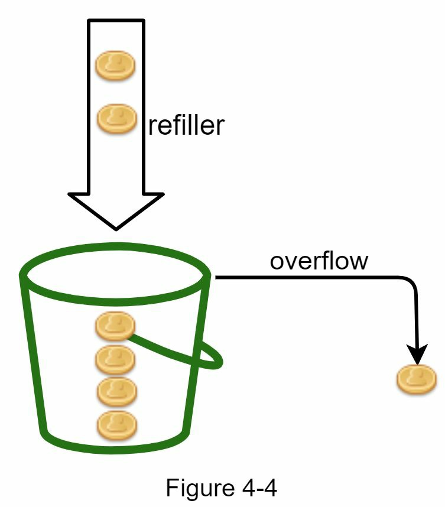

- **요청 처리**: 각 요청은 하나의 토큰을 소비합니다. 요청이 들어오면 버킷에 충분한 토큰이 있는지 확인합니다.

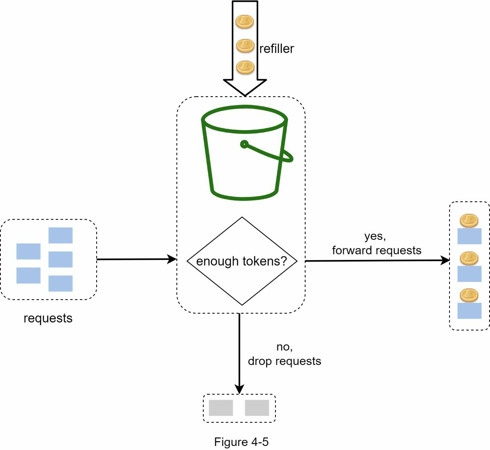

- **토큰이 충분하면**: 각 요청마다 하나의 토큰을 꺼내고 요청은 통과합니다.
- **토큰이 부족하면**: 요청은 드롭됩니다.

#### 토큰 소비, 충전 및 속도 제한 로직

Figure 4-6은 토큰 소비, 충전 및 속도 제한 로직이 어떻게 작동하는지 보여줍니다. 이 예에서 토큰 버킷 크기는 4이고, 충전 속도는 분당 4개입니다.

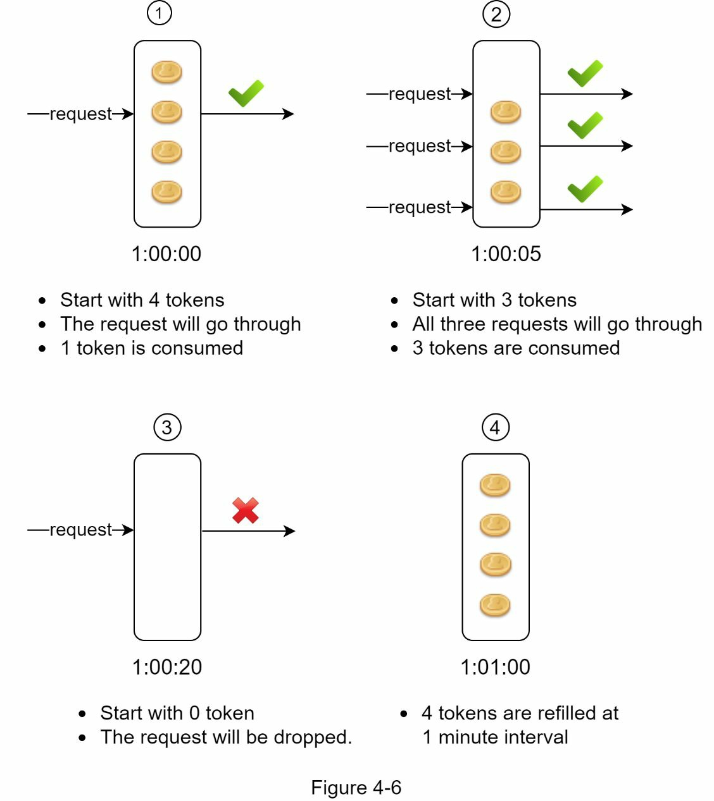

#### 토큰 버킷의 파라미터

토큰 버킷 알고리즘은 두 가지 파라미터를 가집니다:
- **버킷 크기**: 버킷에 허용되는 최대 토큰 수
- **충전 속도**: 초당 버킷에 들어가는 토큰 수

#### 필요한 버킷 개수는?

필요한 버킷의 개수는 속도 제한 규칙에 따라 달라집니다:

- **API 엔드포인트별 다른 버킷**: 서로 다른 제한이 필요합니다. 예를 들어, 사용자가 초당 1개의 게시물을 작성할 수 있고, 하루에 150명의 친구를 추가할 수 있으며, 초당 5개의 게시물에 좋아요를 할 수 있다면, 각 사용자마다 3개의 버킷이 필요합니다.
- **IP 주소별 버킷**: IP 주소를 기반으로 요청을 제한해야 한다면, 각 IP 주소마다 하나의 버킷이 필요합니다.
- **글로벌 버킷**: 시스템이 초당 최대 10,000개의 요청을 허용한다면, 모든 요청을 공유하는 글로벌 버킷을 두는 것이 좋습니다.

#### 토큰 버킷의 장점과 단점

**장점:**
- 알고리즘 구현이 간단합니다.
- 메모리 효율적입니다.
- 토큰 버킷은 짧은 기간의 트래픽 버스트를 허용합니다. 토큰이 남아있으면 요청이 통과합니다.

**단점:**
- 알고리즘의 두 파라미터(버킷 크기와 토큰 충전 속도)를 적절히 조정하기 어려울 수 있습니다.

---

### 누수 버킷 알고리즘: 안정적이지만 제약 있는 접근

누수 버킷 알고리즘은 토큰 버킷과 유사하지만, 요청이 고정된 속도로 처리된다는 점이 다릅니다. 보통 **FIFO(First-In-First-Out) 큐**로 구현됩니다.

#### 작동 방식

알고리즘의 작동 방식은 다음과 같습니다:
- 요청이 도착하면 시스템은 큐가 가득 찼는지 확인합니다. 가득 차지 않았으면 요청을 큐에 추가합니다.
- 그렇지 않으면 요청은 드롭됩니다.
- 요청은 큐에서 꺼내 정기적으로 처리됩니다.

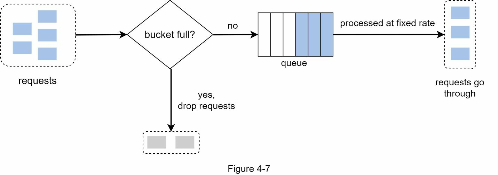

#### 누수 버킷의 파라미터

누수 버킷 알고리즘은 두 가지 파라미터를 가집니다:
- **버킷 크기**: 큐 크기와 같습니다. 큐는 고정된 속도로 처리할 요청을 보관합니다.
- **유출 속도(Outflow Rate)**: 고정된 속도로 처리할 수 있는 요청 수를 정의하며, 보통 초 단위로 측정됩니다.

이커머스 회사 Shopify는 속도 제한에 누수 버킷을 사용합니다.

#### 누수 버킷의 장점과 단점

**장점:**
- 제한된 큐 크기로 인해 메모리 효율적입니다.
- 요청이 고정된 속도로 처리되므로, 안정적인 유출 속도가 필요한 사용 사례에 적합합니다.

**단점:**
- 트래픽 버스트로 큐가 오래된 요청으로 가득 차면, 최근 요청이 속도 제한될 수 있습니다.
- 알고리즘에 두 가지 파라미터가 있으므로 적절히 조정하기 어려울 수 있습니다.

---

### 고정 윈도우 카운터 알고리즘: 단순하지만 문제 있는 방식

고정 윈도우 카운터 알고리즘은 다음과 같이 작동합니다:
- 알고리즘은 타임라인을 고정된 크기의 시간 윈도우로 나누고 각 윈도우마다 카운터를 할당합니다.
- 각 요청은 카운터를 1씩 증가시킵니다.
- 카운터가 사전 정의된 임계값에 도달하면, 새로운 시간 윈도우가 시작될 때까지 새 요청은 드롭됩니다.

#### 작동 방식 예시

Figure 4-8에서 시간 단위는 1초이고 시스템은 초당 최대 3개의 요청을 허용합니다. 각 초 윈도우에서 3개를 초과하는 요청을 받으면, 초과 요청은 드롭됩니다.

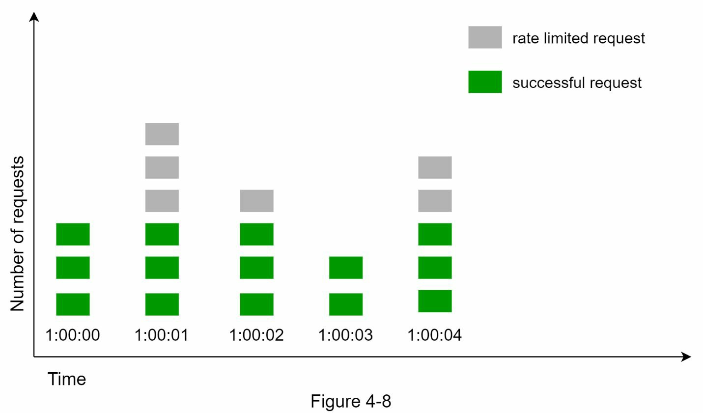

#### 고정 윈도우의 주요 문제: 경계 부분의 버스트 트래픽

이 알고리즘의 주요 문제는 시간 윈도우의 경계에서 버스트 트래픽이 발생하면, 허용된 할당량보다 더 많은 요청이 통과할 수 있다는 점입니다.

다음 경우를 생각해봅시다: Figure 4-9에서 시스템은 분당 최대 5개의 요청을 허용하고, 사용 가능한 할당량은 인간 친화적인 정각에 리셋됩니다. 보시다시피, 2:00:00에서 2:01:00 사이에 5개의 요청이 있고, 2:01:00에서 2:02:00 사이에 5개의 요청이 더 있습니다. 하지만 2:00:30에서 2:01:30 사이의 1분 윈도우에서는 10개의 요청이 통과합니다. 이는 허용된 요청의 2배입니다!

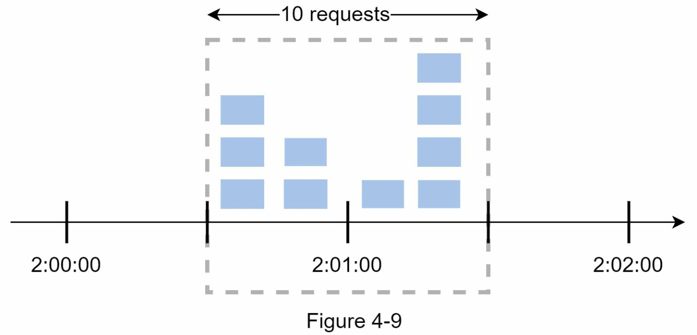

#### 고정 윈도우의 장점과 단점

**장점:**
- 메모리 효율적입니다.
- 이해하기 쉽습니다.
- 사용 가능한 할당량을 시간 단위 윈도우 끝에 리셋하는 것이 특정 사용 사례에 맞습니다.

**단점:**
- 윈도우 경계에서의 트래픽 스파이크로 인해 허용된 할당량보다 더 많은 요청이 통과할 수 있습니다.

---

### 슬라이딩 윈도우 로그 알고리즘: 정확하지만 메모리 많이 소비

앞서 논의했듯이, 고정 윈도우 카운터 알고리즘은 주요 문제가 있습니다. 슬라이딩 윈도우 로그 알고리즘이 이 문제를 해결합니다.

#### 작동 원리

알고리즘은 다음과 같이 작동합니다:
- 알고리즘은 요청 타임스탬프를 추적합니다. 타임스탬프 데이터는 보통 **Redis의 정렬된 세트(Sorted Sets)**와 같은 캐시에 저장됩니다.
- 새로운 요청이 오면, 모든 만료된 타임스탬프를 제거합니다. 만료된 타임스탬프는 현재 시간 윈도우 시작보다 오래된 것입니다.
- 새 요청의 타임스탐프를 로그에 추가합니다.
- 로그 크기가 허용된 개수보다 같거나 작으면 요청을 수락합니다. 그렇지 않으면 거절합니다.

#### 예시를 통한 이해

Figure 4-10에서 보여주는 예시를 살펴봅시다. 이 속도 제한기는 분당 2개의 요청을 허용합니다.

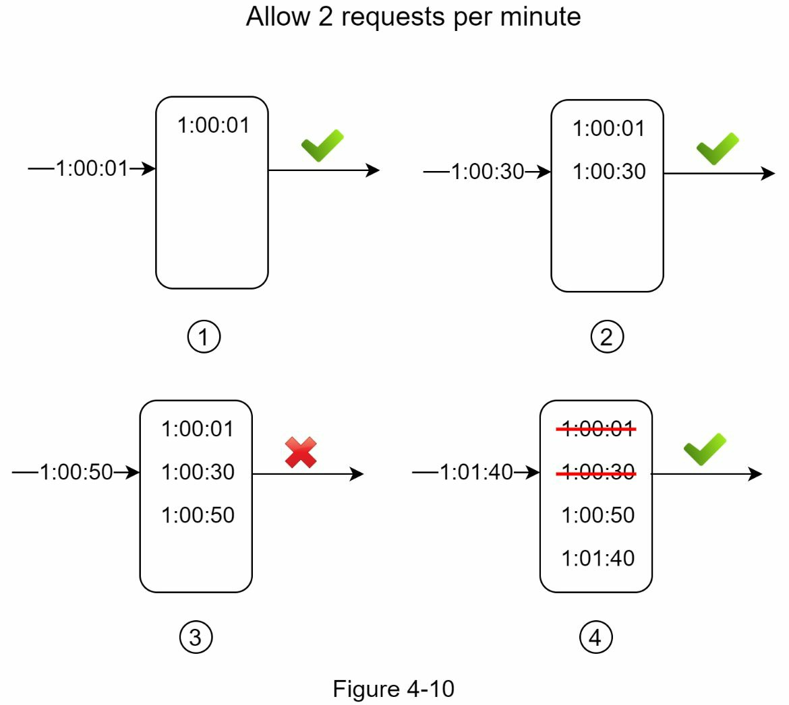

- 1:00:01에 새 요청이 도착하면 로그는 비어있습니다. 따라서 요청이 허용됩니다.
- 1:00:30에 새 요청이 도착하면 타임스탬프 1:00:30이 로그에 삽입됩니다. 삽입 후 로그 크기는 2이며, 허용된 개수 이하입니다. 따라서 요청이 허용됩니다.
- 1:00:50에 새 요청이 도착하고 타임스탬프가 로그에 삽입됩니다. 삽입 후 로그 크기는 3이며, 허용된 크기 2를 초과합니다. 따라서 이 요청은 거절되지만, 타임스탬프는 로그에 남아있습니다.
- 1:01:40에 새 요청이 도착합니다. [1:00:40, 1:01:40) 범위의 요청은 최신 시간 프레임 내에 있지만, 1:00:40 이전에 보낸 요청은 만료됩니다. 두 개의 만료된 타임스탬프, 1:00:01과 1:00:30이 로그에서 제거됩니다. 제거 후 로그 크기는 2가 되므로 요청이 수락됩니다.

#### 슬라이딩 윈도우 로그의 장점과 단점

**장점:**
- 이 알고리즘으로 구현된 속도 제한은 매우 정확합니다. 어떤 롤링 윈도우에서든 요청이 속도 제한을 초과하지 않습니다.

**단점:**
- 알고리즘은 많은 메모리를 소비합니다. 요청이 거절되어도 타임스탬프는 여전히 메모리에 저장될 수 있기 때문입니다.

---

### 슬라이딩 윈도우 카운터: 절충형 접근 방식

슬라이딩 윈도우 카운터 알고리즘은 고정 윈도우 카운터와 슬라이딩 윈도우 로그를 결합한 하이브리드 접근 방식입니다. 이 알고리즘은 두 가지 다른 접근 방식으로 구현할 수 있습니다. 우리는 이 섹션에서 하나의 구현을 설명하고, 섹션 끝에 다른 구현에 대한 참고자료를 제공합니다.

Figure 4-11은 이 알고리즘이 어떻게 작동하는지 보여줍니다.

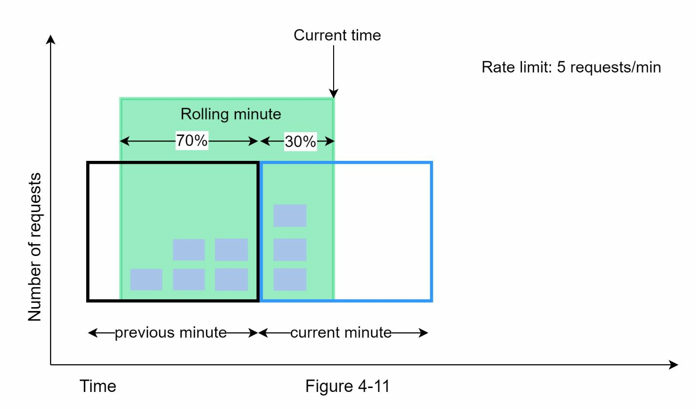

#### 작동 방식 예시

속도 제한기가 분당 최대 7개의 요청을 허용한다고 가정합시다. 이전 분에 5개의 요청이 있었고 현재 분에 3개의 요청이 있습니다. 현재 분의 30% 위치에 도착하는 새 요청에 대해, 롤링 윈도우의 요청 수는 다음 공식을 사용하여 계산됩니다:

**현재 윈도우의 요청 수 + 이전 윈도우의 요청 수 × 롤링 윈도우와 이전 윈도우의 중복 비율**

이 공식을 사용하면 3 + 5 × 0.7 = 6.5개의 요청을 얻습니다. 사용 사례에 따라 이 수를 올림하거나 내림할 수 있습니다. 우리의 예에서는 6으로 내림합니다.

속도 제한기가 분당 최대 7개의 요청을 허용하므로, 현재 요청은 통과할 수 있습니다. 하지만 한 개의 요청이 더 들어오면 제한에 도달합니다.

#### 슬라이딩 윈도우 카운터의 장점과 단점

**장점:**
- 트래픽 스파이크를 완화합니다. 속도가 이전 윈도우의 평균 속도를 기반으로 하기 때문입니다.
- 메모리 효율적입니다.

**단점:**
- 느슨한 룩백 윈도우에서만 작동합니다. 이것은 실제 속도의 근사치입니다. 이전 윈도우의 요청이 균등하게 분포되어 있다고 가정하기 때문입니다. 그러나 이 문제는 생각보다 나쁘지 않습니다. Cloudflare가 수행한 실험에 따르면, 4억 개의 요청 중 0.003%만이 잘못 허용되거나 제한되었습니다.

---

### 고수준 아키텍처: 핵심 요소들의 배치

속도 제한 알고리즘의 기본 개념은 간단합니다. 고수준에서 보면, 동일한 사용자, IP 주소 등에서 보낸 요청의 개수를 추적하기 위한 카운터가 필요합니다. 카운터가 제한보다 크면 요청은 거절됩니다.

#### 카운터 저장 위치는?

데이터베이스를 사용하는 것은 좋은 아이디어가 아닙니다. 디스크 접근이 느리기 때문입니다. **인메모리 캐시(In-memory Cache)**를 선택합니다. 왜냐하면 빠르고 시간 기반 만료 전략을 지원하기 때문입니다. 예를 들어, **Redis**는 속도 제한을 구현하는 인기 있는 선택지입니다. Redis는 두 가지 명령을 제공합니다:

- **INCR**: 저장된 카운터를 1씩 증가시킵니다.
- **EXPIRE**: 카운터에 대한 타임아웃을 설정합니다. 타임아웃이 만료되면 카운터는 자동으로 삭제됩니다.

#### 고수준 아키텍처

Figure 4-12는 속도 제한에 대한 고수준 아키텍처를 보여주며, 다음과 같이 작동합니다:

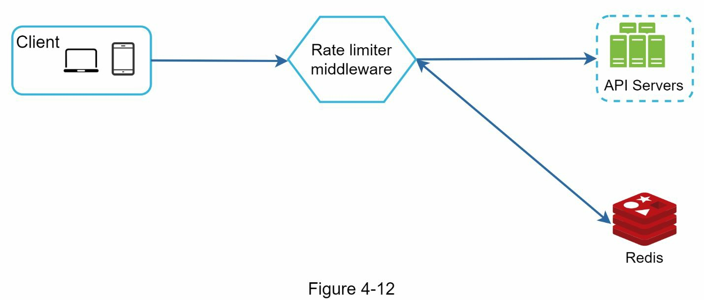

- 클라이언트는 속도 제한 미들웨어에 요청을 보냅니다.
- 속도 제한 미들웨어는 Redis의 해당 버킷에서 카운터를 가져오고 제한에 도달했는지 확인합니다.
- 제한에 도달했으면 요청은 거절됩니다.
- 제한에 도달하지 않았으면 요청은 API 서버로 전송됩니다. 동시에 시스템은 카운터를 증가시키고 Redis에 다시 저장합니다.

---

## 3단계: 상세 설계 및 최적화

Figure 4-12의 고수준 설계는 다음 질문에 답하지 않습니다:
- 속도 제한 규칙은 어떻게 생성되나요? 규칙은 어디에 저장되나요?
- 속도 제한된 요청은 어떻게 처리되나요?

이 섹션에서는 먼저 속도 제한 규칙에 관한 질문에 답한 다음, 속도 제한된 요청을 처리하는 전략을 살펴봅시다. 마지막으로 분산 환경에서의 속도 제한, 상세 설계, 성능 최적화 및 모니터링을 논의하겠습니다.

### 속도 제한 규칙: 구성 기반 제어

Lyft는 자신들의 속도 제한 컴포넌트를 오픈소스로 공개했습니다. 우리는 이 컴포넌트 내부를 살펴보고 속도 제한 규칙의 예시를 봅시다:

```yaml
domain: messaging
descriptors:
  - key: message_type
    value: marketing
    rate_limit:
      unit: day
      requests_per_unit: 5
```

위의 예에서 시스템은 하루에 최대 5개의 마케팅 메시지를 허용하도록 구성되었습니다.

또 다른 예시:
```yaml
domain: auth
descriptors:
  - key: auth_type
    value: login
    rate_limit:
      unit: minute
      requests_per_unit: 5
```

이 규칙은 클라이언트가 1분에 5번 이상 로그인하지 못하도록 합니다. 규칙은 일반적으로 구성 파일에 작성되고 디스크에 저장됩니다.

### 속도 제한 초과: 요청 처리 방식

요청이 속도 제한되면 API는 클라이언트에게 HTTP 응답 코드 **429(Too Many Requests)**를 반환합니다. 사용 사례에 따라 속도 제한된 요청을 나중에 처리하기 위해 큐에 넣을 수도 있습니다. 예를 들어, 시스템 과부하로 인해 일부 주문이 속도 제한되면, 나중에 처리하도록 이 주문들을 보관할 수 있습니다.

### 속도 제한 헤더: 클라이언트에 정보 제공

클라이언트가 속도 제한을 받고 있는지 어떻게 알 수 있을까요? 그리고 클라이언트가 속도 제한되기 전에 남은 허용 요청 수를 어떻게 알 수 있을까요? 답은 **HTTP 응답 헤더**에 있습니다. 속도 제한기는 클라이언트에게 다음 HTTP 헤더를 반환합니다:

- **X-Ratelimit-Remaining**: 윈도우 내에서 허용된 나머지 요청의 수
- **X-Ratelimit-Limit**: 클라이언트가 시간 윈도우당 만들 수 있는 호출 수
- **X-Ratelimit-Retry-After**: 속도 제한 없이 요청할 수 있을 때까지 대기할 초 단위 시간

사용자가 너무 많은 요청을 보내면, 429 Too Many Requests 에러와 **X-Ratelimit-Retry-After** 헤더가 클라이언트에게 반환됩니다.

### 상세 설계: 동적 규칙 관리

Figure 4-13은 시스템의 상세 설계를 보여줍니다:

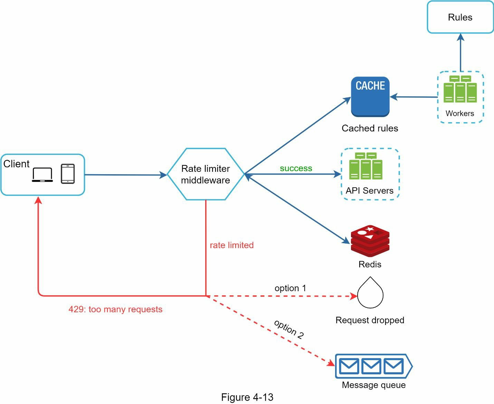

- 규칙은 디스크에 저장됩니다. 워커(Workers)는 주기적으로 디스크에서 규칙을 가져와 캐시에 저장합니다.
- 클라이언트가 요청을 서버로 보내면, 요청은 먼저 속도 제한 미들웨어로 전송됩니다.
- 속도 제한 미들웨어는 캐시에서 규칙을 로드합니다. Redis 캐시에서 카운터와 마지막 요청 타임스탬프를 가져옵니다. 응답에 따라 속도 제한기는 다음을 결정합니다:
  - 요청이 속도 제한되지 않으면 API 서버로 전달됩니다.
  - 요청이 속도 제한되면 속도 제한기는 429 Too Many Requests 에러를 클라이언트에게 반환합니다. 동시에 요청은 드롭되거나 큐로 전달될 수 있습니다.

---

### 분산 환경에서의 속도 제한: 추가적인 과제들

단일 서버 환경에서 속도 제한기를 만드는 것은 어렵지 않습니다. 그러나 시스템을 여러 서버와 동시 스레드를 지원하도록 확장하는 것은 다른 이야기입니다.

#### 1. 경쟁 상태(Race Condition)

앞서 논의했듯이, 속도 제한기는 고수준에서 다음과 같이 작동합니다:
- Redis에서 카운터 값을 읽습니다.
- (카운터 + 1)이 임계값을 초과하는지 확인합니다.
- 초과하지 않으면 Redis에서 카운터 값을 1씩 증가시킵니다.

**경쟁 상태**는 매우 동시성 높은 환경에서 발생할 수 있습니다(Figure 4-14 참조).

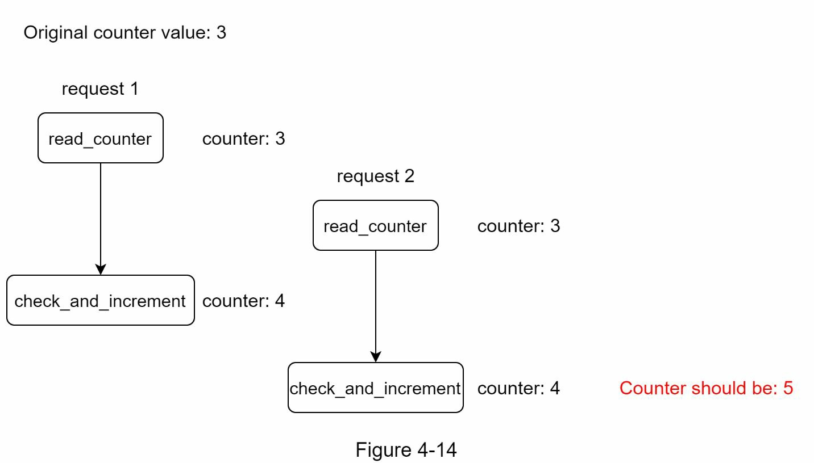

Redis에서 카운터 값이 3이라고 가정합시다. 두 요청이 동시에 카운터 값을 읽은 후 둘 다 값을 다시 쓰기 전에, 각 요청은 카운터를 1씩 증가시키고 다른 스레드를 확인하지 않고 다시 씁니다. 두 요청(스레드)은 모두 올바른 카운터 값 4를 가지고 있다고 믿습니다. 그러나 올바른 카운터 값은 5여야 합니다.

**해결책**: 락(Lock)은 경쟁 상태를 해결하는 가장 명백한 방법입니다. 그러나 락은 시스템을 크게 느리게 합니다. 이 문제를 해결하는 데 일반적으로 사용되는 두 가지 전략이 있습니다:
- **Lua 스크립트(Lua Script)**
- **Redis의 정렬된 세트 데이터 구조(Sorted Sets)**

이 전략들에 관심 있는 독자들은 해당 참고 자료를 참조해주세요.

#### 2. 동기화 문제(Synchronization Issue)

동기화는 분산 환경에서 고려해야 할 또 다른 중요한 요소입니다. 수백만 사용자를 지원하려면 하나의 속도 제한기 서버로는 부족할 수 있습니다.

여러 속도 제한기 서버가 사용되면 동기화가 필요합니다. 예를 들어, Figure 4-15의 왼쪽에서 클라이언트 1은 속도 제한기 1로 요청을 보내고, 클라이언트 2는 속도 제한기 2로 요청을 보냅니다. 웹 티어가 상태를 유지하지 않으므로, 클라이언트는 Figure 4-15의 오른쪽처럼 다른 속도 제한기로 요청을 보낼 수 있습니다.

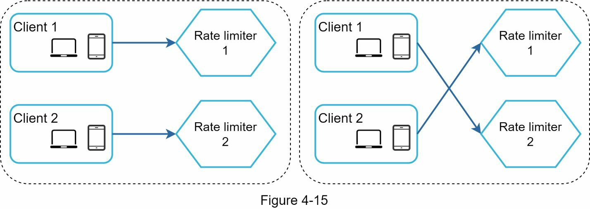

동기화가 일어나지 않으면 속도 제한기 1은 클라이언트 2에 대한 데이터를 포함하지 않습니다. 따라서 속도 제한기는 제대로 작동하지 않습니다.

**해결책**: 가능한 해결책은 Redis와 같은 중앙화된 데이터 저장소를 사용하는 것입니다. 설계는 Figure 4-16에 나타납니다.

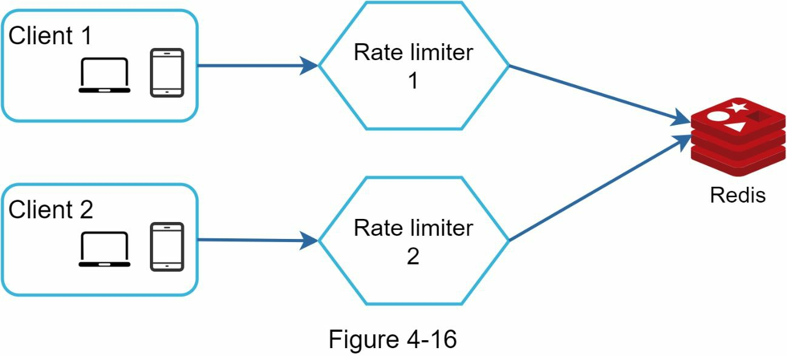

---

### 성능 최적화: 글로벌 규모로의 확장

성능 최적화는 시스템 설계 인터뷰의 흔한 주제입니다. 다음 두 영역의 개선을 살펴봅시다.

#### 1. 다중 데이터센터 설정

다중 데이터센터 설정은 속도 제한기에 매우 중요합니다. 데이터센터에서 멀리 떨어진 사용자의 지연시간이 높기 때문입니다. 대부분의 클라우드 서비스 제공자는 전 세계에 많은 엣지 서버 위치(Edge Server Location)를 구축합니다. 예를 들어, 2020년 5월 20일 기준으로 Cloudflare는 지리적으로 분산된 194개의 엣지 서버를 가지고 있습니다. 트래픽은 지연시간을 줄이기 위해 자동으로 가장 가까운 엣지 서버로 라우팅됩니다.

#### 2. 최종 일관성 모델을 통한 데이터 동기화

최종 일관성 모델(Eventual Consistency Model)로 데이터를 동기화합니다. 최종 일관성 모델이 불분명하다면, "[[6장 키-값 저장소 설계|키-값 저장소]] 설계"의 "일관성(Consistency)" 섹션을 참조해주세요.

---

### 모니터링: 속도 제한기의 효과 검증

속도 제한기가 적용된 후, 속도 제한기가 효과적인지 확인하기 위해 분석 데이터를 수집하는 것이 중요합니다. 주로 다음을 확인하려고 합니다:

- **속도 제한 알고리즘의 효과**: 알고리즘이 예상대로 작동하고 있는가?
- **속도 제한 규칙의 효과**: 규칙이 예상대로 작동하고 있는가?

예를 들어, 속도 제한 규칙이 너무 엄격하면 많은 유효한 요청이 드롭됩니다. 이 경우 규칙을 약간 완화하고 싶을 것입니다. 또 다른 예시에서 우리의 속도 제한기가 플래시 세일(Flash Sale) 같은 갑작스러운 트래픽 증가에 무력할 수 있음을 발견했습니다. 이 시나리오에서는 버스트 트래픽을 지원하는 알고리즘으로 변경할 수 있습니다. **토큰 버킷**이 여기에 적합합니다.

---

## 4단계: 마무리

이 장에서 우리는 속도 제한의 다양한 알고리즘과 그들의 장단점을 논의했습니다. 다루어진 알고리즘은 다음과 같습니다:

- 토큰 버킷(Token Bucket)
- 누수 버킷(Leaking Bucket)
- 고정 윈도우(Fixed Window)
- 슬라이딩 윈도우 로그(Sliding Window Log)
- 슬라이딩 윈도우 카운터(Sliding Window Counter)

그 다음 우리는 시스템 아키텍처, 분산 환경에서의 속도 제한, 성능 최적화 및 모니터링을 논의했습니다.

### 추가 주제들

시간이 허락한다면 언급할 수 있는 추가 주제들:

#### 하드 vs 소프트 속도 제한
- **하드 속도 제한(Hard Rate Limiting)**: 요청 수가 임계값을 초과할 수 없습니다.
- **소프트 속도 제한(Soft Rate Limiting)**: 요청이 짧은 기간 동안 임계값을 초과할 수 있습니다.

#### 다양한 계층에서의 속도 제한
이 장에서는 애플리케이션 계층(HTTP: 계층 7)에서의 속도 제한만 논의했습니다. 다른 계층에서도 속도 제한을 적용할 수 있습니다. 예를 들어, **Iptables**를 사용하여 IP 주소로 속도 제한을 적용할 수 있습니다(IP: 계층 3).

**참고**: **개방 시스템 상호연결 모델(Open Systems Interconnection, OSI 모델)**은 7개 계층을 가집니다:
- 계층 1: 물리 계층(Physical Layer)
- 계층 2: 데이터 링크 계층(Data Link Layer)
- 계층 3: 네트워크 계층(Network Layer)
- 계층 4: 전송 계층(Transport Layer)
- 계층 5: 세션 계층(Session Layer)
- 계층 6: 표현 계층(Presentation Layer)
- 계층 7: 애플리케이션 계층(Application Layer)

#### 속도 제한 회피: 클라이언트 설계 모범 사례
속도 제한되는 것을 피하도록 클라이언트를 설계하세요:

- **클라이언트 캐시 사용**: 빈번한 API 호출을 피하기 위해 클라이언트 캐시를 사용합니다.
- **제한 이해**: 제한을 이해하고 짧은 시간 내에 너무 많은 요청을 보내지 않습니다.
- **예외 처리**: 클라이언트가 예외에서 우아하게 복구할 수 있도록 예외나 오류를 포착하기 위한 코드를 포함합니다.
- **백오프 시간**: 재시도 로직에 충분한 백오프 시간을 추가합니다.

---

여기까지입니다! 지금까지 따라온 자신에게 박수를 쳐주세요. 잘하셨습니다!

---

## 핵심 개념 정리

**토큰 버킷(Token Bucket)**: 버킷에 일정 속도로 토큰을 채우고, 요청마다 토큰을 하나씩 소비하는 알고리즘. 버스트 트래픽을 허용하면서도 평균 처리량을 제어한다.

**누수 버킷(Leaking Bucket)**: FIFO 큐를 사용해 요청을 고정된 속도로 처리하는 알고리즘. 출력 속도가 일정하여 하류 시스템을 안정적으로 보호한다.

**고정 윈도우 카운터(Fixed Window Counter)**: 타임라인을 고정 크기의 시간 윈도우로 나누고 윈도우마다 카운터를 할당하는 알고리즘. 구현이 단순하지만 윈도우 경계에서 버스트 트래픽이 허용량을 초과할 수 있다.

**슬라이딩 윈도우 로그(Sliding Window Log)**: 요청 타임스탬프를 로그에 기록하고 만료된 항목을 제거해 매 순간 정확한 요청 수를 계산하는 알고리즘. 정확도가 높지만 메모리를 많이 소비한다.

**슬라이딩 윈도우 카운터(Sliding Window Counter)**: 고정 윈도우 카운터와 슬라이딩 윈도우 로그를 결합한 하이브리드 방식. 이전 윈도우의 가중치를 적용해 근사값을 계산하며 메모리 효율과 정확도를 절충한다.

**API 게이트웨이(API Gateway)**: 속도 제한·SSL 종료·인증·IP 화이트리스팅 등을 처리하는 완전 관리형 미들웨어 컴포넌트. 마이크로서비스 환경에서 진입점 역할을 한다.

**Redis**: 인메모리 캐시 데이터 저장소로, `INCR`(카운터 증가)과 `EXPIRE`(자동 만료) 명령을 통해 속도 제한 카운터를 빠르고 효율적으로 관리한다.

**HTTP 429 (Too Many Requests)**: 클라이언트가 정해진 시간 안에 너무 많은 요청을 보냈을 때 서버가 반환하는 HTTP 상태 코드. 응답 헤더 `X-Ratelimit-Retry-After`와 함께 재시도 시점을 안내한다.

**경쟁 상태(Race Condition)**: 여러 스레드가 Redis 카운터를 동시에 읽고 쓸 때 카운터 값이 잘못 계산되는 문제. Lua 스크립트나 Redis 정렬된 세트(Sorted Sets)로 원자적 연산을 보장해 해결한다.

**하드/소프트 속도 제한(Hard/Soft Rate Limiting)**: 하드 제한은 임계값을 절대 초과할 수 없고, 소프트 제한은 짧은 기간 동안 초과를 허용한다. 서비스 특성에 따라 선택한다.

**최종 일관성 모델(Eventual Consistency Model)**: 분산 환경의 여러 속도 제한기 인스턴스 간 데이터 동기화 전략. 즉각적 일관성 대신 일정 시간이 지나면 모든 노드가 같은 상태로 수렴하도록 설계한다.

속도 제한기 설계의 핵심은 알고리즘 선택(버스트 허용 여부·정확도·메모리 트레이드오프)과 분산 환경에서의 동기화 문제를 함께 고려하는 것입니다. Redis 같은 중앙화된 인메모리 저장소를 활용하면 낮은 지연시간과 높은 장애 내성을 동시에 달성할 수 있습니다.

## 참고 자료

[1] Rate-limiting strategies and techniques: https://cloud.google.com/solutions/rate-limiting-strategies-techniques

[2] Twitter rate limits: https://developer.twitter.com/en/docs/basics/rate-limits

[3] Google docs usage limits: https://developers.google.com/docs/api/limits

[4] IBM microservices: https://www.ibm.com/cloud/learn/microservices

[5] Throttle API requests for better throughput: https://docs.aws.amazon.com/apigateway/latest/developerguide/api-gateway-request-throttling.html

[6] Stripe rate limiters: https://stripe.com/blog/rate-limiters

[7] Shopify REST Admin API rate limits: https://help.shopify.com/en/api/reference/rest-admin-api-rate-limits

[8] Better Rate Limiting With Redis Sorted Sets: https://engineering.classdojo.com/blog/2015/02/06/rolling-rate-limiter/

[9] System Design — Rate limiter and Data modelling: https://medium.com/@saisandeepmopuri/system-design-rate-limiter-and-data-modelling-9304b0d18250

[10] How we built rate limiting capable of scaling to millions of domains: https://blog.cloudflare.com/counting-things-a-lot-of-different-things/

[11] Redis website: https://redis.io/

[12] Lyft rate limiting: https://github.com/lyft/ratelimit

[13] Scaling your API with rate limiters: https://gist.github.com/ptarjan/e38f45f2dfe601419ca3af937fff574d#request-rate-limiter

[14] What is edge computing: https://www.cloudflare.com/learning/serverless/glossary/what-is-edge-computing/

[15] Rate Limit Requests with Iptables: https://blog.programster.org/rate-limit-requests-with-iptables

[16] OSI model: https://en.wikipedia.org/wiki/OSI_model#Layer_architecture
