## 들어가며

여러 상점에 제품을 나누어 보관한다고 생각해봅시다. 고객이 특정 제품을 찾을 때마다 어느 상점에 가야 할지 빠르게 알아야 합니다. 처음엔 상점이 4개였다가 갑자기 5개가 되면 어떻게 될까요? 혹은 한 상점이 문을 닫으면요? 이럴 때마다 모든 제품의 위치를 다시 정리한다면 엄청난 혼란이 생길 겁니다. 수평 확장(horizontal scaling)을 달성하려면 요청과 데이터를 서버 전체에 효율적이고 균등하게 분산시켜야 합니다. **일관 해싱(Consistent Hashing)**은 이 목표를 달성하기 위해 널리 사용되는 기법입니다. 이 장에서는 그 필요성과 작동 원리를 자세히 살펴보겠습니다.

---

## 리해싱 문제: 기존 방식은 왜 문제를 일으키나

캐시 서버가 n개 있을 때, 부하를 균형 있게 분산하는 일반적인 방법은 다음 해시 함수를 사용하는 것입니다:

```
serverIndex = hash(key) % N
```

여기서 N은 서버 풀의 크기입니다.

구체적인 예를 들어봅시다. 아래 표와 같이 4개의 서버와 8개의 문자열 키가 있다고 가정합니다.

| Key | Hash | hash(key) % 4 |
|-----|------|---------------|
| key0 | 12353 | 1 |
| key1 | 5327 | 3 |
| key2 | 17334 | 2 |
| key3 | 81236 | 0 |
| key4 | 49301 | 1 |
| key5 | 5671 | 3 |
| key6 | 17346 | 2 |
| key7 | 75311 | 3 |

특정 키가 어느 서버에 저장되어 있는지 알아내려면, hash(key) % 4 연산을 수행합니다. 예를 들어 hash(key0) % 4 = 1이면, 클라이언트는 서버 1에 접속하여 캐시된 데이터를 가져와야 합니다.

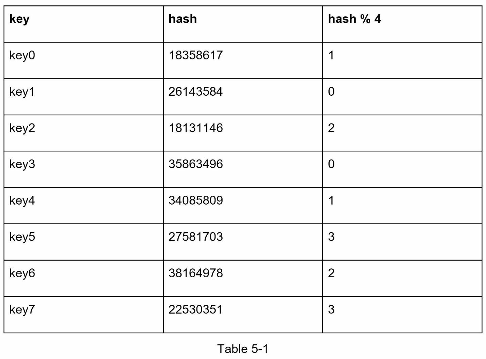

이 방식은 서버 풀의 크기가 고정되어 있고 데이터 분배가 균등할 때 잘 작동합니다. 그러나 새 서버가 추가되거나 기존 서버가 제거될 때 문제가 발생합니다.

예를 들어, 서버 1이 오프라인 상태가 되면 서버 풀의 크기는 3이 됩니다. 같은 해시 함수를 사용하면 키의 해시값은 동일하지만, 모듈로 연산의 결과는 서버 개수가 1개 줄었기 때문에 완전히 달라집니다. hash % 3을 적용하면 다음과 같은 결과를 얻습니다:

| Key | Hash | hash(key) % 3 |
|-----|------|---------------|
| key0 | 12353 | 1 |
| key1 | 5327 | 1 |
| key2 | 17334 | 2 |
| key3 | 81236 | 0 |
| key4 | 49301 | 1 |
| key5 | 5671 | 2 |
| key6 | 17346 | 2 |
| key7 | 75311 | 2 |

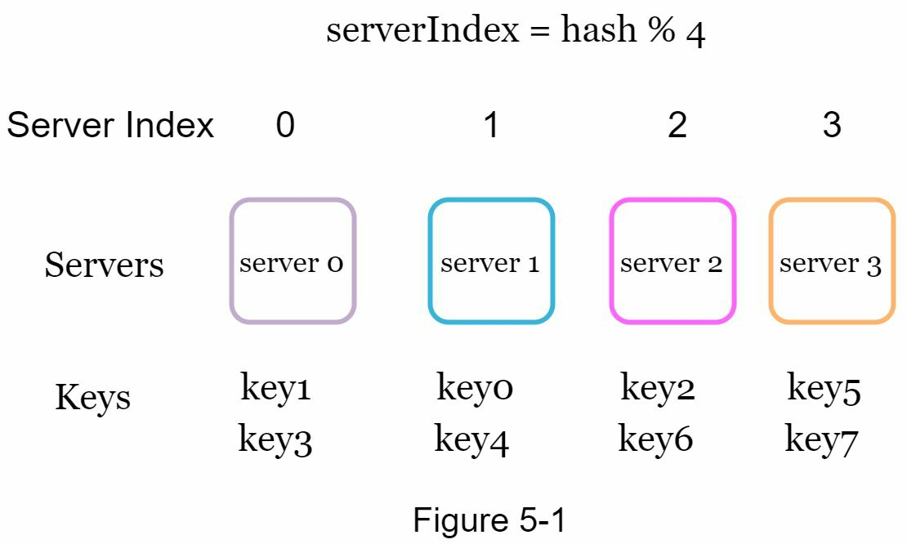

그림 5-2에서 보이듯이, 원래 오프라인 상태인 서버 1에만 저장되었던 키들뿐 아니라 대부분의 키가 재분배됩니다. 이는 서버 1이 오프라인이 되면 대부분의 캐시 클라이언트가 잘못된 서버에 접속하게 되어 캐시 미스(cache miss) 폭주(storm)를 초래한다는 의미입니다. 이것이 바로 **일관 해싱**이 이 문제를 완화하기 위해 고안된 이유입니다.

---

## 일관 해싱: 효율적인 해결책

위키피디아에서 인용하면, "일관 해싱은 특별한 종류의 해싱입니다. 해시 테이블이 크기를 조정하고 일관 해싱이 사용될 때, 평균적으로 k/n개의 키만 재맵핑되어야 합니다. 여기서 k는 키의 개수이고 n은 슬롯의 개수입니다. 이와는 대조적으로, 대부분의 전통적인 해시 테이블에서는 배열 슬롯의 개수가 변하면 거의 모든 키가 재맵핑됩니다."

### 해시 공간과 해시 링: 선형에서 원형으로

일관 해싱의 작동 원리를 이해하기 위해, SHA-1을 해시 함수 f로 사용한다고 가정해봅시다. 해시 함수의 출력 범위는 x0, x1, x2, x3, …, xn입니다. 암호학에서 SHA-1의 해시 공간(hash space)은 0에서 2^160 - 1까지입니다. 즉, x0은 0에 대응되고, xn은 2^160 - 1에 대응되며, 그 중간의 모든 해시값은 0과 2^160 - 1 사이에 분포합니다.

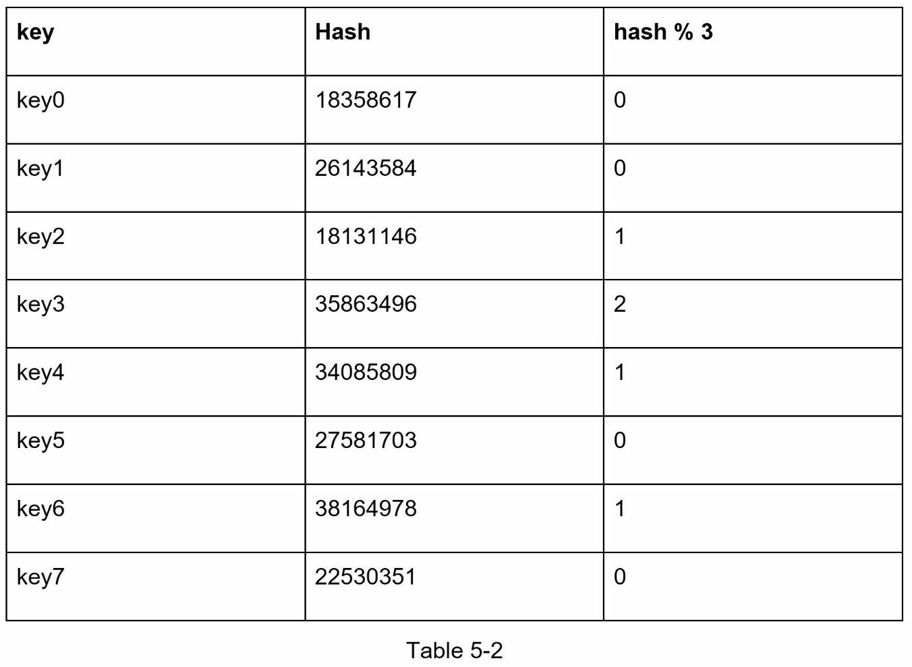

이 양 끝을 연결하면 **해시 링(hash ring)**을 얻게 됩니다:

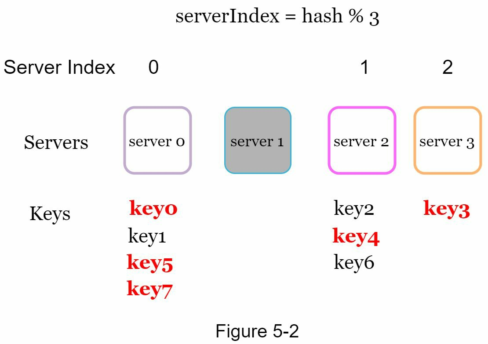

### 해시 서버: 서버를 링 위에 배치하기

같은 해시 함수 f를 사용하여, 서버의 IP 주소나 이름을 기반으로 서버들을 링 위에 맵핑합니다.

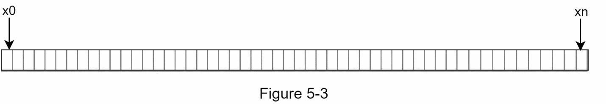

### 해시 키: 데이터도 링 위에 배치하기

여기서 주목할 점은, 리해싱 문제에서 사용한 해시 함수와 다르게 모듈로 연산이 없다는 것입니다. 그림 5-6과 같이, 4개의 캐시 키(key0, key1, key2, key3)가 해시 링 위에 맵핑됩니다.

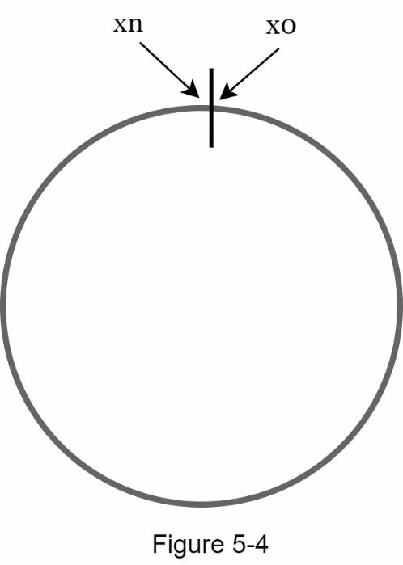

### 서버 조회: 링 위에서 시계 방향으로 이동하기

특정 키가 어느 서버에 저장되어 있는지 알아내려면, 링 위의 키 위치에서 출발하여 시계 방향으로 이동하면서 처음으로 만나는 서버를 찾습니다.

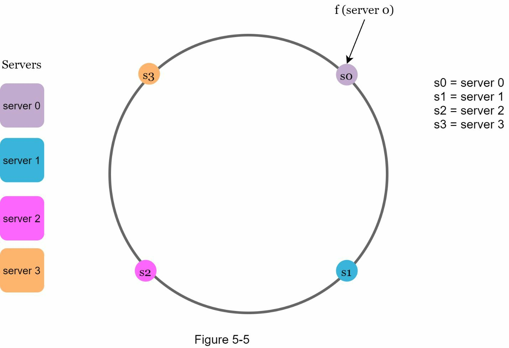

그림 5-7에서 볼 수 있듯이, 시계 방향으로 이동하면:
- key0은 서버 0에 저장됩니다
- key1은 서버 1에 저장됩니다
- key2는 서버 2에 저장됩니다
- key3은 서버 3에 저장됩니다

### 서버 추가: 최소한의 재분배만 필요

위에서 설명한 로직을 사용하면, 새 서버를 추가할 때 극히 일부의 키만 재분배하면 됩니다.

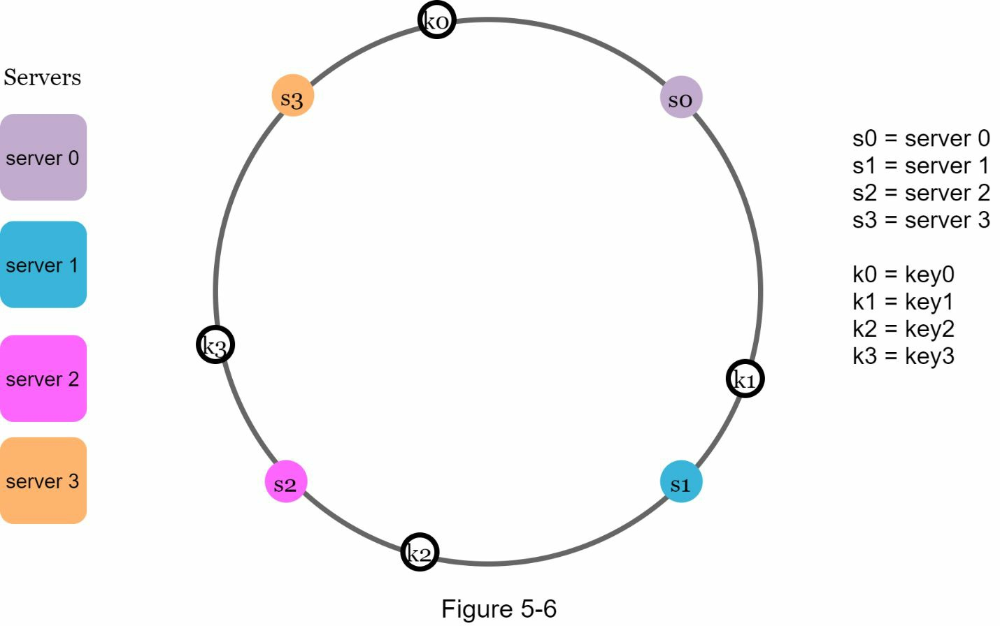

그림 5-8에서 새로운 서버 4가 추가되면, **오직 key0만 재분배됩니다**. key1, key2, key3은 동일한 서버에 남아 있습니다. 자세히 살펴보면, 서버 4가 추가되기 전에는 key0이 서버 0에 저장되어 있었습니다. 이제 key0은 key0의 위치에서 시계 방향으로 이동했을 때 처음으로 만나는 서버인 서버 4에 저장됩니다. 다른 키들은 일관 해싱 알고리즘에 따라 재분배되지 않습니다.

### 서버 제거: 영향받는 데이터만 옮기기

서버가 제거될 때도, 일관 해싱을 사용하면 적은 수의 키만 재분배됩니다.

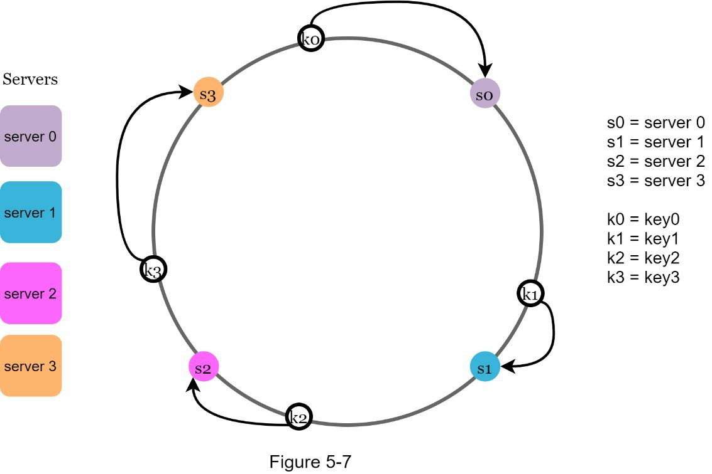

그림 5-9에서 서버 1이 제거되면, **오직 key1만 서버 2로 재맵핑됩니다**. 나머지 키들은 영향을 받지 않습니다.

---

## 기본 접근의 두 가지 문제점과 해결책

MIT의 Karger 등에 의해 소개된 일관 해싱 알고리즘의 기본 단계는 다음과 같습니다:

1. 균등하게 분포하는 해시 함수를 사용하여 서버와 키를 링 위에 맵핑합니다
2. 특정 키가 어느 서버에 맵핑되는지 찾으려면, 키의 위치에서 시계 방향으로 이동하여 링 위의 첫 서버를 찾습니다

그러나 이 접근 방식에는 두 가지 문제가 식별됩니다.

**첫 번째 문제: 불균형한 파티션**

서버가 추가되거나 제거될 수 있다는 점을 고려하면, 링 위의 모든 서버에 대해 동일 크기의 파티션을 유지하는 것은 불가능합니다. 파티션(partition)은 인접한 서버들 사이의 해시 공간입니다. 각 서버에 할당된 파티션의 크기가 매우 작을 수도 있고 매우 클 수도 있습니다.

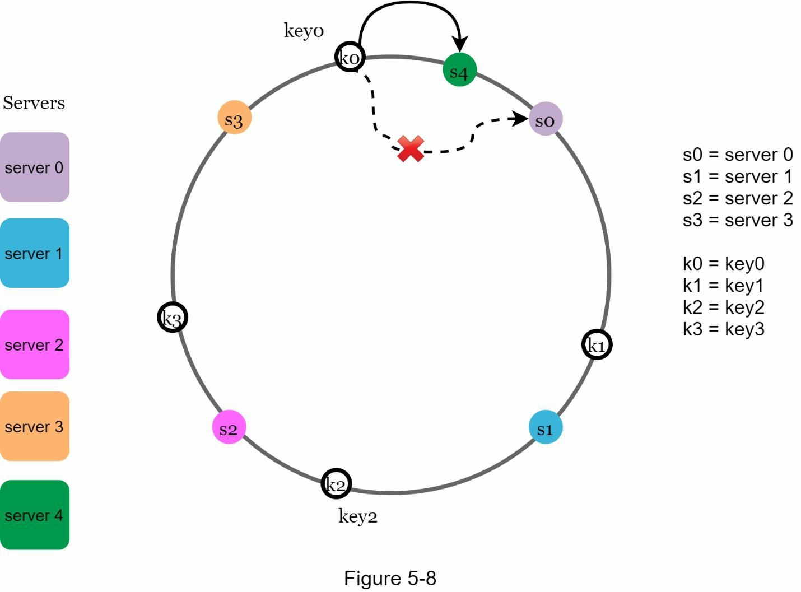

그림 5-10에서 s1이 제거되면, s2의 파티션(양방향 화살표로 표시)은 s0과 s3의 파티션보다 2배나 큽니다.

**두 번째 문제: 불균형한 키 분배**

링 위에 키가 균등하지 않게 분배될 수 있습니다. 예를 들어, 서버들이 그림 5-11과 같은 위치에 맵핑되면, 대부분의 키가 서버 2에 저장되고, 서버 1과 서버 3에는 데이터가 전혀 없을 수 있습니다.

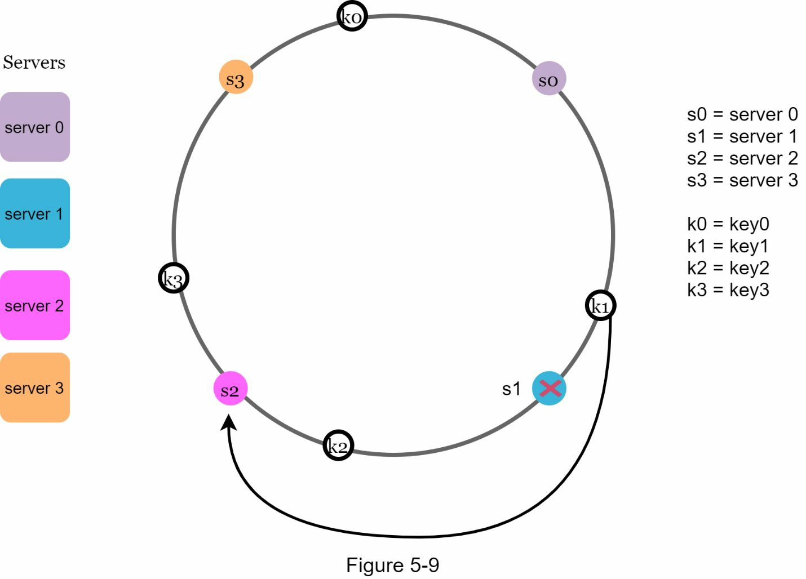

### 가상 노드: 문제를 해결하는 기법

**가상 노드(virtual nodes)** 또는 **레플리카(replicas)**라는 기법을 사용하면 이 두 문제를 모두 해결할 수 있습니다. 가상 노드는 실제 노드를 가리키며, 각 서버는 링 위에 여러 개의 가상 노드로 표현됩니다.

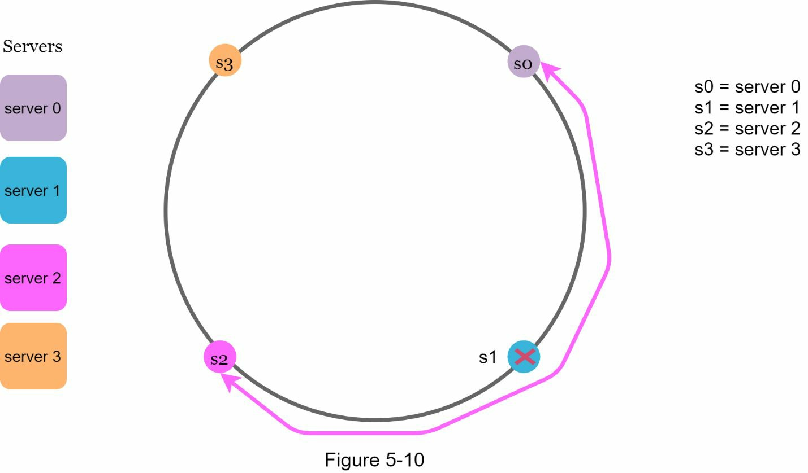

그림 5-12에서 서버 0과 서버 1은 각각 3개의 가상 노드를 가집니다. 여기서 3이라는 숫자는 임의로 선택한 것이며, 실제 시스템에서는 훨씬 더 많은 가상 노드를 사용합니다. 서버 0을 나타내기 위해 s0을 사용하는 대신 s0_0, s0_1, s0_2를 링 위에 배치합니다. 마찬가지로 s1_0, s1_1, s1_2가 서버 1을 나타냅니다. 

가상 노드 덕분에 각 서버는 여러 개의 파티션을 담당하게 됩니다. s0이라는 레이블이 붙은 파티션(간선)은 서버 0이 관리하고, s1이라는 레이블이 붙은 파티션은 서버 1이 관리합니다.

특정 키가 어느 서버에 저장되어 있는지 찾으려면, 키의 위치에서 시계 방향으로 이동하여 처음으로 만나는 가상 노드를 찾습니다.

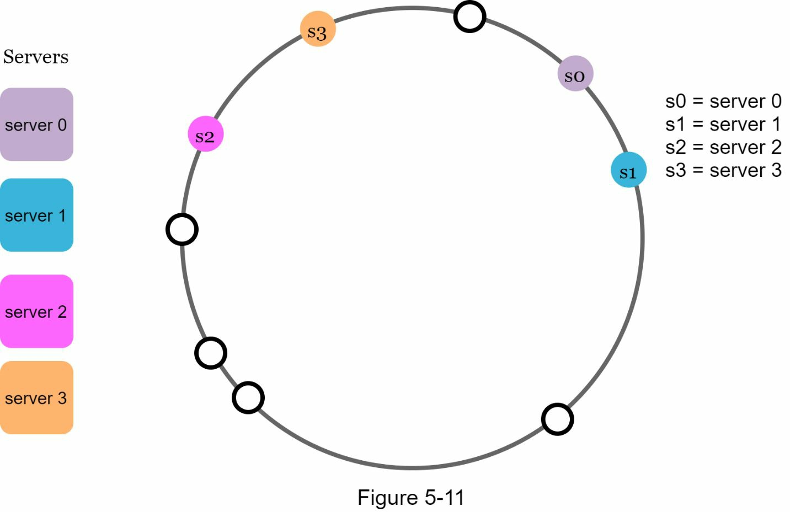

그림 5-13에서 k0이 어느 서버에 저장되어 있는지 알아내려면, k0의 위치에서 시계 방향으로 이동하여 가상 노드 s1_1을 만나고, 이는 서버 1을 가리킵니다.

### 가상 노드의 균형 효과

가상 노드의 개수가 증가할수록 키의 분배가 더욱 균등해집니다. 표준 편차(standard deviation)가 작아질수록 데이터 분배가 균등하기 때문입니다. 표준 편차는 데이터가 얼마나 흩어져 있는지를 측정합니다.

온라인 연구에 따르면, 100개에서 200개 정도의 가상 노드를 사용했을 때:
- 200개 가상 노드: 표준 편차 약 5% (평균 기준)
- 100개 가상 노드: 표준 편차 약 10% (평균 기준)

가상 노드를 더 많이 사용할수록 표준 편차는 더 작아집니다. 그러나 가상 노드 정보를 저장하기 위해 더 많은 공간이 필요합니다. 이는 트레이드오프(trade-off)이므로, 시스템 요구사항에 맞게 가상 노드의 개수를 조정할 수 있습니다.

---

## 영향받는 키 찾기: 효율적인 재분배 범위 결정

서버가 추가되거나 제거될 때, 일부 데이터를 재분배해야 합니다. 어떤 범위의 키를 재분배할지는 어떻게 알 수 있을까요?

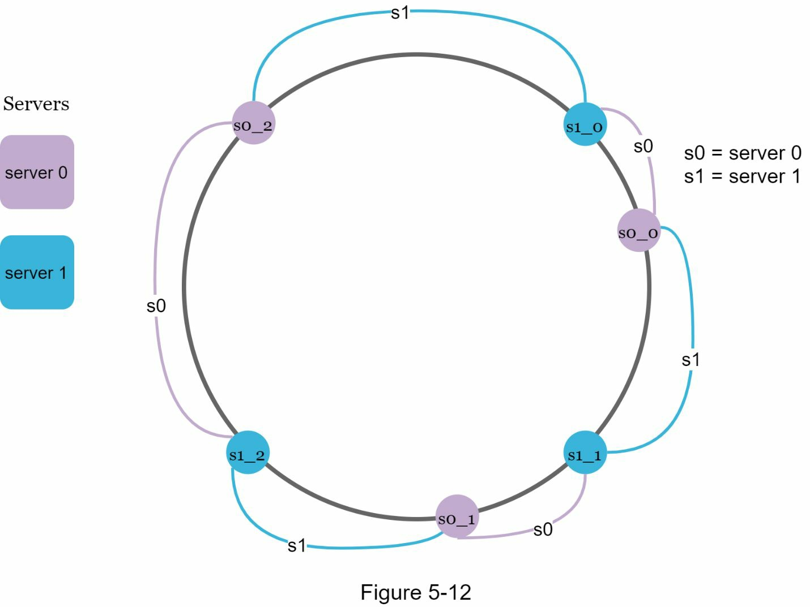

그림 5-14에서 서버 4가 링에 추가되면, 영향받는 범위는 s4(새로 추가된 노드)에서 시작하여 반시계 방향으로 이동하면서 서버를 만날 때까지(s3) 진행됩니다. 따라서 s3과 s4 사이에 위치한 키들이 s4로 재분배되어야 합니다.

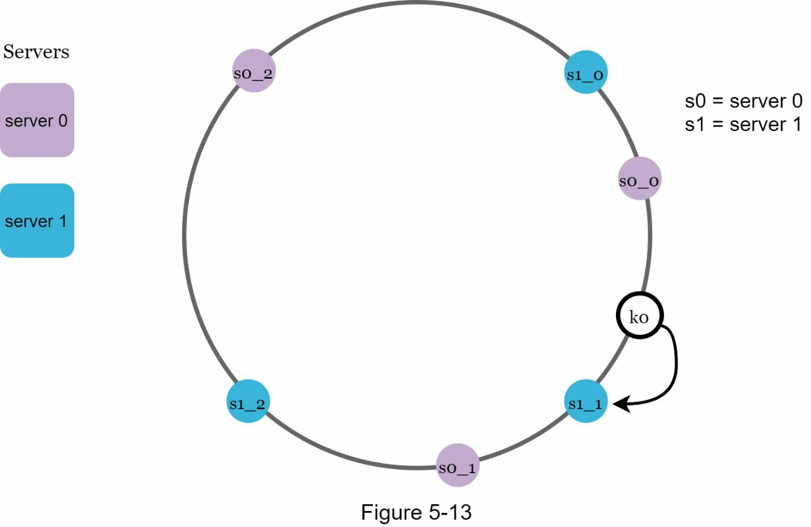

그림 5-15에서 보이듯이, 서버 s1이 제거될 때, 영향받는 범위는 s1(제거된 노드)에서 시작하여 반시계 방향으로 이동하면서 서버를 만날 때까지(s0) 진행됩니다. 따라서 s0과 s1 사이에 위치한 키들을 s2로 재분배해야 합니다.

---

## 핵심 정리: 일관 해싱의 이점

이 장에서 우리는 일관 해싱이 왜 필요한지, 그리고 어떻게 작동하는지에 대해 심도 있게 살펴보았습니다. 일관 해싱의 주요 이점은 다음과 같습니다:

**재분배되는 키의 최소화**
- 서버가 추가되거나 제거될 때, 극히 일부의 키만 재분배됩니다. 이는 기존의 모듈로 기반 방식과 근본적으로 다릅니다.

**수평 확장의 용이성**
- 데이터가 더욱 균등하게 분산되기 때문에 수평 확장이 간편합니다. 새 서버를 추가하기만 하면 자동으로 일부 데이터를 받게 됩니다.

**핫스팟 키 문제 완화**
- 특정 샤드(shard)에 대한 과도한 접근으로 인한 서버 과부하를 방지합니다. 예를 들어, Katy Perry, Justin Bieber, Lady Gaga의 데이터가 모두 같은 샤드에 끝나는 상황을 일관 해싱이 데이터를 더욱 균등하게 분산시켜 완화할 수 있습니다.

### 실제 시스템에서의 사용

일관 해싱은 많은 실제 시스템에서 널리 사용되고 있습니다:

- **Amazon Dynamo 데이터베이스**: 파티셔닝 컴포넌트에 사용
- **Apache Cassandra**: 클러스터 전체의 데이터 파티셔닝에 사용
- **Discord 채팅 애플리케이션**: 대규모 동시 사용자 처리
- **Akamai 콘텐츠 전달 네트워크**: 엣지 서버 분산
- **Maglev 네트워크 로드 밸런서**: 트래픽 분산

지금까지 따라와주신 여정에 축하합니다! 이 복잡한 개념을 끝까지 학습하셨으니, 자신에게 박수를 보내주세요. 잘하셨습니다!

---

## 핵심 개념 정리

**일관 해싱(Consistent Hashing)**: 해시 테이블 크기 변경 시 평균 k/n개의 키만 재맵핑되도록 설계된 특수 해싱 기법으로, 서버 추가·제거 시 영향을 최소화합니다.

**리해싱(Rehashing)**: 서버 풀 크기 N이 변할 때 기존 모듈로 기반 해싱(hash(key) % N)을 재계산하는 과정으로, 대부분의 키가 재분배되는 문제가 발생합니다.

**해시 링(Hash Ring)**: 해시 공간(0 ~ 2^160 - 1)의 양 끝을 연결하여 원형으로 구성한 자료 구조로, 서버와 키를 같은 공간 위에 배치하여 조회를 단순화합니다.

**해시 공간(Hash Space)**: SHA-1 등 해시 함수의 출력값이 분포하는 범위로, 일관 해싱에서는 0에서 2^160 - 1까지의 공간을 사용합니다.

**가상 노드(Virtual Nodes)**: 하나의 실제 서버를 링 위에 여러 위치로 분산 배치하는 기법으로, 파티션 크기 불균형과 키 분배 불균형을 동시에 완화합니다.

**레플리카(Replicas)**: 가상 노드의 다른 명칭으로, 각 서버(s0)를 s0_0, s0_1, s0_2처럼 복수의 위치로 표현하여 링 위의 분포를 고르게 만듭니다.

**파티션(Partition)**: 해시 링 위에서 인접한 두 서버 사이의 해시 공간 구간으로, 그 구간에 속한 키는 시계 방향으로 만나는 첫 서버가 담당합니다.

**캐시 미스(Cache Miss)**: 클라이언트가 요청한 데이터가 대상 서버에 없는 상황으로, 리해싱 후 대부분의 키가 잘못된 서버로 매핑될 때 대규모로 발생합니다.

**표준 편차(Standard Deviation)**: 데이터 분배의 균등함을 측정하는 지표로, 가상 노드 수가 증가할수록 키 분배의 표준 편차가 작아져 부하 불균형이 줄어듭니다.

**수평 확장(Horizontal Scaling)**: 서버 수를 늘려 처리 용량을 키우는 방식으로, 일관 해싱은 서버 추가 시 극히 일부의 키만 재분배하여 이를 효율적으로 지원합니다.

**핫스팟(Hotspot)**: 특정 서버나 샤드에 트래픽이 과도하게 집중되는 현상으로, 가상 노드를 통한 균등 분산으로 완화할 수 있습니다.

일관 해싱은 해시 링과 가상 노드를 결합하여, 서버 구성이 동적으로 바뀌는 분산 시스템에서도 재분배 비용을 최소화하고 부하를 균등하게 유지하는 핵심 기법입니다. Amazon Dynamo, Apache Cassandra 등 대규모 프로덕션 시스템에서 파티셔닝의 근간으로 사용됩니다.

---

## 참고문헌

[1] Consistent hashing: https://en.wikipedia.org/wiki/Consistent_hashing

[2] Consistent Hashing: https://tom-e-white.com/2007/11/consistent-hashing.html

[3] Dynamo: Amazon's Highly Available Key-value Store: https://www.allthingsdistributed.com/files/amazon-dynamo-sosp2007.pdf

[4] Cassandra - A Decentralized Structured Storage System: http://www.cs.cornell.edu/Projects/ladis2009/papers/Lakshman-ladis2009.PDF

[5] How Discord Scaled Elixir to 5,000,000 Concurrent Users: https://blog.discord.com/scaling-elixir-f9b8e1e7c29b

[6] CS168: The Modern Algorithmic Toolbox Lecture #1: Introduction and Consistent Hashing: http://theory.stanford.edu/~tim/s16/l/l1.pdf

[7] Maglev: A Fast and Reliable Software Network Load Balancer: https://static.googleusercontent.com/media/research.google.com/en//pubs/archive/44824.pdf
