## 서론: 모든 데이터에는 주소가 필요합니다

도서관을 떠올려 봅시다. 수십만 권의 책이 있는 도서관에서 원하는 책을 찾으려면 어떻게 해야 할까요? 제목이라는 **키(key)**를 알면 해당 책의 위치라는 **값(value)**을 즉시 찾을 수 있습니다. 결론부터 말하면, 키-값 저장소(Key-Value Store)는 바로 이 원리를 따르는 가장 단순하면서도 강력한 형태의 데이터베이스입니다.

키-값 저장소(Key-Value Store), 혹은 키-값 데이터베이스(Key-Value Database)는 비관계형(non-relational) 데이터베이스의 한 종류입니다. 각 고유 식별자는 연관된 값(value)과 함께 키(key)로 저장되며, 이 데이터 쌍을 "키-값 쌍(key-value pair)"이라고 합니다.

키-값 쌍에서 키는 반드시 고유해야 하며, 키를 통해 연관된 값에 접근할 수 있습니다. 키는 일반 텍스트(plain text)이거나 해시값(hashed value)일 수 있습니다. 성능 측면에서는 짧은 키가 더 유리합니다. 키의 형태는 어떨까요? 몇 가지 예시를 살펴봅시다.

- 일반 텍스트 키: `"last_logged_in_at"`
- 해시 키: `253DDEC4`

키-값 쌍에서 값(value)은 문자열, 리스트, 객체 등 어떤 형태든 될 수 있습니다. Amazon DynamoDB [1], Memcached [2], Redis [3] 같은 키-값 저장소에서 값은 일반적으로 불투명한 객체(opaque object)로 취급됩니다.

아래는 키-값 저장소의 데이터 예시입니다.

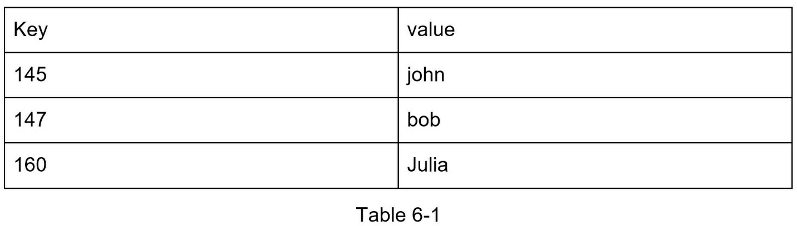

이 장에서는 다음 두 가지 연산을 지원하는 키-값 저장소를 설계해 봅니다.

```
put(key, value)  // "key"와 연관된 "value"를 삽입
get(key)         // "key"와 연관된 "value"를 조회
```

---

## 문제 이해와 설계 범위 파악: 무엇을 만들어야 할까요?

완벽한 설계란 존재하지 않습니다. 모든 설계는 읽기, 쓰기, 메모리 사용량 간의 트레이드오프(tradeoff)를 특정 방향으로 균형을 잡은 결과물입니다. 또한 일관성(consistency)과 가용성(availability) 사이에서도 선택이 필요합니다. 이 장에서 설계하는 키-값 저장소는 다음 특성을 갖추고 있습니다.

- 키-값 쌍의 크기는 작습니다: 10 KB 미만
- 대용량 데이터를 저장할 수 있습니다
- **고가용성(High Availability)**: 장애 상황에서도 시스템이 신속히 응답합니다
- **고확장성(High Scalability)**: 대규모 데이터셋을 지원하도록 확장할 수 있습니다
- **자동 확장(Automatic Scaling)**: 트래픽에 따라 서버 추가 및 삭제가 자동으로 이루어집니다
- **조정 가능한 일관성(Tunable Consistency)**
- **낮은 지연 시간(Low Latency)**

---

## 단일 서버 키-값 저장소: 한계는 어디에 있을까요?

단일 서버에 키-값 저장소를 구축하는 것은 어렵지 않습니다. 직관적인 접근법은 키-값 쌍을 해시 테이블(hash table)에 저장하는 것인데, 이는 모든 데이터를 메모리에 유지합니다. 메모리 접근은 빠르지만, 공간 제약으로 인해 모든 데이터를 메모리에 올리는 것은 불가능할 수 있습니다. 단일 서버에 더 많은 데이터를 담기 위해 두 가지 최적화를 시도할 수 있습니다.

- **데이터 압축(Data Compression)**
- **자주 사용되는 데이터만 메모리에 저장**하고 나머지는 디스크에 보관

이러한 최적화를 적용하더라도 단일 서버는 금방 용량 한계에 다다릅니다. 빅데이터를 지원하려면 **분산 키-값 저장소(Distributed Key-Value Store)**가 필요합니다.

---

## 분산 키-값 저장소: 세 가지 보장 중 두 가지를 선택해야 한다면?

분산 키-값 저장소(Distributed Key-Value Store)는 분산 해시 테이블(distributed hash table)이라고도 불리며, 키-값 쌍을 여러 서버에 분산 저장합니다. 분산 시스템을 설계할 때는 **CAP 정리(CAP theorem)**를 이해하는 것이 매우 중요합니다.

### CAP 정리: 세 가지를 동시에 가질 수는 없습니다

CAP 정리는 분산 시스템이 다음 세 가지 보장을 동시에 모두 제공하는 것은 불가능하다고 말합니다: **일관성(Consistency)**, **가용성(Availability)**, **파티션 내성(Partition Tolerance)**. 각 용어의 정의를 살펴봅시다.

- **일관성(Consistency)**: 모든 클라이언트가 어떤 노드에 연결하든 동시에 동일한 데이터를 본다는 것을 의미합니다.
- **가용성(Availability)**: 일부 노드가 다운되더라도 데이터를 요청하는 클라이언트가 반드시 응답을 받는다는 것을 의미합니다.
- **파티션 내성(Partition Tolerance)**: 파티션(partition)은 두 노드 간의 통신 단절을 의미합니다. 파티션 내성이란 네트워크 파티션이 발생해도 시스템이 계속 동작한다는 것을 의미합니다.

CAP 정리에 따르면, 세 가지 속성 중 하나를 포기해야 나머지 두 가지를 지원할 수 있습니다. 이를 그림으로 나타내면 Figure 6-1과 같습니다.

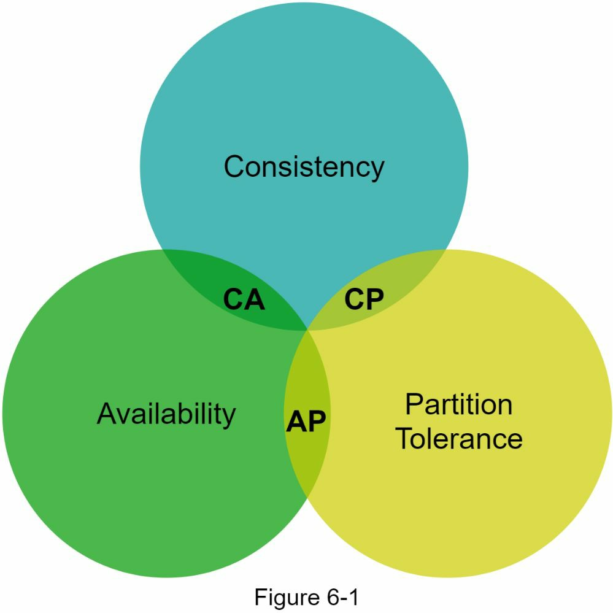

오늘날 키-값 저장소는 지원하는 두 가지 CAP 특성에 따라 분류됩니다.

- **CP(일관성 + 파티션 내성) 시스템**: 가용성을 희생하면서 일관성과 파티션 내성을 지원합니다.
- **AP(가용성 + 파티션 내성) 시스템**: 일관성을 희생하면서 가용성과 파티션 내성을 지원합니다.
- **CA(일관성 + 가용성) 시스템**: 파티션 내성을 희생하면서 일관성과 가용성을 지원합니다. 그러나 네트워크 장애는 피할 수 없으므로, 분산 시스템은 반드시 네트워크 파티션을 허용해야 합니다. 따라서 CA 시스템은 실제로 존재할 수 없습니다.

### 이상적인 상황과 현실: 파티션이 발생하면 무엇을 선택할까요?

앞서 살펴본 내용은 주로 정의에 관한 것이었습니다. 이해를 돕기 위해 구체적인 예를 살펴봅시다. 분산 시스템에서 데이터는 보통 여러 번 복제됩니다. 데이터가 세 개의 복제 노드 n1, n2, n3에 복제되는 상황을 Figure 6-2에서 확인해 봅시다.

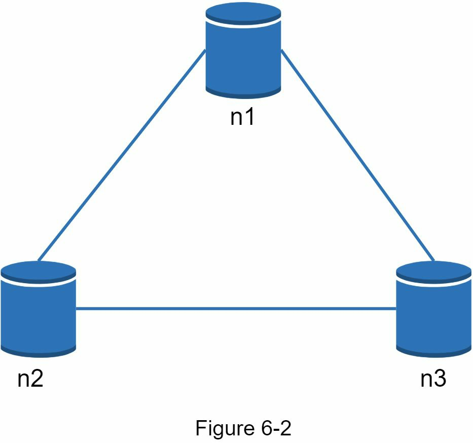

**이상적인 상황**: 이상적인 세계에서는 네트워크 파티션이 발생하지 않습니다. n1에 쓰여진 데이터는 자동으로 n2와 n3에 복제되며, 일관성과 가용성이 모두 달성됩니다.

**현실의 분산 시스템**: 분산 시스템에서 파티션은 피할 수 없습니다. 파티션이 발생하면 일관성과 가용성 중 하나를 선택해야 합니다. Figure 6-3에서 n3이 다운되어 n1, n2와 통신할 수 없는 상황을 살펴봅시다. 클라이언트가 n1이나 n2에 데이터를 쓰면, 해당 데이터는 n3으로 전파될 수 없습니다. 반대로 n3에 데이터가 쓰여졌지만 n1, n2에 전파되지 않았다면, n1과 n2는 오래된(stale) 데이터를 가지게 됩니다.

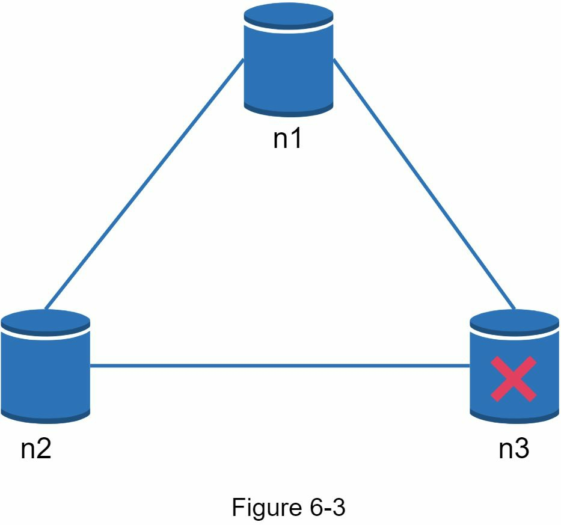

**CP 시스템을 선택한다면**: 일관성을 가용성보다 우선시할 경우(CP 시스템), 세 서버 간의 데이터 불일치를 방지하기 위해 n1과 n2의 모든 쓰기 연산을 차단해야 합니다. 이는 시스템을 사용 불가능하게 만듭니다. 은행 시스템은 보통 매우 높은 일관성 요구 사항을 갖습니다. 예를 들어, 은행 시스템은 최신 잔액 정보를 표시하는 것이 매우 중요합니다. 네트워크 파티션으로 인해 불일치가 발생하면, 은행 시스템은 불일치가 해소될 때까지 오류를 반환합니다.

**AP 시스템을 선택한다면**: 반대로 가용성을 일관성보다 우선시할 경우(AP 시스템), 시스템은 오래된 데이터를 반환할 수 있더라도 읽기 요청을 계속 수락합니다. 쓰기의 경우, n1과 n2는 쓰기를 계속 수락하고 네트워크 파티션이 해소되면 데이터가 n3에 동기화됩니다.

사용 사례에 맞는 CAP 보장을 선택하는 것은 분산 키-값 저장소를 구축하는 중요한 단계입니다. 면접관과 이를 논의하고 그에 맞게 시스템을 설계할 수 있습니다.

---

## 시스템 구성 요소: 키-값 저장소는 어떻게 만들어질까요?

이 섹션에서는 키-값 저장소를 구축하는 데 사용되는 다음 핵심 구성 요소와 기법을 살펴봅니다.

- 데이터 파티셔닝(Data Partition)
- 데이터 복제(Data Replication)
- 일관성(Consistency)
- 불일치 해소(Inconsistency Resolution)
- 장애 처리(Handling Failures)
- 시스템 아키텍처 다이어그램(System Architecture Diagram)
- 쓰기 경로(Write Path)
- 읽기 경로(Read Path)

아래 내용은 세 가지 인기 있는 키-값 저장소 시스템인 Dynamo [4], Cassandra [5], BigTable [6]을 주로 참고합니다.

### 데이터 파티셔닝: 데이터를 균등하게 나누는 방법

대규모 애플리케이션에서 전체 데이터셋을 단일 서버에 담는 것은 불가능합니다. 가장 간단한 해결책은 데이터를 더 작은 파티션으로 나누어 여러 서버에 저장하는 것입니다. 데이터 파티셔닝에는 두 가지 과제가 있습니다.

- 여러 서버에 데이터를 **균등하게 분산**
- 노드가 추가되거나 제거될 때 **데이터 이동을 최소화**

5장에서 설명한 **[[5장 일관 해싱 설계|일관 해싱]](Consistent Hashing)**은 이 문제를 해결하는 훌륭한 기법입니다. 높은 수준에서 일관된 해싱이 어떻게 동작하는지 다시 살펴봅시다.

- 먼저 서버들이 해시 링(hash ring)에 배치됩니다. Figure 6-4에서 s0, s1, …, s7로 표시된 여덟 개의 서버가 해시 링에 배치됩니다.
- 다음으로 키를 동일한 링에 해시하고, 시계 방향으로 이동하면서 처음 만나는 서버에 저장합니다. 예를 들어, key0은 이 로직으로 s1에 저장됩니다.

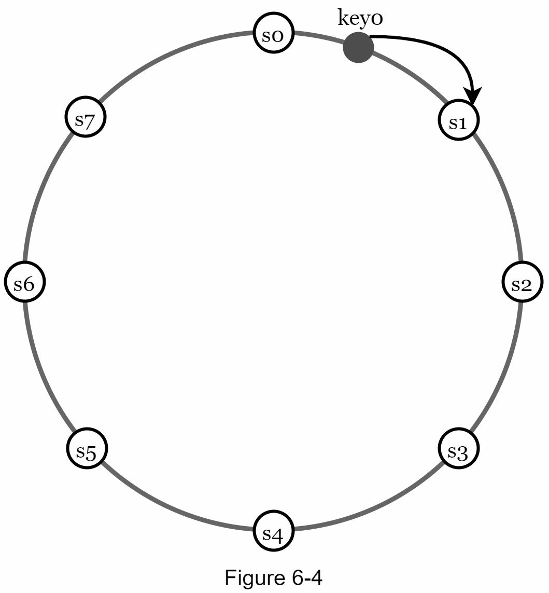

일관된 해싱을 사용한 데이터 파티셔닝의 장점은 다음과 같습니다.

- **자동 확장(Automatic Scaling)**: 부하에 따라 서버를 자동으로 추가하고 제거할 수 있습니다.
- **이질성(Heterogeneity)**: 서버의 가상 노드(virtual node) 수는 서버 용량에 비례합니다. 예를 들어, 용량이 더 큰 서버에는 더 많은 가상 노드가 할당됩니다.

### 데이터 복제: 신뢰성을 어떻게 높일까요?

고가용성(high availability)과 신뢰성(reliability)을 달성하려면 데이터를 N개의 서버에 비동기적으로 복제해야 합니다. N은 설정 가능한 매개변수입니다. 이 N개의 서버는 다음 로직으로 선택됩니다: 키가 해시 링의 한 위치에 매핑된 후, 그 위치에서 시계 방향으로 이동하면서 링에서 처음 만나는 N개의 서버를 선택합니다. Figure 6-5에서 N = 3일 때, key0은 s1, s2, s3에 복제됩니다.

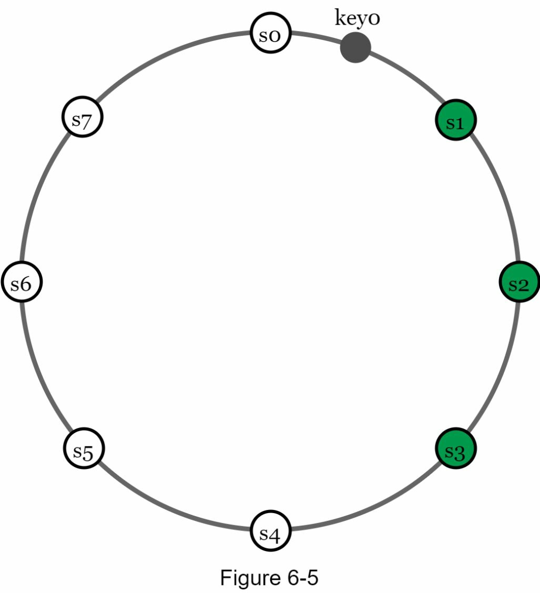

가상 노드를 사용하면 링의 처음 N개 노드가 N개 미만의 물리적 서버에 속할 수 있습니다. 이 문제를 방지하기 위해 시계 방향 탐색 로직을 수행할 때 고유한 서버만 선택합니다.

같은 데이터 센터의 노드들은 정전, 네트워크 문제, 자연재해 등으로 동시에 장애가 발생하는 경우가 많습니다. 더 높은 신뢰성을 위해 복제본은 서로 다른 데이터 센터에 배치되며, 데이터 센터들은 고속 네트워크로 연결됩니다.

### 일관성: 쿼럼 합의란 무엇인가?

데이터가 여러 노드에 복제되므로 복제본 간에 동기화가 필요합니다. **쿼럼 합의(Quorum Consensus)**는 읽기 및 쓰기 연산 모두에 대한 일관성을 보장할 수 있습니다. 먼저 몇 가지 정의를 살펴봅시다.

- **N** = 복제본의 수
- **W** = 쓰기 쿼럼 크기. 쓰기 연산이 성공으로 간주되려면 W개의 복제본으로부터 확인(acknowledgment)을 받아야 합니다.
- **R** = 읽기 쿼럼 크기. 읽기 연산이 성공으로 간주되려면 최소 R개의 복제본으로부터 응답을 기다려야 합니다.

N = 3인 Figure 6-6의 예시를 살펴봅시다.

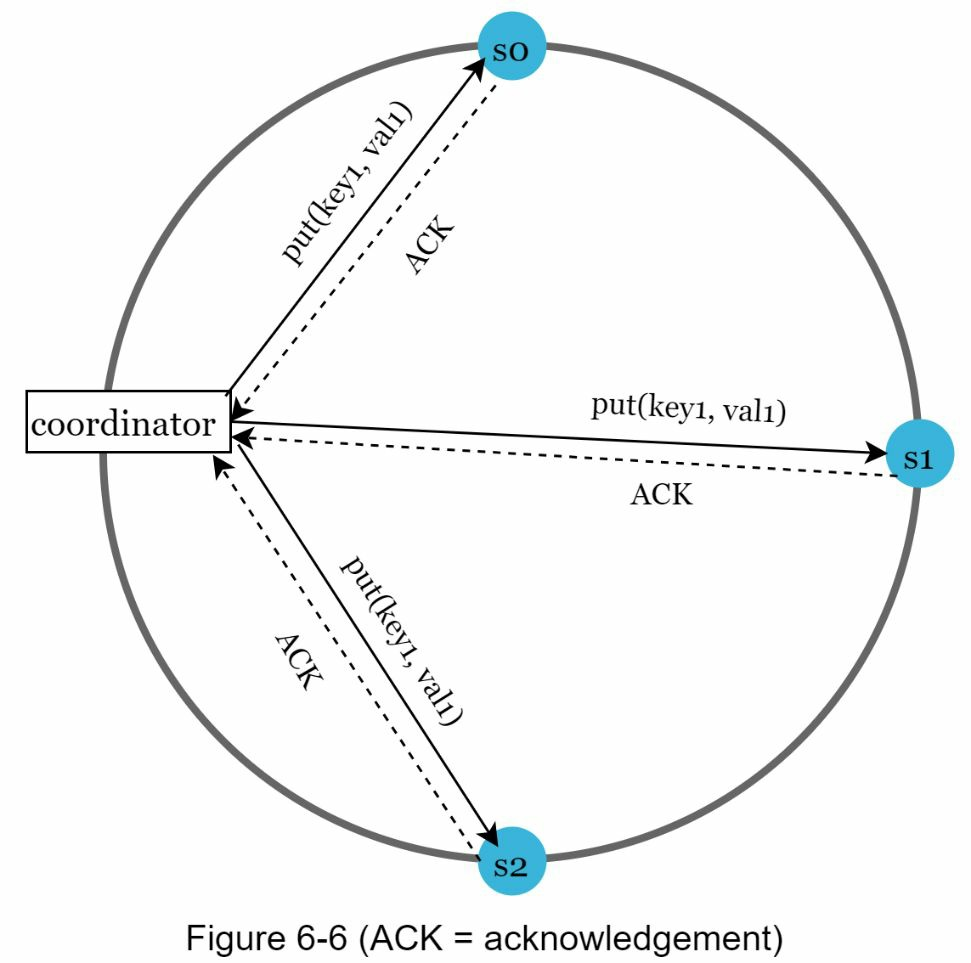

W = 1이 데이터가 하나의 서버에만 쓰여진다는 의미는 아닙니다. 예를 들어 Figure 6-6의 설정에서 데이터는 s0, s1, s2 모두에 복제됩니다. W = 1은 코디네이터(coordinator)가 쓰기 연산을 성공으로 간주하기 전에 최소 하나의 확인을 받아야 한다는 의미입니다. 예를 들어 s1로부터 확인을 받으면 s0와 s2의 확인을 더 기다릴 필요가 없습니다. 코디네이터는 클라이언트와 노드 사이의 프록시(proxy)로 동작합니다.

W, R, N의 설정은 지연 시간과 일관성 사이의 전형적인 트레이드오프입니다.

- W = 1 또는 R = 1이면 코디네이터가 하나의 복제본에서만 응답을 기다리므로 연산이 빠르게 반환됩니다.
- W 또는 R > 1이면 더 나은 일관성을 제공하지만, 코디네이터가 가장 느린 복제본의 응답을 기다려야 하므로 쿼리가 느려집니다.
- **W + R > N이면 강한 일관성(strong consistency)이 보장**됩니다. 최신 데이터를 가진 겹치는 노드가 반드시 하나 이상 존재하기 때문입니다.

사용 사례에 따라 N, W, R을 설정하는 몇 가지 방법을 살펴봅시다.

| 설정 | 최적화 목표 |
|------|-------------|
| R = 1, W = N | 빠른 읽기에 최적화 |
| W = 1, R = N | 빠른 쓰기에 최적화 |
| W + R > N | 강한 일관성 보장 (보통 N=3, W=R=2) |
| W + R ≤ N | 강한 일관성 미보장 |

요구사항에 따라 W, R, N 값을 조정하여 원하는 수준의 일관성을 달성할 수 있습니다.

### 일관성 모델: 어느 수준의 일관성을 원하십니까?

**일관성 모델(Consistency Model)**은 키-값 저장소를 설계할 때 고려해야 할 또 다른 중요한 요소입니다. 일관성 모델은 데이터 일관성의 수준을 정의하며, 다양한 모델이 존재합니다.

- **강한 일관성(Strong Consistency)**: 모든 읽기 연산은 가장 최근에 쓰여진 데이터에 해당하는 값을 반환합니다. 클라이언트는 절대 오래된 데이터를 보지 않습니다.
- **약한 일관성(Weak Consistency)**: 이후의 읽기 연산이 최신 값을 보지 못할 수 있습니다.
- **최종 일관성(Eventual Consistency)**: 약한 일관성의 특정 형태입니다. 충분한 시간이 지나면 모든 업데이트가 전파되고 모든 복제본이 일관된 상태가 됩니다.

강한 일관성은 보통 모든 복제본이 현재 쓰기에 동의할 때까지 복제본이 새로운 읽기/쓰기를 수락하지 않도록 강제하여 달성됩니다. 이 방식은 새로운 연산을 차단할 수 있으므로 고가용성 시스템에 적합하지 않습니다. Dynamo와 Cassandra는 **최종 일관성(Eventual Consistency)**을 채택하고 있으며, 이것이 우리가 키-값 저장소에 권장하는 일관성 모델입니다. 최종 일관성에서는 동시 쓰기로 인해 불일치 값이 시스템에 진입할 수 있으며, 클라이언트가 값을 읽어 조정(reconcile)해야 합니다. 다음 섹션에서는 버전 관리(versioning)를 통한 조정 방법을 설명합니다.

---

## 불일치 해소: 버전 충돌은 어떻게 처리할까요?

### 버전 관리와 벡터 클록: 데이터의 역사를 추적하다

복제는 고가용성을 제공하지만 복제본 간의 불일치를 초래합니다. **버전 관리(Versioning)**와 **벡터 클록(Vector Clock)**은 불일치 문제를 해결하는 데 사용됩니다. 버전 관리는 각 데이터 수정을 새로운 불변 버전(immutable version)으로 취급하는 것을 의미합니다.

버전 관리를 설명하기 전에, 먼저 불일치가 어떻게 발생하는지 예시로 살펴봅시다.

Figure 6-7에서 보듯이, 복제 노드 n1과 n2는 동일한 값을 가집니다. 이 값을 원본 값(original value)이라고 합시다. server 1과 server 2는 `get("name")` 연산으로 동일한 값을 얻습니다.

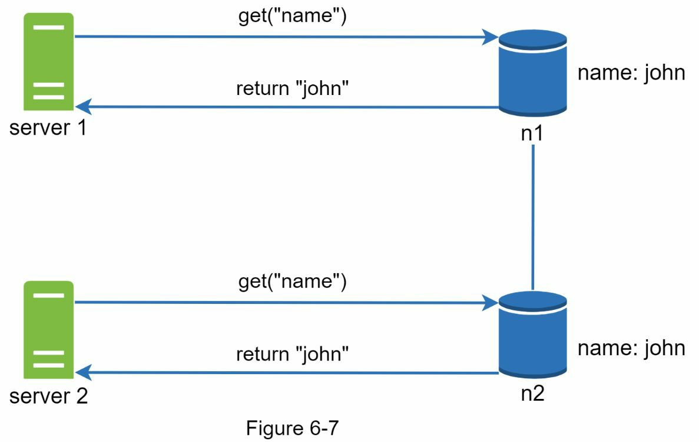

다음으로 Figure 6-8에서 server 1이 이름을 "johnSanFrancisco"로 변경하고, server 2가 이름을 "johnNewYork"으로 변경합니다. 이 두 변경이 동시에 수행됩니다. 이제 우리는 v1과 v2라는 두 가지 충돌하는 값을 갖게 됩니다.

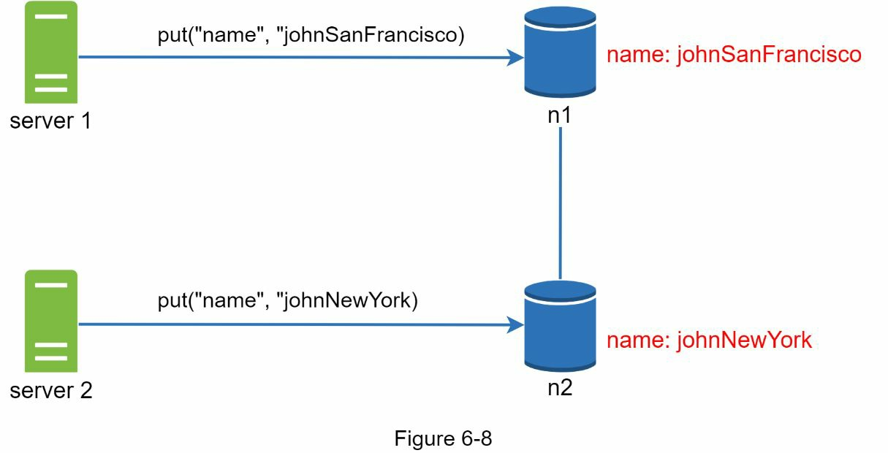

이 예시에서 원본 값은 수정을 기반으로 하므로 무시할 수 있습니다. 그러나 마지막 두 버전의 충돌을 해소할 명확한 방법이 없습니다. 이 문제를 해결하기 위해 충돌을 감지하고 조정할 수 있는 버전 관리 시스템이 필요합니다. **벡터 클록(Vector Clock)**은 이 문제를 해결하는 일반적인 기법입니다.

벡터 클록은 데이터 항목과 연관된 `[서버, 버전]` 쌍입니다. 하나의 버전이 다른 버전보다 이전인지, 이후인지, 혹은 충돌 상태인지를 확인하는 데 사용됩니다.

벡터 클록이 `D([S1, v1], [S2, v2], …, [Sn, vn])`으로 표현된다고 가정합시다. 여기서 D는 데이터 항목, v1은 버전 카운터, s1은 서버 번호입니다. 데이터 항목 D가 서버 Si에 쓰여지면 시스템은 다음 중 하나를 수행해야 합니다.

- `[Si, vi]`가 존재하면 vi를 증가시킵니다.
- 그렇지 않으면 새 항목 `[Si, 1]`을 생성합니다.

위 추상적인 로직을 Figure 6-9의 구체적인 예시로 설명합니다.

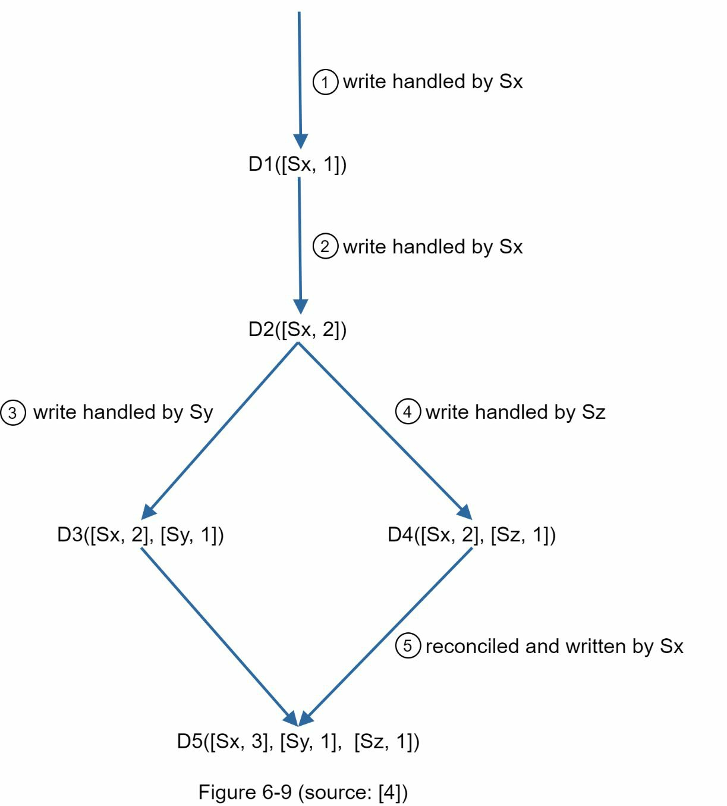

1. 클라이언트가 데이터 항목 D1을 시스템에 씁니다. 쓰기는 서버 Sx가 처리하며, 벡터 클록은 `D1[(Sx, 1)]`이 됩니다.
2. 다른 클라이언트가 최신 D1을 읽고, D2로 업데이트하여 다시 씁니다. D2는 D1에서 파생되므로 D1을 덮어씁니다. 동일한 서버 Sx가 처리하면 벡터 클록은 `D2([Sx, 2])`가 됩니다.
3. 다른 클라이언트가 최신 D2를 읽고, D3로 업데이트하여 다시 씁니다. 서버 Sy가 처리하면 벡터 클록은 `D3([Sx, 2], [Sy, 1])`이 됩니다.
4. 다른 클라이언트가 최신 D2를 읽고, D4로 업데이트하여 다시 씁니다. 서버 Sz가 처리하면 `D4([Sx, 2], [Sz, 1])`이 됩니다.
5. 다른 클라이언트가 D3와 D4를 읽으면 충돌을 발견합니다. D2가 Sy와 Sz 모두에 의해 수정되었기 때문입니다. 충돌은 클라이언트가 해소하고 업데이트된 데이터를 서버에 전송합니다. Sx가 처리하면 `D5([Sx, 3], [Sy, 1], [Sz, 1])`이 됩니다.

벡터 클록을 사용하면 Y의 벡터 클록에서 각 참여자의 버전 카운터가 X의 버전 카운터보다 크거나 같으면, 버전 X가 버전 Y의 조상(ancestor, 즉 충돌 없음)임을 쉽게 알 수 있습니다. 예를 들어 `D([s0, 1], [s1, 1])`은 `D([s0, 1], [s1, 2])`의 조상입니다. 따라서 충돌이 기록되지 않습니다.

마찬가지로, Y의 벡터 클록에서 어떤 참여자의 카운터가 X의 해당 카운터보다 작으면, 버전 X와 Y는 형제(sibling, 즉 충돌 존재) 관계임을 알 수 있습니다. 예를 들어 다음 두 벡터 클록은 충돌이 있음을 나타냅니다: `D([s0, 1], [s1, 2])`와 `D([s0, 2], [s1, 1])`.

**벡터 클록의 단점**: 벡터 클록이 충돌을 해소할 수 있지만, 두 가지 주목할 만한 단점이 있습니다.

첫째, 클라이언트가 충돌 해소 로직을 구현해야 하므로 클라이언트에 복잡성이 추가됩니다.

둘째, 벡터 클록의 `[서버: 버전]` 쌍이 빠르게 증가할 수 있습니다. 이 문제를 해결하기 위해 길이에 임계값을 설정하고, 한계를 초과하면 가장 오래된 쌍을 제거합니다. 이는 자손 관계를 정확히 결정할 수 없게 되어 조정 과정에서 비효율을 초래할 수 있습니다. 그러나 Dynamo 논문 [4]에 따르면, Amazon은 아직 프로덕션에서 이 문제를 겪지 않았으므로 대부분의 회사에서 수용할 수 있는 솔루션일 것입니다.

---

## 장애 처리: 대규모 시스템에서 실패는 예외가 아닌 일상입니다

대규모 시스템에서 장애는 불가피할 뿐만 아니라 흔한 일입니다. 장애 시나리오 처리는 매우 중요합니다. 이 섹션에서는 먼저 장애를 감지하는 기법을 소개한 다음, 일반적인 장애 해소 전략을 살펴봅니다.

### 장애 감지: 소문이 퍼지듯 상태를 전파하다

분산 시스템에서 다른 서버가 "이 서버가 다운됐다"고 말한다고 해서 그것을 그대로 믿기에는 충분하지 않습니다. 일반적으로 서버를 다운된 것으로 표시하려면 최소 두 개의 독립적인 정보 출처가 필요합니다.

Figure 6-10에서 보듯이, **전체-대-전체 멀티캐스팅(all-to-all multicasting)**은 간단한 해결책입니다. 그러나 시스템에 서버가 많을 때는 비효율적입니다.

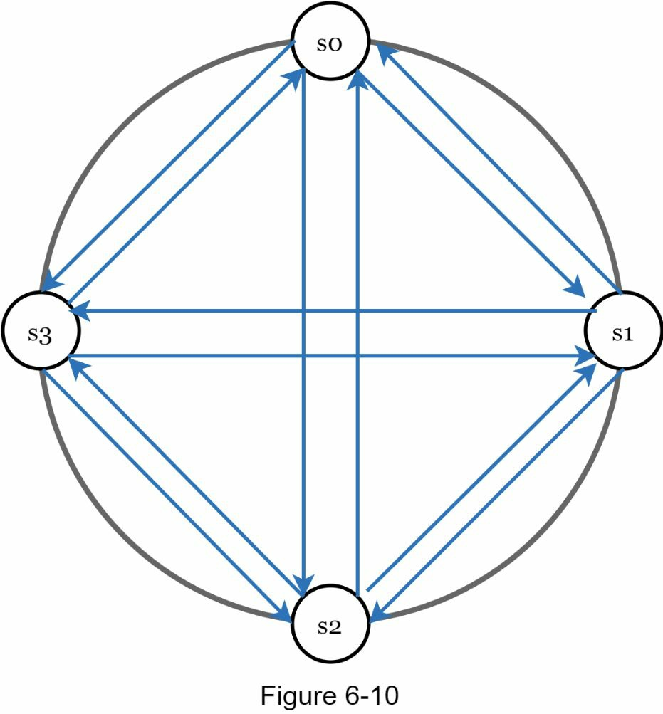

더 나은 솔루션은 **가십 프로토콜(Gossip Protocol)**과 같은 탈중앙화 장애 감지 방법을 사용하는 것입니다. 가십 프로토콜은 다음과 같이 동작합니다.

- 각 노드는 멤버 ID와 하트비트(heartbeat) 카운터를 포함하는 노드 멤버십 목록(node membership list)을 유지합니다.
- 각 노드는 주기적으로 하트비트 카운터를 증가시킵니다.
- 각 노드는 주기적으로 임의의 노드 집합에 하트비트를 전송하며, 이 노드들은 다시 다른 노드 집합에 전파합니다.
- 노드들이 하트비트를 받으면 멤버십 목록이 최신 정보로 업데이트됩니다.
- 하트비트가 사전 정의된 기간 이상 증가하지 않으면 해당 멤버는 오프라인으로 간주됩니다.

Figure 6-11에서 가십 프로토콜의 동작을 확인할 수 있습니다.

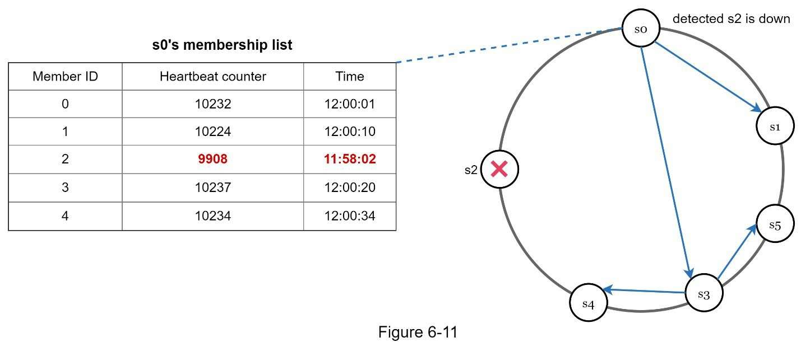

- 노드 s0은 왼쪽에 표시된 노드 멤버십 목록을 유지합니다.
- 노드 s0은 노드 s2(멤버 ID = 2)의 하트비트 카운터가 오랫동안 증가하지 않았음을 감지합니다.
- 노드 s0은 s2의 정보를 포함한 하트비트를 임의의 노드 집합에 전송합니다. 다른 노드들이 s2의 하트비트 카운터가 오랫동안 업데이트되지 않았음을 확인하면, 노드 s2는 다운된 것으로 표시되고 이 정보가 다른 노드들에게 전파됩니다.

### 임시 장애 처리: 느슨한 쿼럼과 힌트된 핸드오프

가십 프로토콜을 통해 장애가 감지된 후, 시스템은 가용성을 보장하기 위해 특정 메커니즘을 배포해야 합니다. 엄격한 쿼럼 방식에서는 쿼럼 합의 섹션에서 설명한 것처럼 읽기 및 쓰기 연산이 차단될 수 있습니다.

**슬로피 쿼럼(Sloppy Quorum)** [4]이라는 기법이 가용성을 향상시키는 데 사용됩니다. 쿼럼 요건을 강제하는 대신, 시스템은 해시 링에서 쓰기용으로 처음 W개의 정상 서버를, 읽기용으로 처음 R개의 정상 서버를 선택합니다. 오프라인 서버는 무시됩니다.

서버가 네트워크나 서버 장애로 인해 사용할 수 없는 경우, 다른 서버가 일시적으로 요청을 처리합니다. 다운된 서버가 복구되면 데이터 일관성을 위해 변경 사항이 전달됩니다. 이 과정을 **힌트된 핸드오프(Hinted Handoff)**라고 합니다. Figure 6-12에서 s2가 사용 불가능하므로, 읽기와 쓰기가 일시적으로 s3에서 처리됩니다. s2가 온라인 상태로 돌아오면 s3이 데이터를 s2에 돌려줍니다.

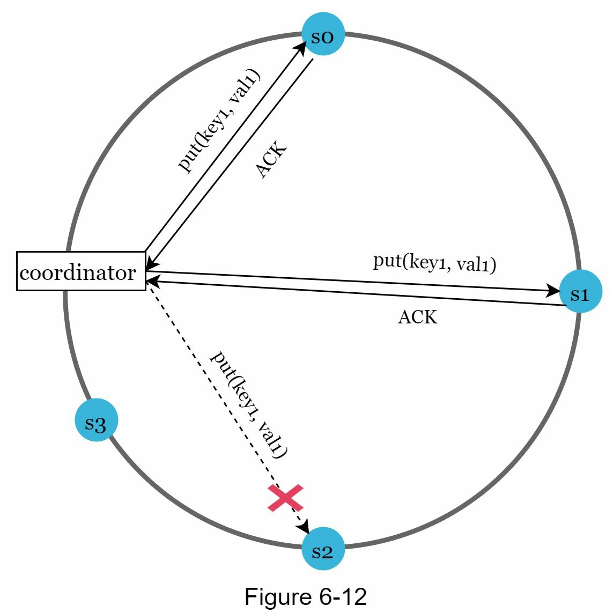

### 영구 장애 처리: 머클 트리로 복제본을 동기화하다

힌트된 핸드오프는 임시 장애를 처리합니다. 복제본이 영구적으로 사용 불가능한 경우는 어떻게 처리할까요? 이를 처리하기 위해 **안티 엔트로피(Anti-Entropy)** 프로토콜을 구현하여 복제본을 동기화 상태로 유지합니다. 안티 엔트로피는 복제본의 각 데이터를 비교하고 각 복제본을 최신 버전으로 업데이트하는 것을 포함합니다. **머클 트리(Merkle Tree)**는 불일치를 감지하고 전송 데이터량을 최소화하는 데 사용됩니다.

Wikipedia [7]에서 인용하면: "해시 트리 또는 머클 트리(Merkle tree)는 모든 비-리프(non-leaf) 노드가 그 자식 노드들의 레이블 또는 값(리프의 경우)의 해시로 표시된 트리입니다. 해시 트리는 대규모 데이터 구조의 내용을 효율적이고 안전하게 검증할 수 있습니다."

키 공간이 1부터 12까지라고 가정하면, 다음 단계들이 머클 트리를 구축하는 방법을 보여줍니다. 강조 표시된 박스는 불일치를 나타냅니다.

**단계 1**: Figure 6-13에서 보듯이 키 공간을 버킷(4개)으로 나눕니다. 버킷은 트리의 깊이를 제한된 수준으로 유지하기 위해 루트 수준 노드로 사용됩니다.

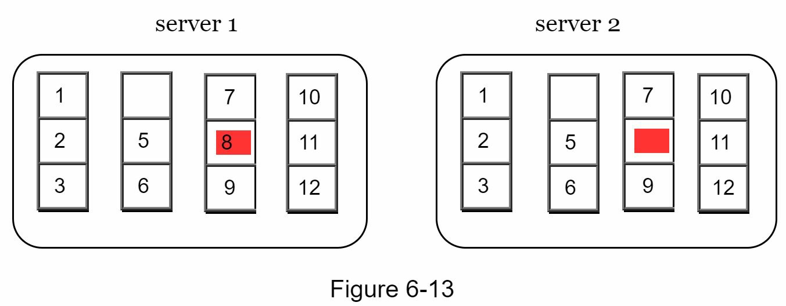

**단계 2**: 버킷이 생성되면 균일 해싱 방법으로 각 버킷의 키를 해시합니다(Figure 6-14).

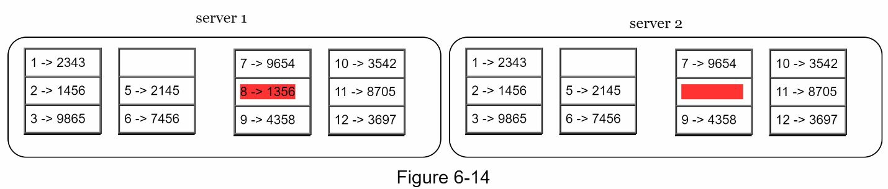

**단계 3**: 버킷당 단일 해시 노드를 생성합니다(Figure 6-15).

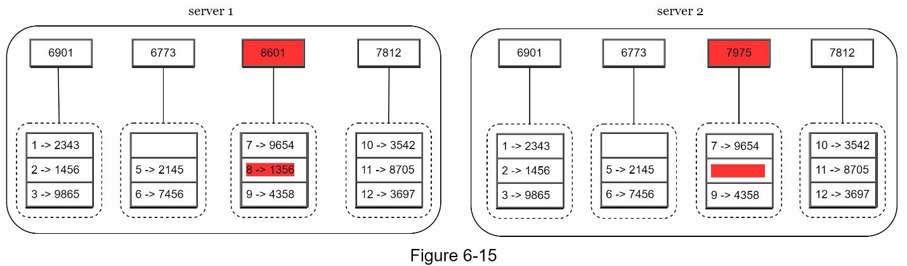

**단계 4**: 자식의 해시를 계산하여 루트까지 트리를 위쪽으로 구축합니다(Figure 6-16).

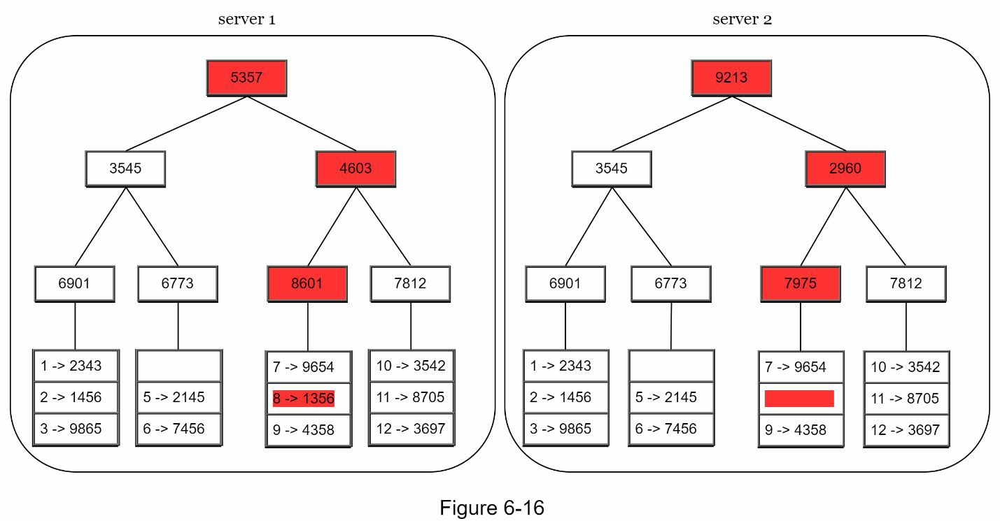

두 머클 트리를 비교하려면 루트 해시를 먼저 비교합니다. 루트 해시가 일치하면 두 서버가 동일한 데이터를 가집니다. 루트 해시가 다르면 왼쪽 자식 해시를 비교한 후 오른쪽 자식 해시를 비교합니다. 트리를 순회하여 동기화되지 않은 버킷을 찾고 해당 버킷만 동기화할 수 있습니다.

머클 트리를 사용하면 동기화해야 하는 데이터의 양이 두 복제본의 차이에 비례하며, 데이터의 총량에는 비례하지 않습니다. 실제 시스템에서는 버킷 크기가 상당히 큽니다. 예를 들어, 10억 개의 키당 100만 개의 버킷이 가능한 설정이며, 각 버킷에는 1000개의 키만 포함됩니다.

### 데이터 센터 장애 처리: 지역 간 복제의 중요성

데이터 센터 장애는 정전, 네트워크 중단, 자연재해 등으로 인해 발생할 수 있습니다. 데이터 센터 장애를 처리할 수 있는 시스템을 구축하려면 여러 데이터 센터에 데이터를 복제하는 것이 중요합니다. 데이터 센터가 완전히 오프라인 상태가 되더라도 사용자는 다른 데이터 센터를 통해 데이터에 접근할 수 있습니다.

---

## 시스템 아키텍처 다이어그램: 전체 그림을 조망해 봅시다

지금까지 키-값 저장소 설계의 다양한 기술적 고려 사항을 논의했습니다. 이제 Figure 6-17에 표시된 아키텍처 다이어그램에 집중해 봅시다.

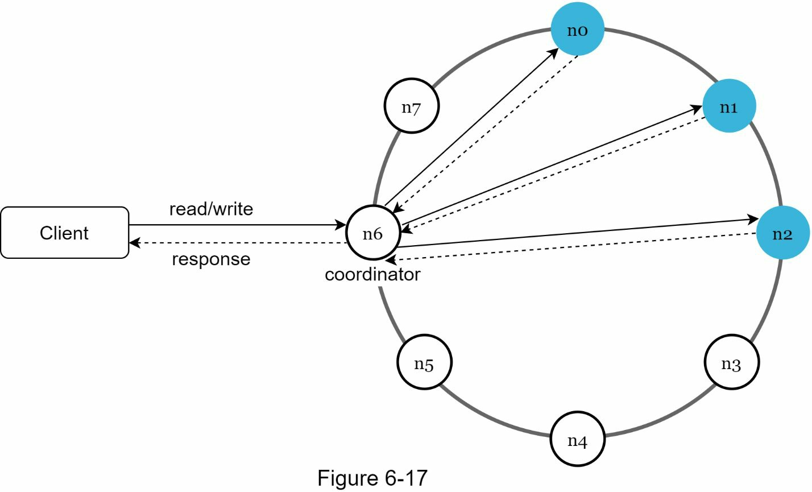

아키텍처의 주요 특징은 다음과 같습니다.

- 클라이언트는 `get(key)` 및 `put(key, value)`와 같은 간단한 API를 통해 키-값 저장소와 통신합니다.
- **코디네이터(Coordinator)**는 클라이언트와 키-값 저장소 사이에서 프록시 역할을 하는 노드입니다.
- 노드들은 일관된 해싱을 사용하여 링에 분산됩니다.
- 시스템은 완전히 탈중앙화(decentralized)되어 있으므로 노드 추가 및 이동이 자동으로 이루어집니다.
- 데이터는 여러 노드에 복제됩니다.
- 모든 노드가 동일한 책임을 가지므로 단일 장애점(single point of failure)이 없습니다.

설계가 탈중앙화되어 있으므로 각 노드는 Figure 6-18에 제시된 것처럼 여러 작업을 수행합니다.

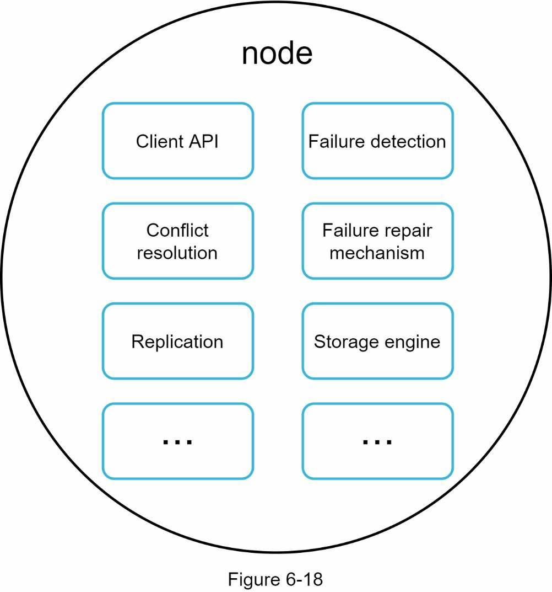

---

## 쓰기 경로: 데이터는 어떻게 저장될까요?

Figure 6-19는 쓰기 요청이 특정 노드에 전달된 후 발생하는 일을 설명합니다. 제안된 쓰기/읽기 경로 설계는 주로 Cassandra [8]의 아키텍처를 기반으로 합니다.

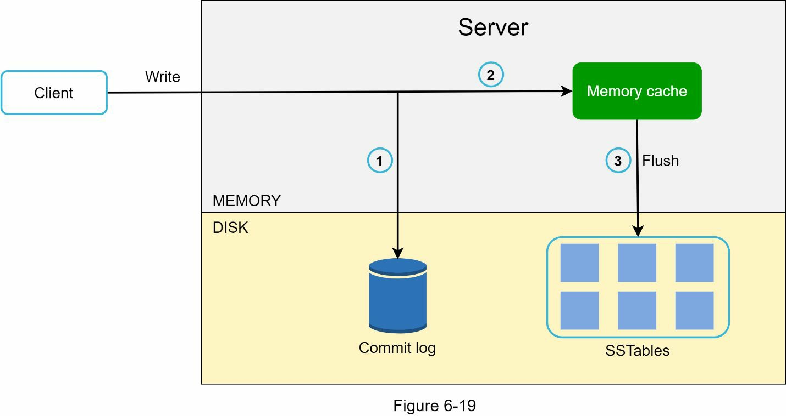

1. **쓰기 요청이 커밋 로그(commit log) 파일에 영속화됩니다.**
2. **데이터가 메모리 캐시에 저장됩니다.**
3. 메모리 캐시가 가득 차거나 사전 정의된 임계값에 도달하면, 데이터가 디스크의 **SSTable** [9]로 플러시(flush)됩니다.

> 참고: SSTable(Sorted-String Table)은 `<key, value>` 쌍의 정렬된 목록입니다. SSTable에 대해 더 알아보고 싶은 독자는 참고 자료 [9]를 참조하세요.

---

## 읽기 경로: 데이터는 어떻게 조회될까요?

읽기 요청이 특정 노드에 전달된 후, 먼저 데이터가 메모리 캐시에 있는지 확인합니다. 있다면 Figure 6-20에서 보듯이 데이터가 클라이언트에 반환됩니다.

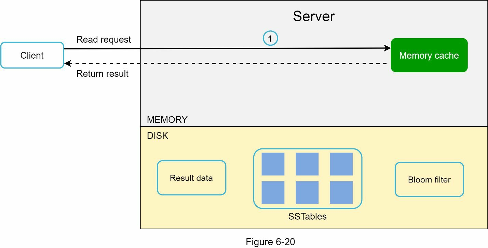

데이터가 메모리에 없으면 디스크에서 가져옵니다. 이때 어떤 SSTable에 키가 있는지 효율적으로 찾아야 합니다. **블룸 필터(Bloom Filter)** [10]가 이 문제를 해결하는 데 일반적으로 사용됩니다.

데이터가 메모리에 없을 때의 읽기 경로는 Figure 6-21에서 확인할 수 있습니다.

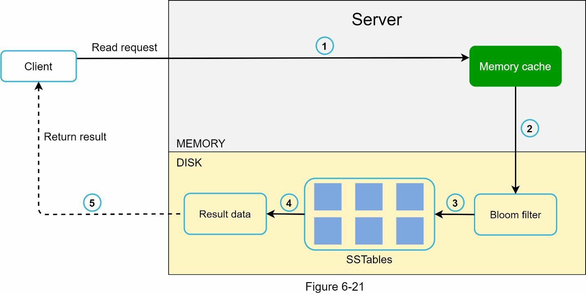

1. 시스템이 먼저 데이터가 메모리에 있는지 확인합니다. 없으면 2단계로 이동합니다.
2. 데이터가 메모리에 없으면 블룸 필터를 확인합니다.
3. 블룸 필터를 사용하여 키를 포함할 수 있는 SSTable을 파악합니다.
4. SSTable이 데이터셋의 결과를 반환합니다.
5. 데이터셋의 결과가 클라이언트에 반환됩니다.

---

## 요약: 분산 키-값 저장소의 핵심을 정리합니다

이 장은 많은 개념과 기법을 다루었습니다. 기억을 되새기기 위해 아래 표에 분산 키-값 저장소의 기능과 해당 기법을 요약합니다.

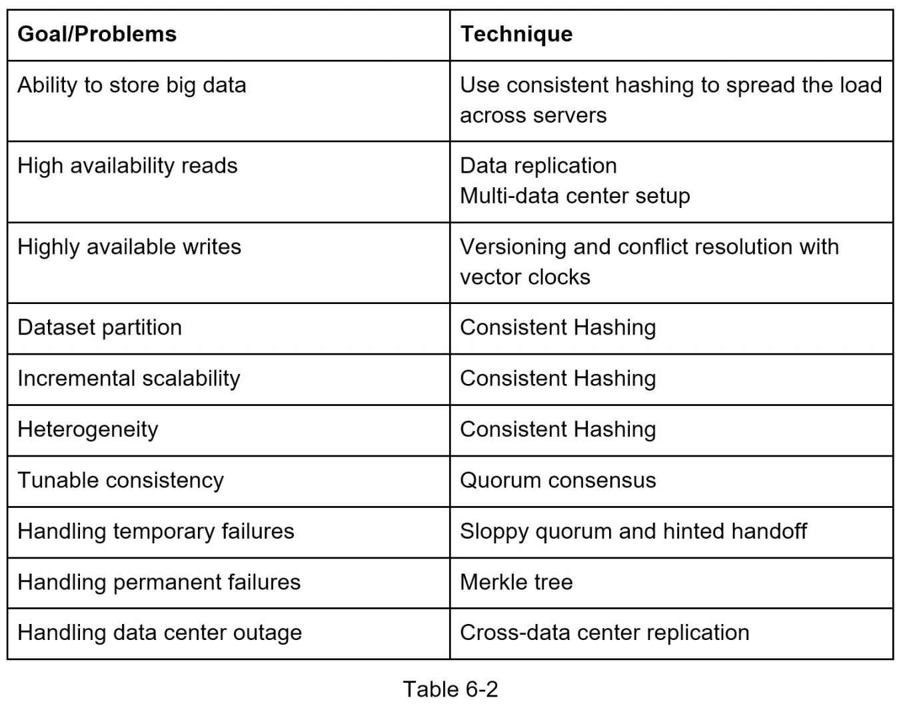

| 목표 / 문제 | 기법 |
|-------------|------|
| 대규모 데이터 저장 | 일관된 해싱으로 서버 부하 분산 |
| 읽기/쓰기 고가용성 | 다중 데이터 센터에 걸쳐 데이터 복제 |
| 대규모 데이터 저장 | 데이터 파티셔닝(일관된 해싱) |
| 조정 가능한 일관성 | 쿼럼 합의 (N, W, R) |
| 불일치 해소 | 벡터 클록 |
| 장애 감지 | 가십 프로토콜 |
| 임시 장애 처리 | 슬로피 쿼럼 + 힌트된 핸드오프 |
| 영구 장애 복구 | 머클 트리 기반 안티 엔트로피 |
| 데이터 센터 장애 처리 | 다중 데이터 센터 복제 |

---

## 핵심 개념 정리

**CAP 정리(CAP Theorem)**: 분산 시스템은 일관성(Consistency), 가용성(Availability), 파티션 내성(Partition Tolerance) 세 가지를 동시에 모두 보장할 수 없으며, 파티션 발생 시 일관성과 가용성 중 하나를 선택해야 한다는 원칙.

**일관 해싱(Consistent Hashing)**: 서버를 해시 링에 배치하고 키를 시계 방향으로 탐색해 저장 서버를 결정하는 기법. 노드 추가·삭제 시 재배치되는 키의 수를 최소화하여 수평 확장을 용이하게 한다.

**쿼럼(Quorum)**: 분산 시스템에서 읽기·쓰기 연산의 성공 기준이 되는 복제본 수. N(복제본 수), W(쓰기 쿼럼), R(읽기 쿼럼)으로 구성되며, W + R > N을 만족하면 강한 일관성이 보장된다.

**벡터 클록(Vector Clock)**: 각 노드가 `[서버, 버전]` 쌍을 추적하여 데이터 버전 간의 인과 관계(조상·충돌)를 판별하는 분산 타임스탬프 기법.

**가십 프로토콜(Gossip Protocol)**: 각 노드가 주기적으로 임의의 이웃 노드에 하트비트를 전파하여, 중앙 조정자 없이 클러스터 전체의 멤버십 상태를 탈중앙화 방식으로 감지하는 프로토콜.

**머클 트리(Merkle Tree)**: 리프 노드에 데이터 해시를, 상위 노드에 자식 해시를 재귀적으로 저장하는 트리 구조. 두 복제본의 루트 해시를 비교하는 것만으로 불일치 구간을 빠르게 좁혀 전송 데이터량을 차이에 비례하도록 줄인다.

**슬로피 쿼럼(Sloppy Quorum)**: 일부 노드에 장애가 발생했을 때 엄격한 쿼럼 대신 정상 노드 중 처음 W·R개를 선택하여 가용성을 유지하는 기법.

**힌트된 핸드오프(Hinted Handoff)**: 장애 노드를 대신해 임시 처리한 서버가 복구 후 원래 노드에 데이터를 돌려주는 메커니즘. 임시 장애 시에도 데이터 유실 없이 일관성을 회복한다.

**최종 일관성(Eventual Consistency)**: 일시적 불일치를 허용하되 충분한 시간이 경과하면 모든 복제본이 동일한 상태로 수렴한다는 일관성 모델. Dynamo, Cassandra 등 고가용성 저장소가 채택한다.

**블룸 필터(Bloom Filter)**: 특정 키가 SSTable에 존재하는지를 확률적으로 빠르게 판별하는 공간 효율적 자료구조. 읽기 경로에서 불필요한 디스크 탐색을 줄인다.

**SSTable(Sorted-String Table)**: `<key, value>` 쌍을 키 순으로 정렬하여 디스크에 저장하는 불변 파일 형식. 커밋 로그와 메모리 캐시(MemTable)와 함께 로그 구조 저장소의 핵심을 이룬다.

이 장에서 설계한 분산 키-값 저장소는 CAP 정리를 현실적 출발점으로 삼아, 일관 해싱으로 데이터를 분산하고 쿼럼·벡터 클록으로 일관성을 조율하며, 가십 프로토콜·머클 트리·힌트된 핸드오프로 장애를 견뎌내는 전층위 구조를 갖춥니다.

---

## 참고 문헌

[1] Amazon DynamoDB: https://aws.amazon.com/dynamodb/

[2] Memcached: https://memcached.org/

[3] Redis: https://redis.io/

[4] Dynamo: Amazon's Highly Available Key-value Store: https://www.allthingsdistributed.com/files/amazon-dynamo-sosp2007.pdf

[5] Cassandra: https://cassandra.apache.org/

[6] Bigtable: A Distributed Storage System for Structured Data: https://static.googleusercontent.com/media/research.google.com/en//archive/bigtable-osdi06.pdf

[7] Merkle tree: https://en.wikipedia.org/wiki/Merkle_tree

[8] Cassandra architecture: https://cassandra.apache.org/doc/latest/architecture/

[9] SSTable: https://www.igvita.com/2012/02/06/sstable-and-log-structured-storage-leveldb/

[10] Bloom filter: https://en.wikipedia.org/wiki/Bloom_filter
