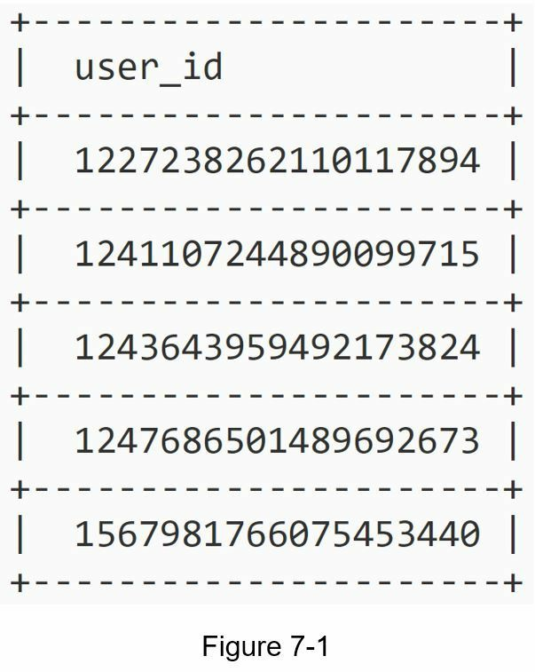
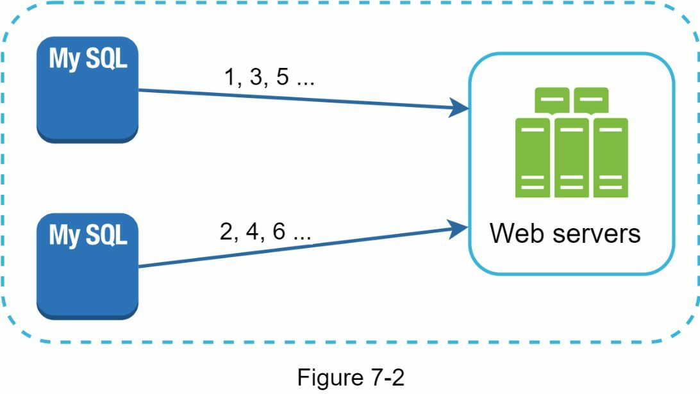
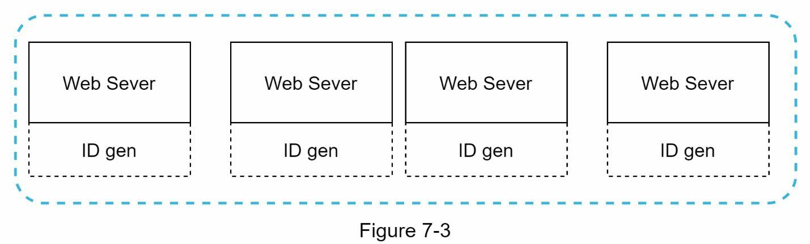
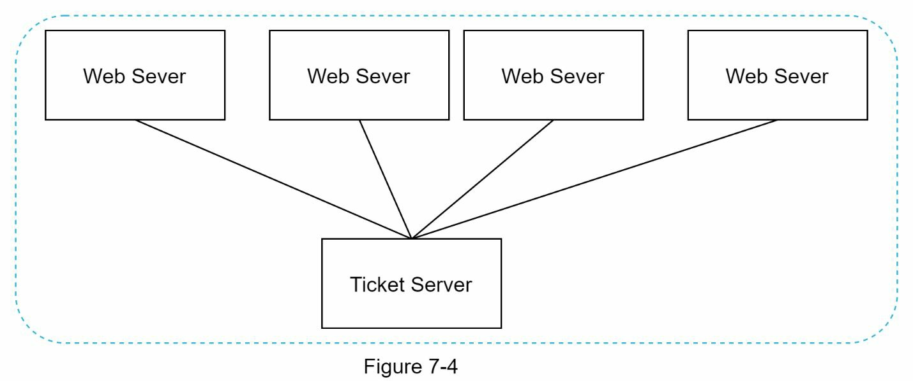
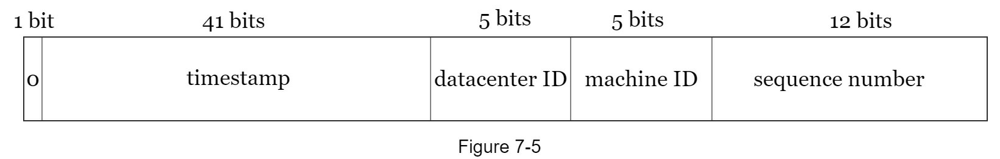
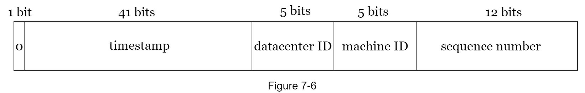
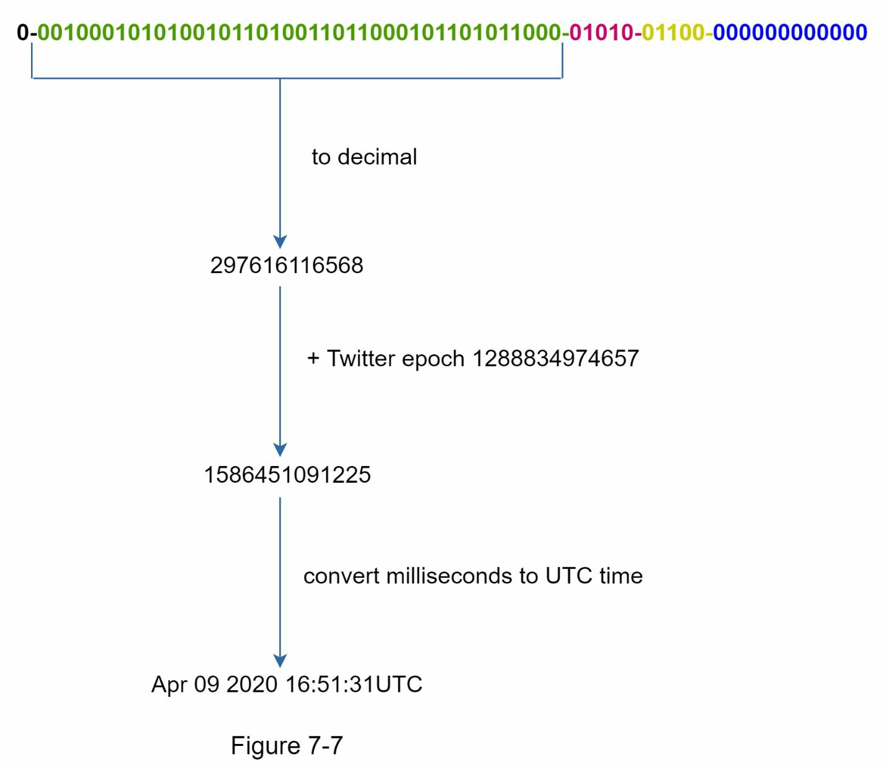

## 서론: 번호를 매기는 일의 어려움

생각해 봅시다. 여러분이 백화점의 고객 관리 시스템을 맡았다고 가정하세요. 처음에는 한 곳의 점포만 있어서 출석부처럼 새 고객이 올 때마다 1, 2, 3... 이렇게 번호를 매기면 됩니다. 하지만 전국에 지점이 늘어나면 어떻게 될까요? 서울 점포에서는 1번, 부산 점포에서는 1번이 나올 수 있습니다. 바로 이 문제가 우리가 오늘 풀어야 할 과제입니다.

결론부터 말하면, 분산 시스템에서 고유 ID를 생성하는 일은 단순한 숫자 증가가 아닌, 여러 서버가 협력하는 복잡한 설계 문제입니다. 전통적인 데이터베이스의 `auto_increment` 기능은 한 대의 서버에서만 작동하기 때문에, 분산 환경에서는 여러 데이터베이스가 최소한의 지연으로 고유한 ID를 생성해야 한다는 난제가 생깁니다.

고유 ID의 예시를 몇 가지 살펴보겠습니다:

---

## 1단계: 문제 이해 및 설계 범위 정립

분산 시스템 설계 인터뷰에서 가장 먼저 해야 할 일은 무엇일까요? 바로 면접관에게 명확한 질문을 던져서 요구사항을 파악하는 것입니다. 다음은 후보자와 면접관 사이의 실제 대화 예시입니다.

**후보자:** 고유 ID가 어떤 특성을 가져야 하나요?
**면접관:** ID는 유일해야 하고 정렬 가능해야 합니다.

**후보자:** 새 레코드마다 ID가 1씩 증가합니까?
**면접관:** ID는 시간이 지남에 따라 증가하지만, 반드시 1씩만 증가하지는 않습니다. 같은 날 저녁에 생성된 ID가 아침에 생성된 ID보다 더 큽니다.

**후보자:** ID는 숫자만 포함합니까?
**면접관:** 네, 맞습니다.

**후보자:** ID의 길이 요구사항은 무엇입니까?
**면접관:** ID는 64비트에 맞아야 합니다.

**후보자:** 시스템의 규모는 어느 정도입니까?
**면접관:** 시스템은 초당 10,000개 이상의 ID를 생성할 수 있어야 합니다.

### 요구사항 정리

이러한 질문들을 통해 다음과 같은 명확한 요구사항을 도출할 수 있습니다:

- ID는 반드시 유일해야 합니다.
- ID는 숫자 값만 포함해야 합니다.
- ID는 64비트에 맞아야 합니다.
- ID는 시간 순서로 정렬되어야 합니다.
- 초당 10,000개 이상의 고유 ID를 생성할 수 있어야 합니다.

---

## 2단계: 고수준 설계 및 검증

분산 시스템에서 고유 ID를 생성하는 방법은 여러 가지가 있습니다. 우리가 검토할 옵션들은 다음과 같습니다:

- 다중 마스터 복제(Multi-Master Replication)
- 범용 고유 식별자(Universally Unique Identifier, UUID)
- 티켓 서버(Ticket Server)
- 트위터 스노우플레이크(Twitter Snowflake) 방식

각 방식이 어떻게 작동하고 어떤 장단점이 있는지 살펴보겠습니다.

### 다중 마스터 복제: 여러 서버에서 나누어 세기

다중 마스터 복제는 데이터베이스의 `auto_increment` 기능을 활용합니다. 다음 ID를 1씩 증가시키는 대신, k씩 증가시킵니다. 여기서 k는 사용 중인 데이터베이스 서버의 개수입니다. 다음 그림에 보이듯이, 같은 서버에서 생성될 다음 ID는 이전 ID에 2를 더한 값입니다. 이 방식은 ID를 데이터베이스 서버의 개수에 따라 확장할 수 있기 때문에 일부 확장성 문제를 해결합니다.

하지만 이 전략은 몇 가지 심각한 단점이 있습니다:

- **다중 데이터센터 확장 어려움**: 여러 지역에 걸쳐 데이터센터를 확장하기 어렵습니다.
- **서버 간 시간 순서 보장 실패**: 여러 서버에서 생성된 ID가 시간 순서로 증가하지 않을 수 있습니다.
- **서버 추가/제거 시 확장성 부족**: 새로운 서버를 추가하거나 기존 서버를 제거할 때 재설정이 복잡합니다.

### UUID: 독립적으로 생성하는 방식

UUID(범용 고유 식별자)는 고유 ID를 얻는 또 다른 간단한 방법입니다. UUID는 컴퓨터 시스템에서 정보를 식별하는 데 사용되는 128비트 숫자입니다. UUID는 충돌할 확률이 매우 낮습니다. 위키피디아에 따르면, "초당 10억 개의 UUID를 약 100년 동안 생성해야 충돌 확률이 50%에 도달한다"고 합니다.

UUID의 예시: `09c93e62-50b4-468d-bf8a-c07e1040bfb2`

이 설계에서 각 웹 서버는 ID 생성기를 포함하고 있으며, 웹 서버는 독립적으로 ID를 생성할 책임이 있습니다.

**장점:**
- **구현이 단순합니다**. 서버 간 조율이 필요 없으므로 동기화 문제가 없습니다.
- **확장성이 뛰어납니다**. 각 웹 서버가 자신이 소비하는 ID를 생성하기 때문에, ID 생성기가 웹 서버와 함께 쉽게 확장됩니다.

**단점:**
- **ID가 128비트입니다**. 우리의 요구사항은 64비트인데, UUID는 이를 초과합니다.
- **ID가 시간 순서로 증가하지 않습니다**. 시간과 무관한 값들이 생성됩니다.
- **ID가 숫자만이 아닙니다**. 하이픈을 포함한 16진수 문자로 표현되므로 숫자 전용 요구사항을 만족하지 않습니다.

### 티켓 서버: 중앙집중식 접근

티켓 서버는 고유 ID를 생성하는 흥미로운 다른 방법입니다. Flickr는 분산 기본 키를 생성하기 위해 티켓 서버를 개발했습니다. 이 시스템이 어떻게 작동하는지 살펴봅시다.

핵심 아이디어는 단일 데이터베이스 서버(티켓 서버)에서 중앙집중식 `auto_increment` 기능을 사용하는 것입니다. 이에 대해 더 자세히 알고 싶으면 Flickr의 엔지니어링 블로그 기사를 참고할 수 있습니다.

**장점:**
- **숫자 ID를 생성합니다**.
- **구현이 간단하고, 소규모에서 중규모 애플리케이션에 잘 작동합니다**.

**단점:**
- **단일 실패점(Single Point of Failure)**. 티켓 서버가 다운되면 이를 의존하는 모든 시스템이 영향을 받습니다. 단일 실패점을 피하기 위해 여러 개의 티켓 서버를 설정할 수 있지만, 이는 데이터 동기화 같은 새로운 문제를 야기합니다.

### 트위터 스노우플레이크: 분할 정복의 지혜

앞에서 살펴본 방식들은 ID 생성 시스템이 어떻게 작동하는지에 대한 좋은 통찰을 제공하지만, 우리의 특정 요구사항을 모두 만족하지는 않습니다. 따라서 다른 접근이 필요합니다. 트위터의 고유 ID 생성 시스템인 "스노우플레이크(Snowflake)"는 영감을 주며 우리의 모든 요구사항을 충족할 수 있습니다.

분할 정복은 우리의 친구입니다. ID를 직접 생성하는 대신, ID를 다양한 섹션으로 나눕니다. 다음 그림은 64비트 ID의 레이아웃을 보여줍니다.

각 섹션을 자세히 설명하면 다음과 같습니다:

- **부호 비트(Sign Bit)**: 1비트. 항상 0입니다. 이는 향후 사용을 위해 예약된 것입니다. 부호가 있는 숫자와 부호가 없는 숫자를 구별하는 데 사용될 수 있습니다.

- **타임스탬프(Timestamp)**: 41비트. 에포크(기준 시점) 이후의 밀리초 또는 사용자 정의 에포크입니다. 트위터 스노우플레이크의 기본 에포크는 1288834974657(2010년 11월 4일, UTC 01:42:54)입니다.

- **데이터센터 ID(Datacenter ID)**: 5비트. 이는 2^5 = 32개의 데이터센터를 제공합니다.

- **머신 ID(Machine ID)**: 5비트. 이는 데이터센터당 2^5 = 32개의 머신을 제공합니다.

- **시퀀스 번호(Sequence Number)**: 12비트. 해당 머신/프로세스에서 생성된 모든 ID에 대해 시퀀스 번호는 1씩 증가합니다. 이 번호는 매 밀리초마다 0으로 재설정됩니다.

---

## 3단계: 깊이 있는 설계

고수준 설계에서 우리는 분산 시스템에서 고유 ID 생성기를 설계하는 다양한 옵션을 논의했습니다. 우리는 트위터 스노우플레이크 ID 생성기를 기반으로 한 접근 방식을 선택했습니다. 이제 이 설계를 더 깊이 있게 살펴봅시다.

### 데이터센터 ID와 머신 ID: 시작 시 고정되는 설정

데이터센터 ID와 머신 ID는 시작 시간에 선택되며, 일반적으로 시스템이 실행되기 시작하면 고정됩니다. 데이터센터 ID와 머신 ID의 변경은 신중한 검토가 필요합니다. 왜냐하면 이들 값의 실수적 변경은 ID 충돌로 이어질 수 있기 때문입니다. ID 생성기가 실행되는 동안 타임스탐프와 시퀀스 번호는 생성됩니다.

### 타임스탬프: 시간을 기록하다

가장 중요한 41비트는 타임스탬프 섹션을 구성합니다. 타임스탬프는 시간이 지남에 따라 증가하기 때문에, ID는 시간 순서로 정렬 가능합니다. 다음 그림은 이진 표현이 UTC로 어떻게 변환되는지를 보여줍니다. 유사한 방법으로 UTC를 다시 이진 표현으로 변환할 수도 있습니다.

41비트로 표현할 수 있는 최대 타임스탬프는:

$$2^{41} - 1 = 2199023255551 \text{ 밀리초 (ms)}$$

이는 약 69년에 해당합니다:

$$\frac{2199023255551 \text{ ms}}{1000 \text{ sec/ms} \times 365 \text{ days/year} \times 24 \text{ hrs/day} \times 3600 \text{ sec/hr}} \approx 69 \text{ years}$$

이는 ID 생성기가 69년 동안 작동할 수 있음을 의미합니다. 오늘 날짜에 가까운 사용자 정의 에포크 시간을 사용하면 오버플로우 시간을 더 연기할 수 있습니다. 69년 후에는 새로운 에포크 시간이 필요하거나 ID 마이그레이션을 위한 다른 기술을 채택해야 합니다.

### 시퀀스 번호: 밀리초 내에서의 고유성 보장

시퀀스 번호는 12비트이며, 2^12 = 4096가지 조합을 제공합니다. 이 필드는 같은 서버에서 한 밀리초 내에 두 개 이상의 ID가 생성되지 않으면 0입니다. 이론상으로, 한 머신은 밀리초당 최대 4096개의 새로운 ID를 생성할 수 있습니다.

---

## 4단계: 마무리 및 추가 고려사항

이 장에서 우리는 고유 ID 생성기를 설계하는 다양한 접근법을 논의했습니다: 다중 마스터 복제, UUID, 티켓 서버, 그리고 트위터 스노우플레이크와 유사한 고유 ID 생성기입니다. 우리는 우리의 모든 사용 사례를 지원하고 분산 환경에서 확장 가능한 스노우플레이크를 선택했습니다.

인터뷰 마지막에 시간이 남으면, 다음과 같은 추가 토픽들을 논의할 수 있습니다:

### 시계 동기화: 모든 서버가 같은 시간을 가져야 한다

우리의 설계에서는 ID 생성 서버들이 같은 시계를 가지고 있다고 가정합니다. 하지만 서버가 다중 코어에서 실행될 때 이 가정이 참이 아닐 수 있습니다. 같은 도전이 다중 머신 시나리오에도 존재합니다. 시계 동기화 솔루션은 이 책의 범위를 벗어나지만, 문제가 존재한다는 것을 이해하는 것이 중요합니다. 네트워크 시간 프로토콜(Network Time Protocol, NTP)은 이 문제를 해결하기 위한 가장 인기 있는 솔루션입니다.

### 섹션 길이 조정: 용도에 맞게 비트 재배분하기

예를 들어, 시퀀스 번호는 적지만 타임스탬프 비트는 많은 것이 저 동시성(low concurrency)과 장기 실행 애플리케이션에 효과적입니다. 우리의 설계를 특정 요구사항에 맞게 조정할 수 있습니다.

### 고가용성: 미션 크리티컬 시스템의 필요조건

ID 생성기는 미션 크리티컬 시스템이기 때문에 높은 가용성을 갖춰야 합니다. 이는 서버 중복, 자동 페일오버, 모니터링 등을 포함해야 함을 의미합니다.

---

## 결론

축하합니다! 지금까지 따라오셨군요. 여러분을 응원합니다. 정말 잘하셨습니다!

---

## 핵심 개념 정리

- **고유 ID(Unique ID)**: 분산 시스템에서 각 레코드나 이벤트를 유일하게 식별하는 숫자 또는 문자열 값. 단일 서버의 `auto_increment`와 달리, 여러 서버가 동시에 충돌 없이 ID를 생성할 수 있어야 한다.

- **다중 마스터 복제(Multi-Master Replication)**: 여러 데이터베이스 서버가 각자 ID를 생성하되, 서버 수(k)만큼 건너뛰며 증가시키는 방식. 서버 간 조율 없이 확장할 수 있지만, 시간 순서 보장과 데이터센터 간 확장이 어렵다.

- **UUID(Universally Unique Identifier, 범용 고유 식별자)**: 128비트 길이의 고유 식별자로, 서버 간 조율 없이 독립적으로 생성 가능하다. 충돌 확률이 극히 낮으나, 64비트 요구사항 초과·숫자 전용 불가·시간 순서 미보장이라는 단점이 있다.

- **티켓 서버(Ticket Server)**: 단일 데이터베이스 서버에서 중앙집중식 `auto_increment`를 운영해 모든 서비스에 고유 ID를 발급하는 방식. Flickr가 개발한 접근법으로, 구현이 단순하지만 단일 실패점(Single Point of Failure) 위험이 있다.

- **단일 실패점(Single Point of Failure, SPOF)**: 시스템의 특정 구성 요소가 장애를 겪으면 전체 서비스가 중단되는 취약 지점. 티켓 서버처럼 중앙집중식 설계는 이 위험에 노출된다.

- **트위터 스노우플레이크(Twitter Snowflake)**: 트위터가 공개한 64비트 분산 ID 생성 알고리즘. 부호 비트(1) + 타임스탬프(41) + 데이터센터 ID(5) + 머신 ID(5) + 시퀀스 번호(12) 구조로 ID를 구성해, 시간 정렬 가능성과 분산 생성의 고유성을 동시에 충족한다.

- **에포크(Epoch)**: 타임스탬프 계산의 기준 시점. 스노우플레이크는 기본 에포크를 2010년 11월 4일로 설정하며, 41비트 타임스탬프를 통해 약 69년간 사용 가능한 값을 생성한다.

- **시퀀스 번호(Sequence Number)**: 동일 머신에서 같은 밀리초 안에 생성되는 ID를 구분하기 위한 12비트 카운터. 밀리초마다 0으로 초기화되며, 머신당 최대 4,096개/밀리초의 고유 ID를 보장한다.

- **데이터센터 ID / 머신 ID(Datacenter ID / Machine ID)**: 스노우플레이크 ID 구조에서 각 5비트를 차지하는 식별자. 최대 32개 데이터센터 × 데이터센터당 32대 머신 조합을 지원하며, 시스템 시작 시 고정되어 변경 시 ID 충돌 위험이 있다.

- **시계 동기화(Clock Synchronization)**: 여러 서버의 시스템 클럭이 동일한 시간을 가리키도록 맞추는 메커니즘. 타임스탬프 기반 ID 생성에서 서버 간 시계 편차는 ID 정렬 오류를 유발하므로, NTP(Network Time Protocol)로 보정한다.

- **NTP(Network Time Protocol, 네트워크 시간 프로토콜)**: 인터넷을 통해 여러 서버의 시계를 밀리초 단위로 동기화하는 표준 프로토콜. 분산 ID 생성기에서 시계 왜곡 문제를 완화하는 대표적 해결책이다.

분산 환경에서 고유 ID를 생성하는 문제는 단순한 숫자 증가를 넘어, 고가용성·시간 정렬·확장성을 동시에 충족해야 하는 설계 과제입니다. 트위터 스노우플레이크는 64비트를 여러 구역으로 분할해 이 세 가지 요건을 균형 있게 달성한 대표적 사례로, 오늘날 많은 대규모 시스템의 ID 생성 설계에 영향을 주고 있습니다.

---

## 참고 자료

[1] 범용 고유 식별자(Universally Unique Identifier): https://en.wikipedia.org/wiki/Universally_unique_identifier

[2] 티켓 서버: 저렴한 분산 고유 기본 키(Ticket Servers: Distributed Unique Primary Keys on the Cheap): https://code.flickr.net/2010/02/08/ticket-servers-distributed-unique-primary-keys-on-the-cheap/

[3] 스노우플레이크 발표(Announcing Snowflake): https://blog.twitter.com/engineering/en_us/a/2010/announcing-snowflake.html

[4] 네트워크 시간 프로토콜(Network Time Protocol): https://en.wikipedia.org/wiki/Network_Time_Protocol
