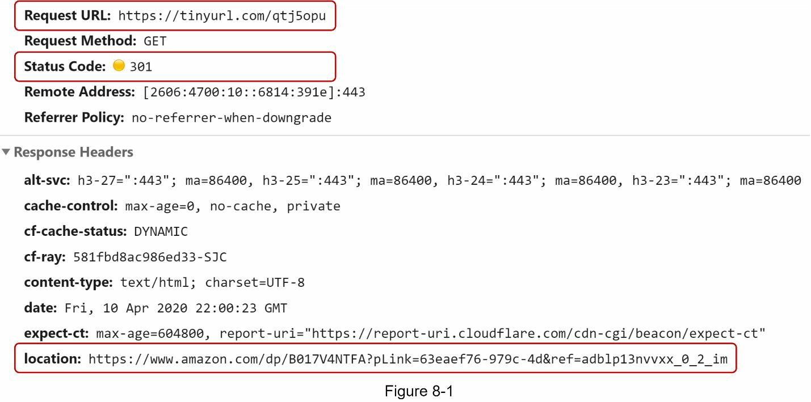
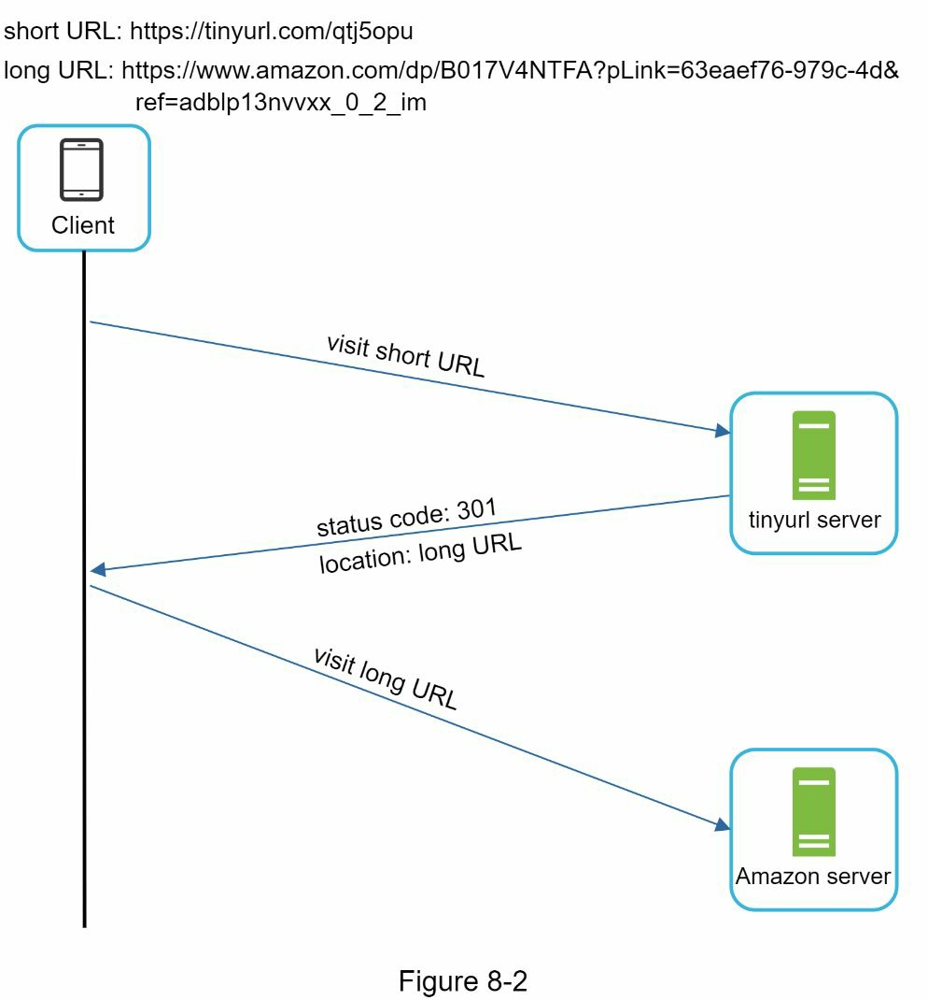
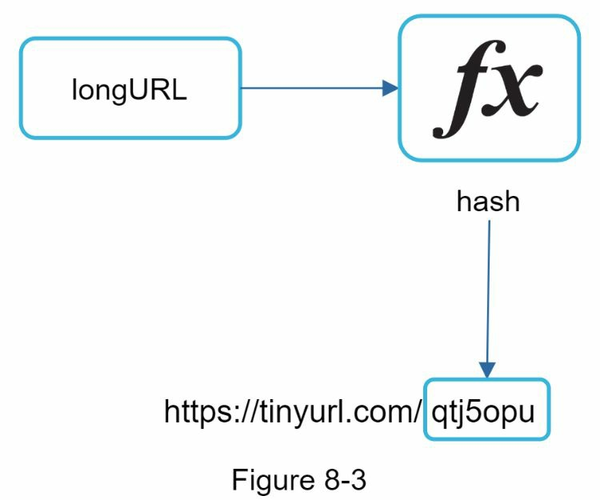
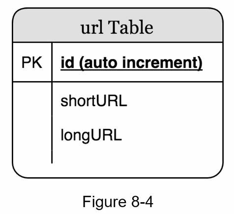
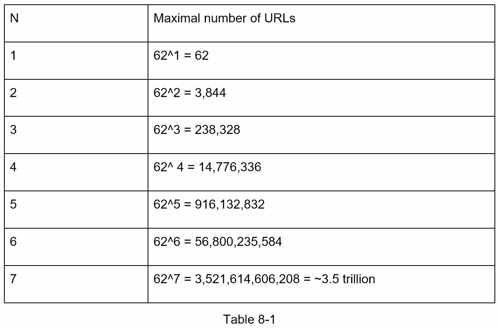
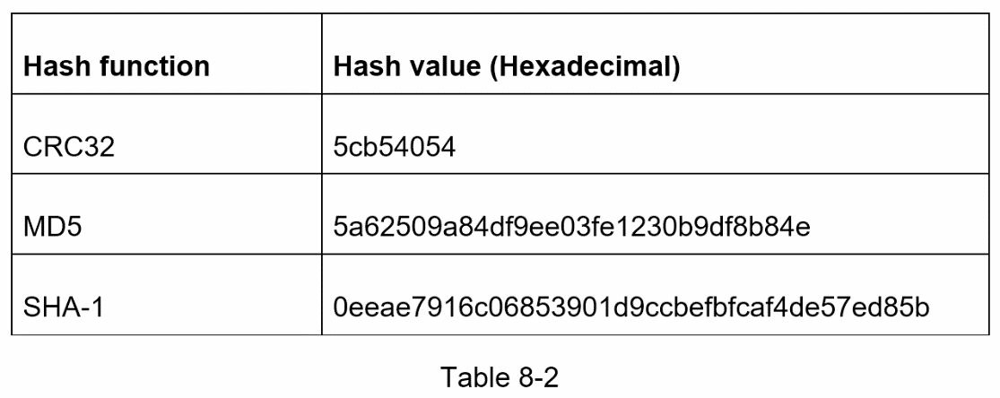
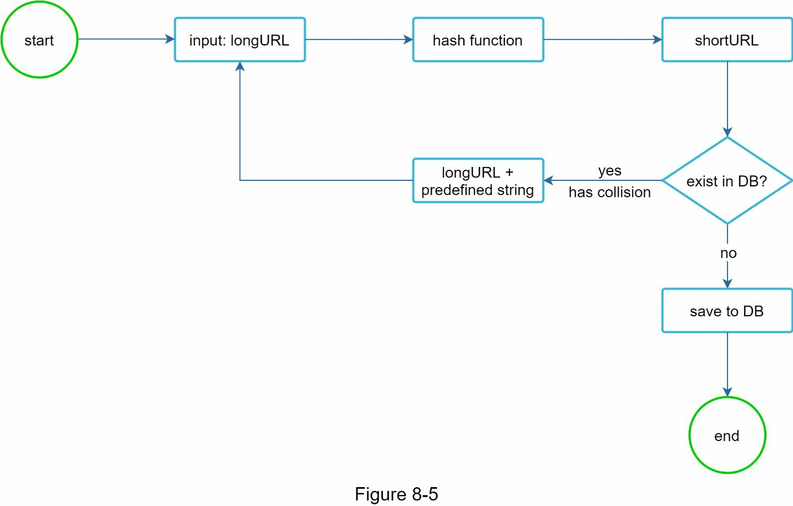
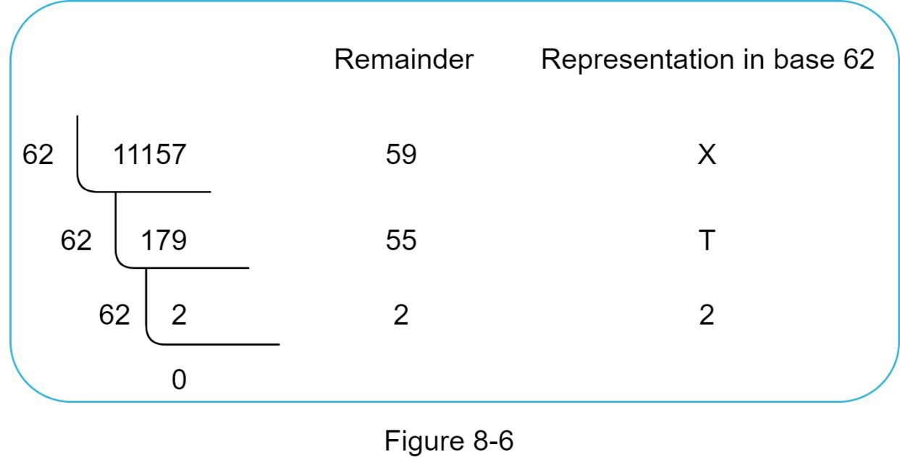
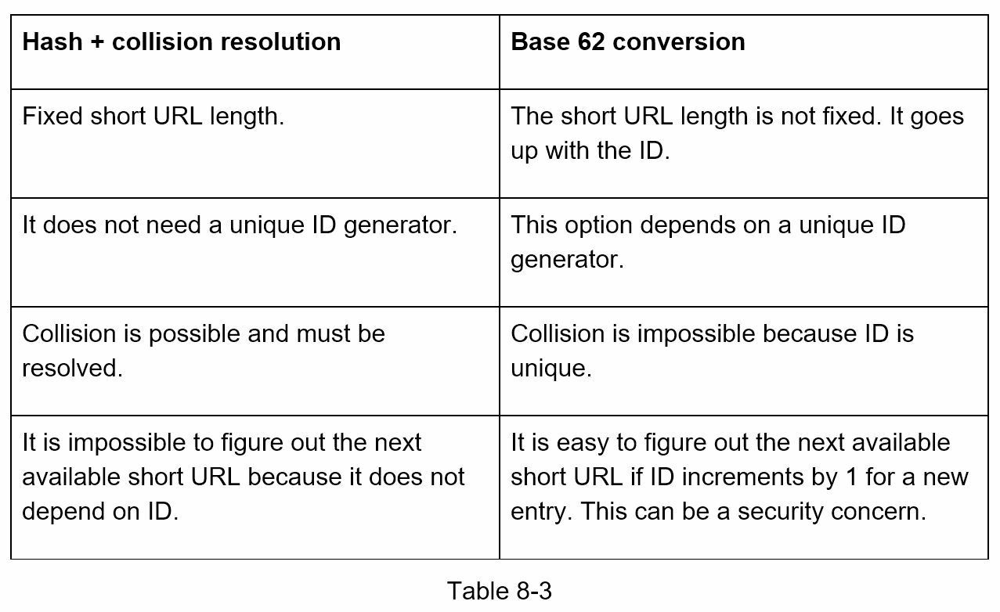

## 서론: 길을 잃은 주소에 별명을 달다

누구나 경험했을 것입니다. 온라인에서 흥미로운 기사를 친구에게 공유할 때, 그 주소가 너무 길어서 손으로 옮겨 적기 힘들 때가 있습니다. 마치 "세종대로 종로구 교남동 인왕산 자락에 있는 집"이라고 장황하게 설명하는 것보다, "종로 아파트 101호"라는 간단한 별명으로 부르는 것이 훨씬 편한 것처럼, URL 단축기(URL Shortener)는 긴 웹 주소를 짧고 기억하기 쉬운 형태로 변환해 줍니다.

이 장에서는 TinyURL 같은 URL 단축 서비스를 설계하는 실제 시스템 설계 인터뷰 질문을 살펴봅시다.

---

## 1단계: 문제 이해 및 설계 범위 결정

### 시스템 설계 인터뷰의 첫 단계: 질문으로 길을 잃지 않기

시스템 설계 인터뷰 질문은 의도적으로 열려 있습니다. 정확한 시스템을 설계하기 위해서는 구체적인 질문이 필요합니다. 여기 실제 인터뷰 대화의 예를 살펴봅시다.

**후보자:** URL 단축기는 어떻게 작동하나요?

**면접자:** 예를 들어, `https://www.systeminterview.com/q=chatsystem&c=loggedin&v=v3&l=long` 같은 원본 URL이 있다고 합시다. 우리 서비스는 이를 `https://tinyurl.com/y7keocwj` 같은 훨씬 짧은 별칭으로 변환합니다. 이 별칭을 클릭하면 원본 URL로 리다이렉트됩니다.

**후보자:** 트래픽 규모는 어떻게 되나요?

**면접자:** 하루에 1억 개의 URL이 생성됩니다.

**후보자:** 단축 URL의 길이는 어느 정도인가요?

**면접자:** 최대한 짧을수록 좋습니다.

**후보자:** 단축 URL에 허용되는 문자는 무엇인가요?

**면접자:** 숫자(0-9)와 영문자(a-z, A-Z)의 조합입니다.

**후보자:** 단축 URL을 삭제하거나 수정할 수 있나요?

**면접자:** 단순함을 위해, 단축 URL은 삭제나 수정이 불가능하다고 가정합시다.

### 핵심 사용 사례

1. **URL 단축**: 긴 URL이 주어졌을 때 → 훨씬 짧은 URL 반환
2. **URL 리다이렉션**: 짧은 URL이 주어졌을 때 → 원본 URL로 리다이렉트
3. **고가용성, 확장성, 내결함성(Fault Tolerance)** 고려

### 대략적 규모 추정: 숫자로 생각해 보기

결론부터 말하면, 우리 시스템은 일일 1억 건의 쓰기 작업과 그 10배인 1,160만 건의 읽기 작업을 처리해야 합니다. 10년간 365억 개의 레코드를 저장하려면 약 365TB의 저장소가 필요합니다.

구체적인 계산을 살펴봅시다:

- **쓰기 작업**: 하루에 1억 개의 URL 생성
- **초당 쓰기 작업**: 100,000,000 ÷ (24 × 3,600) = **1,160 QPS(Queries Per Second)**
- **읽기 작업**: 읽기/쓰기 비율이 10:1이라 가정하면, 초당 읽기 작업 = 1,160 × 10 = **11,600 QPS**
- **총 저장 용량**: URL 단축기 서비스가 10년간 운영된다고 가정
  - 총 레코드 수: 100,000,000 × 365 × 10 = **3,650억 개**
  - 평균 URL 길이: 100바이트
  - **10년간 저장 요구량**: 365,000,000,000 × 100바이트 × 10 = **약 365TB**

이 가정들을 면접자와 함께 검토하는 것이 중요합니다. 그래야 서로 같은 기준으로 논의할 수 있습니다.

---

## 2단계: 고수준 설계 및 동의 얻기

### API 엔드포인트: 클라이언트와 서버의 대화법 정의

API 엔드포인트는 클라이언트와 서버 간의 통신을 가능하게 합니다. REST 방식의 API로 설계하겠습니다. URL 단축기는 주로 두 개의 API 엔드포인트가 필요합니다.

**1. URL 단축 엔드포인트**

긴 URL을 단축하기 위해 클라이언트는 POST 요청을 보냅니다. 이 요청은 원본 긴 URL을 하나의 파라미터로 포함합니다.

```
POST /api/v1/data/shorten
요청: { longUrl: "https://www.example.com/very/long/url" }
응답: { shortUrl: "https://tinyurl.com/y7keocwj" }
```

**2. URL 리다이렉션 엔드포인트**

짧은 URL을 원본 긴 URL로 리다이렉트하기 위해 클라이언트는 GET 요청을 보냅니다.

```
GET /api/v1/shortUrl
응답: { longUrl: "https://www.example.com/very/long/url" } (HTTP 리다이렉션)
```

### URL 리다이렉션: 짧은 주소에서 원래 장소로 돌아가기

브라우저에 TinyURL을 입력했을 때 어떤 일이 벌어질까요? 서버는 짧은 URL을 받으면 301 리다이렉트를 사용해 원본 URL로 변환합니다.



클라이언트와 서버 간의 상세한 통신 과정은 아래 그림과 같습니다.



### 301 리다이렉트 vs 302 리다이렉트: 영구인가 임시인가?

리다이렉션 방식을 선택할 때는 두 가지 중요한 차이를 고려해야 합니다.

**301 리다이렉트 (Moved Permanently)**

301은 요청한 URL이 **영구적으로** 다른 URL로 이동했다는 의미입니다. 영구 리다이렉트이므로 브라우저는 응답을 캐시합니다. 그 결과 같은 URL에 대한 후속 요청은 URL 단축 서비스를 거치지 않고 바로 원본 URL 서버로 리다이렉트됩니다.

**302 리다이렉트 (Found / Temporarily Moved)**

302는 URL이 **임시로** 다른 URL로 이동했다는 의미입니다. 따라서 같은 URL에 대한 후속 요청도 계속 URL 단축 서비스에 먼저 도달합니다. 그 다음 서비스가 원본 URL 서버로 리다이렉트합니다.

각 방식의 장단점:

- **301 리다이렉트 선택 시**: 서버 부하를 줄이는 것이 우선이면 좋습니다. 첫 요청만 서버에 도달하기 때문입니다.
- **302 리다이렉트 선택 시**: 분석(Analytics)이 중요하면 더 좋습니다. 모든 클릭을 추적할 수 있고, 클릭 위치나 발원지를 정확히 파악할 수 있습니다.

### URL 리다이렉션의 구현: 해시 테이블의 단순함

가장 직관적인 방법은 해시 테이블을 사용하는 것입니다. `<shortURL, longURL>` 쌍을 저장한 해시 테이블이 있다면:

- **긴 URL 조회**: `longURL = hashTable.get(shortURL)`
- **리다이렉션 수행**: 조회한 longURL로 리다이렉트

### URL 단축: 긴 문자열을 짧은 코드로 인코딩하기

단축 URL이 `www.tinyurl.com/{hashValue}` 형태라고 가정합시다. URL 단축을 지원하려면 긴 URL을 hashValue에 매핑하는 해시 함수 f(x)를 찾아야 합니다.



이 해시 함수는 다음 조건을 만족해야 합니다:

- 각 긴 URL은 하나의 hashValue로 해싱되어야 합니다.
- 각 hashValue는 원본 긴 URL로 역변환될 수 있어야 합니다.

해시 함수의 상세 설계는 다음 섹션에서 논의합니다.

---

## 3단계: 설계 심화 탐구

### 데이터 모델: 메모리에서 데이터베이스로

지금까지는 모든 데이터를 해시 테이블에 저장한다고 가정했습니다. 좋은 출발점이지만, 현실의 시스템에서는 메모리가 제한되고 비쌉니다. 더 나은 방식은 `<shortURL, longURL>` 매핑을 관계형 데이터베이스(Relational Database)에 저장하는 것입니다.



간단한 테이블 구조는 세 개 칼럼으로 구성됩니다:
- **id**: 고유한 식별자 (Primary Key)
- **shortURL**: 단축된 URL
- **longURL**: 원본 긴 URL

### 해시 함수: 긴 주소를 짧은 코드로 변환하기

#### 해시값의 길이 결정: 몇 글자면 충분할까?

hashValue는 문자 집합 [0-9, a-z, A-Z]에서 선택되므로 62개의 서로 다른 문자를 사용할 수 있습니다 (10 + 26 + 26 = 62). hashValue의 길이 n을 정하려면 62^n이 대략 365억을 초과해야 합니다.

| n | 최대 지원 URL 개수 |
|---|---|
| 1 | 62 |
| 2 | 3,844 |
| 3 | 238,328 |
| 4 | 14,776,336 |
| 5 | 916,132,832 |
| 6 | 56,800,235,584 |
| 7 | 3,521,614,606,208 |

n = 7일 때, 62^7 ≈ **3.5조**로 3,650억 URL을 충분히 지원합니다. 따라서 hashValue의 길이는 **7**입니다.



#### 해시 함수 방식: 두 가지 접근법

URL 단축기를 위한 두 가지 주요 해시 함수 방식을 살펴봅시다.

**방식 1: 해시 + 충돌 해소 (Hash + Collision Resolution)**

긴 URL을 7글자 문자열로 해싱하는 가장 직관적인 방법은 CRC32, MD5, SHA-1 같은 잘 알려진 해시 함수를 사용하는 것입니다.

예를 들어, URL `https://en.wikipedia.org/wiki/Systems_design`에 다양한 해시 함수를 적용해보면:

| 해시 함수 | 해시값 |
|---|---|
| CRC32 | ce48ebc |
| MD5 | 5d41402abc4b2a76b9719d911017c592 |
| SHA-1 | 356a192b7913b04c54574d18c28d46e6395428ab |

보시다시피, CRC32의 결과도 7글자를 초과합니다. 어떻게 더 짧게 만들 수 있을까요?

첫 번째 접근은 해시값의 처음 7글자를 취하는 것입니다. 하지만 이는 **해시 충돌(Hash Collision)**을 야기할 수 있습니다. 충돌을 해소하려면 미리 정한 문자열을 반복적으로 추가하면서 충돌이 없을 때까지 시도합니다.



이 방법은 충돌을 제거할 수 있지만, 매 요청마다 데이터베이스에 shortURL이 이미 존재하는지 쿼리해야 하므로 비효율적입니다. **블룸 필터(Bloom Filter)**라는 기법을 사용하면 성능을 개선할 수 있습니다. 블룸 필터는 어떤 원소가 집합에 속하는지를 효율적으로 판정하는 확률론적 기법입니다.

**방식 2: Base 62 변환 (Base 62 Conversion)**

Base 62 변환은 URL 단축기에서 흔히 사용되는 또 다른 접근법입니다. Base 변환은 같은 숫자를 다양한 진법으로 표현하는 기술입니다. hashValue에 62개의 서로 다른 문자를 사용하므로 Base 62를 사용합니다.

구체적인 예: 10진법의 11,157을 Base 62로 변환합니다.

**문자 매핑:**
- 0-0, 1-1, ..., 9-9
- 10-a, 11-b, ..., 35-z
- 36-A, 37-B, ..., 61-Z

**계산:**
```
11157₁₀ = 2 × 62² + 55 × 62¹ + 59 × 62⁰ = [2, 55, 59]
       → [2, T, X] (Base 62 표현)
```



따라서 단축 URL은 `https://tinyurl.com/2TX`가 됩니다.

**두 접근법의 비교**

| 항목 | 해시 + 충돌 해소 | Base 62 변환 |
|---|---|---|
| 구현 복잡도 | 중간 | 낮음 |
| 해시 충돌 | 있을 수 있음 | 없음 |
| 성능 | 다소 낮음 | 높음 |
| 역변환 가능 | 아니오 | 예 |

---

### URL 단축 심화: 단계별 흐름 설계

시스템의 핵심인 URL 단축 흐름을 논리적이고 명확하게 만들어 봅시다. 설계에서는 Base 62 변환을 사용합니다.



**URL 단축의 상세 흐름:**

1. 입력으로 **longURL**을 받습니다.
2. 시스템이 데이터베이스에서 이 longURL을 검색합니다.
3. 만약 이미 존재한다면, 이는 과거에 단축된 URL입니다. 데이터베이스에서 shortURL을 조회하여 클라이언트에 반환합니다.
4. 만약 존재하지 않는다면, longURL은 새로운 URL입니다. [[7장 분산 시스템에서 고유 ID 생성기 설계|고유 ID 생성기]]로부터 새로운 고유 ID(Primary Key)를 얻습니다.
5. 이 ID를 Base 62 변환으로 shortURL로 변환합니다.
6. ID, shortURL, longURL을 함께 데이터베이스의 새 행에 저장합니다.

**실제 예시:**

원본 longURL: `https://en.wikipedia.org/wiki/Systems_design`

1. 고유 ID 생성기가 반환한 ID: `2009215674938`
2. ID를 Base 62로 변환: `2009215674938₁₀` → `"zn9edcu"`
3. 데이터베이스에 저장:

| id | shortURL | longURL |
|---|---|---|
| 2009215674938 | zn9edcu | https://en.wikipedia.org/wiki/Systems_design |

**분산 고유 ID 생성기의 중요성**

분산 환경에서 고유 ID 생성기를 구현하는 것은 어려운 과제입니다. 다행히 "7장: 분산 시스템에서 고유 ID 생성기 설계"에서 여러 해결책을 이미 논의했습니다. 필요하면 해당 장을 다시 참고하시기 바랍니다.

### URL 리다이렉션 심화: 캐시를 활용한 고속화



읽기 작업이 쓰기보다 훨씬 많으므로 (10:1), `<shortURL, longURL>` 매핑을 **캐시(Cache)**에 저장하여 성능을 높입니다.

**URL 리다이렉션의 상세 흐름:**

1. 사용자가 짧은 URL 링크를 클릭합니다: `https://tinyurl.com/zn9edcu`
2. **로드 밸런서(Load Balancer)**가 요청을 웹 서버에 전달합니다.
3. 만약 shortURL이 **캐시에 이미 있다면**, longURL을 즉시 반환합니다.
4. 만약 캐시에 없다면, 데이터베이스에서 longURL을 조회합니다. 데이터베이스에도 없다면 사용자가 잘못된 shortURL을 입력한 것입니다.
5. longURL을 사용자에게 반환합니다.

이러한 설계를 통해 자주 접근하는 URL은 캐시에서 빠르게 제공할 수 있으며, 서버 부하를 크게 줄일 수 있습니다.

---

## 4단계: 정리 및 추가 고려사항

이 장에서 우리는 URL 단축기의 API 설계, 데이터 모델, 해시 함수, URL 단축 및 리다이렉션을 살펴봤습니다.

인터뷰에서 추가 시간이 남는다면, 다음과 같은 주제들을 논의할 수 있습니다:

### 속도 제한기 (Rate Limiter): 악의적 사용으로부터 보호

잠재적인 보안 문제 중 하나는 악의적 사용자가 URL 단축 요청을 과도하게 보내는 것입니다. [[4장 속도 제한기 설계 (Design a Rate Limiter)|속도 제한기]]는 IP 주소나 기타 필터링 규칙을 기반으로 요청을 제어합니다. 속도 제한기에 대해 더 알고 싶다면 "4장: 속도 제한기 설계"를 참고하세요.

### 웹 서버 확장: 무상태 아키텍처의 이점

웹 계층이 **무상태(Stateless)**이므로, 웹 서버를 추가하거나 제거하는 것만으로 쉽게 확장할 수 있습니다. 상태를 저장할 필요가 없으므로, 어떤 서버가 요청을 처리해도 결과는 동일합니다.

### 데이터베이스 확장: 복제와 샤딩

**데이터베이스 복제(Replication)**와 **샤딩(Sharding)**은 데이터베이스를 확장하는 일반적인 기법입니다:

- **복제**: 마스터-슬레이브 구조로 읽기 성능을 높입니다.
- **샤딩**: 데이터를 여러 데이터베이스에 분산하여 쓰기 성능을 높입니다.

### 분석 (Analytics): 데이터로 비즈니스 성공 주도

데이터는 현대 비즈니스의 핵심입니다. URL 단축기에 분석 기능을 통합하면 다음과 같은 질문에 답할 수 있습니다:

- 얼마나 많은 사람들이 링크를 클릭했나?
- 언제 클릭이 가장 많이 일어나나?
- 어느 지역에서 클릭이 발생했나?
- 어느 플랫폼(PC, 모바일 등)에서 클릭되었나?

### 가용성, 일관성, 신뢰성: 대규모 시스템의 기초

이 세 개념은 모든 대규모 시스템의 성공의 핵심입니다. 자세한 내용은 "1장: 규모 있는 시스템 설계의 기초"를 다시 참고하세요.

---

## 마치며

축하합니다! 여기까지 오신 것만으로도 충분히 잘하고 계십니다. 자신을 격려해 주세요!

---

## 핵심 개념 정리

**해시 함수(Hash Function)**: 임의 길이의 입력을 고정 길이 출력으로 변환하는 함수. URL 단축에서는 긴 URL을 짧은 코드로 매핑하는 데 사용

**Base 62 변환(Base 62 Conversion)**: 숫자(0-9), 소문자(a-z), 대문자(A-Z)의 62개 문자를 이용해 정수 ID를 짧은 문자열로 인코딩하는 방식

**해시 충돌(Hash Collision)**: 서로 다른 두 입력이 동일한 해시값을 만들어내는 현상. 충돌 해소를 위해 미리 정한 문자열을 반복 추가하며 재시도

**301 리다이렉트(301 Redirect, Moved Permanently)**: 요청한 URL이 영구 이동했음을 나타내는 HTTP 상태 코드. 브라우저가 응답을 캐시하므로 이후 요청은 서버를 거치지 않음

**302 리다이렉트(302 Redirect, Found)**: 요청한 URL이 임시 이동했음을 나타내는 HTTP 상태 코드. 매 요청마다 서버를 경유하므로 클릭 분석에 유리

**블룸 필터(Bloom Filter)**: 어떤 원소가 집합에 속하는지 확률적으로 판정하는 자료구조. 해시 충돌 검사 시 데이터베이스 조회를 줄이는 데 활용

**충돌 해소(Collision Resolution)**: 해시 충돌이 발생했을 때 미리 정한 문자열을 원본 URL에 추가하며 고유한 해시값을 찾아가는 과정

**캐시(Cache)**: 자주 조회되는 `<shortURL, longURL>` 매핑을 메모리에 저장해 데이터베이스 부하를 줄이고 응답 속도를 높이는 기법

**QPS(Queries Per Second)**: 초당 처리 가능한 쿼리 수. 시스템 용량 계획의 기준 지표

**데이터베이스 샤딩(Database Sharding)**: 데이터를 여러 데이터베이스 노드에 분산 저장하여 쓰기 성능과 저장 용량을 수평 확장하는 기법

**무상태 아키텍처(Stateless Architecture)**: 서버가 클라이언트의 상태를 저장하지 않아 어떤 서버가 요청을 처리해도 동일한 결과를 보장하는 설계 방식

**대략적 추정(Back-of-the-Envelope Estimation)**: 시스템 규모를 빠르게 가늠하기 위해 단순화된 수치로 QPS, 저장소 등을 계산하는 기법. 자세한 내용은 [[2장 대략적 추정 (Back-of-the-Envelope Estimation)|대략적 추정]] 참고

---

## 참고 자료

[1] RESTful API 튜토리얼: https://www.restapitutorial.com/index.html

[2] 블룸 필터: https://en.wikipedia.org/wiki/Bloom_filter
