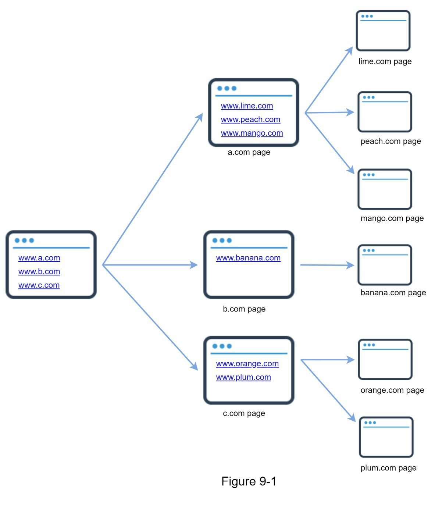
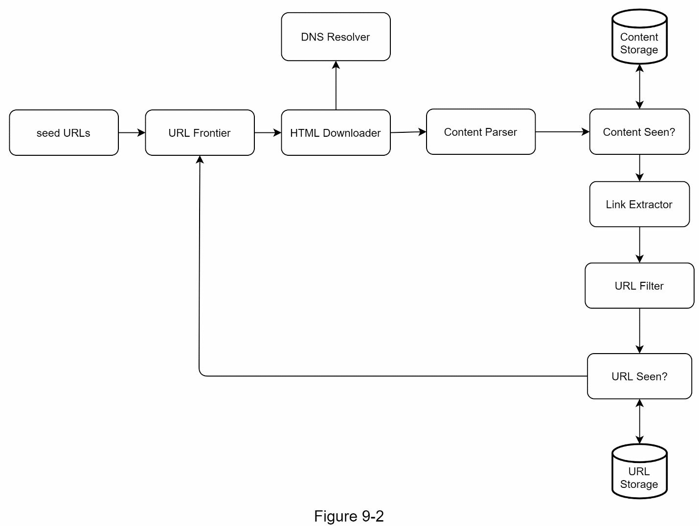
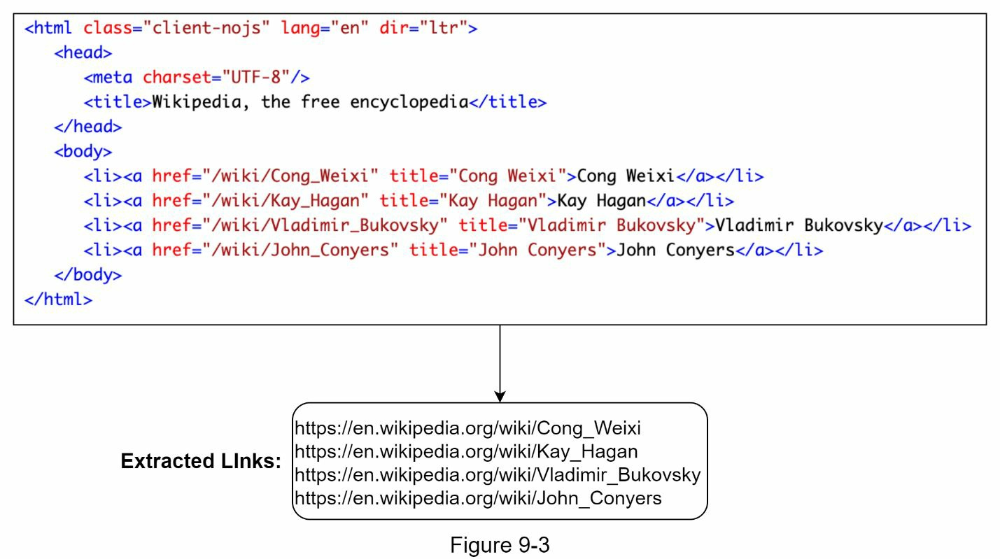
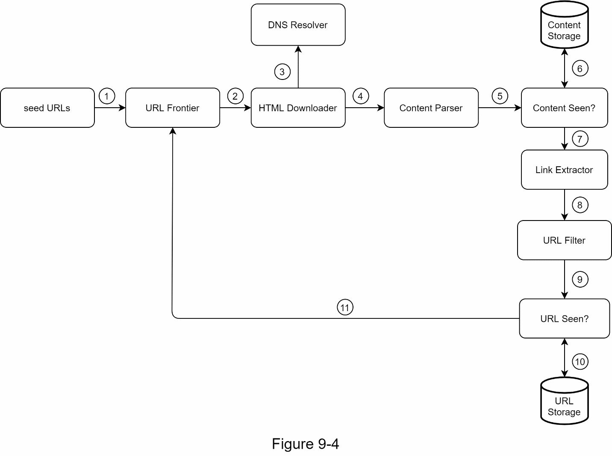
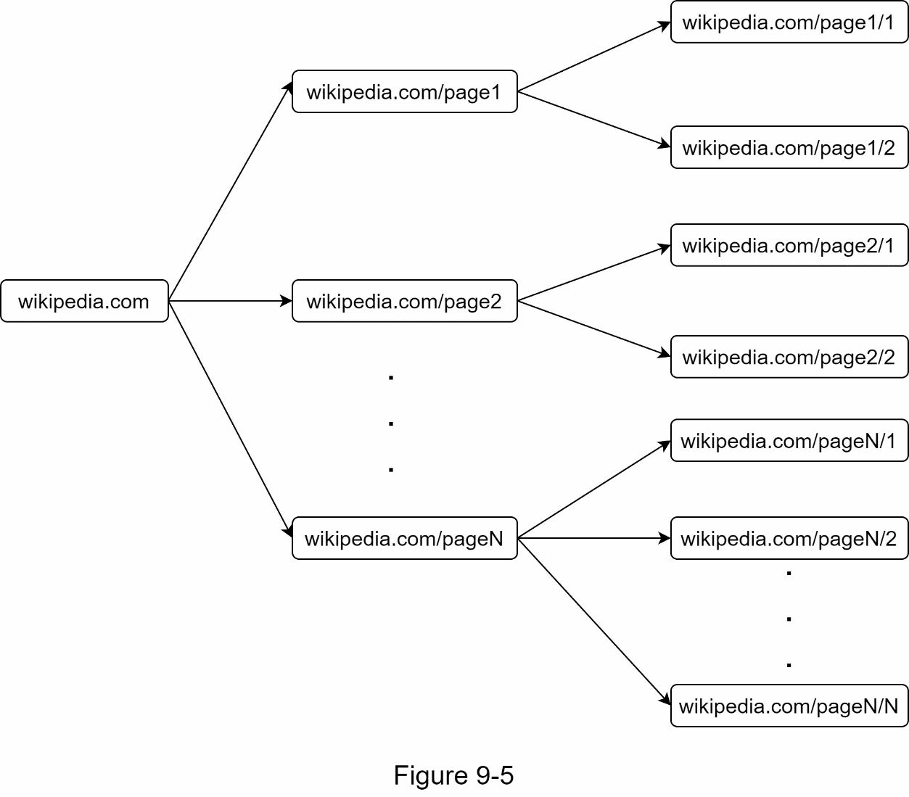
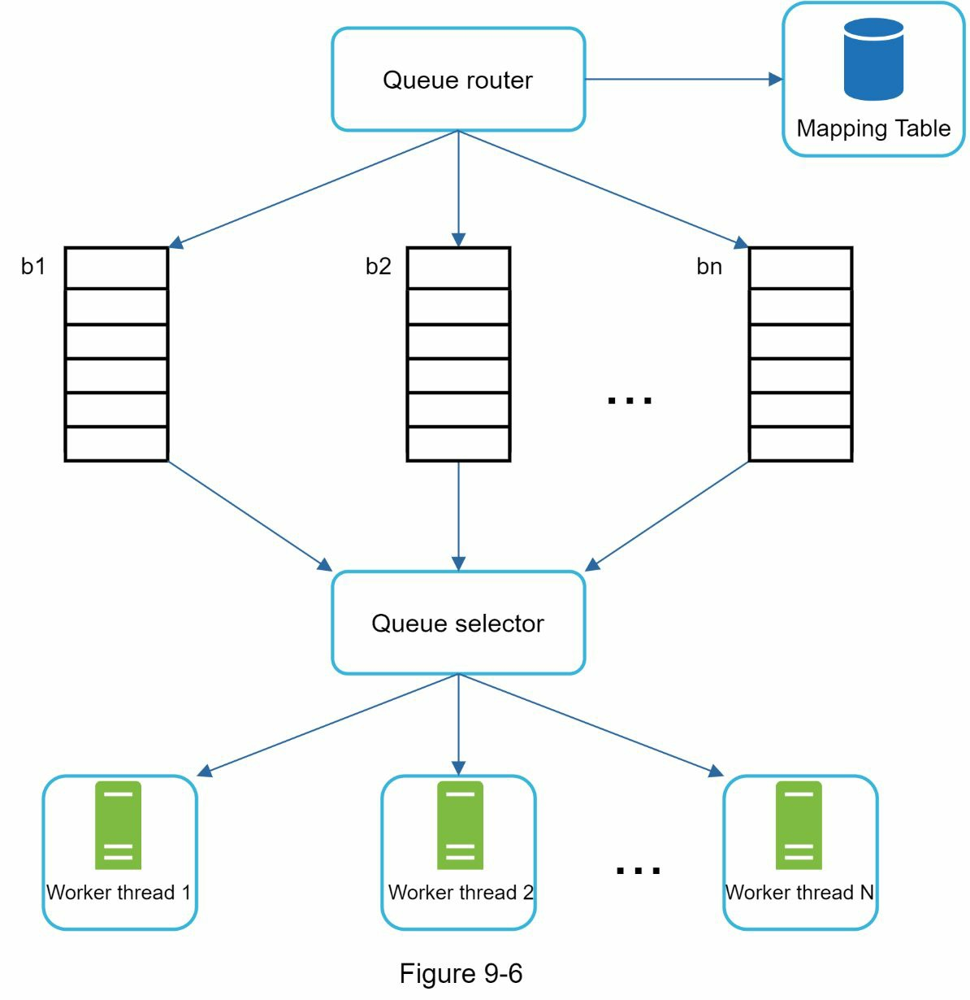
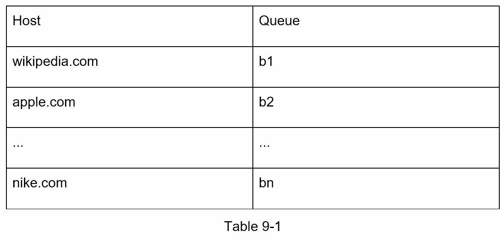
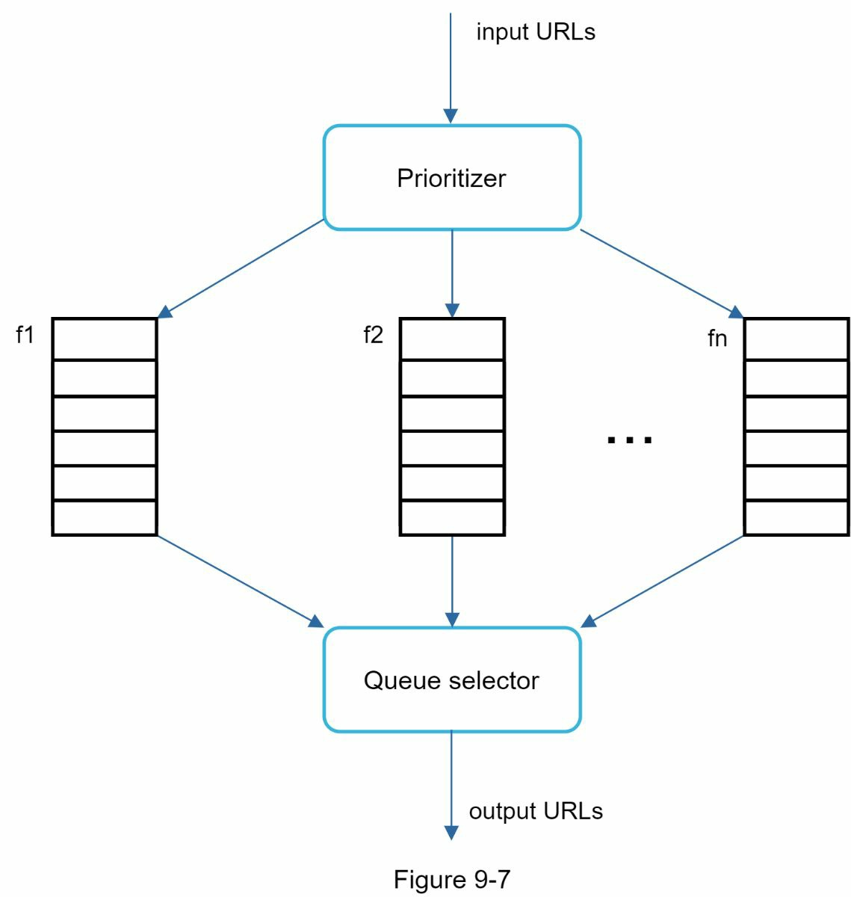
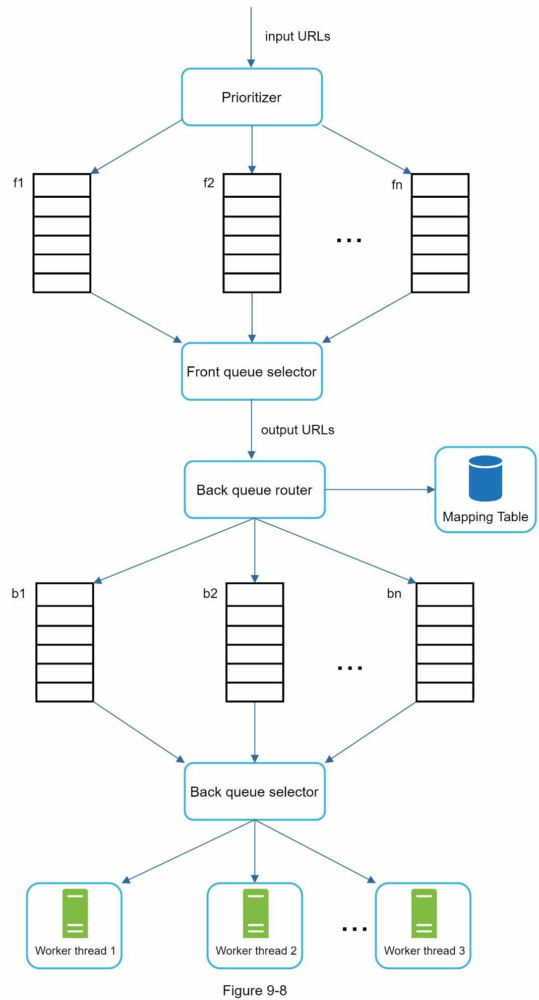
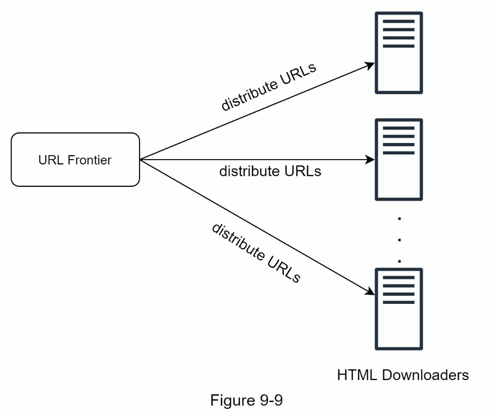

## 서론: 인터넷의 사서 역할을 하는 웹 크롤러

도서관의 사서가 도서를 정리하고 카탈로그를 만들어 사람들이 필요한 책을 찾을 수 있도록 돕듯이, 웹 크롤러도 인터넷 전체를 돌아다니며 웹 페이지를 발견하고 수집하는 시스템입니다. 결론부터 말하면, 웹 크롤러는 수십억 개의 웹 페이지를 효율적으로 수집하고 저장하면서도 웹 서버에 무리를 주지 않는 정중한(polite) 방식으로 작동해야 하는 복잡한 시스템입니다.

웹 크롤러(web crawler)는 로봇(robot) 또는 스파이더(spider)로도 불리며, 검색 엔진이 웹 상의 새로운 콘텐츠나 업데이트된 콘텐츠를 발견하는 데 널리 사용됩니다. 웹 페이지, 이미지, 동영상, PDF 파일 등 다양한 형태의 콘텐츠를 수집할 수 있습니다. 웹 크롤러는 몇 개의 시작 웹 페이지를 수집한 후, 그 페이지의 링크를 따라가며 새로운 콘텐츠를 계속 발견해 나갑니다.



### 웹 크롤러의 다양한 사용 사례

웹 크롤러는 여러 목적으로 사용됩니다:

**검색 엔진 인덱싱(Search engine indexing)**: 가장 일반적인 사용 사례입니다. 크롤러가 웹 페이지를 수집하여 검색 엔진의 로컬 인덱스를 만듭니다. 예를 들어 Googlebot은 Google 검색 엔진 뒤에서 작동하는 웹 크롤러입니다.

**웹 아카이빙(Web archiving)**: 웹에서 정보를 수집하여 미래 사용을 위해 데이터를 보존하는 과정입니다. 많은 국립 도서관들이 웹사이트를 아카이빙하기 위해 크롤러를 운영합니다. 미국 국회도서관(US Library of Congress)과 EU 웹 아카이브(EU web archive)가 주목할 만한 예입니다.

**웹 마이닝(Web mining)**: 웹의 폭발적인 성장은 데이터 마이닝을 위한 전례 없는 기회를 제공합니다. 웹 마이닝은 인터넷에서 유용한 지식을 발견하는 데 도움이 됩니다. 예를 들어 대형 금융 회사들은 크롤러를 사용하여 주주총회 자료와 연간 보고서를 다운로드하여 주요 회사 계획을 학습합니다.

**웹 모니터링(Web monitoring)**: 크롤러는 인터넷 상의 저작권 및 상표권 침해를 모니터링하는 데 도움이 됩니다. 예를 들어 Digimarc는 크롤러를 사용하여 불법 복제 작품을 발견하고 보고합니다.

웹 크롤러 개발의 복잡성은 지원하려는 규모에 따라 달라집니다. 간단한 학교 프로젝트는 몇 시간이면 완료될 수 있지만, 대규모 프로젝트는 전담 엔지니어링 팀의 지속적인 개선이 필요합니다.

---

## Step 1: 문제 이해 및 설계 범위 결정

### 기본 알고리즘의 단순함과 실제 복잡성의 간극

웹 크롤러의 기본 알고리즘은 매우 간단합니다:

1. 주어진 URL 집합에서 모든 웹 페이지를 다운로드한다.
2. 이 웹 페이지에서 URL을 추출한다.
3. 새로운 URL을 다운로드 목록에 추가한다. 이 3단계를 반복한다.

하지만 실제로 웹 크롤러가 이렇게 단순하게 작동할까요? 그렇지 않습니다. 대규모로 확장 가능한 웹 크롤러를 설계하는 것은 극도로 복잡한 작업입니다. 인터뷰 기간 내에 거대한 웹 크롤러를 완벽하게 설계하기는 거의 불가능합니다. 설계를 시작하기 전에, 요구 사항을 이해하고 설계 범위를 정하기 위해 질문을 해야 합니다.

### 인터뷰 질의응답 예시

**면접자**: 크롤러의 주요 목적은 무엇입니까? 검색 엔진 인덱싱, 데이터 마이닝, 또는 다른 용도입니까?

**인터뷰어**: 검색 엔진 인덱싱입니다.

**면접자**: 웹 크롤러가 매월 수집하는 웹 페이지는 몇 개입니까?

**인터뷰어**: 10억 개의 페이지입니다.

**면접자**: 어떤 콘텐츠 유형이 포함됩니까? HTML만 포함하거나 PDF, 이미지 같은 다른 콘텐츠 유형도 포함합니까?

**인터뷰어**: HTML만 포함합니다.

**면접자**: 새로 추가되거나 편집된 웹 페이지를 고려해야 합니까?

**인터뷰어**: 예, 새로 추가되거나 편집된 웹 페이지를 고려해야 합니다.

**면접자**: 웹에서 크롤링한 HTML 페이지를 저장해야 합니까?

**인터뷰어**: 예, 5년까지 저장해야 합니다.

**면접자**: 중복 콘텐츠가 있는 웹 페이지는 어떻게 처리합니까?

**인터뷰어**: 중복 콘텐츠가 있는 페이지는 무시해야 합니다.

### 좋은 웹 크롤러의 특성

위와 같은 질문들은 요구 사항을 이해하고 모호함을 명확히 하기 위한 샘플일 뿐입니다. 기능 요구 사항을 명확히하는 것 외에도, 좋은 웹 크롤러가 가져야 할 다음의 특성들을 기억해야 합니다:

**확장성(Scalability)**: 웹은 매우 거대합니다. 수십억 개의 웹 페이지가 존재합니다. 웹 크롤링은 병렬 처리(parallelization)를 사용하여 극도로 효율적이어야 합니다.

**견고성(Robustness)**: 웹은 수많은 함정으로 가득 차 있습니다. 잘못된 HTML, 응답하지 않는 서버, 충돌, 악의적 링크 등이 모두 일반적입니다. 크롤러는 이 모든 엣지 케이스를 처리해야 합니다.

**정중함(Politeness)**: 크롤러는 짧은 시간 내에 한 웹사이트에 너무 많은 요청을 보내면 안 됩니다.

**확장 가능성(Extensibility)**: 시스템이 충분히 유연해서 새로운 콘텐츠 유형을 지원하기 위해 최소한의 변경만 필요합니다. 예를 들어 앞으로 이미지 파일을 크롤링하려고 할 때, 전체 시스템을 다시 설계할 필요가 없어야 합니다.

### 넓이 우선 추정(Back of the Envelope Estimation)

다음 추정은 많은 가정에 기반하며, 인터뷰어와 같은 페이지에 있는지 확인하는 것이 중요합니다.

- 매달 10억 개의 웹 페이지를 다운로드한다고 가정합니다.
- **QPS(Query Per Second)**:
  $$1,000,000,000 \div 30 \text{ days} \div 24 \text{ hours} \div 3600 \text{ seconds} \approx 400 \text{ pages/second}$$
- **피크 QPS** = 2 × QPS = 800 pages/second
- 평균 웹 페이지 크기가 500KB라고 가정합니다.
- **월간 저장 용량**: 1,000,000,000 페이지 × 500KB = 500TB
- 데이터를 5년 동안 저장한다고 가정하면:
  $$500 \text{ TB} \times 12 \text{ months} \times 5 \text{ years} = 30 \text{ PB}$$
  30PB의 저장 용량이 5년치 콘텐츠를 저장하기 위해 필요합니다.

---

## Step 2: 고수준 설계 제안 및 동의 획득

### 웹 크롤러 시스템의 주요 컴포넌트

요구 사항이 명확해지면, 고수준 설계로 넘어갑니다. 웹 크롤링에 관한 이전 연구들에서 영감을 받아, 다음과 같은 고수준 설계를 제안합니다:



먼저 각 설계 컴포넌트를 탐색하여 그들의 기능을 이해합니다. 그런 다음 크롤러 워크플로우를 단계별로 검토합니다.

### 시드 URL(Seed URLs)

웹 크롤러는 시드 URL을 크롤링 프로세스의 시작점으로 사용합니다. 예를 들어, 대학 웹사이트의 모든 웹 페이지를 크롤링하려면, 직관적인 방법은 대학의 도메인명을 시드 URL로 선택하는 것입니다.

전체 웹을 크롤링하려면, 시드 URL 선택에 창의력을 발휘해야 합니다. 좋은 시드 URL은 크롤러가 가능한 한 많은 링크를 탐색할 수 있는 좋은 시작점입니다. 일반적인 전략은 전체 URL 공간을 더 작은 것으로 분할하는 것입니다. 첫 번째 접근 방식은 지역성에 기반합니다. 왜냐하면 다른 국가는 다른 인기 있는 웹사이트를 가질 수 있기 때문입니다. 또 다른 방법은 주제를 기반으로 시드 URL을 선택하는 것입니다. 예를 들어, URL 공간을 쇼핑, 스포츠, 의료 등으로 나눌 수 있습니다. 시드 URL 선택은 열린 문제입니다. 완벽한 답변을 제시할 필요는 없습니다. 다만 생각을 말로 표현하면 됩니다.

### URL 프론티어(URL Frontier)

대부분의 현대 웹 크롤러는 크롤 상태를 두 가지로 분리합니다: 다운로드할 것과 이미 다운로드된 것. 다운로드할 URL을 저장하는 컴포넌트를 URL 프론티어(URL Frontier)라고 부릅니다. 이것을 FIFO(First-In-First-Out) 큐로 생각할 수 있습니다. URL 프론티어에 관한 상세한 정보는 깊이 있는 분석(deep dive) 부분을 참고하시기 바랍니다.

### HTML 다운로더(HTML Downloader)

HTML 다운로더는 인터넷에서 웹 페이지를 다운로드합니다. URL은 URL 프론티어에서 제공됩니다.

### DNS 리졸버(DNS Resolver)

웹 페이지를 다운로드하려면, URL을 IP 주소로 변환해야 합니다. HTML 다운로더는 DNS 리졸버를 호출하여 URL에 해당하는 IP 주소를 얻습니다. 예를 들어, URL www.wikipedia.org는 2019년 3월 5일 기준으로 IP 주소 198.35.26.96으로 변환됩니다.

### 콘텐츠 파서(Content Parser)

웹 페이지를 다운로드한 후, 잘못된 형식의 웹 페이지가 문제를 일으키고 저장 공간을 낭비할 수 있으므로 파싱하고 검증해야 합니다. 크롤 서버에서 콘텐츠 파서를 구현하면 크롤링 프로세스가 느려집니다. 따라서 콘텐츠 파서는 별도의 컴포넌트입니다.

### 콘텐츠 확인(Content Seen?)

온라인 연구에 따르면, 웹 페이지의 약 29%가 중복된 콘텐츠입니다. 이는 같은 콘텐츠가 여러 번 저장될 수 있다는 의미입니다. 데이터 중복을 제거하고 처리 시간을 단축하기 위해 "Content Seen?" 데이터 구조를 도입합니다. 이것은 시스템에 이미 저장된 콘텐츠를 감지하는 데 도움이 됩니다. 두 개의 HTML 문서를 비교하려면, 문자 단위로 비교할 수 있습니다. 하지만 이 방법은 특히 수십억 개의 웹 페이지가 관련되어 있을 때 느리고 시간이 오래 걸립니다. 이 작업을 효율적으로 수행하는 방법은 두 웹 페이지의 해시 값(hash values)을 비교하는 것입니다.

### 콘텐츠 저장소(Content Storage)

HTML 콘텐츠를 저장하는 저장 시스템입니다. 저장 시스템의 선택은 데이터 유형, 데이터 크기, 접근 빈도, 수명 등의 요소에 따라 달라집니다. 디스크와 메모리 모두 사용됩니다.

- 대부분의 콘텐츠는 데이터 세트가 너무 커서 메모리에 맞지 않기 때문에 디스크에 저장됩니다.
- 인기 있는 콘텐츠는 지연 시간을 줄이기 위해 메모리에 유지됩니다.

### URL 추출기(URL Extractor)

URL 추출기는 HTML 페이지에서 링크를 파싱하고 추출합니다. 다음 그림은 링크 추출 프로세스의 예시를 보여줍니다. 상대 경로는 "https://en.wikipedia.org" 접두사를 추가하여 절대 URL로 변환됩니다.



### URL 필터(URL Filter)

URL 필터는 특정 콘텐츠 유형, 파일 확장자, 오류 링크, "블랙리스트" 사이트의 URL을 제외합니다.

### URL 확인(URL Seen?)

"URL Seen?"은 이전에 방문했거나 이미 프론티어에 있는 URL을 추적하는 데이터 구조입니다. "URL Seen?"은 같은 URL이 여러 번 추가되는 것을 방지하는 데 도움이 됩니다. 이는 서버 부하를 증가시킬 수 있고 무한 루프를 야기할 수 있습니다. 블룸 필터(Bloom filter)와 해시 테이블(hash table)은 "URL Seen?" 컴포넌트를 구현하는 일반적인 기법입니다.

### URL 저장소(URL Storage)

URL 저장소는 이미 방문한 URL을 저장합니다.

### 웹 크롤러 워크플로우

지금까지 모든 시스템 컴포넌트를 논의했습니다. 다음으로, 이들을 함께 워크플로우를 설명합니다.

더 나은 설명을 위해, 설계 다이어그램에 순서 번호를 추가했습니다:



**Step 1**: 시드 URL을 URL 프론티어에 추가합니다.

**Step 2**: HTML 다운로더가 URL 프론티어에서 URL 목록을 가져옵니다.

**Step 3**: HTML 다운로더가 DNS 리졸버에서 URL의 IP 주소를 얻고 다운로드를 시작합니다.

**Step 4**: 콘텐츠 파서가 HTML 페이지를 파싱하고 페이지가 잘못된 형식인지 확인합니다.

**Step 5**: 콘텐츠가 파싱되고 검증된 후, "Content Seen?" 컴포넌트로 전달됩니다.

**Step 6**: "Content Seen" 컴포넌트가 HTML 페이지가 이미 저장소에 있는지 확인합니다.
- 저장소에 있으면, 다른 URL의 같은 콘텐츠가 이미 처리되었다는 의미입니다. 이 경우, HTML 페이지는 버려집니다.
- 저장소에 없으면, 시스템이 이전에 같은 콘텐츠를 처리하지 않았다는 의미입니다. 콘텐츠는 링크 추출기로 전달됩니다.

**Step 7**: 링크 추출기가 HTML 페이지에서 링크를 추출합니다.

**Step 8**: 추출된 링크는 URL 필터로 전달됩니다.

**Step 9**: 링크가 필터링된 후, "URL Seen?" 컴포넌트로 전달됩니다.

**Step 10**: "URL Seen" 컴포넌트가 URL이 이미 저장소에 있는지 확인합니다. 있으면, 이전에 처리된 것이므로 아무 작업도 수행할 필요가 없습니다.

**Step 11**: URL이 이전에 처리되지 않았으면, URL 프론티어에 추가됩니다.

---

## Step 3: 설계 깊이 있는 분석

### 깊이 우선 탐색과 넓이 우선 탐색: 어느 것이 더 나을까?

지금까지 고수준 설계를 논의했습니다. 이제 가장 중요한 구성 요소와 기법을 깊이 있게 살펴보겠습니다:

- 깊이 우선 탐색(Depth-First Search, DFS) 대 넓이 우선 탐색(Breadth-First Search, BFS)
- URL 프론티어
- HTML 다운로더
- 견고성(Robustness)
- 확장 가능성(Extensibility)
- 문제 있는 콘텐츠 감지 및 회피

### DFS vs BFS

웹을 방향성 그래프로 생각할 수 있습니다. 웹 페이지는 노드(nodes)이고 하이퍼링크(hyperlinks, URL)는 엣지(edges)입니다. 크롤 프로세스는 한 웹 페이지에서 다른 웹 페이지로 방향성 그래프를 순회하는 것으로 볼 수 있습니다. DFS와 BFS는 두 가지 일반적인 그래프 순회 알고리즘입니다. 하지만 DFS는 보통 좋은 선택이 아닙니다. 왜냐하면 DFS의 깊이가 매우 깊을 수 있기 때문입니다.

BFS는 웹 크롤러에서 일반적으로 사용되며 FIFO(First-In-First-Out) 큐로 구현됩니다. FIFO 큐에서, URL은 들어온 순서대로 제거됩니다. 하지만 이 구현에는 두 가지 문제가 있습니다:

**문제 1 - 같은 호스트로의 과도한 요청**: 같은 웹 페이지의 대부분의 링크는 같은 호스트로 연결되어 있습니다. 다음 그림에서, wikipedia.com의 모든 링크는 내부 링크이며, 크롤러가 같은 호스트(wikipedia.com)의 URL 처리로 바쁩니다. 크롤러가 병렬로 웹 페이지를 다운로드하려고 할 때, Wikipedia 서버는 요청으로 몹시 분주해집니다. 이는 "정중하지 않다"고 간주됩니다.



**문제 2 - URL 우선순위의 미고려**: 표준 BFS는 URL의 우선순위를 고려하지 않습니다. 웹은 크고, 모든 페이지가 같은 수준의 품질과 중요도를 가지지는 않습니다. 따라서 PageRank, 웹 트래픽, 업데이트 빈도 등에 따라 URL의 우선순위를 지정하고 싶을 수 있습니다.

### URL 프론티어: 정중함, 우선순위, 신선도를 모두 관리하기

URL 프론티어는 이러한 문제들을 해결하는 데 도움이 됩니다. URL 프론티어는 다운로드할 URL을 저장하는 데이터 구조입니다. URL 프론티어는 정중함(politeness), URL 우선화(prioritization), 신선도(freshness)를 보장하는 중요한 컴포넌트입니다.

#### 정중함(Politeness)

일반적으로, 웹 크롤러는 짧은 기간 내에 같은 호스팅 서버에 너무 많은 요청을 보내는 것을 피해야 합니다. 너무 많은 요청을 보내는 것은 "정중하지 않다"고 간주되거나 심지어 거부 서비스(denial-of-service, DOS) 공격으로 취급될 수 있습니다. 예를 들어, 제약이 없으면, 크롤러는 같은 웹사이트에 초당 수천 개의 요청을 보낼 수 있습니다. 이는 웹 서버를 압도할 수 있습니다.

정중함을 강제하는 일반적인 아이디어는 같은 호스트에서 한 번에 한 페이지씩 다운로드하는 것입니다. 두 다운로드 작업 사이에 지연을 추가할 수 있습니다. 정중함 제약은 웹사이트 호스트명에서 다운로드(워커) 스레드로의 매핑을 유지함으로써 구현됩니다. 각 다운로더 스레드는 별도의 FIFO 큐를 가지며, 그 큐에서만 URL을 다운로드합니다. 다음 그림은 정중함을 관리하는 설계를 보여줍니다:



- **큐 라우터(Queue router)**: 각 큐(b1, b2, … bn)가 같은 호스트의 URL만 포함하도록 보장합니다.
- **매핑 테이블(Mapping table)**: 각 호스트를 큐에 매핑합니다.
- **FIFO 큐 b1, b2부터 bn까지**: 각 큐는 같은 호스트의 URL을 포함합니다.
- **큐 선택기(Queue selector)**: 각 워커 스레드는 FIFO 큐에 매핑되며, 그 큐에서만 URL을 다운로드합니다. 큐 선택 로직은 큐 선택기에 의해 수행됩니다.
- **워커 스레드 1부터 N까지**: 워커 스레드는 같은 호스트에서 한 번에 한 페이지씩 웹 페이지를 다운로드합니다. 두 다운로드 작업 사이에 지연을 추가할 수 있습니다.

#### 우선순위(Priority)

Apple 제품에 관한 토론 포럼의 무작위 게시물은 Apple 홈페이지의 게시물과 매우 다른 가중치를 갖습니다. "Apple" 키워드를 모두 포함하고 있지만, 크롤러가 먼저 Apple 홈페이지를 크롤링하는 것이 합리적입니다.

URL의 유용성에 따라 URL의 우선순위를 지정합니다. 유용성은 PageRank, 웹사이트 트래픽, 업데이트 빈도 등으로 측정할 수 있습니다. "Prioritizer"는 URL 우선화를 처리하는 컴포넌트입니다. 다음 그림은 URL 우선순위를 관리하는 설계를 보여줍니다:



- **Prioritizer**: URL을 입력으로 받아 우선순위를 계산합니다.
- **큐 f1부터 fn까지**: 각 큐는 할당된 우선순위를 가집니다. 높은 우선순위의 큐가 더 높은 확률로 선택됩니다.
- **큐 선택기**: 높은 우선순위의 큐로 향하는 편향을 가지고 무작위로 큐를 선택합니다.

다음 그림은 URL 프론티어의 전체 설계를 보여줍니다. URL 프론티어는 두 개의 모듈을 포함합니다:



- **앞 큐(Front queues)**: 우선화를 관리합니다.
- **뒤 큐(Back queues)**: 정중함을 관리합니다.

#### 신선도(Freshness)

웹 페이지는 지속적으로 추가, 삭제, 편집됩니다. 웹 크롤러는 다운로드한 페이지를 정기적으로 재크롤링하여 데이터 세트를 최신으로 유지해야 합니다. 모든 URL을 재크롤링하는 것은 시간이 많이 걸리고 리소스 집약적입니다. 신선도를 최적화하기 위한 몇 가지 전략은 다음과 같습니다:

- 웹 페이지의 업데이트 기록을 기반으로 재크롤링합니다.
- URL의 우선순위를 지정하고 중요한 페이지를 먼저, 더 자주 재크롤링합니다.

#### URL 프론티어의 저장소

실제 검색 엔진 크롤의 경우, 프론티어의 URL 개수는 수백만 개에 달할 수 있습니다. 모든 것을 메모리에 보관하는 것은 내구성이나 확장성 측면에서 좋지 않습니다. 모든 것을 디스크에 보관하는 것도 바람직하지 않습니다. 왜냐하면 디스크는 느리고, 쉽게 병목이 될 수 있기 때문입니다.

우리는 하이브리드 접근 방식을 채택했습니다. 대부분의 URL은 디스크에 저장되므로, 저장 공간이 문제가 되지 않습니다. 디스크 읽기 및 쓰기 비용을 줄이기 위해, 들어오기/나가기 작업을 위해 메모리에 버퍼를 유지합니다. 버퍼의 데이터는 정기적으로 디스크에 기록됩니다.

### HTML 다운로더: 성능과 정중함을 모두 고려하기

HTML 다운로더는 HTTP 프로토콜을 사용하여 인터넷에서 웹 페이지를 다운로드합니다. HTML 다운로더를 논의하기 전에, 먼저 Robots 제외 프로토콜을 살펴봅시다.

#### Robots.txt: 웹사이트가 크롤러와 소통하는 방식

Robots.txt는 Robots 제외 프로토콜(Robots Exclusion Protocol)이라 불리며, 웹사이트가 크롤러와 소통하기 위해 사용하는 표준입니다. 크롤러가 다운로드할 수 있는 페이지를 지정합니다. 웹사이트를 크롤링하기 전에, 크롤러는 먼저 해당 robots.txt를 확인하고 그 규칙을 따라야 합니다. robots.txt 파일의 반복 다운로드를 피하기 위해, 파일의 결과를 캐시합니다. 파일은 주기적으로 캐시에 다운로드되고 저장됩니다.

다음은 https://www.amazon.com/robots.txt에서 가져온 robots.txt 파일의 일부입니다. creatorhub 같은 일부 디렉토리는 Google bot에 대해 허용되지 않습니다:

```
User-agent: Googlebot
Disallow: /creatorhub/*
Disallow: /rss/people/*/reviews
Disallow: /gp/pdp/rss/*/reviews
Disallow: /gp/cdp/member-reviews/
Disallow: /gp/aw/cr/
```

#### 성능 최적화: 속도와 효율성을 모두 달성하기

robots.txt 외에도, 성능 최적화는 HTML 다운로더를 위한 또 다른 중요한 개념입니다. HTML 다운로더의 성능 최적화 목록은 다음과 같습니다:

**1. 분산 크롤링(Distributed crawl)**

높은 성능을 달성하기 위해, 크롤 작업은 여러 서버에 분산되고, 각 서버는 여러 스레드를 실행합니다. URL 공간은 더 작은 조각들로 분할되므로, 각 다운로더는 URL의 부분 집합을 담당합니다. 다음 그림은 분산 크롤의 예시를 보여줍니다:



**2. DNS 리졸버 캐싱(Cache DNS Resolver)**

DNS 리졸버는 크롤러의 병목입니다. 왜냐하면 DNS 요청은 많은 DNS 인터페이스의 동기적 특성 때문에 시간이 걸릴 수 있기 때문입니다. DNS 응답 시간은 10ms에서 200ms 사이입니다. 크롤러 스레드가 DNS에 요청을 하면, 첫 요청이 완료될 때까지 다른 스레드들은 차단됩니다. DNS 캐시를 유지하여 자주 DNS를 호출하지 않는 것은 속도 최적화를 위한 효과적인 기법입니다. DNS 캐시는 도메인명에서 IP 주소로의 매핑을 유지하고, cron 작업으로 주기적으로 업데이트됩니다.

**3. 지역성(Locality)**

지역적으로 크롤 서버를 분산시킵니다. 크롤 서버가 웹사이트 호스트에 더 가까우면, 크롤러는 더 빠른 다운로드 시간을 경험합니다. 지역성 설계는 대부분의 시스템 컴포넌트에 적용됩니다: 크롤 서버, 캐시, 큐, 저장소 등입니다.

**4. 짧은 타임아웃(Short timeout)**

일부 웹 서버는 응답이 느리거나 전혀 응답하지 않을 수 있습니다. 오래 기다리는 것을 피하기 위해, 최대 대기 시간을 지정합니다. 호스트가 미리 정의된 시간 내에 응답하지 않으면, 크롤러는 작업을 중지하고 다른 페이지를 크롤링합니다.

### 견고성(Robustness): 오류 처리와 복원 전략

성능 최적화 외에도, 견고성은 중요한 고려 사항입니다. 시스템 견고성을 개선하기 위한 몇 가지 접근 방식을 제시합니다:

**[[5장 일관 해싱 설계|일관 해싱]](Consistent hashing)**: 이것은 다운로더들 간에 부하를 분산하는 데 도움이 됩니다. 새 다운로더 서버를 일관 해싱을 사용하여 추가하거나 제거할 수 있습니다.

**크롤 상태와 데이터 저장(Save crawl states and data)**: 장애에 대비하기 위해, 크롤 상태와 데이터는 저장 시스템에 기록됩니다. 중단된 크롤은 저장된 상태와 데이터를 로드하여 쉽게 다시 시작할 수 있습니다.

**예외 처리(Exception handling)**: 오류는 대규모 시스템에서 불가피하고 일반적입니다. 크롤러는 시스템을 크래시하지 않고 예외를 정중하게 처리해야 합니다.

**데이터 검증(Data validation)**: 이것은 시스템 오류를 방지하기 위한 중요한 조치입니다.

### 확장 가능성(Extensibility): 새로운 콘텐츠 유형 지원하기

거의 모든 시스템이 진화하듯이, 설계 목표 중 하나는 새로운 콘텐츠 유형을 지원할 수 있을 정도로 시스템을 충분히 유연하게 만드는 것입니다. 크롤러는 새 모듈을 플러그인 하여 확장할 수 있습니다. 다음 그림은 새 모듈을 추가하는 방법을 보여줍니다:



- **PNG 다운로더 모듈**: PNG 파일을 다운로드하기 위해 플러그인됩니다.
- **웹 모니터 모듈**: 웹을 모니터링하고 저작권 및 상표권 침해를 방지하기 위해 추가됩니다.

### 문제 있는 콘텐츠 감지 및 회피: 세 가지 주의할 점

이 섹션에서는 중복된, 무의미한, 또는 해로운 콘텐츠의 감지 및 방지에 대해 논의합니다.

#### 1. 중복 콘텐츠(Redundant content)

이전에 논의했듯이, 거의 30%의 웹 페이지가 복제본입니다. 해시나 체크섬이 중복을 감지하는 데 도움이 됩니다.

#### 2. 스파이더 트랩(Spider traps)

스파이더 트랩은 크롤러를 무한 루프에 빠뜨리는 웹 페이지입니다. 예를 들어, 무한히 깊은 디렉토리 구조는 다음과 같습니다:

```
www.spidertrapexample.com/foo/bar/foo/bar/foo/bar/…
```

이러한 스파이더 트랩은 URL의 최대 길이를 설정하여 피할 수 있습니다. 하지만 스파이더 트랩을 감지하는 보편적인 해결책은 없습니다. 스파이더 트랩을 포함하는 웹사이트는 그 웹사이트에서 비정상적으로 많은 수의 웹 페이지가 발견되어 쉽게 식별될 수 있습니다. 스파이더 트랩을 회피하기 위한 자동 알고리즘을 개발하는 것은 어렵습니다. 하지만 사용자는 수동으로 스파이더 트랩을 확인하고 식별하며, 그 웹사이트를 크롤러에서 제외하거나 맞춤 URL 필터를 적용할 수 있습니다.

#### 3. 데이터 노이즈(Data noise)

일부 콘텐츠는 거의 또는 전혀 가치가 없습니다. 예를 들어 광고, 코드 스니펫, 스팸 URL 등입니다. 이러한 콘텐츠는 크롤러에 유용하지 않으므로 가능하면 제외해야 합니다.

---

## Step 4: 마무리

### 웹 크롤러 설계의 핵심 요약

이 장에서, 우리는 먼저 좋은 크롤러의 특성을 논의했습니다: 확장성, 정중함, 확장 가능성, 견고성. 그 다음, 우리는 설계를 제안하고 주요 컴포넌트를 논의했습니다. 확장 가능한 웹 크롤러를 구축하는 것은 자명한 작업이 아닙니다. 왜냐하면 웹은 엄청나게 크고 함정으로 가득 차 있기 때문입니다. 우리가 많은 주제를 다뤘지만, 우리는 여전히 많은 관련된 논의 주제를 놓쳤습니다:

**서버 측 렌더링(Server-side rendering)**: 많은 웹사이트는 JavaScript, AJAX 등과 같은 스크립트를 사용하여 링크를 동적으로 생성합니다. 우리가 웹 페이지를 직접 다운로드하고 파싱하면, 동적으로 생성된 링크를 검색할 수 없습니다. 이 문제를 해결하기 위해, 우리는 페이지를 파싱하기 전에 먼저 서버 측 렌더링(동적 렌더링이라고도 함)을 수행합니다.

**원하지 않는 페이지 필터링(Filter out unwanted pages)**: 저장 용량과 크롤 리소스가 제한되어 있으므로, 저품질 및 스팸 페이지를 필터링하는 안티 스팸 컴포넌트가 도움이 됩니다.

**데이터베이스 복제 및 샤딩(Database replication and sharding)**: 복제 및 샤딩 같은 기법을 사용하여 데이터 계층의 가용성, 확장성, 신뢰성을 개선합니다.

**수평 확장(Horizontal scaling)**: 대규모 크롤의 경우, 다운로드 작업을 수행하기 위해 수백 개 또는 수천 개의 서버가 필요합니다. 핵심은 서버를 무상태(stateless)로 유지하는 것입니다.

**가용성, 일관성, 신뢰성(Availability, consistency, and reliability)**: 이러한 개념들은 모든 대규모 시스템의 성공의 핵심입니다. 우리는 1장에서 이 개념들을 상세히 논의했습니다. 이 주제들을 기억 속으로 되돌려 보시기 바랍니다.

**분석(Analytics)**: 데이터 수집 및 분석은 모든 시스템의 중요한 부분입니다. 왜냐하면 데이터는 미세 조정을 위한 핵심 재료이기 때문입니다.

축하합니다! 여기까지 오셨습니다! 이제 자신에게 박수를 쳐 주세요. 잘했습니다!

---

## 핵심 개념 정리

**URL 프론티어(URL Frontier)**: 다운로드 대기 중인 URL을 저장하는 데이터 구조로, 정중함·우선순위·신선도를 함께 관리하는 크롤러의 핵심 컴포넌트

**넓이 우선 탐색(BFS, Breadth-First Search)**: 웹 크롤러가 링크를 탐색할 때 주로 채택하는 그래프 순회 알고리즘으로, FIFO 큐를 기반으로 동작

**robots.txt**: 웹사이트가 크롤러에게 접근 허용·금지 경로를 알려주는 Robots 제외 프로토콜(Robots Exclusion Protocol) 파일

**스파이더 트랩(Spider Trap)**: 크롤러를 무한 루프에 빠뜨리기 위해 설계된 웹 페이지 또는 URL 패턴으로, URL 최대 길이 제한과 수동 블랙리스트로 방어

**콘텐츠 중복 감지(Content Seen?)**: 해시 값을 비교하여 이미 수집한 콘텐츠의 재저장을 방지하는 컴포넌트로, 약 29%에 달하는 웹의 중복 콘텐츠를 처리

**블룸 필터(Bloom Filter)**: URL 방문 여부를 공간 효율적으로 추적하는 확률적 자료 구조로, "URL Seen?" 컴포넌트 구현에 활용

**정중함(Politeness)**: 동일 호스트에 단시간에 과도한 요청을 보내지 않도록 요청 간격을 제어하는 크롤링 원칙으로, 호스트별 FIFO 큐와 다운로더 스레드 매핑으로 구현

**PageRank**: 웹 페이지의 중요도를 다른 페이지로부터의 링크 수와 품질로 측정하는 알고리즘으로, URL 우선순위 결정에 활용

**시드 URL(Seed URLs)**: 크롤링 프로세스의 출발점이 되는 초기 URL 집합으로, 지역 또는 주제 기반으로 선택

**신선도(Freshness)**: 수집한 페이지 데이터를 최신 상태로 유지하기 위해 업데이트 이력과 중요도를 기반으로 재크롤링 주기를 조정하는 전략

**DNS 캐싱(DNS Caching)**: DNS 조회 결과를 캐시에 저장하여 반복 DNS 요청을 줄이고 크롤링 성능을 높이는 최적화 기법

**분산 크롤링(Distributed Crawl)**: URL 공간을 분할하여 여러 서버와 스레드에서 병렬로 크롤링 작업을 수행하는 아키텍처

---

## 참고 자료

[1] US Library of Congress: https://www.loc.gov/websites/

[2] EU Web Archive: http://data.europa.eu/webarchive

[3] Digimarc: https://www.digimarc.com/products/digimarc-services/piracy-intelligence

[4] Heydon A., Najork M. Mercator: A scalable, extensible web crawler World Wide Web, 2(4) (1999), pp. 219-229

[5] By Christopher Olston, Marc Najork: Web Crawling. http://infolab.stanford.edu/~olston/publications/crawling_survey.pdf

[6] 29% Of Sites Face Duplicate Content Issues: https://tinyurl.com/y6tmh55y

[7] Rabin M.O., et al. Fingerprinting by random polynomials Center for Research in Computing Techn., Aiken Computation Laboratory, Univ. (1981)

[8] B. H. Bloom, "Space/time trade-offs in hash coding with allowable errors," Communications of the ACM, vol. 13, no. 7, pp. 422–426, 1970.

[9] Donald J. Patterson, Web Crawling: https://www.ics.uci.edu/~lopes/teaching/cs221W12/slides/Lecture05.pdf

[10] L. Page, S. Brin, R. Motwani, and T. Winograd, "The PageRank citation ranking: Bringing order to the web," Technical Report, Stanford University, 1998.

[11] Burton Bloom. Space/time trade-offs in hash coding with allowable errors. Communications of the ACM, 13(7), pages 422--436, July 1970.

[12] Google Dynamic Rendering: https://developers.google.com/search/docs/guides/dynamic-rendering

[13] T. Urvoy, T. Lavergne, and P. Filoche, "Tracking web spam with hidden style similarity," in Proceedings of the 2nd International Workshop on Adversarial Information Retrieval on the Web, 2006.

[14] H.-T. Lee, D. Leonard, X. Wang, and D. Loguinov, "IRLbot: Scaling to 6 billion pages and beyond," in Proceedings of the 17th International World Wide Web Conference, 2008.
